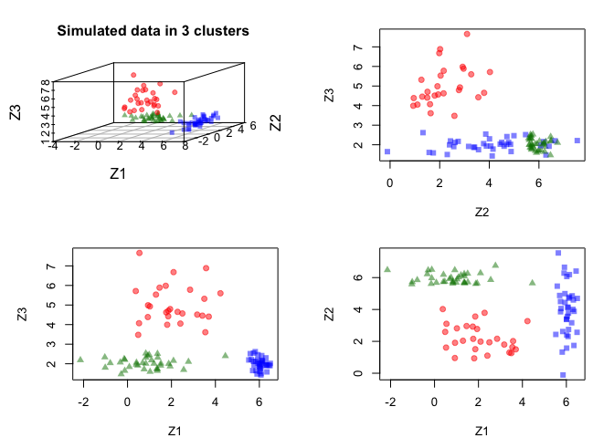
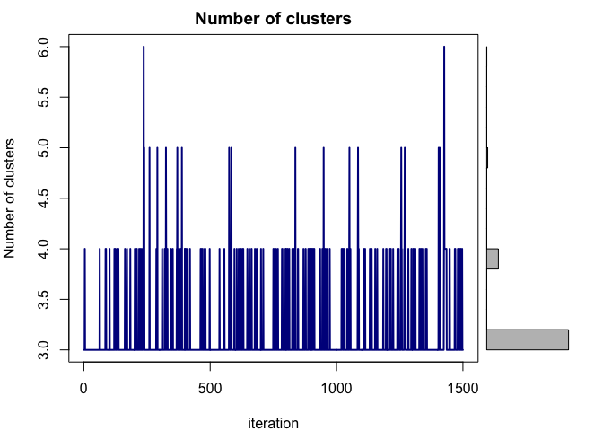
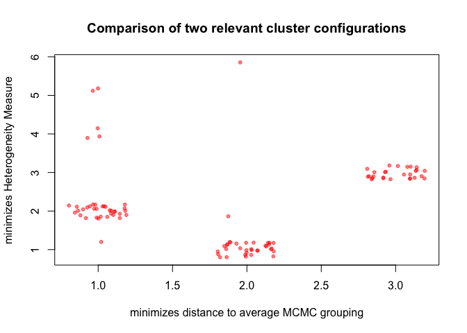
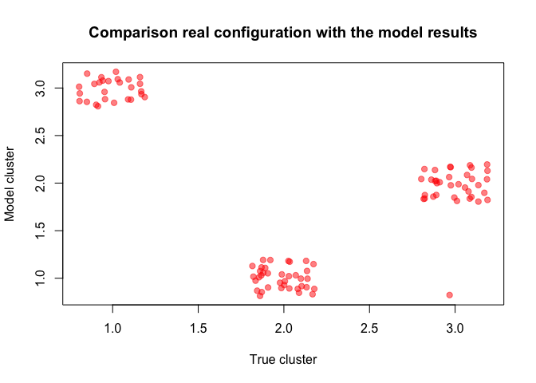

<!-- README.md is generated from README.Rmd. Please edit that file -->

# BNPMIXcluster

<!-- badges: start -->

[](https://doi.org/10.1007/s11634-018-0313-6)
[](https://github.com/christianu7/BNPMIXcluster)
[](https://cran.r-project.org/web/licenses/MIT)
<!-- badges: end -->

The BNPMIXcluster package provides a method for model-based clustering
of multivariate data. It is capable of combining different types of
variables (continuous, ordinal and nominal) and accommodates for
different sampling probabilities in a complex survey design.

The model is based on a location mixture model with a Poisson-Dirichlet
process prior on the location parameters of the associated latent
variables.

Details of the underlying model is described in Carmona, C.,
Nieto-Barajas, L. E., Canale, A. (2016)
[arXiv:1612.00083](https://arxiv.org/abs/1612.00083).

## Installation

You can install the released version of BNPMIXcluster from
[CRAN](https://CRAN.R-project.org/package=BNPMIXcluster) with:

``` r
install.packages("BNPMIXcluster")
```

And the development version from
[GitHub](https://github.com/christianu7/BNPMIXcluster) with:

``` r
# install.packages("devtools")
devtools::install_github("christianu7/BNPMIXcluster")
```

## Examples

``` r
require(BNPMIXcluster)
#> Loading required package: BNPMIXcluster
```

### Simulation study 1

In this toy example, we evaluate the clustering allocation of our model
using synthetic iid data. Details are discussed in section 5.1 of
Carmona et al. (2017).

We sample 3-dimensional latent continuous vectors
*z* = (*z*<sub>1</sub>, *z*<sub>2</sub>, *z*<sub>3</sub>) from a
3-components mixture of Gaussians with equal mixing probabilities and
mixture components with means *μ*<sub>1</sub> = (2, 2, 5),
*μ*<sub>2</sub> = (6, 4, 2) and *μ*<sub>3</sub> = (1, 6, 2), and
covariance matrices *Σ*<sub>1</sub> = diag(1, 1, 1),
*Σ*<sub>2</sub> = diag(0.1, 2, 0.1) and
*Σ*<sub>3</sub> = diag(2, 0.1, 0.1).

In the next figure we show the “True” (generative) cluster allocation
using different colors. Such grouping is unknown and we would like to
discover it using our model.

    #> Loading required package: scatterplot3d



We test the method by considering different scenarios for the observed
data.It is possible to recover the cluster structure even assuming that
we can only observe discretized versions of the latent continuous data.

Here we illustrate the most straightforward scenario (I), where we
assume that the three continuous variables are directly observable.

``` r
# Observable data
# Choose scenario: 1, 2, or 3
ex_i <- 1
head( Y_ex_5_1[[ ex_i ]] )
#>          Z1       Z2       Z3
#> 1 1.3763751 5.662050 2.315275
#> 2 0.9337998 1.909544 4.987471
#> 3 6.0974958 3.772059 2.057523
#> 4 6.1090338 4.708976 2.416915
#> 5 0.4672619 5.746002 1.912791
#> 6 1.7615436 2.156490 4.625145
```

We select hyper-parameters that define a prior specification which
promotes a small number of groups.

``` r
# Prior specification
# Choose "a", "b" or "c"
param_j <- "c"
meta_param_ex[ param_j, ]
#>   scenario_param alpha d_0_a d_1_a d_0_b d_1_b eta kappa delta d_0_z d_0_mu
#> c              c   0.5     1     1     1     1   2     5     4   2.1    2.1
#>   d_1_z d_1_mu
#> c    30     30
```

The function `MIXclustering` performs MCMC to allocate clusters to each
individual.

``` r
set.seed(0) 

# Specify the data type that is being provided to the method
var_type_Y_ex_5_1 <- list( c("c","c","c"),
                           c("o","o"),
                           c("o","o","o","c") )

cluster_ex <- MIXclustering( Y = as.matrix(Y_ex_5_1[[ ex_i ]]),
                             var_type=var_type_Y_ex_5_1[[ ex_i ]],
                             
                             n_iter_out=1500,
                             n_burn=200,
                             n_thin=3,
                             
                             alpha = meta_param_ex[ param_j, "alpha" ],
                             d_0_a = meta_param_ex[ param_j, "d_0_a"],
                             d_1_a = meta_param_ex[ param_j, "d_1_a" ],
                             d_0_b = meta_param_ex[ param_j, "d_0_b" ],
                             d_1_b = meta_param_ex[ param_j, "d_1_b" ],
                             eta = meta_param_ex[ param_j, "eta" ],
                             kappa = meta_param_ex[ param_j, "kappa" ],
                             delta = meta_param_ex[ param_j, "delta" ],
                             
                             d_0_z = meta_param_ex[ param_j, "d_0_z" ],
                             d_1_z = meta_param_ex[ param_j, "d_1_z" ],
                             d_0_mu = meta_param_ex[ param_j, "d_0_mu" ],
                             d_1_mu = meta_param_ex[ param_j, "d_1_mu" ] )
#> *** Clustering estimation started ***
#> |                                                    |  0%                      |                                                    |0.02128565% ~14 m remaining|                                                    |0.04257131% ~13 m remaining|                                                    |0.06385696% ~11 m remaining|                                                    |0.08514261% ~9 m remaining|                                                    |0.1064283% ~8 m remaining |                                                    |0.1277139% ~8 m remaining |                                                    |0.1489996% ~7 m remaining |                                                    |0.1702852% ~7 m remaining |                                                    |0.1915709% ~7 m remaining |                                                    |0.2128565% ~6 m remaining |                                                    |0.2341422% ~6 m remaining |                                                    |0.2554278% ~6 m remaining |                                                    |0.2767135% ~5 m remaining |                                                    |0.2979991% ~5 m remaining |                                                    |0.3192848% ~5 m remaining |                                                    |0.3405705% ~5 m remaining |                                                    |0.3618561% ~5 m remaining |                                                    |0.3831418% ~4 m remaining |                                                    |0.4044274% ~4 m remaining |                                                    |0.4257131% ~4 m remaining |                                                    |0.4469987% ~4 m remaining |                                                    |0.4682844% ~4 m remaining |                                                    |0.48957% ~4 m remaining   |                                                    |0.5108557% ~4 m remaining |                                                    |0.5321413% ~4 m remaining |                                                    |0.553427% ~4 m remaining  |                                                    |0.5747126% ~4 m remaining |                                                    |0.5959983% ~4 m remaining |                                                    |0.617284% ~3 m remaining  |                                                    |0.6385696% ~3 m remaining |                                                    |0.6598553% ~3 m remaining |                                                    |0.6811409% ~3 m remaining |                                                    |0.7024266% ~3 m remaining |                                                    |0.7237122% ~3 m remaining |                                                    |0.7449979% ~3 m remaining |                                                    |0.7662835% ~3 m remaining |                                                    |0.7875692% ~3 m remaining |                                                    |0.8088548% ~3 m remaining |                                                    |0.8301405% ~3 m remaining |                                                    |0.8514261% ~3 m remaining |                                                    |0.8727118% ~3 m remaining |                                                    |0.8939974% ~3 m remaining |                                                    |0.9152831% ~3 m remaining |                                                    |0.9365688% ~3 m remaining |                                                    |0.9578544% ~3 m remaining |                                                    |0.9791401% ~3 m remaining |                                                    |1.000426% ~3 m remaining  |                                                    |1.021711% ~3 m remaining  |                                                    |1.042997% ~3 m remaining  |                                                    |1.064283% ~3 m remaining  |                                                    |1.085568% ~3 m remaining  |                                                    |1.106854% ~3 m remaining  |                                                    |1.12814% ~3 m remaining   |                                                    |1.149425% ~3 m remaining  |                                                    |1.170711% ~3 m remaining  |                                                    |1.191997% ~3 m remaining  |                                                    |1.213282% ~3 m remaining  |                                                    |1.234568% ~3 m remaining  |                                                    |1.255854% ~3 m remaining  |                                                    |1.277139% ~3 m remaining  |                                                    |1.298425% ~3 m remaining  |                                                    |1.319711% ~3 m remaining  |                                                    |1.340996% ~3 m remaining  |                                                    |1.362282% ~3 m remaining  |                                                    |1.383567% ~2 m remaining  |                                                    |1.404853% ~2 m remaining  |                                                    |1.426139% ~2 m remaining  |                                                    |1.447424% ~2 m remaining  |                                                    |1.46871% ~2 m remaining   |                                                    |1.489996% ~2 m remaining  |                                                    |1.511281% ~2 m remaining  |                                                    |1.532567% ~2 m remaining  |                                                    |1.553853% ~2 m remaining  |                                                    |1.575138% ~2 m remaining  |                                                    |1.596424% ~2 m remaining  |                                                    |1.61771% ~2 m remaining   |                                                    |1.638995% ~2 m remaining  |                                                    |1.660281% ~2 m remaining  |                                                    |1.681567% ~2 m remaining  |                                                    |1.702852% ~2 m remaining  |                                                    |1.724138% ~2 m remaining  |                                                    |1.745424% ~2 m remaining  |                                                    |1.766709% ~2 m remaining  |                                                    |1.787995% ~2 m remaining  |                                                    |1.809281% ~2 m remaining  |                                                    |1.830566% ~2 m remaining  |                                                    |1.851852% ~2 m remaining  |                                                    |1.873138% ~2 m remaining  |                                                    |1.894423% ~2 m remaining  |                                                    |1.915709% ~2 m remaining  |=                                                   |1.936994% ~2 m remaining  |=                                                   |1.95828% ~2 m remaining   |=                                                   |1.979566% ~2 m remaining  |=                                                   |2.000851% ~2 m remaining  |=                                                   |2.022137% ~2 m remaining  |=                                                   |2.043423% ~2 m remaining  |=                                                   |2.064708% ~2 m remaining  |=                                                   |2.085994% ~2 m remaining  |=                                                   |2.10728% ~2 m remaining   |=                                                   |2.128565% ~2 m remaining  |=                                                   |2.149851% ~2 m remaining  |=                                                   |2.171137% ~2 m remaining  |=                                                   |2.192422% ~2 m remaining  |=                                                   |2.213708% ~2 m remaining  |=                                                   |2.234994% ~2 m remaining  |=                                                   |2.256279% ~2 m remaining  |=                                                   |2.277565% ~2 m remaining  |=                                                   |2.298851% ~2 m remaining  |=                                                   |2.320136% ~2 m remaining  |=                                                   |2.341422% ~2 m remaining  |=                                                   |2.362708% ~2 m remaining  |=                                                   |2.383993% ~2 m remaining  |=                                                   |2.405279% ~2 m remaining  |=                                                   |2.426564% ~2 m remaining  |=                                                   |2.44785% ~2 m remaining   |=                                                   |2.469136% ~2 m remaining  |=                                                   |2.490421% ~2 m remaining  |=                                                   |2.511707% ~2 m remaining  |=                                                   |2.532993% ~2 m remaining  |=                                                   |2.554278% ~2 m remaining  |=                                                   |2.575564% ~2 m remaining  |=                                                   |2.59685% ~2 m remaining   |=                                                   |2.618135% ~2 m remaining  |=                                                   |2.639421% ~2 m remaining  |=                                                   |2.660707% ~2 m remaining  |=                                                   |2.681992% ~2 m remaining  |=                                                   |2.703278% ~2 m remaining  |=                                                   |2.724564% ~2 m remaining  |=                                                   |2.745849% ~2 m remaining  |=                                                   |2.767135% ~2 m remaining  |=                                                   |2.788421% ~2 m remaining  |=                                                   |2.809706% ~2 m remaining  |=                                                   |2.830992% ~2 m remaining  |=                                                   |2.852278% ~2 m remaining  |=                                                   |2.873563% ~2 m remaining  |=                                                   |2.894849% ~2 m remaining  |=                                                   |2.916135% ~2 m remaining  |=                                                   |2.93742% ~2 m remaining   |=                                                   |2.958706% ~2 m remaining  |=                                                   |2.979991% ~2 m remaining  |=                                                   |3.001277% ~2 m remaining  |=                                                   |3.022563% ~2 m remaining  |=                                                   |3.043848% ~2 m remaining  |=                                                   |3.065134% ~2 m remaining  |=                                                   |3.08642% ~2 m remaining   |=                                                   |3.107705% ~2 m remaining  |=                                                   |3.128991% ~2 m remaining  |=                                                   |3.150277% ~2 m remaining  |=                                                   |3.171562% ~2 m remaining  |=                                                   |3.192848% ~2 m remaining  |=                                                   |3.214134% ~2 m remaining  |=                                                   |3.235419% ~2 m remaining  |=                                                   |3.256705% ~2 m remaining  |=                                                   |3.277991% ~2 m remaining  |=                                                   |3.299276% ~2 m remaining  |=                                                   |3.320562% ~2 m remaining  |=                                                   |3.341848% ~2 m remaining  |=                                                   |3.363133% ~2 m remaining  |=                                                   |3.384419% ~2 m remaining  |=                                                   |3.405705% ~2 m remaining  |=                                                   |3.42699% ~2 m remaining   |=                                                   |3.448276% ~2 m remaining  |=                                                   |3.469562% ~2 m remaining  |=                                                   |3.490847% ~2 m remaining  |=                                                   |3.512133% ~2 m remaining  |=                                                   |3.533418% ~2 m remaining  |=                                                   |3.554704% ~2 m remaining  |=                                                   |3.57599% ~2 m remaining   |=                                                   |3.597275% ~2 m remaining  |=                                                   |3.618561% ~2 m remaining  |=                                                   |3.639847% ~2 m remaining  |=                                                   |3.661132% ~2 m remaining  |=                                                   |3.682418% ~2 m remaining  |=                                                   |3.703704% ~2 m remaining  |=                                                   |3.724989% ~2 m remaining  |=                                                   |3.746275% ~2 m remaining  |=                                                   |3.767561% ~2 m remaining  |=                                                   |3.788846% ~2 m remaining  |=                                                   |3.810132% ~2 m remaining  |=                                                   |3.831418% ~2 m remaining  |==                                                  |3.852703% ~2 m remaining  |==                                                  |3.873989% ~2 m remaining  |==                                                  |3.895275% ~2 m remaining  |==                                                  |3.91656% ~2 m remaining   |==                                                  |3.937846% ~2 m remaining  |==                                                  |3.959132% ~2 m remaining  |==                                                  |3.980417% ~2 m remaining  |==                                                  |4.001703% ~2 m remaining  |==                                                  |4.022989% ~2 m remaining  |==                                                  |4.044274% ~2 m remaining  |==                                                  |4.06556% ~2 m remaining   |==                                                  |4.086845% ~2 m remaining  |==                                                  |4.108131% ~2 m remaining  |==                                                  |4.129417% ~2 m remaining  |==                                                  |4.150702% ~2 m remaining  |==                                                  |4.171988% ~2 m remaining  |==                                                  |4.193274% ~2 m remaining  |==                                                  |4.214559% ~2 m remaining  |==                                                  |4.235845% ~2 m remaining  |==                                                  |4.257131% ~2 m remaining  |==                                                  |4.278416% ~2 m remaining  |==                                                  |4.299702% ~2 m remaining  |==                                                  |4.320988% ~2 m remaining  |==                                                  |4.342273% ~2 m remaining  |==                                                  |4.363559% ~2 m remaining  |==                                                  |4.384845% ~2 m remaining  |==                                                  |4.40613% ~2 m remaining   |==                                                  |4.427416% ~2 m remaining  |==                                                  |4.448702% ~2 m remaining  |==                                                  |4.469987% ~2 m remaining  |==                                                  |4.491273% ~2 m remaining  |==                                                  |4.512559% ~2 m remaining  |==                                                  |4.533844% ~2 m remaining  |==                                                  |4.55513% ~2 m remaining   |==                                                  |4.576415% ~2 m remaining  |==                                                  |4.597701% ~2 m remaining  |==                                                  |4.618987% ~2 m remaining  |==                                                  |4.640272% ~2 m remaining  |==                                                  |4.661558% ~2 m remaining  |==                                                  |4.682844% ~2 m remaining  |==                                                  |4.704129% ~2 m remaining  |==                                                  |4.725415% ~2 m remaining  |==                                                  |4.746701% ~2 m remaining  |==                                                  |4.767986% ~2 m remaining  |==                                                  |4.789272% ~2 m remaining  |==                                                  |4.810558% ~2 m remaining  |==                                                  |4.831843% ~2 m remaining  |==                                                  |4.853129% ~2 m remaining  |==                                                  |4.874415% ~2 m remaining  |==                                                  |4.8957% ~2 m remaining    |==                                                  |4.916986% ~2 m remaining  |==                                                  |4.938272% ~2 m remaining  |==                                                  |4.959557% ~2 m remaining  |==                                                  |4.980843% ~2 m remaining  |==                                                  |5.002129% ~2 m remaining  |==                                                  |5.023414% ~2 m remaining  |==                                                  |5.0447% ~2 m remaining    |==                                                  |5.065986% ~2 m remaining  |==                                                  |5.087271% ~2 m remaining  |==                                                  |5.108557% ~2 m remaining  |==                                                  |5.129842% ~2 m remaining  |==                                                  |5.151128% ~2 m remaining  |==                                                  |5.172414% ~2 m remaining  |==                                                  |5.193699% ~2 m remaining  |==                                                  |5.214985% ~2 m remaining  |==                                                  |5.236271% ~2 m remaining  |==                                                  |5.257556% ~2 m remaining  |==                                                  |5.278842% ~2 m remaining  |==                                                  |5.300128% ~2 m remaining  |==                                                  |5.321413% ~2 m remaining  |==                                                  |5.342699% ~2 m remaining  |==                                                  |5.363985% ~2 m remaining  |==                                                  |5.38527% ~2 m remaining   |==                                                  |5.406556% ~2 m remaining  |==                                                  |5.427842% ~2 m remaining  |==                                                  |5.449127% ~2 m remaining  |==                                                  |5.470413% ~2 m remaining  |==                                                  |5.491699% ~2 m remaining  |==                                                  |5.512984% ~2 m remaining  |==                                                  |5.53427% ~2 m remaining   |==                                                  |5.555556% ~2 m remaining  |==                                                  |5.576841% ~2 m remaining  |==                                                  |5.598127% ~2 m remaining  |==                                                  |5.619413% ~2 m remaining  |==                                                  |5.640698% ~2 m remaining  |==                                                  |5.661984% ~2 m remaining  |==                                                  |5.683269% ~2 m remaining  |==                                                  |5.704555% ~2 m remaining  |==                                                  |5.725841% ~2 m remaining  |==                                                  |5.747126% ~2 m remaining  |==                                                  |5.768412% ~2 m remaining  |===                                                 |5.789698% ~2 m remaining  |===                                                 |5.810983% ~2 m remaining  |===                                                 |5.832269% ~2 m remaining  |===                                                 |5.853555% ~2 m remaining  |===                                                 |5.87484% ~2 m remaining   |===                                                 |5.896126% ~2 m remaining  |===                                                 |5.917412% ~2 m remaining  |===                                                 |5.938697% ~2 m remaining  |===                                                 |5.959983% ~2 m remaining  |===                                                 |5.981269% ~2 m remaining  |===                                                 |6.002554% ~2 m remaining  |===                                                 |6.02384% ~2 m remaining   |===                                                 |6.045126% ~2 m remaining  |===                                                 |6.066411% ~2 m remaining  |===                                                 |6.087697% ~2 m remaining  |===                                                 |6.108983% ~2 m remaining  |===                                                 |6.130268% ~2 m remaining  |===                                                 |6.151554% ~2 m remaining  |===                                                 |6.17284% ~2 m remaining   |===                                                 |6.194125% ~2 m remaining  |===                                                 |6.215411% ~2 m remaining  |===                                                 |6.236696% ~2 m remaining  |===                                                 |6.257982% ~2 m remaining  |===                                                 |6.279268% ~2 m remaining  |===                                                 |6.300553% ~2 m remaining  |===                                                 |6.321839% ~2 m remaining  |===                                                 |6.343125% ~2 m remaining  |===                                                 |6.36441% ~2 m remaining   |===                                                 |6.385696% ~2 m remaining  |===                                                 |6.406982% ~2 m remaining  |===                                                 |6.428267% ~2 m remaining  |===                                                 |6.449553% ~2 m remaining  |===                                                 |6.470839% ~2 m remaining  |===                                                 |6.492124% ~2 m remaining  |===                                                 |6.51341% ~2 m remaining   |===                                                 |6.534696% ~2 m remaining  |===                                                 |6.555981% ~2 m remaining  |===                                                 |6.577267% ~2 m remaining  |===                                                 |6.598553% ~2 m remaining  |===                                                 |6.619838% ~2 m remaining  |===                                                 |6.641124% ~2 m remaining  |===                                                 |6.66241% ~2 m remaining   |===                                                 |6.683695% ~2 m remaining  |===                                                 |6.704981% ~2 m remaining  |===                                                 |6.726266% ~2 m remaining  |===                                                 |6.747552% ~2 m remaining  |===                                                 |6.768838% ~2 m remaining  |===                                                 |6.790123% ~2 m remaining  |===                                                 |6.811409% ~2 m remaining  |===                                                 |6.832695% ~2 m remaining  |===                                                 |6.85398% ~2 m remaining   |===                                                 |6.875266% ~2 m remaining  |===                                                 |6.896552% ~2 m remaining  |===                                                 |6.917837% ~2 m remaining  |===                                                 |6.939123% ~2 m remaining  |===                                                 |6.960409% ~2 m remaining  |===                                                 |6.981694% ~2 m remaining  |===                                                 |7.00298% ~2 m remaining   |===                                                 |7.024266% ~2 m remaining  |===                                                 |7.045551% ~2 m remaining  |===                                                 |7.066837% ~2 m remaining  |===                                                 |7.088123% ~2 m remaining  |===                                                 |7.109408% ~2 m remaining  |===                                                 |7.130694% ~2 m remaining  |===                                                 |7.15198% ~2 m remaining   |===                                                 |7.173265% ~2 m remaining  |===                                                 |7.194551% ~2 m remaining  |===                                                 |7.215837% ~2 m remaining  |===                                                 |7.237122% ~2 m remaining  |===                                                 |7.258408% ~2 m remaining  |===                                                 |7.279693% ~2 m remaining  |===                                                 |7.300979% ~2 m remaining  |===                                                 |7.322265% ~2 m remaining  |===                                                 |7.34355% ~2 m remaining   |===                                                 |7.364836% ~2 m remaining  |===                                                 |7.386122% ~2 m remaining  |===                                                 |7.407407% ~2 m remaining  |===                                                 |7.428693% ~2 m remaining  |===                                                 |7.449979% ~2 m remaining  |===                                                 |7.471264% ~2 m remaining  |===                                                 |7.49255% ~2 m remaining   |===                                                 |7.513836% ~2 m remaining  |===                                                 |7.535121% ~2 m remaining  |===                                                 |7.556407% ~2 m remaining  |===                                                 |7.577693% ~2 m remaining  |===                                                 |7.598978% ~2 m remaining  |===                                                 |7.620264% ~2 m remaining  |===                                                 |7.64155% ~2 m remaining   |===                                                 |7.662835% ~2 m remaining  |===                                                 |7.684121% ~2 m remaining  |====                                                |7.705407% ~2 m remaining  |====                                                |7.726692% ~2 m remaining  |====                                                |7.747978% ~2 m remaining  |====                                                |7.769264% ~2 m remaining  |====                                                |7.790549% ~2 m remaining  |====                                                |7.811835% ~2 m remaining  |====                                                |7.83312% ~2 m remaining   |====                                                |7.854406% ~2 m remaining  |====                                                |7.875692% ~2 m remaining  |====                                                |7.896977% ~2 m remaining  |====                                                |7.918263% ~2 m remaining  |====                                                |7.939549% ~2 m remaining  |====                                                |7.960834% ~2 m remaining  |====                                                |7.98212% ~2 m remaining   |====                                                |8.003406% ~2 m remaining  |====                                                |8.024691% ~2 m remaining  |====                                                |8.045977% ~2 m remaining  |====                                                |8.067263% ~2 m remaining  |====                                                |8.088548% ~2 m remaining  |====                                                |8.109834% ~2 m remaining  |====                                                |8.13112% ~2 m remaining   |====                                                |8.152405% ~2 m remaining  |====                                                |8.173691% ~2 m remaining  |====                                                |8.194977% ~2 m remaining  |====                                                |8.216262% ~2 m remaining  |====                                                |8.237548% ~2 m remaining  |====                                                |8.258834% ~2 m remaining  |====                                                |8.280119% ~2 m remaining  |====                                                |8.301405% ~2 m remaining  |====                                                |8.322691% ~2 m remaining  |====                                                |8.343976% ~2 m remaining  |====                                                |8.365262% ~2 m remaining  |====                                                |8.386547% ~2 m remaining  |====                                                |8.407833% ~2 m remaining  |====                                                |8.429119% ~2 m remaining  |====                                                |8.450404% ~2 m remaining  |====                                                |8.47169% ~2 m remaining   |====                                                |8.492976% ~2 m remaining  |====                                                |8.514261% ~2 m remaining  |====                                                |8.535547% ~2 m remaining  |====                                                |8.556833% ~2 m remaining  |====                                                |8.578118% ~2 m remaining  |====                                                |8.599404% ~2 m remaining  |====                                                |8.62069% ~2 m remaining   |====                                                |8.641975% ~2 m remaining  |====                                                |8.663261% ~2 m remaining  |====                                                |8.684547% ~2 m remaining  |====                                                |8.705832% ~2 m remaining  |====                                                |8.727118% ~2 m remaining  |====                                                |8.748404% ~2 m remaining  |====                                                |8.769689% ~2 m remaining  |====                                                |8.790975% ~2 m remaining  |====                                                |8.812261% ~2 m remaining  |====                                                |8.833546% ~2 m remaining  |====                                                |8.854832% ~2 m remaining  |====                                                |8.876117% ~2 m remaining  |====                                                |8.897403% ~2 m remaining  |====                                                |8.918689% ~2 m remaining  |====                                                |8.939974% ~2 m remaining  |====                                                |8.96126% ~2 m remaining   |====                                                |8.982546% ~2 m remaining  |====                                                |9.003831% ~2 m remaining  |====                                                |9.025117% ~2 m remaining  |====                                                |9.046403% ~2 m remaining  |====                                                |9.067688% ~2 m remaining  |====                                                |9.088974% ~2 m remaining  |====                                                |9.11026% ~2 m remaining   |====                                                |9.131545% ~2 m remaining  |====                                                |9.152831% ~2 m remaining  |====                                                |9.174117% ~2 m remaining  |====                                                |9.195402% ~2 m remaining  |====                                                |9.216688% ~2 m remaining  |====                                                |9.237974% ~2 m remaining  |====                                                |9.259259% ~2 m remaining  |====                                                |9.280545% ~2 m remaining  |====                                                |9.301831% ~2 m remaining  |====                                                |9.323116% ~2 m remaining  |====                                                |9.344402% ~2 m remaining  |====                                                |9.365688% ~2 m remaining  |====                                                |9.386973% ~2 m remaining  |====                                                |9.408259% ~2 m remaining  |====                                                |9.429544% ~2 m remaining  |====                                                |9.45083% ~2 m remaining   |====                                                |9.472116% ~2 m remaining  |====                                                |9.493401% ~2 m remaining  |====                                                |9.514687% ~2 m remaining  |====                                                |9.535973% ~2 m remaining  |====                                                |9.557258% ~2 m remaining  |====                                                |9.578544% ~2 m remaining  |====                                                |9.59983% ~2 m remaining   |=====                                               |9.621115% ~2 m remaining  |=====                                               |9.642401% ~2 m remaining  |=====                                               |9.663687% ~2 m remaining  |=====                                               |9.684972% ~2 m remaining  |=====                                               |9.706258% ~2 m remaining  |=====                                               |9.727544% ~2 m remaining  |=====                                               |9.748829% ~2 m remaining  |=====                                               |9.770115% ~2 m remaining  |=====                                               |9.791401% ~2 m remaining  |=====                                               |9.812686% ~2 m remaining  |=====                                               |9.833972% ~2 m remaining  |=====                                               |9.855258% ~2 m remaining  |=====                                               |9.876543% ~2 m remaining  |=====                                               |9.897829% ~2 m remaining  |=====                                               |9.919115% ~2 m remaining  |=====                                               |9.9404% ~2 m remaining    |=====                                               |9.961686% ~2 m remaining  |=====                                               |9.982971% ~2 m remaining  |=====                                               |10.00426% ~2 m remaining  |=====                                               |10.02554% ~2 m remaining  |=====                                               |10.04683% ~2 m remaining  |=====                                               |10.06811% ~2 m remaining  |=====                                               |10.0894% ~2 m remaining   |=====                                               |10.11069% ~2 m remaining  |=====                                               |10.13197% ~2 m remaining  |=====                                               |10.15326% ~2 m remaining  |=====                                               |10.17454% ~2 m remaining  |=====                                               |10.19583% ~2 m remaining  |=====                                               |10.21711% ~2 m remaining  |=====                                               |10.2384% ~2 m remaining   |=====                                               |10.25968% ~2 m remaining  |=====                                               |10.28097% ~2 m remaining  |=====                                               |10.30226% ~2 m remaining  |=====                                               |10.32354% ~2 m remaining  |=====                                               |10.34483% ~2 m remaining  |=====                                               |10.36611% ~2 m remaining  |=====                                               |10.3874% ~2 m remaining   |=====                                               |10.40868% ~2 m remaining  |=====                                               |10.42997% ~2 m remaining  |=====                                               |10.45126% ~2 m remaining  |=====                                               |10.47254% ~2 m remaining  |=====                                               |10.49383% ~2 m remaining  |=====                                               |10.51511% ~2 m remaining  |=====                                               |10.5364% ~2 m remaining   |=====                                               |10.55768% ~2 m remaining  |=====                                               |10.57897% ~2 m remaining  |=====                                               |10.60026% ~2 m remaining  |=====                                               |10.62154% ~2 m remaining  |=====                                               |10.64283% ~2 m remaining  |=====                                               |10.66411% ~2 m remaining  |=====                                               |10.6854% ~2 m remaining   |=====                                               |10.70668% ~2 m remaining  |=====                                               |10.72797% ~2 m remaining  |=====                                               |10.74926% ~2 m remaining  |=====                                               |10.77054% ~2 m remaining  |=====                                               |10.79183% ~2 m remaining  |=====                                               |10.81311% ~2 m remaining  |=====                                               |10.8344% ~2 m remaining   |=====                                               |10.85568% ~2 m remaining  |=====                                               |10.87697% ~2 m remaining  |=====                                               |10.89825% ~2 m remaining  |=====                                               |10.91954% ~2 m remaining  |=====                                               |10.94083% ~2 m remaining  |=====                                               |10.96211% ~2 m remaining  |=====                                               |10.9834% ~2 m remaining   |=====                                               |11.00468% ~2 m remaining  |=====                                               |11.02597% ~2 m remaining  |=====                                               |11.04725% ~2 m remaining  |=====                                               |11.06854% ~2 m remaining  |=====                                               |11.08983% ~2 m remaining  |=====                                               |11.11111% ~2 m remaining  |=====                                               |11.1324% ~2 m remaining   |=====                                               |11.15368% ~2 m remaining  |=====                                               |11.17497% ~2 m remaining  |=====                                               |11.19625% ~2 m remaining  |=====                                               |11.21754% ~2 m remaining  |=====                                               |11.23883% ~2 m remaining  |=====                                               |11.26011% ~2 m remaining  |=====                                               |11.2814% ~2 m remaining   |=====                                               |11.30268% ~2 m remaining  |=====                                               |11.32397% ~2 m remaining  |=====                                               |11.34525% ~2 m remaining  |=====                                               |11.36654% ~2 m remaining  |=====                                               |11.38782% ~2 m remaining  |=====                                               |11.40911% ~2 m remaining  |=====                                               |11.4304% ~2 m remaining   |=====                                               |11.45168% ~2 m remaining  |=====                                               |11.47297% ~2 m remaining  |=====                                               |11.49425% ~2 m remaining  |=====                                               |11.51554% ~2 m remaining  |=====                                               |11.53682% ~2 m remaining  |======                                              |11.55811% ~2 m remaining  |======                                              |11.5794% ~2 m remaining   |======                                              |11.60068% ~2 m remaining  |======                                              |11.62197% ~2 m remaining  |======                                              |11.64325% ~2 m remaining  |======                                              |11.66454% ~2 m remaining  |======                                              |11.68582% ~2 m remaining  |======                                              |11.70711% ~2 m remaining  |======                                              |11.7284% ~2 m remaining   |======                                              |11.74968% ~2 m remaining  |======                                              |11.77097% ~2 m remaining  |======                                              |11.79225% ~2 m remaining  |======                                              |11.81354% ~2 m remaining  |======                                              |11.83482% ~2 m remaining  |======                                              |11.85611% ~2 m remaining  |======                                              |11.87739% ~2 m remaining  |======                                              |11.89868% ~2 m remaining  |======                                              |11.91997% ~2 m remaining  |======                                              |11.94125% ~2 m remaining  |======                                              |11.96254% ~2 m remaining  |======                                              |11.98382% ~2 m remaining  |======                                              |12.00511% ~2 m remaining  |======                                              |12.02639% ~2 m remaining  |======                                              |12.04768% ~2 m remaining  |======                                              |12.06897% ~2 m remaining  |======                                              |12.09025% ~2 m remaining  |======                                              |12.11154% ~2 m remaining  |======                                              |12.13282% ~2 m remaining  |======                                              |12.15411% ~2 m remaining  |======                                              |12.17539% ~2 m remaining  |======                                              |12.19668% ~2 m remaining  |======                                              |12.21797% ~2 m remaining  |======                                              |12.23925% ~2 m remaining  |======                                              |12.26054% ~2 m remaining  |======                                              |12.28182% ~2 m remaining  |======                                              |12.30311% ~2 m remaining  |======                                              |12.32439% ~2 m remaining  |======                                              |12.34568% ~2 m remaining  |======                                              |12.36696% ~2 m remaining  |======                                              |12.38825% ~2 m remaining  |======                                              |12.40954% ~2 m remaining  |======                                              |12.43082% ~2 m remaining  |======                                              |12.45211% ~2 m remaining  |======                                              |12.47339% ~2 m remaining  |======                                              |12.49468% ~2 m remaining  |======                                              |12.51596% ~2 m remaining  |======                                              |12.53725% ~2 m remaining  |======                                              |12.55854% ~2 m remaining  |======                                              |12.57982% ~2 m remaining  |======                                              |12.60111% ~2 m remaining  |======                                              |12.62239% ~2 m remaining  |======                                              |12.64368% ~2 m remaining  |======                                              |12.66496% ~2 m remaining  |======                                              |12.68625% ~2 m remaining  |======                                              |12.70754% ~2 m remaining  |======                                              |12.72882% ~2 m remaining  |======                                              |12.75011% ~2 m remaining  |======                                              |12.77139% ~2 m remaining  |======                                              |12.79268% ~2 m remaining  |======                                              |12.81396% ~2 m remaining  |======                                              |12.83525% ~2 m remaining  |======                                              |12.85653% ~2 m remaining  |======                                              |12.87782% ~2 m remaining  |======                                              |12.89911% ~2 m remaining  |======                                              |12.92039% ~2 m remaining  |======                                              |12.94168% ~2 m remaining  |======                                              |12.96296% ~2 m remaining  |======                                              |12.98425% ~2 m remaining  |======                                              |13.00553% ~2 m remaining  |======                                              |13.02682% ~2 m remaining  |======                                              |13.04811% ~2 m remaining  |======                                              |13.06939% ~2 m remaining  |======                                              |13.09068% ~2 m remaining  |======                                              |13.11196% ~2 m remaining  |======                                              |13.13325% ~2 m remaining  |======                                              |13.15453% ~2 m remaining  |======                                              |13.17582% ~2 m remaining  |======                                              |13.19711% ~2 m remaining  |======                                              |13.21839% ~2 m remaining  |======                                              |13.23968% ~2 m remaining  |======                                              |13.26096% ~2 m remaining  |======                                              |13.28225% ~2 m remaining  |======                                              |13.30353% ~2 m remaining  |======                                              |13.32482% ~2 m remaining  |======                                              |13.3461% ~2 m remaining   |======                                              |13.36739% ~2 m remaining  |======                                              |13.38868% ~2 m remaining  |======                                              |13.40996% ~2 m remaining  |======                                              |13.43125% ~2 m remaining  |======                                              |13.45253% ~2 m remaining  |=======                                             |13.47382% ~2 m remaining  |=======                                             |13.4951% ~2 m remaining   |=======                                             |13.51639% ~2 m remaining  |=======                                             |13.53768% ~2 m remaining  |=======                                             |13.55896% ~2 m remaining  |=======                                             |13.58025% ~2 m remaining  |=======                                             |13.60153% ~2 m remaining  |=======                                             |13.62282% ~2 m remaining  |=======                                             |13.6441% ~2 m remaining   |=======                                             |13.66539% ~2 m remaining  |=======                                             |13.68668% ~2 m remaining  |=======                                             |13.70796% ~2 m remaining  |=======                                             |13.72925% ~2 m remaining  |=======                                             |13.75053% ~2 m remaining  |=======                                             |13.77182% ~2 m remaining  |=======                                             |13.7931% ~2 m remaining   |=======                                             |13.81439% ~2 m remaining  |=======                                             |13.83567% ~2 m remaining  |=======                                             |13.85696% ~2 m remaining  |=======                                             |13.87825% ~2 m remaining  |=======                                             |13.89953% ~2 m remaining  |=======                                             |13.92082% ~2 m remaining  |=======                                             |13.9421% ~2 m remaining   |=======                                             |13.96339% ~2 m remaining  |=======                                             |13.98467% ~2 m remaining  |=======                                             |14.00596% ~2 m remaining  |=======                                             |14.02725% ~2 m remaining  |=======                                             |14.04853% ~2 m remaining  |=======                                             |14.06982% ~2 m remaining  |=======                                             |14.0911% ~2 m remaining   |=======                                             |14.11239% ~2 m remaining  |=======                                             |14.13367% ~2 m remaining  |=======                                             |14.15496% ~2 m remaining  |=======                                             |14.17625% ~2 m remaining  |=======                                             |14.19753% ~2 m remaining  |=======                                             |14.21882% ~2 m remaining  |=======                                             |14.2401% ~2 m remaining   |=======                                             |14.26139% ~2 m remaining  |=======                                             |14.28267% ~2 m remaining  |=======                                             |14.30396% ~2 m remaining  |=======                                             |14.32524% ~2 m remaining  |=======                                             |14.34653% ~2 m remaining  |=======                                             |14.36782% ~2 m remaining  |=======                                             |14.3891% ~2 m remaining   |=======                                             |14.41039% ~2 m remaining  |=======                                             |14.43167% ~2 m remaining  |=======                                             |14.45296% ~2 m remaining  |=======                                             |14.47424% ~2 m remaining  |=======                                             |14.49553% ~2 m remaining  |=======                                             |14.51682% ~2 m remaining  |=======                                             |14.5381% ~2 m remaining   |=======                                             |14.55939% ~2 m remaining  |=======                                             |14.58067% ~2 m remaining  |=======                                             |14.60196% ~2 m remaining  |=======                                             |14.62324% ~2 m remaining  |=======                                             |14.64453% ~2 m remaining  |=======                                             |14.66582% ~2 m remaining  |=======                                             |14.6871% ~2 m remaining   |=======                                             |14.70839% ~2 m remaining  |=======                                             |14.72967% ~2 m remaining  |=======                                             |14.75096% ~2 m remaining  |=======                                             |14.77224% ~2 m remaining  |=======                                             |14.79353% ~2 m remaining  |=======                                             |14.81481% ~2 m remaining  |=======                                             |14.8361% ~2 m remaining   |=======                                             |14.85739% ~2 m remaining  |=======                                             |14.87867% ~2 m remaining  |=======                                             |14.89996% ~2 m remaining  |=======                                             |14.92124% ~2 m remaining  |=======                                             |14.94253% ~2 m remaining  |=======                                             |14.96381% ~2 m remaining  |=======                                             |14.9851% ~2 m remaining   |=======                                             |15.00639% ~2 m remaining  |=======                                             |15.02767% ~2 m remaining  |=======                                             |15.04896% ~2 m remaining  |=======                                             |15.07024% ~2 m remaining  |=======                                             |15.09153% ~2 m remaining  |=======                                             |15.11281% ~2 m remaining  |=======                                             |15.1341% ~2 m remaining   |=======                                             |15.15539% ~2 m remaining  |=======                                             |15.17667% ~2 m remaining  |=======                                             |15.19796% ~2 m remaining  |=======                                             |15.21924% ~2 m remaining  |=======                                             |15.24053% ~2 m remaining  |=======                                             |15.26181% ~2 m remaining  |=======                                             |15.2831% ~2 m remaining   |=======                                             |15.30438% ~2 m remaining  |=======                                             |15.32567% ~2 m remaining  |=======                                             |15.34696% ~2 m remaining  |=======                                             |15.36824% ~2 m remaining  |========                                            |15.38953% ~2 m remaining  |========                                            |15.41081% ~2 m remaining  |========                                            |15.4321% ~2 m remaining   |========                                            |15.45338% ~2 m remaining  |========                                            |15.47467% ~2 m remaining  |========                                            |15.49596% ~2 m remaining  |========                                            |15.51724% ~2 m remaining  |========                                            |15.53853% ~2 m remaining  |========                                            |15.55981% ~2 m remaining  |========                                            |15.5811% ~2 m remaining   |========                                            |15.60238% ~2 m remaining  |========                                            |15.62367% ~2 m remaining  |========                                            |15.64496% ~2 m remaining  |========                                            |15.66624% ~2 m remaining  |========                                            |15.68753% ~2 m remaining  |========                                            |15.70881% ~2 m remaining  |========                                            |15.7301% ~2 m remaining   |========                                            |15.75138% ~2 m remaining  |========                                            |15.77267% ~2 m remaining  |========                                            |15.79395% ~2 m remaining  |========                                            |15.81524% ~2 m remaining  |========                                            |15.83653% ~2 m remaining  |========                                            |15.85781% ~2 m remaining  |========                                            |15.8791% ~2 m remaining   |========                                            |15.90038% ~2 m remaining  |========                                            |15.92167% ~2 m remaining  |========                                            |15.94295% ~2 m remaining  |========                                            |15.96424% ~2 m remaining  |========                                            |15.98553% ~2 m remaining  |========                                            |16.00681% ~2 m remaining  |========                                            |16.0281% ~2 m remaining   |========                                            |16.04938% ~2 m remaining  |========                                            |16.07067% ~2 m remaining  |========                                            |16.09195% ~2 m remaining  |========                                            |16.11324% ~2 m remaining  |========                                            |16.13453% ~2 m remaining  |========                                            |16.15581% ~2 m remaining  |========                                            |16.1771% ~2 m remaining   |========                                            |16.19838% ~2 m remaining  |========                                            |16.21967% ~2 m remaining  |========                                            |16.24095% ~2 m remaining  |========                                            |16.26224% ~2 m remaining  |========                                            |16.28352% ~2 m remaining  |========                                            |16.30481% ~2 m remaining  |========                                            |16.3261% ~2 m remaining   |========                                            |16.34738% ~2 m remaining  |========                                            |16.36867% ~2 m remaining  |========                                            |16.38995% ~2 m remaining  |========                                            |16.41124% ~2 m remaining  |========                                            |16.43252% ~2 m remaining  |========                                            |16.45381% ~2 m remaining  |========                                            |16.4751% ~2 m remaining   |========                                            |16.49638% ~2 m remaining  |========                                            |16.51767% ~2 m remaining  |========                                            |16.53895% ~2 m remaining  |========                                            |16.56024% ~2 m remaining  |========                                            |16.58152% ~2 m remaining  |========                                            |16.60281% ~2 m remaining  |========                                            |16.6241% ~2 m remaining   |========                                            |16.64538% ~2 m remaining  |========                                            |16.66667% ~2 m remaining  |========                                            |16.68795% ~2 m remaining  |========                                            |16.70924% ~2 m remaining  |========                                            |16.73052% ~2 m remaining  |========                                            |16.75181% ~2 m remaining  |========                                            |16.77309% ~2 m remaining  |========                                            |16.79438% ~2 m remaining  |========                                            |16.81567% ~2 m remaining  |========                                            |16.83695% ~2 m remaining  |========                                            |16.85824% ~2 m remaining  |========                                            |16.87952% ~2 m remaining  |========                                            |16.90081% ~2 m remaining  |========                                            |16.92209% ~2 m remaining  |========                                            |16.94338% ~2 m remaining  |========                                            |16.96467% ~2 m remaining  |========                                            |16.98595% ~2 m remaining  |========                                            |17.00724% ~2 m remaining  |========                                            |17.02852% ~2 m remaining  |========                                            |17.04981% ~2 m remaining  |========                                            |17.07109% ~2 m remaining  |========                                            |17.09238% ~2 m remaining  |========                                            |17.11367% ~2 m remaining  |========                                            |17.13495% ~2 m remaining  |========                                            |17.15624% ~2 m remaining  |========                                            |17.17752% ~2 m remaining  |========                                            |17.19881% ~2 m remaining  |========                                            |17.22009% ~2 m remaining  |========                                            |17.24138% ~2 m remaining  |========                                            |17.26266% ~2 m remaining  |========                                            |17.28395% ~2 m remaining  |========                                            |17.30524% ~2 m remaining  |=========                                           |17.32652% ~2 m remaining  |=========                                           |17.34781% ~2 m remaining  |=========                                           |17.36909% ~2 m remaining  |=========                                           |17.39038% ~2 m remaining  |=========                                           |17.41166% ~2 m remaining  |=========                                           |17.43295% ~2 m remaining  |=========                                           |17.45424% ~2 m remaining  |=========                                           |17.47552% ~2 m remaining  |=========                                           |17.49681% ~2 m remaining  |=========                                           |17.51809% ~2 m remaining  |=========                                           |17.53938% ~2 m remaining  |=========                                           |17.56066% ~2 m remaining  |=========                                           |17.58195% ~2 m remaining  |=========                                           |17.60324% ~2 m remaining  |=========                                           |17.62452% ~2 m remaining  |=========                                           |17.64581% ~2 m remaining  |=========                                           |17.66709% ~2 m remaining  |=========                                           |17.68838% ~2 m remaining  |=========                                           |17.70966% ~2 m remaining  |=========                                           |17.73095% ~2 m remaining  |=========                                           |17.75223% ~2 m remaining  |=========                                           |17.77352% ~2 m remaining  |=========                                           |17.79481% ~2 m remaining  |=========                                           |17.81609% ~2 m remaining  |=========                                           |17.83738% ~2 m remaining  |=========                                           |17.85866% ~2 m remaining  |=========                                           |17.87995% ~2 m remaining  |=========                                           |17.90123% ~2 m remaining  |=========                                           |17.92252% ~2 m remaining  |=========                                           |17.94381% ~2 m remaining  |=========                                           |17.96509% ~2 m remaining  |=========                                           |17.98638% ~2 m remaining  |=========                                           |18.00766% ~2 m remaining  |=========                                           |18.02895% ~2 m remaining  |=========                                           |18.05023% ~2 m remaining  |=========                                           |18.07152% ~2 m remaining  |=========                                           |18.09281% ~2 m remaining  |=========                                           |18.11409% ~2 m remaining  |=========                                           |18.13538% ~2 m remaining  |=========                                           |18.15666% ~2 m remaining  |=========                                           |18.17795% ~2 m remaining  |=========                                           |18.19923% ~2 m remaining  |=========                                           |18.22052% ~2 m remaining  |=========                                           |18.24181% ~2 m remaining  |=========                                           |18.26309% ~2 m remaining  |=========                                           |18.28438% ~2 m remaining  |=========                                           |18.30566% ~2 m remaining  |=========                                           |18.32695% ~2 m remaining  |=========                                           |18.34823% ~2 m remaining  |=========                                           |18.36952% ~2 m remaining  |=========                                           |18.3908% ~2 m remaining   |=========                                           |18.41209% ~2 m remaining  |=========                                           |18.43338% ~2 m remaining  |=========                                           |18.45466% ~2 m remaining  |=========                                           |18.47595% ~2 m remaining  |=========                                           |18.49723% ~2 m remaining  |=========                                           |18.51852% ~2 m remaining  |=========                                           |18.5398% ~2 m remaining   |=========                                           |18.56109% ~2 m remaining  |=========                                           |18.58238% ~2 m remaining  |=========                                           |18.60366% ~2 m remaining  |=========                                           |18.62495% ~2 m remaining  |=========                                           |18.64623% ~2 m remaining  |=========                                           |18.66752% ~2 m remaining  |=========                                           |18.6888% ~2 m remaining   |=========                                           |18.71009% ~2 m remaining  |=========                                           |18.73138% ~2 m remaining  |=========                                           |18.75266% ~2 m remaining  |=========                                           |18.77395% ~2 m remaining  |=========                                           |18.79523% ~2 m remaining  |=========                                           |18.81652% ~1 m remaining  |=========                                           |18.8378% ~1 m remaining   |=========                                           |18.85909% ~1 m remaining  |=========                                           |18.88037% ~1 m remaining  |=========                                           |18.90166% ~1 m remaining  |=========                                           |18.92295% ~1 m remaining  |=========                                           |18.94423% ~1 m remaining  |=========                                           |18.96552% ~1 m remaining  |=========                                           |18.9868% ~1 m remaining   |=========                                           |19.00809% ~1 m remaining  |=========                                           |19.02937% ~1 m remaining  |=========                                           |19.05066% ~1 m remaining  |=========                                           |19.07195% ~1 m remaining  |=========                                           |19.09323% ~1 m remaining  |=========                                           |19.11452% ~1 m remaining  |=========                                           |19.1358% ~1 m remaining   |=========                                           |19.15709% ~1 m remaining  |=========                                           |19.17837% ~1 m remaining  |=========                                           |19.19966% ~1 m remaining  |=========                                           |19.22095% ~1 m remaining  |==========                                          |19.24223% ~1 m remaining  |==========                                          |19.26352% ~1 m remaining  |==========                                          |19.2848% ~1 m remaining   |==========                                          |19.30609% ~1 m remaining  |==========                                          |19.32737% ~1 m remaining  |==========                                          |19.34866% ~1 m remaining  |==========                                          |19.36994% ~1 m remaining  |==========                                          |19.39123% ~1 m remaining  |==========                                          |19.41252% ~1 m remaining  |==========                                          |19.4338% ~1 m remaining   |==========                                          |19.45509% ~1 m remaining  |==========                                          |19.47637% ~1 m remaining  |==========                                          |19.49766% ~1 m remaining  |==========                                          |19.51894% ~1 m remaining  |==========                                          |19.54023% ~1 m remaining  |==========                                          |19.56152% ~1 m remaining  |==========                                          |19.5828% ~1 m remaining   |==========                                          |19.60409% ~1 m remaining  |==========                                          |19.62537% ~1 m remaining  |==========                                          |19.64666% ~1 m remaining  |==========                                          |19.66794% ~1 m remaining  |==========                                          |19.68923% ~1 m remaining  |==========                                          |19.71052% ~1 m remaining  |==========                                          |19.7318% ~1 m remaining   |==========                                          |19.75309% ~1 m remaining  |==========                                          |19.77437% ~1 m remaining  |==========                                          |19.79566% ~1 m remaining  |==========                                          |19.81694% ~1 m remaining  |==========                                          |19.83823% ~1 m remaining  |==========                                          |19.85951% ~1 m remaining  |==========                                          |19.8808% ~1 m remaining   |==========                                          |19.90209% ~1 m remaining  |==========                                          |19.92337% ~1 m remaining  |==========                                          |19.94466% ~1 m remaining  |==========                                          |19.96594% ~1 m remaining  |==========                                          |19.98723% ~1 m remaining  |==========                                          |20.00851% ~1 m remaining  |==========                                          |20.0298% ~1 m remaining   |==========                                          |20.05109% ~1 m remaining  |==========                                          |20.07237% ~1 m remaining  |==========                                          |20.09366% ~1 m remaining  |==========                                          |20.11494% ~1 m remaining  |==========                                          |20.13623% ~1 m remaining  |==========                                          |20.15751% ~1 m remaining  |==========                                          |20.1788% ~1 m remaining   |==========                                          |20.20009% ~1 m remaining  |==========                                          |20.22137% ~1 m remaining  |==========                                          |20.24266% ~1 m remaining  |==========                                          |20.26394% ~1 m remaining  |==========                                          |20.28523% ~1 m remaining  |==========                                          |20.30651% ~1 m remaining  |==========                                          |20.3278% ~1 m remaining   |==========                                          |20.34908% ~1 m remaining  |==========                                          |20.37037% ~1 m remaining  |==========                                          |20.39166% ~1 m remaining  |==========                                          |20.41294% ~1 m remaining  |==========                                          |20.43423% ~1 m remaining  |==========                                          |20.45551% ~1 m remaining  |==========                                          |20.4768% ~1 m remaining   |==========                                          |20.49808% ~1 m remaining  |==========                                          |20.51937% ~1 m remaining  |==========                                          |20.54066% ~1 m remaining  |==========                                          |20.56194% ~1 m remaining  |==========                                          |20.58323% ~1 m remaining  |==========                                          |20.60451% ~1 m remaining  |==========                                          |20.6258% ~1 m remaining   |==========                                          |20.64708% ~1 m remaining  |==========                                          |20.66837% ~1 m remaining  |==========                                          |20.68966% ~1 m remaining  |==========                                          |20.71094% ~1 m remaining  |==========                                          |20.73223% ~1 m remaining  |==========                                          |20.75351% ~1 m remaining  |==========                                          |20.7748% ~1 m remaining   |==========                                          |20.79608% ~1 m remaining  |==========                                          |20.81737% ~1 m remaining  |==========                                          |20.83865% ~1 m remaining  |==========                                          |20.85994% ~1 m remaining  |==========                                          |20.88123% ~1 m remaining  |==========                                          |20.90251% ~1 m remaining  |==========                                          |20.9238% ~1 m remaining   |==========                                          |20.94508% ~1 m remaining  |==========                                          |20.96637% ~1 m remaining  |==========                                          |20.98765% ~1 m remaining  |==========                                          |21.00894% ~1 m remaining  |==========                                          |21.03023% ~1 m remaining  |==========                                          |21.05151% ~1 m remaining  |==========                                          |21.0728% ~1 m remaining   |==========                                          |21.09408% ~1 m remaining  |==========                                          |21.11537% ~1 m remaining  |==========                                          |21.13665% ~1 m remaining  |===========                                         |21.15794% ~1 m remaining  |===========                                         |21.17923% ~1 m remaining  |===========                                         |21.20051% ~1 m remaining  |===========                                         |21.2218% ~1 m remaining   |===========                                         |21.24308% ~1 m remaining  |===========                                         |21.26437% ~1 m remaining  |===========                                         |21.28565% ~1 m remaining  |===========                                         |21.30694% ~1 m remaining  |===========                                         |21.32822% ~1 m remaining  |===========                                         |21.34951% ~1 m remaining  |===========                                         |21.3708% ~1 m remaining   |===========                                         |21.39208% ~1 m remaining  |===========                                         |21.41337% ~1 m remaining  |===========                                         |21.43465% ~1 m remaining  |===========                                         |21.45594% ~1 m remaining  |===========                                         |21.47722% ~1 m remaining  |===========                                         |21.49851% ~1 m remaining  |===========                                         |21.5198% ~1 m remaining   |===========                                         |21.54108% ~1 m remaining  |===========                                         |21.56237% ~1 m remaining  |===========                                         |21.58365% ~1 m remaining  |===========                                         |21.60494% ~1 m remaining  |===========                                         |21.62622% ~1 m remaining  |===========                                         |21.64751% ~1 m remaining  |===========                                         |21.6688% ~1 m remaining   |===========                                         |21.69008% ~1 m remaining  |===========                                         |21.71137% ~1 m remaining  |===========                                         |21.73265% ~1 m remaining  |===========                                         |21.75394% ~1 m remaining  |===========                                         |21.77522% ~1 m remaining  |===========                                         |21.79651% ~1 m remaining  |===========                                         |21.81779% ~1 m remaining  |===========                                         |21.83908% ~1 m remaining  |===========                                         |21.86037% ~1 m remaining  |===========                                         |21.88165% ~1 m remaining  |===========                                         |21.90294% ~1 m remaining  |===========                                         |21.92422% ~1 m remaining  |===========                                         |21.94551% ~1 m remaining  |===========                                         |21.96679% ~1 m remaining  |===========                                         |21.98808% ~1 m remaining  |===========                                         |22.00937% ~1 m remaining  |===========                                         |22.03065% ~1 m remaining  |===========                                         |22.05194% ~1 m remaining  |===========                                         |22.07322% ~1 m remaining  |===========                                         |22.09451% ~1 m remaining  |===========                                         |22.11579% ~1 m remaining  |===========                                         |22.13708% ~1 m remaining  |===========                                         |22.15837% ~1 m remaining  |===========                                         |22.17965% ~1 m remaining  |===========                                         |22.20094% ~1 m remaining  |===========                                         |22.22222% ~1 m remaining  |===========                                         |22.24351% ~1 m remaining  |===========                                         |22.26479% ~1 m remaining  |===========                                         |22.28608% ~1 m remaining  |===========                                         |22.30736% ~1 m remaining  |===========                                         |22.32865% ~1 m remaining  |===========                                         |22.34994% ~1 m remaining  |===========                                         |22.37122% ~1 m remaining  |===========                                         |22.39251% ~1 m remaining  |===========                                         |22.41379% ~1 m remaining  |===========                                         |22.43508% ~1 m remaining  |===========                                         |22.45636% ~1 m remaining  |===========                                         |22.47765% ~1 m remaining  |===========                                         |22.49894% ~1 m remaining  |===========                                         |22.52022% ~1 m remaining  |===========                                         |22.54151% ~1 m remaining  |===========                                         |22.56279% ~1 m remaining  |===========                                         |22.58408% ~1 m remaining  |===========                                         |22.60536% ~1 m remaining  |===========                                         |22.62665% ~1 m remaining  |===========                                         |22.64794% ~1 m remaining  |===========                                         |22.66922% ~1 m remaining  |===========                                         |22.69051% ~1 m remaining  |===========                                         |22.71179% ~1 m remaining  |===========                                         |22.73308% ~1 m remaining  |===========                                         |22.75436% ~1 m remaining  |===========                                         |22.77565% ~1 m remaining  |===========                                         |22.79693% ~1 m remaining  |===========                                         |22.81822% ~1 m remaining  |===========                                         |22.83951% ~1 m remaining  |===========                                         |22.86079% ~1 m remaining  |===========                                         |22.88208% ~1 m remaining  |===========                                         |22.90336% ~1 m remaining  |===========                                         |22.92465% ~1 m remaining  |===========                                         |22.94593% ~1 m remaining  |===========                                         |22.96722% ~1 m remaining  |===========                                         |22.98851% ~1 m remaining  |===========                                         |23.00979% ~1 m remaining  |===========                                         |23.03108% ~1 m remaining  |===========                                         |23.05236% ~1 m remaining  |===========                                         |23.07365% ~1 m remaining  |============                                        |23.09493% ~1 m remaining  |============                                        |23.11622% ~1 m remaining  |============                                        |23.13751% ~1 m remaining  |============                                        |23.15879% ~1 m remaining  |============                                        |23.18008% ~1 m remaining  |============                                        |23.20136% ~1 m remaining  |============                                        |23.22265% ~1 m remaining  |============                                        |23.24393% ~1 m remaining  |============                                        |23.26522% ~1 m remaining  |============                                        |23.2865% ~1 m remaining   |============                                        |23.30779% ~1 m remaining  |============                                        |23.32908% ~1 m remaining  |============                                        |23.35036% ~1 m remaining  |============                                        |23.37165% ~1 m remaining  |============                                        |23.39293% ~1 m remaining  |============                                        |23.41422% ~1 m remaining  |============                                        |23.4355% ~1 m remaining   |============                                        |23.45679% ~1 m remaining  |============                                        |23.47808% ~1 m remaining  |============                                        |23.49936% ~1 m remaining  |============                                        |23.52065% ~1 m remaining  |============                                        |23.54193% ~1 m remaining  |============                                        |23.56322% ~1 m remaining  |============                                        |23.5845% ~1 m remaining   |============                                        |23.60579% ~1 m remaining  |============                                        |23.62708% ~1 m remaining  |============                                        |23.64836% ~1 m remaining  |============                                        |23.66965% ~1 m remaining  |============                                        |23.69093% ~1 m remaining  |============                                        |23.71222% ~1 m remaining  |============                                        |23.7335% ~1 m remaining   |============                                        |23.75479% ~1 m remaining  |============                                        |23.77607% ~1 m remaining  |============                                        |23.79736% ~1 m remaining  |============                                        |23.81865% ~1 m remaining  |============                                        |23.83993% ~1 m remaining  |============                                        |23.86122% ~1 m remaining  |============                                        |23.8825% ~1 m remaining   |============                                        |23.90379% ~1 m remaining  |============                                        |23.92507% ~1 m remaining  |============                                        |23.94636% ~1 m remaining  |============                                        |23.96765% ~1 m remaining  |============                                        |23.98893% ~1 m remaining  |============                                        |24.01022% ~1 m remaining  |============                                        |24.0315% ~1 m remaining   |============                                        |24.05279% ~1 m remaining  |============                                        |24.07407% ~1 m remaining  |============                                        |24.09536% ~1 m remaining  |============                                        |24.11665% ~1 m remaining  |============                                        |24.13793% ~1 m remaining  |============                                        |24.15922% ~1 m remaining  |============                                        |24.1805% ~1 m remaining   |============                                        |24.20179% ~1 m remaining  |============                                        |24.22307% ~1 m remaining  |============                                        |24.24436% ~1 m remaining  |============                                        |24.26564% ~1 m remaining  |============                                        |24.28693% ~1 m remaining  |============                                        |24.30822% ~1 m remaining  |============                                        |24.3295% ~1 m remaining   |============                                        |24.35079% ~1 m remaining  |============                                        |24.37207% ~1 m remaining  |============                                        |24.39336% ~1 m remaining  |============                                        |24.41464% ~1 m remaining  |============                                        |24.43593% ~1 m remaining  |============                                        |24.45722% ~1 m remaining  |============                                        |24.4785% ~1 m remaining   |============                                        |24.49979% ~1 m remaining  |============                                        |24.52107% ~1 m remaining  |============                                        |24.54236% ~1 m remaining  |============                                        |24.56364% ~1 m remaining  |============                                        |24.58493% ~1 m remaining  |============                                        |24.60622% ~1 m remaining  |============                                        |24.6275% ~1 m remaining   |============                                        |24.64879% ~1 m remaining  |============                                        |24.67007% ~1 m remaining  |============                                        |24.69136% ~1 m remaining  |============                                        |24.71264% ~1 m remaining  |============                                        |24.73393% ~1 m remaining  |============                                        |24.75521% ~1 m remaining  |============                                        |24.7765% ~1 m remaining   |============                                        |24.79779% ~1 m remaining  |============                                        |24.81907% ~1 m remaining  |============                                        |24.84036% ~1 m remaining  |============                                        |24.86164% ~1 m remaining  |============                                        |24.88293% ~1 m remaining  |============                                        |24.90421% ~1 m remaining  |============                                        |24.9255% ~1 m remaining   |============                                        |24.94679% ~1 m remaining  |============                                        |24.96807% ~1 m remaining  |============                                        |24.98936% ~1 m remaining  |=============                                       |25.01064% ~1 m remaining  |=============                                       |25.03193% ~1 m remaining  |=============                                       |25.05321% ~1 m remaining  |=============                                       |25.0745% ~1 m remaining   |=============                                       |25.09579% ~1 m remaining  |=============                                       |25.11707% ~1 m remaining  |=============                                       |25.13836% ~1 m remaining  |=============                                       |25.15964% ~1 m remaining  |=============                                       |25.18093% ~1 m remaining  |=============                                       |25.20221% ~1 m remaining  |=============                                       |25.2235% ~1 m remaining   |=============                                       |25.24479% ~1 m remaining  |=============                                       |25.26607% ~1 m remaining  |=============                                       |25.28736% ~1 m remaining  |=============                                       |25.30864% ~1 m remaining  |=============                                       |25.32993% ~1 m remaining  |=============                                       |25.35121% ~1 m remaining  |=============                                       |25.3725% ~1 m remaining   |=============                                       |25.39378% ~1 m remaining  |=============                                       |25.41507% ~1 m remaining  |=============                                       |25.43636% ~1 m remaining  |=============                                       |25.45764% ~1 m remaining  |=============                                       |25.47893% ~1 m remaining  |=============                                       |25.50021% ~1 m remaining  |=============                                       |25.5215% ~1 m remaining   |=============                                       |25.54278% ~1 m remaining  |=============                                       |25.56407% ~1 m remaining  |=============                                       |25.58536% ~1 m remaining  |=============                                       |25.60664% ~1 m remaining  |=============                                       |25.62793% ~1 m remaining  |=============                                       |25.64921% ~1 m remaining  |=============                                       |25.6705% ~1 m remaining   |=============                                       |25.69178% ~1 m remaining  |=============                                       |25.71307% ~1 m remaining  |=============                                       |25.73436% ~1 m remaining  |=============                                       |25.75564% ~1 m remaining  |=============                                       |25.77693% ~1 m remaining  |=============                                       |25.79821% ~1 m remaining  |=============                                       |25.8195% ~1 m remaining   |=============                                       |25.84078% ~1 m remaining  |=============                                       |25.86207% ~1 m remaining  |=============                                       |25.88335% ~1 m remaining  |=============                                       |25.90464% ~1 m remaining  |=============                                       |25.92593% ~1 m remaining  |=============                                       |25.94721% ~1 m remaining  |=============                                       |25.9685% ~1 m remaining   |=============                                       |25.98978% ~1 m remaining  |=============                                       |26.01107% ~1 m remaining  |=============                                       |26.03235% ~1 m remaining  |=============                                       |26.05364% ~1 m remaining  |=============                                       |26.07493% ~1 m remaining  |=============                                       |26.09621% ~1 m remaining  |=============                                       |26.1175% ~1 m remaining   |=============                                       |26.13878% ~1 m remaining  |=============                                       |26.16007% ~1 m remaining  |=============                                       |26.18135% ~1 m remaining  |=============                                       |26.20264% ~1 m remaining  |=============                                       |26.22393% ~1 m remaining  |=============                                       |26.24521% ~1 m remaining  |=============                                       |26.2665% ~1 m remaining   |=============                                       |26.28778% ~1 m remaining  |=============                                       |26.30907% ~1 m remaining  |=============                                       |26.33035% ~1 m remaining  |=============                                       |26.35164% ~1 m remaining  |=============                                       |26.37292% ~1 m remaining  |=============                                       |26.39421% ~1 m remaining  |=============                                       |26.4155% ~1 m remaining   |=============                                       |26.43678% ~1 m remaining  |=============                                       |26.45807% ~1 m remaining  |=============                                       |26.47935% ~1 m remaining  |=============                                       |26.50064% ~1 m remaining  |=============                                       |26.52192% ~1 m remaining  |=============                                       |26.54321% ~1 m remaining  |=============                                       |26.5645% ~1 m remaining   |=============                                       |26.58578% ~1 m remaining  |=============                                       |26.60707% ~1 m remaining  |=============                                       |26.62835% ~1 m remaining  |=============                                       |26.64964% ~1 m remaining  |=============                                       |26.67092% ~1 m remaining  |=============                                       |26.69221% ~1 m remaining  |=============                                       |26.7135% ~1 m remaining   |=============                                       |26.73478% ~1 m remaining  |=============                                       |26.75607% ~1 m remaining  |=============                                       |26.77735% ~1 m remaining  |=============                                       |26.79864% ~1 m remaining  |=============                                       |26.81992% ~1 m remaining  |=============                                       |26.84121% ~1 m remaining  |=============                                       |26.86249% ~1 m remaining  |=============                                       |26.88378% ~1 m remaining  |=============                                       |26.90507% ~1 m remaining  |==============                                      |26.92635% ~1 m remaining  |==============                                      |26.94764% ~1 m remaining  |==============                                      |26.96892% ~1 m remaining  |==============                                      |26.99021% ~1 m remaining  |==============                                      |27.01149% ~1 m remaining  |==============                                      |27.03278% ~1 m remaining  |==============                                      |27.05407% ~1 m remaining  |==============                                      |27.07535% ~1 m remaining  |==============                                      |27.09664% ~1 m remaining  |==============                                      |27.11792% ~1 m remaining  |==============                                      |27.13921% ~1 m remaining  |==============                                      |27.16049% ~1 m remaining  |==============                                      |27.18178% ~1 m remaining  |==============                                      |27.20307% ~1 m remaining  |==============                                      |27.22435% ~1 m remaining  |==============                                      |27.24564% ~1 m remaining  |==============                                      |27.26692% ~1 m remaining  |==============                                      |27.28821% ~1 m remaining  |==============                                      |27.30949% ~1 m remaining  |==============                                      |27.33078% ~1 m remaining  |==============                                      |27.35206% ~1 m remaining  |==============                                      |27.37335% ~1 m remaining  |==============                                      |27.39464% ~1 m remaining  |==============                                      |27.41592% ~1 m remaining  |==============                                      |27.43721% ~1 m remaining  |==============                                      |27.45849% ~1 m remaining  |==============                                      |27.47978% ~1 m remaining  |==============                                      |27.50106% ~1 m remaining  |==============                                      |27.52235% ~1 m remaining  |==============                                      |27.54364% ~1 m remaining  |==============                                      |27.56492% ~1 m remaining  |==============                                      |27.58621% ~1 m remaining  |==============                                      |27.60749% ~1 m remaining  |==============                                      |27.62878% ~1 m remaining  |==============                                      |27.65006% ~1 m remaining  |==============                                      |27.67135% ~1 m remaining  |==============                                      |27.69264% ~1 m remaining  |==============                                      |27.71392% ~1 m remaining  |==============                                      |27.73521% ~1 m remaining  |==============                                      |27.75649% ~1 m remaining  |==============                                      |27.77778% ~1 m remaining  |==============                                      |27.79906% ~1 m remaining  |==============                                      |27.82035% ~1 m remaining  |==============                                      |27.84163% ~1 m remaining  |==============                                      |27.86292% ~1 m remaining  |==============                                      |27.88421% ~1 m remaining  |==============                                      |27.90549% ~1 m remaining  |==============                                      |27.92678% ~1 m remaining  |==============                                      |27.94806% ~1 m remaining  |==============                                      |27.96935% ~1 m remaining  |==============                                      |27.99063% ~1 m remaining  |==============                                      |28.01192% ~1 m remaining  |==============                                      |28.03321% ~1 m remaining  |==============                                      |28.05449% ~1 m remaining  |==============                                      |28.07578% ~1 m remaining  |==============                                      |28.09706% ~1 m remaining  |==============                                      |28.11835% ~1 m remaining  |==============                                      |28.13963% ~1 m remaining  |==============                                      |28.16092% ~1 m remaining  |==============                                      |28.18221% ~1 m remaining  |==============                                      |28.20349% ~1 m remaining  |==============                                      |28.22478% ~1 m remaining  |==============                                      |28.24606% ~1 m remaining  |==============                                      |28.26735% ~1 m remaining  |==============                                      |28.28863% ~1 m remaining  |==============                                      |28.30992% ~1 m remaining  |==============                                      |28.3312% ~1 m remaining   |==============                                      |28.35249% ~1 m remaining  |==============                                      |28.37378% ~1 m remaining  |==============                                      |28.39506% ~1 m remaining  |==============                                      |28.41635% ~1 m remaining  |==============                                      |28.43763% ~1 m remaining  |==============                                      |28.45892% ~1 m remaining  |==============                                      |28.4802% ~1 m remaining   |==============                                      |28.50149% ~1 m remaining  |==============                                      |28.52278% ~1 m remaining  |==============                                      |28.54406% ~1 m remaining  |==============                                      |28.56535% ~1 m remaining  |==============                                      |28.58663% ~1 m remaining  |==============                                      |28.60792% ~1 m remaining  |==============                                      |28.6292% ~1 m remaining   |==============                                      |28.65049% ~1 m remaining  |==============                                      |28.67178% ~1 m remaining  |==============                                      |28.69306% ~1 m remaining  |==============                                      |28.71435% ~1 m remaining  |==============                                      |28.73563% ~1 m remaining  |==============                                      |28.75692% ~1 m remaining  |==============                                      |28.7782% ~1 m remaining   |==============                                      |28.79949% ~1 m remaining  |==============                                      |28.82077% ~1 m remaining  |==============                                      |28.84206% ~1 m remaining  |===============                                     |28.86335% ~1 m remaining  |===============                                     |28.88463% ~1 m remaining  |===============                                     |28.90592% ~1 m remaining  |===============                                     |28.9272% ~1 m remaining   |===============                                     |28.94849% ~1 m remaining  |===============                                     |28.96977% ~1 m remaining  |===============                                     |28.99106% ~1 m remaining  |===============                                     |29.01235% ~1 m remaining  |===============                                     |29.03363% ~1 m remaining  |===============                                     |29.05492% ~1 m remaining  |===============                                     |29.0762% ~1 m remaining   |===============                                     |29.09749% ~1 m remaining  |===============                                     |29.11877% ~1 m remaining  |===============                                     |29.14006% ~1 m remaining  |===============                                     |29.16135% ~1 m remaining  |===============                                     |29.18263% ~1 m remaining  |===============                                     |29.20392% ~1 m remaining  |===============                                     |29.2252% ~1 m remaining   |===============                                     |29.24649% ~1 m remaining  |===============                                     |29.26777% ~1 m remaining  |===============                                     |29.28906% ~1 m remaining  |===============                                     |29.31034% ~1 m remaining  |===============                                     |29.33163% ~1 m remaining  |===============                                     |29.35292% ~1 m remaining  |===============                                     |29.3742% ~1 m remaining   |===============                                     |29.39549% ~1 m remaining  |===============                                     |29.41677% ~1 m remaining  |===============                                     |29.43806% ~1 m remaining  |===============                                     |29.45934% ~1 m remaining  |===============                                     |29.48063% ~1 m remaining  |===============                                     |29.50192% ~1 m remaining  |===============                                     |29.5232% ~1 m remaining   |===============                                     |29.54449% ~1 m remaining  |===============                                     |29.56577% ~1 m remaining  |===============                                     |29.58706% ~1 m remaining  |===============                                     |29.60834% ~1 m remaining  |===============                                     |29.62963% ~1 m remaining  |===============                                     |29.65092% ~1 m remaining  |===============                                     |29.6722% ~1 m remaining   |===============                                     |29.69349% ~1 m remaining  |===============                                     |29.71477% ~1 m remaining  |===============                                     |29.73606% ~1 m remaining  |===============                                     |29.75734% ~1 m remaining  |===============                                     |29.77863% ~1 m remaining  |===============                                     |29.79991% ~1 m remaining  |===============                                     |29.8212% ~1 m remaining   |===============                                     |29.84249% ~1 m remaining  |===============                                     |29.86377% ~1 m remaining  |===============                                     |29.88506% ~1 m remaining  |===============                                     |29.90634% ~1 m remaining  |===============                                     |29.92763% ~1 m remaining  |===============                                     |29.94891% ~1 m remaining  |===============                                     |29.9702% ~1 m remaining   |===============                                     |29.99149% ~1 m remaining  |===============                                     |30.01277% ~1 m remaining  |===============                                     |30.03406% ~1 m remaining  |===============                                     |30.05534% ~1 m remaining  |===============                                     |30.07663% ~1 m remaining  |===============                                     |30.09791% ~1 m remaining  |===============                                     |30.1192% ~1 m remaining   |===============                                     |30.14049% ~1 m remaining  |===============                                     |30.16177% ~1 m remaining  |===============                                     |30.18306% ~1 m remaining  |===============                                     |30.20434% ~1 m remaining  |===============                                     |30.22563% ~1 m remaining  |===============                                     |30.24691% ~1 m remaining  |===============                                     |30.2682% ~1 m remaining   |===============                                     |30.28948% ~1 m remaining  |===============                                     |30.31077% ~1 m remaining  |===============                                     |30.33206% ~1 m remaining  |===============                                     |30.35334% ~1 m remaining  |===============                                     |30.37463% ~1 m remaining  |===============                                     |30.39591% ~1 m remaining  |===============                                     |30.4172% ~1 m remaining   |===============                                     |30.43848% ~1 m remaining  |===============                                     |30.45977% ~1 m remaining  |===============                                     |30.48106% ~1 m remaining  |===============                                     |30.50234% ~1 m remaining  |===============                                     |30.52363% ~1 m remaining  |===============                                     |30.54491% ~1 m remaining  |===============                                     |30.5662% ~1 m remaining   |===============                                     |30.58748% ~1 m remaining  |===============                                     |30.60877% ~1 m remaining  |===============                                     |30.63006% ~1 m remaining  |===============                                     |30.65134% ~1 m remaining  |===============                                     |30.67263% ~1 m remaining  |===============                                     |30.69391% ~1 m remaining  |===============                                     |30.7152% ~1 m remaining   |===============                                     |30.73648% ~1 m remaining  |===============                                     |30.75777% ~1 m remaining  |================                                    |30.77905% ~1 m remaining  |================                                    |30.80034% ~1 m remaining  |================                                    |30.82163% ~1 m remaining  |================                                    |30.84291% ~1 m remaining  |================                                    |30.8642% ~1 m remaining   |================                                    |30.88548% ~1 m remaining  |================                                    |30.90677% ~1 m remaining  |================                                    |30.92805% ~1 m remaining  |================                                    |30.94934% ~1 m remaining  |================                                    |30.97063% ~1 m remaining  |================                                    |30.99191% ~1 m remaining  |================                                    |31.0132% ~1 m remaining   |================                                    |31.03448% ~1 m remaining  |================                                    |31.05577% ~1 m remaining  |================                                    |31.07705% ~1 m remaining  |================                                    |31.09834% ~1 m remaining  |================                                    |31.11963% ~1 m remaining  |================                                    |31.14091% ~1 m remaining  |================                                    |31.1622% ~1 m remaining   |================                                    |31.18348% ~1 m remaining  |================                                    |31.20477% ~1 m remaining  |================                                    |31.22605% ~1 m remaining  |================                                    |31.24734% ~1 m remaining  |================                                    |31.26862% ~1 m remaining  |================                                    |31.28991% ~1 m remaining  |================                                    |31.3112% ~1 m remaining   |================                                    |31.33248% ~1 m remaining  |================                                    |31.35377% ~1 m remaining  |================                                    |31.37505% ~1 m remaining  |================                                    |31.39634% ~1 m remaining  |================                                    |31.41762% ~1 m remaining  |================                                    |31.43891% ~1 m remaining  |================                                    |31.4602% ~1 m remaining   |================                                    |31.48148% ~1 m remaining  |================                                    |31.50277% ~1 m remaining  |================                                    |31.52405% ~1 m remaining  |================                                    |31.54534% ~1 m remaining  |================                                    |31.56662% ~1 m remaining  |================                                    |31.58791% ~1 m remaining  |================                                    |31.6092% ~1 m remaining   |================                                    |31.63048% ~1 m remaining  |================                                    |31.65177% ~1 m remaining  |================                                    |31.67305% ~1 m remaining  |================                                    |31.69434% ~1 m remaining  |================                                    |31.71562% ~1 m remaining  |================                                    |31.73691% ~1 m remaining  |================                                    |31.75819% ~1 m remaining  |================                                    |31.77948% ~1 m remaining  |================                                    |31.80077% ~1 m remaining  |================                                    |31.82205% ~1 m remaining  |================                                    |31.84334% ~1 m remaining  |================                                    |31.86462% ~1 m remaining  |================                                    |31.88591% ~1 m remaining  |================                                    |31.90719% ~1 m remaining  |================                                    |31.92848% ~1 m remaining  |================                                    |31.94977% ~1 m remaining  |================                                    |31.97105% ~1 m remaining  |================                                    |31.99234% ~1 m remaining  |================                                    |32.01362% ~1 m remaining  |================                                    |32.03491% ~1 m remaining  |================                                    |32.05619% ~1 m remaining  |================                                    |32.07748% ~1 m remaining  |================                                    |32.09877% ~1 m remaining  |================                                    |32.12005% ~1 m remaining  |================                                    |32.14134% ~1 m remaining  |================                                    |32.16262% ~1 m remaining  |================                                    |32.18391% ~1 m remaining  |================                                    |32.20519% ~1 m remaining  |================                                    |32.22648% ~1 m remaining  |================                                    |32.24777% ~1 m remaining  |================                                    |32.26905% ~1 m remaining  |================                                    |32.29034% ~1 m remaining  |================                                    |32.31162% ~1 m remaining  |================                                    |32.33291% ~1 m remaining  |================                                    |32.35419% ~1 m remaining  |================                                    |32.37548% ~1 m remaining  |================                                    |32.39676% ~1 m remaining  |================                                    |32.41805% ~1 m remaining  |================                                    |32.43934% ~1 m remaining  |================                                    |32.46062% ~1 m remaining  |================                                    |32.48191% ~1 m remaining  |================                                    |32.50319% ~1 m remaining  |================                                    |32.52448% ~1 m remaining  |================                                    |32.54576% ~1 m remaining  |================                                    |32.56705% ~1 m remaining  |================                                    |32.58834% ~1 m remaining  |================                                    |32.60962% ~1 m remaining  |================                                    |32.63091% ~1 m remaining  |================                                    |32.65219% ~1 m remaining  |================                                    |32.67348% ~1 m remaining  |=================                                   |32.69476% ~1 m remaining  |=================                                   |32.71605% ~1 m remaining  |=================                                   |32.73734% ~1 m remaining  |=================                                   |32.75862% ~1 m remaining  |=================                                   |32.77991% ~1 m remaining  |=================                                   |32.80119% ~1 m remaining  |=================                                   |32.82248% ~1 m remaining  |=================                                   |32.84376% ~1 m remaining  |=================                                   |32.86505% ~1 m remaining  |=================                                   |32.88633% ~1 m remaining  |=================                                   |32.90762% ~1 m remaining  |=================                                   |32.92891% ~1 m remaining  |=================                                   |32.95019% ~1 m remaining  |=================                                   |32.97148% ~1 m remaining  |=================                                   |32.99276% ~1 m remaining  |=================                                   |33.01405% ~1 m remaining  |=================                                   |33.03533% ~1 m remaining  |=================                                   |33.05662% ~1 m remaining  |=================                                   |33.07791% ~1 m remaining  |=================                                   |33.09919% ~1 m remaining  |=================                                   |33.12048% ~1 m remaining  |=================                                   |33.14176% ~1 m remaining  |=================                                   |33.16305% ~1 m remaining  |=================                                   |33.18433% ~1 m remaining  |=================                                   |33.20562% ~1 m remaining  |=================                                   |33.22691% ~1 m remaining  |=================                                   |33.24819% ~1 m remaining  |=================                                   |33.26948% ~1 m remaining  |=================                                   |33.29076% ~1 m remaining  |=================                                   |33.31205% ~1 m remaining  |=================                                   |33.33333% ~1 m remaining  |=================                                   |33.35462% ~1 m remaining  |=================                                   |33.3759% ~1 m remaining   |=================                                   |33.39719% ~1 m remaining  |=================                                   |33.41848% ~1 m remaining  |=================                                   |33.43976% ~1 m remaining  |=================                                   |33.46105% ~1 m remaining  |=================                                   |33.48233% ~1 m remaining  |=================                                   |33.50362% ~1 m remaining  |=================                                   |33.5249% ~1 m remaining   |=================                                   |33.54619% ~1 m remaining  |=================                                   |33.56748% ~1 m remaining  |=================                                   |33.58876% ~1 m remaining  |=================                                   |33.61005% ~1 m remaining  |=================                                   |33.63133% ~1 m remaining  |=================                                   |33.65262% ~1 m remaining  |=================                                   |33.6739% ~1 m remaining   |=================                                   |33.69519% ~1 m remaining  |=================                                   |33.71648% ~1 m remaining  |=================                                   |33.73776% ~1 m remaining  |=================                                   |33.75905% ~1 m remaining  |=================                                   |33.78033% ~1 m remaining  |=================                                   |33.80162% ~1 m remaining  |=================                                   |33.8229% ~1 m remaining   |=================                                   |33.84419% ~1 m remaining  |=================                                   |33.86547% ~1 m remaining  |=================                                   |33.88676% ~1 m remaining  |=================                                   |33.90805% ~1 m remaining  |=================                                   |33.92933% ~1 m remaining  |=================                                   |33.95062% ~1 m remaining  |=================                                   |33.9719% ~1 m remaining   |=================                                   |33.99319% ~1 m remaining  |=================                                   |34.01447% ~1 m remaining  |=================                                   |34.03576% ~1 m remaining  |=================                                   |34.05705% ~1 m remaining  |=================                                   |34.07833% ~1 m remaining  |=================                                   |34.09962% ~1 m remaining  |=================                                   |34.1209% ~1 m remaining   |=================                                   |34.14219% ~1 m remaining  |=================                                   |34.16347% ~1 m remaining  |=================                                   |34.18476% ~1 m remaining  |=================                                   |34.20605% ~1 m remaining  |=================                                   |34.22733% ~1 m remaining  |=================                                   |34.24862% ~1 m remaining  |=================                                   |34.2699% ~1 m remaining   |=================                                   |34.29119% ~1 m remaining  |=================                                   |34.31247% ~1 m remaining  |=================                                   |34.33376% ~1 m remaining  |=================                                   |34.35504% ~1 m remaining  |=================                                   |34.37633% ~1 m remaining  |=================                                   |34.39762% ~1 m remaining  |=================                                   |34.4189% ~1 m remaining   |=================                                   |34.44019% ~1 m remaining  |=================                                   |34.46147% ~1 m remaining  |=================                                   |34.48276% ~1 m remaining  |=================                                   |34.50404% ~1 m remaining  |=================                                   |34.52533% ~1 m remaining  |=================                                   |34.54662% ~1 m remaining  |=================                                   |34.5679% ~1 m remaining   |=================                                   |34.58919% ~1 m remaining  |=================                                   |34.61047% ~1 m remaining  |==================                                  |34.63176% ~1 m remaining  |==================                                  |34.65304% ~1 m remaining  |==================                                  |34.67433% ~1 m remaining  |==================                                  |34.69562% ~1 m remaining  |==================                                  |34.7169% ~1 m remaining   |==================                                  |34.73819% ~1 m remaining  |==================                                  |34.75947% ~1 m remaining  |==================                                  |34.78076% ~1 m remaining  |==================                                  |34.80204% ~1 m remaining  |==================                                  |34.82333% ~1 m remaining  |==================                                  |34.84461% ~1 m remaining  |==================                                  |34.8659% ~1 m remaining   |==================                                  |34.88719% ~1 m remaining  |==================                                  |34.90847% ~1 m remaining  |==================                                  |34.92976% ~1 m remaining  |==================                                  |34.95104% ~1 m remaining  |==================                                  |34.97233% ~1 m remaining  |==================                                  |34.99361% ~1 m remaining  |==================                                  |35.0149% ~1 m remaining   |==================                                  |35.03619% ~1 m remaining  |==================                                  |35.05747% ~1 m remaining  |==================                                  |35.07876% ~1 m remaining  |==================                                  |35.10004% ~1 m remaining  |==================                                  |35.12133% ~1 m remaining  |==================                                  |35.14261% ~1 m remaining  |==================                                  |35.1639% ~1 m remaining   |==================                                  |35.18519% ~1 m remaining  |==================                                  |35.20647% ~1 m remaining  |==================                                  |35.22776% ~1 m remaining  |==================                                  |35.24904% ~1 m remaining  |==================                                  |35.27033% ~1 m remaining  |==================                                  |35.29161% ~1 m remaining  |==================                                  |35.3129% ~1 m remaining   |==================                                  |35.33418% ~1 m remaining  |==================                                  |35.35547% ~1 m remaining  |==================                                  |35.37676% ~1 m remaining  |==================                                  |35.39804% ~1 m remaining  |==================                                  |35.41933% ~1 m remaining  |==================                                  |35.44061% ~1 m remaining  |==================                                  |35.4619% ~1 m remaining   |==================                                  |35.48318% ~1 m remaining  |==================                                  |35.50447% ~1 m remaining  |==================                                  |35.52576% ~1 m remaining  |==================                                  |35.54704% ~1 m remaining  |==================                                  |35.56833% ~1 m remaining  |==================                                  |35.58961% ~1 m remaining  |==================                                  |35.6109% ~1 m remaining   |==================                                  |35.63218% ~1 m remaining  |==================                                  |35.65347% ~1 m remaining  |==================                                  |35.67476% ~1 m remaining  |==================                                  |35.69604% ~1 m remaining  |==================                                  |35.71733% ~1 m remaining  |==================                                  |35.73861% ~1 m remaining  |==================                                  |35.7599% ~1 m remaining   |==================                                  |35.78118% ~1 m remaining  |==================                                  |35.80247% ~1 m remaining  |==================                                  |35.82375% ~1 m remaining  |==================                                  |35.84504% ~1 m remaining  |==================                                  |35.86633% ~1 m remaining  |==================                                  |35.88761% ~1 m remaining  |==================                                  |35.9089% ~1 m remaining   |==================                                  |35.93018% ~1 m remaining  |==================                                  |35.95147% ~1 m remaining  |==================                                  |35.97275% ~1 m remaining  |==================                                  |35.99404% ~1 m remaining  |==================                                  |36.01533% ~1 m remaining  |==================                                  |36.03661% ~1 m remaining  |==================                                  |36.0579% ~1 m remaining   |==================                                  |36.07918% ~1 m remaining  |==================                                  |36.10047% ~1 m remaining  |==================                                  |36.12175% ~1 m remaining  |==================                                  |36.14304% ~1 m remaining  |==================                                  |36.16433% ~1 m remaining  |==================                                  |36.18561% ~1 m remaining  |==================                                  |36.2069% ~1 m remaining   |==================                                  |36.22818% ~1 m remaining  |==================                                  |36.24947% ~1 m remaining  |==================                                  |36.27075% ~1 m remaining  |==================                                  |36.29204% ~1 m remaining  |==================                                  |36.31332% ~1 m remaining  |==================                                  |36.33461% ~1 m remaining  |==================                                  |36.3559% ~1 m remaining   |==================                                  |36.37718% ~1 m remaining  |==================                                  |36.39847% ~1 m remaining  |==================                                  |36.41975% ~1 m remaining  |==================                                  |36.44104% ~1 m remaining  |==================                                  |36.46232% ~1 m remaining  |==================                                  |36.48361% ~1 m remaining  |==================                                  |36.5049% ~1 m remaining   |==================                                  |36.52618% ~1 m remaining  |===================                                 |36.54747% ~1 m remaining  |===================                                 |36.56875% ~1 m remaining  |===================                                 |36.59004% ~1 m remaining  |===================                                 |36.61132% ~1 m remaining  |===================                                 |36.63261% ~1 m remaining  |===================                                 |36.6539% ~1 m remaining   |===================                                 |36.67518% ~1 m remaining  |===================                                 |36.69647% ~1 m remaining  |===================                                 |36.71775% ~1 m remaining  |===================                                 |36.73904% ~1 m remaining  |===================                                 |36.76032% ~1 m remaining  |===================                                 |36.78161% ~1 m remaining  |===================                                 |36.80289% ~1 m remaining  |===================                                 |36.82418% ~1 m remaining  |===================                                 |36.84547% ~1 m remaining  |===================                                 |36.86675% ~1 m remaining  |===================                                 |36.88804% ~1 m remaining  |===================                                 |36.90932% ~1 m remaining  |===================                                 |36.93061% ~1 m remaining  |===================                                 |36.95189% ~1 m remaining  |===================                                 |36.97318% ~1 m remaining  |===================                                 |36.99447% ~1 m remaining  |===================                                 |37.01575% ~1 m remaining  |===================                                 |37.03704% ~1 m remaining  |===================                                 |37.05832% ~1 m remaining  |===================                                 |37.07961% ~1 m remaining  |===================                                 |37.10089% ~1 m remaining  |===================                                 |37.12218% ~1 m remaining  |===================                                 |37.14347% ~1 m remaining  |===================                                 |37.16475% ~1 m remaining  |===================                                 |37.18604% ~1 m remaining  |===================                                 |37.20732% ~1 m remaining  |===================                                 |37.22861% ~1 m remaining  |===================                                 |37.24989% ~1 m remaining  |===================                                 |37.27118% ~1 m remaining  |===================                                 |37.29246% ~1 m remaining  |===================                                 |37.31375% ~1 m remaining  |===================                                 |37.33504% ~1 m remaining  |===================                                 |37.35632% ~1 m remaining  |===================                                 |37.37761% ~1 m remaining  |===================                                 |37.39889% ~1 m remaining  |===================                                 |37.42018% ~1 m remaining  |===================                                 |37.44146% ~1 m remaining  |===================                                 |37.46275% ~1 m remaining  |===================                                 |37.48404% ~1 m remaining  |===================                                 |37.50532% ~1 m remaining  |===================                                 |37.52661% ~1 m remaining  |===================                                 |37.54789% ~1 m remaining  |===================                                 |37.56918% ~1 m remaining  |===================                                 |37.59046% ~1 m remaining  |===================                                 |37.61175% ~1 m remaining  |===================                                 |37.63304% ~1 m remaining  |===================                                 |37.65432% ~1 m remaining  |===================                                 |37.67561% ~1 m remaining  |===================                                 |37.69689% ~1 m remaining  |===================                                 |37.71818% ~1 m remaining  |===================                                 |37.73946% ~1 m remaining  |===================                                 |37.76075% ~1 m remaining  |===================                                 |37.78203% ~1 m remaining  |===================                                 |37.80332% ~1 m remaining  |===================                                 |37.82461% ~1 m remaining  |===================                                 |37.84589% ~1 m remaining  |===================                                 |37.86718% ~1 m remaining  |===================                                 |37.88846% ~1 m remaining  |===================                                 |37.90975% ~1 m remaining  |===================                                 |37.93103% ~1 m remaining  |===================                                 |37.95232% ~1 m remaining  |===================                                 |37.97361% ~1 m remaining  |===================                                 |37.99489% ~1 m remaining  |===================                                 |38.01618% ~1 m remaining  |===================                                 |38.03746% ~1 m remaining  |===================                                 |38.05875% ~1 m remaining  |===================                                 |38.08003% ~1 m remaining  |===================                                 |38.10132% ~1 m remaining  |===================                                 |38.12261% ~1 m remaining  |===================                                 |38.14389% ~1 m remaining  |===================                                 |38.16518% ~1 m remaining  |===================                                 |38.18646% ~1 m remaining  |===================                                 |38.20775% ~1 m remaining  |===================                                 |38.22903% ~1 m remaining  |===================                                 |38.25032% ~1 m remaining  |===================                                 |38.2716% ~1 m remaining   |===================                                 |38.29289% ~1 m remaining  |===================                                 |38.31418% ~1 m remaining  |===================                                 |38.33546% ~1 m remaining  |===================                                 |38.35675% ~1 m remaining  |===================                                 |38.37803% ~1 m remaining  |===================                                 |38.39932% ~1 m remaining  |===================                                 |38.4206% ~1 m remaining   |===================                                 |38.44189% ~1 m remaining  |====================                                |38.46318% ~1 m remaining  |====================                                |38.48446% ~1 m remaining  |====================                                |38.50575% ~1 m remaining  |====================                                |38.52703% ~1 m remaining  |====================                                |38.54832% ~1 m remaining  |====================                                |38.5696% ~1 m remaining   |====================                                |38.59089% ~1 m remaining  |====================                                |38.61218% ~1 m remaining  |====================                                |38.63346% ~1 m remaining  |====================                                |38.65475% ~1 m remaining  |====================                                |38.67603% ~1 m remaining  |====================                                |38.69732% ~1 m remaining  |====================                                |38.7186% ~1 m remaining   |====================                                |38.73989% ~1 m remaining  |====================                                |38.76117% ~1 m remaining  |====================                                |38.78246% ~1 m remaining  |====================                                |38.80375% ~1 m remaining  |====================                                |38.82503% ~1 m remaining  |====================                                |38.84632% ~1 m remaining  |====================                                |38.8676% ~1 m remaining   |====================                                |38.88889% ~1 m remaining  |====================                                |38.91017% ~1 m remaining  |====================                                |38.93146% ~1 m remaining  |====================                                |38.95275% ~1 m remaining  |====================                                |38.97403% ~1 m remaining  |====================                                |38.99532% ~1 m remaining  |====================                                |39.0166% ~1 m remaining   |====================                                |39.03789% ~1 m remaining  |====================                                |39.05917% ~1 m remaining  |====================                                |39.08046% ~1 m remaining  |====================                                |39.10175% ~1 m remaining  |====================                                |39.12303% ~1 m remaining  |====================                                |39.14432% ~1 m remaining  |====================                                |39.1656% ~1 m remaining   |====================                                |39.18689% ~1 m remaining  |====================                                |39.20817% ~1 m remaining  |====================                                |39.22946% ~1 m remaining  |====================                                |39.25074% ~1 m remaining  |====================                                |39.27203% ~1 m remaining  |====================                                |39.29332% ~1 m remaining  |====================                                |39.3146% ~1 m remaining   |====================                                |39.33589% ~1 m remaining  |====================                                |39.35717% ~1 m remaining  |====================                                |39.37846% ~1 m remaining  |====================                                |39.39974% ~1 m remaining  |====================                                |39.42103% ~1 m remaining  |====================                                |39.44232% ~1 m remaining  |====================                                |39.4636% ~1 m remaining   |====================                                |39.48489% ~1 m remaining  |====================                                |39.50617% ~1 m remaining  |====================                                |39.52746% ~1 m remaining  |====================                                |39.54874% ~1 m remaining  |====================                                |39.57003% ~1 m remaining  |====================                                |39.59132% ~1 m remaining  |====================                                |39.6126% ~1 m remaining   |====================                                |39.63389% ~1 m remaining  |====================                                |39.65517% ~1 m remaining  |====================                                |39.67646% ~1 m remaining  |====================                                |39.69774% ~1 m remaining  |====================                                |39.71903% ~1 m remaining  |====================                                |39.74032% ~1 m remaining  |====================                                |39.7616% ~1 m remaining   |====================                                |39.78289% ~1 m remaining  |====================                                |39.80417% ~1 m remaining  |====================                                |39.82546% ~1 m remaining  |====================                                |39.84674% ~1 m remaining  |====================                                |39.86803% ~1 m remaining  |====================                                |39.88931% ~1 m remaining  |====================                                |39.9106% ~1 m remaining   |====================                                |39.93189% ~1 m remaining  |====================                                |39.95317% ~1 m remaining  |====================                                |39.97446% ~1 m remaining  |====================                                |39.99574% ~1 m remaining  |====================                                |40.01703% ~1 m remaining  |====================                                |40.03831% ~1 m remaining  |====================                                |40.0596% ~1 m remaining   |====================                                |40.08089% ~1 m remaining  |====================                                |40.10217% ~1 m remaining  |====================                                |40.12346% ~1 m remaining  |====================                                |40.14474% ~1 m remaining  |====================                                |40.16603% ~1 m remaining  |====================                                |40.18731% ~1 m remaining  |====================                                |40.2086% ~1 m remaining   |====================                                |40.22989% ~1 m remaining  |====================                                |40.25117% ~1 m remaining  |====================                                |40.27246% ~1 m remaining  |====================                                |40.29374% ~1 m remaining  |====================                                |40.31503% ~1 m remaining  |====================                                |40.33631% ~1 m remaining  |====================                                |40.3576% ~1 m remaining   |====================                                |40.37888% ~1 m remaining  |=====================                               |40.40017% ~1 m remaining  |=====================                               |40.42146% ~1 m remaining  |=====================                               |40.44274% ~1 m remaining  |=====================                               |40.46403% ~1 m remaining  |=====================                               |40.48531% ~1 m remaining  |=====================                               |40.5066% ~1 m remaining   |=====================                               |40.52788% ~1 m remaining  |=====================                               |40.54917% ~1 m remaining  |=====================                               |40.57046% ~1 m remaining  |=====================                               |40.59174% ~1 m remaining  |=====================                               |40.61303% ~1 m remaining  |=====================                               |40.63431% ~1 m remaining  |=====================                               |40.6556% ~1 m remaining   |=====================                               |40.67688% ~1 m remaining  |=====================                               |40.69817% ~1 m remaining  |=====================                               |40.71946% ~1 m remaining  |=====================                               |40.74074% ~1 m remaining  |=====================                               |40.76203% ~1 m remaining  |=====================                               |40.78331% ~1 m remaining  |=====================                               |40.8046% ~1 m remaining   |=====================                               |40.82588% ~1 m remaining  |=====================                               |40.84717% ~1 m remaining  |=====================                               |40.86845% ~1 m remaining  |=====================                               |40.88974% ~1 m remaining  |=====================                               |40.91103% ~1 m remaining  |=====================                               |40.93231% ~1 m remaining  |=====================                               |40.9536% ~1 m remaining   |=====================                               |40.97488% ~1 m remaining  |=====================                               |40.99617% ~1 m remaining  |=====================                               |41.01745% ~1 m remaining  |=====================                               |41.03874% ~1 m remaining  |=====================                               |41.06003% ~1 m remaining  |=====================                               |41.08131% ~1 m remaining  |=====================                               |41.1026% ~1 m remaining   |=====================                               |41.12388% ~1 m remaining  |=====================                               |41.14517% ~1 m remaining  |=====================                               |41.16645% ~1 m remaining  |=====================                               |41.18774% ~1 m remaining  |=====================                               |41.20903% ~1 m remaining  |=====================                               |41.23031% ~1 m remaining  |=====================                               |41.2516% ~1 m remaining   |=====================                               |41.27288% ~1 m remaining  |=====================                               |41.29417% ~1 m remaining  |=====================                               |41.31545% ~1 m remaining  |=====================                               |41.33674% ~1 m remaining  |=====================                               |41.35802% ~1 m remaining  |=====================                               |41.37931% ~1 m remaining  |=====================                               |41.4006% ~1 m remaining   |=====================                               |41.42188% ~1 m remaining  |=====================                               |41.44317% ~1 m remaining  |=====================                               |41.46445% ~1 m remaining  |=====================                               |41.48574% ~1 m remaining  |=====================                               |41.50702% ~1 m remaining  |=====================                               |41.52831% ~1 m remaining  |=====================                               |41.5496% ~1 m remaining   |=====================                               |41.57088% ~1 m remaining  |=====================                               |41.59217% ~1 m remaining  |=====================                               |41.61345% ~1 m remaining  |=====================                               |41.63474% ~1 m remaining  |=====================                               |41.65602% ~1 m remaining  |=====================                               |41.67731% ~1 m remaining  |=====================                               |41.6986% ~1 m remaining   |=====================                               |41.71988% ~1 m remaining  |=====================                               |41.74117% ~1 m remaining  |=====================                               |41.76245% ~1 m remaining  |=====================                               |41.78374% ~1 m remaining  |=====================                               |41.80502% ~1 m remaining  |=====================                               |41.82631% ~1 m remaining  |=====================                               |41.84759% ~1 m remaining  |=====================                               |41.86888% ~1 m remaining  |=====================                               |41.89017% ~1 m remaining  |=====================                               |41.91145% ~1 m remaining  |=====================                               |41.93274% ~1 m remaining  |=====================                               |41.95402% ~1 m remaining  |=====================                               |41.97531% ~1 m remaining  |=====================                               |41.99659% ~1 m remaining  |=====================                               |42.01788% ~1 m remaining  |=====================                               |42.03917% ~1 m remaining  |=====================                               |42.06045% ~1 m remaining  |=====================                               |42.08174% ~1 m remaining  |=====================                               |42.10302% ~1 m remaining  |=====================                               |42.12431% ~1 m remaining  |=====================                               |42.14559% ~1 m remaining  |=====================                               |42.16688% ~1 m remaining  |=====================                               |42.18817% ~1 m remaining  |=====================                               |42.20945% ~1 m remaining  |=====================                               |42.23074% ~1 m remaining  |=====================                               |42.25202% ~1 m remaining  |=====================                               |42.27331% ~1 m remaining  |=====================                               |42.29459% ~1 m remaining  |======================                              |42.31588% ~1 m remaining  |======================                              |42.33716% ~1 m remaining  |======================                              |42.35845% ~1 m remaining  |======================                              |42.37974% ~1 m remaining  |======================                              |42.40102% ~1 m remaining  |======================                              |42.42231% ~1 m remaining  |======================                              |42.44359% ~1 m remaining  |======================                              |42.46488% ~1 m remaining  |======================                              |42.48616% ~1 m remaining  |======================                              |42.50745% ~1 m remaining  |======================                              |42.52874% ~1 m remaining  |======================                              |42.55002% ~1 m remaining  |======================                              |42.57131% ~1 m remaining  |======================                              |42.59259% ~1 m remaining  |======================                              |42.61388% ~1 m remaining  |======================                              |42.63516% ~1 m remaining  |======================                              |42.65645% ~1 m remaining  |======================                              |42.67774% ~1 m remaining  |======================                              |42.69902% ~1 m remaining  |======================                              |42.72031% ~1 m remaining  |======================                              |42.74159% ~1 m remaining  |======================                              |42.76288% ~1 m remaining  |======================                              |42.78416% ~1 m remaining  |======================                              |42.80545% ~1 m remaining  |======================                              |42.82673% ~1 m remaining  |======================                              |42.84802% ~1 m remaining  |======================                              |42.86931% ~1 m remaining  |======================                              |42.89059% ~1 m remaining  |======================                              |42.91188% ~1 m remaining  |======================                              |42.93316% ~1 m remaining  |======================                              |42.95445% ~1 m remaining  |======================                              |42.97573% ~1 m remaining  |======================                              |42.99702% ~1 m remaining  |======================                              |43.01831% ~1 m remaining  |======================                              |43.03959% ~1 m remaining  |======================                              |43.06088% ~1 m remaining  |======================                              |43.08216% ~1 m remaining  |======================                              |43.10345% ~1 m remaining  |======================                              |43.12473% ~1 m remaining  |======================                              |43.14602% ~1 m remaining  |======================                              |43.16731% ~1 m remaining  |======================                              |43.18859% ~1 m remaining  |======================                              |43.20988% ~1 m remaining  |======================                              |43.23116% ~1 m remaining  |======================                              |43.25245% ~1 m remaining  |======================                              |43.27373% ~1 m remaining  |======================                              |43.29502% ~1 m remaining  |======================                              |43.3163% ~1 m remaining   |======================                              |43.33759% ~1 m remaining  |======================                              |43.35888% ~1 m remaining  |======================                              |43.38016% ~1 m remaining  |======================                              |43.40145% ~1 m remaining  |======================                              |43.42273% ~1 m remaining  |======================                              |43.44402% ~1 m remaining  |======================                              |43.4653% ~1 m remaining   |======================                              |43.48659% ~1 m remaining  |======================                              |43.50788% ~1 m remaining  |======================                              |43.52916% ~1 m remaining  |======================                              |43.55045% ~1 m remaining  |======================                              |43.57173% ~1 m remaining  |======================                              |43.59302% ~1 m remaining  |======================                              |43.6143% ~1 m remaining   |======================                              |43.63559% ~1 m remaining  |======================                              |43.65688% ~1 m remaining  |======================                              |43.67816% ~1 m remaining  |======================                              |43.69945% ~1 m remaining  |======================                              |43.72073% ~1 m remaining  |======================                              |43.74202% ~1 m remaining  |======================                              |43.7633% ~1 m remaining   |======================                              |43.78459% ~1 m remaining  |======================                              |43.80587% ~1 m remaining  |======================                              |43.82716% ~1 m remaining  |======================                              |43.84845% ~1 m remaining  |======================                              |43.86973% ~1 m remaining  |======================                              |43.89102% ~1 m remaining  |======================                              |43.9123% ~1 m remaining   |======================                              |43.93359% ~1 m remaining  |======================                              |43.95487% ~1 m remaining  |======================                              |43.97616% ~1 m remaining  |======================                              |43.99745% ~1 m remaining  |======================                              |44.01873% ~1 m remaining  |======================                              |44.04002% ~1 m remaining  |======================                              |44.0613% ~1 m remaining   |======================                              |44.08259% ~60 s remaining |======================                              |44.10387% ~60 s remaining |======================                              |44.12516% ~60 s remaining |======================                              |44.14645% ~60 s remaining |======================                              |44.16773% ~60 s remaining |======================                              |44.18902% ~60 s remaining |======================                              |44.2103% ~60 s remaining  |=======================                             |44.23159% ~60 s remaining |=======================                             |44.25287% ~60 s remaining |=======================                             |44.27416% ~60 s remaining |=======================                             |44.29544% ~60 s remaining |=======================                             |44.31673% ~60 s remaining |=======================                             |44.33802% ~60 s remaining |=======================                             |44.3593% ~60 s remaining  |=======================                             |44.38059% ~60 s remaining |=======================                             |44.40187% ~60 s remaining |=======================                             |44.42316% ~60 s remaining |=======================                             |44.44444% ~60 s remaining |=======================                             |44.46573% ~60 s remaining |=======================                             |44.48702% ~60 s remaining |=======================                             |44.5083% ~60 s remaining  |=======================                             |44.52959% ~59 s remaining |=======================                             |44.55087% ~59 s remaining |=======================                             |44.57216% ~59 s remaining |=======================                             |44.59344% ~59 s remaining |=======================                             |44.61473% ~59 s remaining |=======================                             |44.63602% ~59 s remaining |=======================                             |44.6573% ~59 s remaining  |=======================                             |44.67859% ~59 s remaining |=======================                             |44.69987% ~59 s remaining |=======================                             |44.72116% ~59 s remaining |=======================                             |44.74244% ~59 s remaining |=======================                             |44.76373% ~59 s remaining |=======================                             |44.78501% ~59 s remaining |=======================                             |44.8063% ~59 s remaining  |=======================                             |44.82759% ~59 s remaining |=======================                             |44.84887% ~59 s remaining |=======================                             |44.87016% ~59 s remaining |=======================                             |44.89144% ~59 s remaining |=======================                             |44.91273% ~59 s remaining |=======================                             |44.93401% ~59 s remaining |=======================                             |44.9553% ~59 s remaining  |=======================                             |44.97659% ~59 s remaining |=======================                             |44.99787% ~59 s remaining |=======================                             |45.01916% ~59 s remaining |=======================                             |45.04044% ~59 s remaining |=======================                             |45.06173% ~59 s remaining |=======================                             |45.08301% ~59 s remaining |=======================                             |45.1043% ~59 s remaining  |=======================                             |45.12559% ~59 s remaining |=======================                             |45.14687% ~59 s remaining |=======================                             |45.16816% ~59 s remaining |=======================                             |45.18944% ~59 s remaining |=======================                             |45.21073% ~59 s remaining |=======================                             |45.23201% ~59 s remaining |=======================                             |45.2533% ~59 s remaining  |=======================                             |45.27458% ~59 s remaining |=======================                             |45.29587% ~59 s remaining |=======================                             |45.31716% ~59 s remaining |=======================                             |45.33844% ~59 s remaining |=======================                             |45.35973% ~59 s remaining |=======================                             |45.38101% ~59 s remaining |=======================                             |45.4023% ~59 s remaining  |=======================                             |45.42358% ~58 s remaining |=======================                             |45.44487% ~58 s remaining |=======================                             |45.46616% ~58 s remaining |=======================                             |45.48744% ~58 s remaining |=======================                             |45.50873% ~58 s remaining |=======================                             |45.53001% ~58 s remaining |=======================                             |45.5513% ~58 s remaining  |=======================                             |45.57258% ~58 s remaining |=======================                             |45.59387% ~58 s remaining |=======================                             |45.61516% ~58 s remaining |=======================                             |45.63644% ~58 s remaining |=======================                             |45.65773% ~58 s remaining |=======================                             |45.67901% ~58 s remaining |=======================                             |45.7003% ~58 s remaining  |=======================                             |45.72158% ~58 s remaining |=======================                             |45.74287% ~58 s remaining |=======================                             |45.76415% ~58 s remaining |=======================                             |45.78544% ~58 s remaining |=======================                             |45.80673% ~58 s remaining |=======================                             |45.82801% ~58 s remaining |=======================                             |45.8493% ~58 s remaining  |=======================                             |45.87058% ~58 s remaining |=======================                             |45.89187% ~58 s remaining |=======================                             |45.91315% ~58 s remaining |=======================                             |45.93444% ~58 s remaining |=======================                             |45.95573% ~58 s remaining |=======================                             |45.97701% ~58 s remaining |=======================                             |45.9983% ~58 s remaining  |=======================                             |46.01958% ~58 s remaining |=======================                             |46.04087% ~58 s remaining |=======================                             |46.06215% ~58 s remaining |=======================                             |46.08344% ~58 s remaining |=======================                             |46.10473% ~58 s remaining |=======================                             |46.12601% ~58 s remaining |=======================                             |46.1473% ~58 s remaining  |========================                            |46.16858% ~58 s remaining |========================                            |46.18987% ~58 s remaining |========================                            |46.21115% ~58 s remaining |========================                            |46.23244% ~58 s remaining |========================                            |46.25372% ~58 s remaining |========================                            |46.27501% ~58 s remaining |========================                            |46.2963% ~58 s remaining  |========================                            |46.31758% ~58 s remaining |========================                            |46.33887% ~58 s remaining |========================                            |46.36015% ~57 s remaining |========================                            |46.38144% ~57 s remaining |========================                            |46.40272% ~57 s remaining |========================                            |46.42401% ~57 s remaining |========================                            |46.4453% ~57 s remaining  |========================                            |46.46658% ~57 s remaining |========================                            |46.48787% ~57 s remaining |========================                            |46.50915% ~57 s remaining |========================                            |46.53044% ~57 s remaining |========================                            |46.55172% ~57 s remaining |========================                            |46.57301% ~57 s remaining |========================                            |46.5943% ~57 s remaining  |========================                            |46.61558% ~57 s remaining |========================                            |46.63687% ~57 s remaining |========================                            |46.65815% ~57 s remaining |========================                            |46.67944% ~57 s remaining |========================                            |46.70072% ~57 s remaining |========================                            |46.72201% ~57 s remaining |========================                            |46.7433% ~57 s remaining  |========================                            |46.76458% ~57 s remaining |========================                            |46.78587% ~57 s remaining |========================                            |46.80715% ~57 s remaining |========================                            |46.82844% ~57 s remaining |========================                            |46.84972% ~57 s remaining |========================                            |46.87101% ~57 s remaining |========================                            |46.89229% ~57 s remaining |========================                            |46.91358% ~57 s remaining |========================                            |46.93487% ~57 s remaining |========================                            |46.95615% ~57 s remaining |========================                            |46.97744% ~57 s remaining |========================                            |46.99872% ~57 s remaining |========================                            |47.02001% ~57 s remaining |========================                            |47.04129% ~57 s remaining |========================                            |47.06258% ~57 s remaining |========================                            |47.08387% ~57 s remaining |========================                            |47.10515% ~57 s remaining |========================                            |47.12644% ~57 s remaining |========================                            |47.14772% ~57 s remaining |========================                            |47.16901% ~57 s remaining |========================                            |47.19029% ~57 s remaining |========================                            |47.21158% ~57 s remaining |========================                            |47.23287% ~56 s remaining |========================                            |47.25415% ~56 s remaining |========================                            |47.27544% ~56 s remaining |========================                            |47.29672% ~56 s remaining |========================                            |47.31801% ~56 s remaining |========================                            |47.33929% ~56 s remaining |========================                            |47.36058% ~56 s remaining |========================                            |47.38186% ~56 s remaining |========================                            |47.40315% ~56 s remaining |========================                            |47.42444% ~56 s remaining |========================                            |47.44572% ~56 s remaining |========================                            |47.46701% ~56 s remaining |========================                            |47.48829% ~56 s remaining |========================                            |47.50958% ~56 s remaining |========================                            |47.53086% ~56 s remaining |========================                            |47.55215% ~56 s remaining |========================                            |47.57344% ~56 s remaining |========================                            |47.59472% ~56 s remaining |========================                            |47.61601% ~56 s remaining |========================                            |47.63729% ~56 s remaining |========================                            |47.65858% ~56 s remaining |========================                            |47.67986% ~56 s remaining |========================                            |47.70115% ~56 s remaining |========================                            |47.72244% ~56 s remaining |========================                            |47.74372% ~56 s remaining |========================                            |47.76501% ~56 s remaining |========================                            |47.78629% ~56 s remaining |========================                            |47.80758% ~56 s remaining |========================                            |47.82886% ~56 s remaining |========================                            |47.85015% ~56 s remaining |========================                            |47.87143% ~56 s remaining |========================                            |47.89272% ~56 s remaining |========================                            |47.91401% ~56 s remaining |========================                            |47.93529% ~56 s remaining |========================                            |47.95658% ~56 s remaining |========================                            |47.97786% ~56 s remaining |========================                            |47.99915% ~56 s remaining |========================                            |48.02043% ~56 s remaining |========================                            |48.04172% ~56 s remaining |========================                            |48.06301% ~56 s remaining |=========================                           |48.08429% ~56 s remaining |=========================                           |48.10558% ~56 s remaining |=========================                           |48.12686% ~55 s remaining |=========================                           |48.14815% ~55 s remaining |=========================                           |48.16943% ~55 s remaining |=========================                           |48.19072% ~55 s remaining |=========================                           |48.21201% ~55 s remaining |=========================                           |48.23329% ~55 s remaining |=========================                           |48.25458% ~55 s remaining |=========================                           |48.27586% ~55 s remaining |=========================                           |48.29715% ~55 s remaining |=========================                           |48.31843% ~55 s remaining |=========================                           |48.33972% ~55 s remaining |=========================                           |48.361% ~55 s remaining   |=========================                           |48.38229% ~55 s remaining |=========================                           |48.40358% ~55 s remaining |=========================                           |48.42486% ~55 s remaining |=========================                           |48.44615% ~55 s remaining |=========================                           |48.46743% ~55 s remaining |=========================                           |48.48872% ~55 s remaining |=========================                           |48.51% ~55 s remaining    |=========================                           |48.53129% ~55 s remaining |=========================                           |48.55258% ~55 s remaining |=========================                           |48.57386% ~55 s remaining |=========================                           |48.59515% ~55 s remaining |=========================                           |48.61643% ~55 s remaining |=========================                           |48.63772% ~55 s remaining |=========================                           |48.659% ~55 s remaining   |=========================                           |48.68029% ~55 s remaining |=========================                           |48.70158% ~55 s remaining |=========================                           |48.72286% ~55 s remaining |=========================                           |48.74415% ~55 s remaining |=========================                           |48.76543% ~55 s remaining |=========================                           |48.78672% ~55 s remaining |=========================                           |48.808% ~55 s remaining   |=========================                           |48.82929% ~55 s remaining |=========================                           |48.85057% ~55 s remaining |=========================                           |48.87186% ~55 s remaining |=========================                           |48.89315% ~55 s remaining |=========================                           |48.91443% ~55 s remaining |=========================                           |48.93572% ~55 s remaining |=========================                           |48.957% ~55 s remaining   |=========================                           |48.97829% ~55 s remaining |=========================                           |48.99957% ~55 s remaining |=========================                           |49.02086% ~54 s remaining |=========================                           |49.04215% ~54 s remaining |=========================                           |49.06343% ~54 s remaining |=========================                           |49.08472% ~54 s remaining |=========================                           |49.106% ~54 s remaining   |=========================                           |49.12729% ~54 s remaining |=========================                           |49.14857% ~54 s remaining |=========================                           |49.16986% ~54 s remaining |=========================                           |49.19115% ~54 s remaining |=========================                           |49.21243% ~54 s remaining |=========================                           |49.23372% ~54 s remaining |=========================                           |49.255% ~54 s remaining   |=========================                           |49.27629% ~54 s remaining |=========================                           |49.29757% ~54 s remaining |=========================                           |49.31886% ~54 s remaining |=========================                           |49.34014% ~54 s remaining |=========================                           |49.36143% ~54 s remaining |=========================                           |49.38272% ~54 s remaining |=========================                           |49.404% ~54 s remaining   |=========================                           |49.42529% ~54 s remaining |=========================                           |49.44657% ~54 s remaining |=========================                           |49.46786% ~54 s remaining |=========================                           |49.48914% ~54 s remaining |=========================                           |49.51043% ~54 s remaining |=========================                           |49.53172% ~54 s remaining |=========================                           |49.553% ~54 s remaining   |=========================                           |49.57429% ~54 s remaining |=========================                           |49.59557% ~54 s remaining |=========================                           |49.61686% ~54 s remaining |=========================                           |49.63814% ~54 s remaining |=========================                           |49.65943% ~54 s remaining |=========================                           |49.68072% ~54 s remaining |=========================                           |49.702% ~54 s remaining   |=========================                           |49.72329% ~54 s remaining |=========================                           |49.74457% ~54 s remaining |=========================                           |49.76586% ~54 s remaining |=========================                           |49.78714% ~54 s remaining |=========================                           |49.80843% ~54 s remaining |=========================                           |49.82971% ~54 s remaining |=========================                           |49.851% ~54 s remaining   |=========================                           |49.87229% ~54 s remaining |=========================                           |49.89357% ~54 s remaining |=========================                           |49.91486% ~53 s remaining |=========================                           |49.93614% ~53 s remaining |=========================                           |49.95743% ~53 s remaining |=========================                           |49.97871% ~53 s remaining |==========================                          | 50% ~53 s remaining      |==========================                          |50.02129% ~53 s remaining |==========================                          |50.04257% ~53 s remaining |==========================                          |50.06386% ~53 s remaining |==========================                          |50.08514% ~53 s remaining |==========================                          |50.10643% ~53 s remaining |==========================                          |50.12771% ~53 s remaining |==========================                          |50.149% ~53 s remaining   |==========================                          |50.17029% ~53 s remaining |==========================                          |50.19157% ~53 s remaining |==========================                          |50.21286% ~53 s remaining |==========================                          |50.23414% ~53 s remaining |==========================                          |50.25543% ~53 s remaining |==========================                          |50.27671% ~53 s remaining |==========================                          |50.298% ~53 s remaining   |==========================                          |50.31928% ~53 s remaining |==========================                          |50.34057% ~53 s remaining |==========================                          |50.36186% ~53 s remaining |==========================                          |50.38314% ~53 s remaining |==========================                          |50.40443% ~53 s remaining |==========================                          |50.42571% ~53 s remaining |==========================                          |50.447% ~53 s remaining   |==========================                          |50.46828% ~53 s remaining |==========================                          |50.48957% ~53 s remaining |==========================                          |50.51086% ~53 s remaining |==========================                          |50.53214% ~53 s remaining |==========================                          |50.55343% ~53 s remaining |==========================                          |50.57471% ~53 s remaining |==========================                          |50.596% ~53 s remaining   |==========================                          |50.61728% ~53 s remaining |==========================                          |50.63857% ~53 s remaining |==========================                          |50.65986% ~53 s remaining |==========================                          |50.68114% ~53 s remaining |==========================                          |50.70243% ~53 s remaining |==========================                          |50.72371% ~53 s remaining |==========================                          |50.745% ~53 s remaining   |==========================                          |50.76628% ~53 s remaining |==========================                          |50.78757% ~53 s remaining |==========================                          |50.80885% ~52 s remaining |==========================                          |50.83014% ~52 s remaining |==========================                          |50.85143% ~52 s remaining |==========================                          |50.87271% ~52 s remaining |==========================                          |50.894% ~52 s remaining   |==========================                          |50.91528% ~52 s remaining |==========================                          |50.93657% ~52 s remaining |==========================                          |50.95785% ~52 s remaining |==========================                          |50.97914% ~52 s remaining |==========================                          |51.00043% ~52 s remaining |==========================                          |51.02171% ~52 s remaining |==========================                          |51.043% ~52 s remaining   |==========================                          |51.06428% ~52 s remaining |==========================                          |51.08557% ~52 s remaining |==========================                          |51.10685% ~52 s remaining |==========================                          |51.12814% ~52 s remaining |==========================                          |51.14943% ~52 s remaining |==========================                          |51.17071% ~52 s remaining |==========================                          |51.192% ~52 s remaining   |==========================                          |51.21328% ~52 s remaining |==========================                          |51.23457% ~52 s remaining |==========================                          |51.25585% ~52 s remaining |==========================                          |51.27714% ~52 s remaining |==========================                          |51.29842% ~52 s remaining |==========================                          |51.31971% ~52 s remaining |==========================                          |51.341% ~52 s remaining   |==========================                          |51.36228% ~52 s remaining |==========================                          |51.38357% ~52 s remaining |==========================                          |51.40485% ~52 s remaining |==========================                          |51.42614% ~52 s remaining |==========================                          |51.44742% ~52 s remaining |==========================                          |51.46871% ~52 s remaining |==========================                          |51.49% ~52 s remaining    |==========================                          |51.51128% ~52 s remaining |==========================                          |51.53257% ~52 s remaining |==========================                          |51.55385% ~52 s remaining |==========================                          |51.57514% ~52 s remaining |==========================                          |51.59642% ~52 s remaining |==========================                          |51.61771% ~52 s remaining |==========================                          |51.639% ~52 s remaining   |==========================                          |51.66028% ~52 s remaining |==========================                          |51.68157% ~52 s remaining |==========================                          |51.70285% ~52 s remaining |==========================                          |51.72414% ~51 s remaining |==========================                          |51.74542% ~51 s remaining |==========================                          |51.76671% ~51 s remaining |==========================                          |51.78799% ~51 s remaining |==========================                          |51.80928% ~51 s remaining |==========================                          |51.83057% ~51 s remaining |==========================                          |51.85185% ~51 s remaining |==========================                          |51.87314% ~51 s remaining |==========================                          |51.89442% ~51 s remaining |==========================                          |51.91571% ~51 s remaining |===========================                         |51.93699% ~51 s remaining |===========================                         |51.95828% ~51 s remaining |===========================                         |51.97957% ~51 s remaining |===========================                         |52.00085% ~51 s remaining |===========================                         |52.02214% ~51 s remaining |===========================                         |52.04342% ~51 s remaining |===========================                         |52.06471% ~51 s remaining |===========================                         |52.08599% ~51 s remaining |===========================                         |52.10728% ~51 s remaining |===========================                         |52.12857% ~51 s remaining |===========================                         |52.14985% ~51 s remaining |===========================                         |52.17114% ~51 s remaining |===========================                         |52.19242% ~51 s remaining |===========================                         |52.21371% ~51 s remaining |===========================                         |52.23499% ~51 s remaining |===========================                         |52.25628% ~51 s remaining |===========================                         |52.27756% ~51 s remaining |===========================                         |52.29885% ~51 s remaining |===========================                         |52.32014% ~51 s remaining |===========================                         |52.34142% ~51 s remaining |===========================                         |52.36271% ~51 s remaining |===========================                         |52.38399% ~51 s remaining |===========================                         |52.40528% ~51 s remaining |===========================                         |52.42656% ~51 s remaining |===========================                         |52.44785% ~51 s remaining |===========================                         |52.46914% ~51 s remaining |===========================                         |52.49042% ~51 s remaining |===========================                         |52.51171% ~51 s remaining |===========================                         |52.53299% ~51 s remaining |===========================                         |52.55428% ~51 s remaining |===========================                         |52.57556% ~51 s remaining |===========================                         |52.59685% ~51 s remaining |===========================                         |52.61814% ~51 s remaining |===========================                         |52.63942% ~50 s remaining |===========================                         |52.66071% ~50 s remaining |===========================                         |52.68199% ~50 s remaining |===========================                         |52.70328% ~50 s remaining |===========================                         |52.72456% ~50 s remaining |===========================                         |52.74585% ~50 s remaining |===========================                         |52.76713% ~50 s remaining |===========================                         |52.78842% ~50 s remaining |===========================                         |52.80971% ~50 s remaining |===========================                         |52.83099% ~50 s remaining |===========================                         |52.85228% ~50 s remaining |===========================                         |52.87356% ~50 s remaining |===========================                         |52.89485% ~50 s remaining |===========================                         |52.91613% ~50 s remaining |===========================                         |52.93742% ~50 s remaining |===========================                         |52.95871% ~50 s remaining |===========================                         |52.97999% ~50 s remaining |===========================                         |53.00128% ~50 s remaining |===========================                         |53.02256% ~50 s remaining |===========================                         |53.04385% ~50 s remaining |===========================                         |53.06513% ~50 s remaining |===========================                         |53.08642% ~50 s remaining |===========================                         |53.10771% ~50 s remaining |===========================                         |53.12899% ~50 s remaining |===========================                         |53.15028% ~50 s remaining |===========================                         |53.17156% ~50 s remaining |===========================                         |53.19285% ~50 s remaining |===========================                         |53.21413% ~50 s remaining |===========================                         |53.23542% ~50 s remaining |===========================                         |53.2567% ~50 s remaining  |===========================                         |53.27799% ~50 s remaining |===========================                         |53.29928% ~50 s remaining |===========================                         |53.32056% ~50 s remaining |===========================                         |53.34185% ~50 s remaining |===========================                         |53.36313% ~50 s remaining |===========================                         |53.38442% ~50 s remaining |===========================                         |53.4057% ~50 s remaining  |===========================                         |53.42699% ~50 s remaining |===========================                         |53.44828% ~50 s remaining |===========================                         |53.46956% ~50 s remaining |===========================                         |53.49085% ~50 s remaining |===========================                         |53.51213% ~50 s remaining |===========================                         |53.53342% ~50 s remaining |===========================                         |53.5547% ~49 s remaining  |===========================                         |53.57599% ~49 s remaining |===========================                         |53.59728% ~49 s remaining |===========================                         |53.61856% ~49 s remaining |===========================                         |53.63985% ~49 s remaining |===========================                         |53.66113% ~49 s remaining |===========================                         |53.68242% ~49 s remaining |===========================                         |53.7037% ~49 s remaining  |===========================                         |53.72499% ~49 s remaining |===========================                         |53.74628% ~49 s remaining |===========================                         |53.76756% ~49 s remaining |===========================                         |53.78885% ~49 s remaining |===========================                         |53.81013% ~49 s remaining |===========================                         |53.83142% ~49 s remaining |============================                        |53.8527% ~49 s remaining  |============================                        |53.87399% ~49 s remaining |============================                        |53.89527% ~49 s remaining |============================                        |53.91656% ~49 s remaining |============================                        |53.93785% ~49 s remaining |============================                        |53.95913% ~49 s remaining |============================                        |53.98042% ~49 s remaining |============================                        |54.0017% ~49 s remaining  |============================                        |54.02299% ~49 s remaining |============================                        |54.04427% ~49 s remaining |============================                        |54.06556% ~49 s remaining |============================                        |54.08685% ~49 s remaining |============================                        |54.10813% ~49 s remaining |============================                        |54.12942% ~49 s remaining |============================                        |54.1507% ~49 s remaining  |============================                        |54.17199% ~49 s remaining |============================                        |54.19327% ~49 s remaining |============================                        |54.21456% ~49 s remaining |============================                        |54.23585% ~49 s remaining |============================                        |54.25713% ~49 s remaining |============================                        |54.27842% ~49 s remaining |============================                        |54.2997% ~49 s remaining  |============================                        |54.32099% ~49 s remaining |============================                        |54.34227% ~49 s remaining |============================                        |54.36356% ~49 s remaining |============================                        |54.38484% ~49 s remaining |============================                        |54.40613% ~49 s remaining |============================                        |54.42742% ~49 s remaining |============================                        |54.4487% ~49 s remaining  |============================                        |54.46999% ~48 s remaining |============================                        |54.49127% ~48 s remaining |============================                        |54.51256% ~48 s remaining |============================                        |54.53384% ~48 s remaining |============================                        |54.55513% ~48 s remaining |============================                        |54.57642% ~48 s remaining |============================                        |54.5977% ~48 s remaining  |============================                        |54.61899% ~48 s remaining |============================                        |54.64027% ~48 s remaining |============================                        |54.66156% ~48 s remaining |============================                        |54.68284% ~48 s remaining |============================                        |54.70413% ~48 s remaining |============================                        |54.72542% ~48 s remaining |============================                        |54.7467% ~48 s remaining  |============================                        |54.76799% ~48 s remaining |============================                        |54.78927% ~48 s remaining |============================                        |54.81056% ~48 s remaining |============================                        |54.83184% ~48 s remaining |============================                        |54.85313% ~48 s remaining |============================                        |54.87441% ~48 s remaining |============================                        |54.8957% ~48 s remaining  |============================                        |54.91699% ~48 s remaining |============================                        |54.93827% ~48 s remaining |============================                        |54.95956% ~48 s remaining |============================                        |54.98084% ~48 s remaining |============================                        |55.00213% ~48 s remaining |============================                        |55.02341% ~48 s remaining |============================                        |55.0447% ~48 s remaining  |============================                        |55.06599% ~48 s remaining |============================                        |55.08727% ~48 s remaining |============================                        |55.10856% ~48 s remaining |============================                        |55.12984% ~48 s remaining |============================                        |55.15113% ~48 s remaining |============================                        |55.17241% ~48 s remaining |============================                        |55.1937% ~48 s remaining  |============================                        |55.21499% ~48 s remaining |============================                        |55.23627% ~48 s remaining |============================                        |55.25756% ~48 s remaining |============================                        |55.27884% ~48 s remaining |============================                        |55.30013% ~48 s remaining |============================                        |55.32141% ~48 s remaining |============================                        |55.3427% ~48 s remaining  |============================                        |55.36398% ~48 s remaining |============================                        |55.38527% ~48 s remaining |============================                        |55.40656% ~47 s remaining |============================                        |55.42784% ~47 s remaining |============================                        |55.44913% ~47 s remaining |============================                        |55.47041% ~47 s remaining |============================                        |55.4917% ~47 s remaining  |============================                        |55.51298% ~47 s remaining |============================                        |55.53427% ~47 s remaining |============================                        |55.55556% ~47 s remaining |============================                        |55.57684% ~47 s remaining |============================                        |55.59813% ~47 s remaining |============================                        |55.61941% ~47 s remaining |============================                        |55.6407% ~47 s remaining  |============================                        |55.66198% ~47 s remaining |============================                        |55.68327% ~47 s remaining |============================                        |55.70456% ~47 s remaining |============================                        |55.72584% ~47 s remaining |============================                        |55.74713% ~47 s remaining |============================                        |55.76841% ~47 s remaining |=============================                       |55.7897% ~47 s remaining  |=============================                       |55.81098% ~47 s remaining |=============================                       |55.83227% ~47 s remaining |=============================                       |55.85355% ~47 s remaining |=============================                       |55.87484% ~47 s remaining |=============================                       |55.89613% ~47 s remaining |=============================                       |55.91741% ~47 s remaining |=============================                       |55.9387% ~47 s remaining  |=============================                       |55.95998% ~47 s remaining |=============================                       |55.98127% ~47 s remaining |=============================                       |56.00255% ~47 s remaining |=============================                       |56.02384% ~47 s remaining |=============================                       |56.04513% ~47 s remaining |=============================                       |56.06641% ~47 s remaining |=============================                       |56.0877% ~47 s remaining  |=============================                       |56.10898% ~47 s remaining |=============================                       |56.13027% ~47 s remaining |=============================                       |56.15155% ~47 s remaining |=============================                       |56.17284% ~47 s remaining |=============================                       |56.19413% ~47 s remaining |=============================                       |56.21541% ~47 s remaining |=============================                       |56.2367% ~47 s remaining  |=============================                       |56.25798% ~47 s remaining |=============================                       |56.27927% ~47 s remaining |=============================                       |56.30055% ~47 s remaining |=============================                       |56.32184% ~46 s remaining |=============================                       |56.34312% ~46 s remaining |=============================                       |56.36441% ~46 s remaining |=============================                       |56.3857% ~46 s remaining  |=============================                       |56.40698% ~46 s remaining |=============================                       |56.42827% ~46 s remaining |=============================                       |56.44955% ~46 s remaining |=============================                       |56.47084% ~46 s remaining |=============================                       |56.49212% ~46 s remaining |=============================                       |56.51341% ~46 s remaining |=============================                       |56.5347% ~46 s remaining  |=============================                       |56.55598% ~46 s remaining |=============================                       |56.57727% ~46 s remaining |=============================                       |56.59855% ~46 s remaining |=============================                       |56.61984% ~46 s remaining |=============================                       |56.64112% ~46 s remaining |=============================                       |56.66241% ~46 s remaining |=============================                       |56.6837% ~46 s remaining  |=============================                       |56.70498% ~46 s remaining |=============================                       |56.72627% ~46 s remaining |=============================                       |56.74755% ~46 s remaining |=============================                       |56.76884% ~46 s remaining |=============================                       |56.79012% ~46 s remaining |=============================                       |56.81141% ~46 s remaining |=============================                       |56.83269% ~46 s remaining |=============================                       |56.85398% ~46 s remaining |=============================                       |56.87527% ~46 s remaining |=============================                       |56.89655% ~46 s remaining |=============================                       |56.91784% ~46 s remaining |=============================                       |56.93912% ~46 s remaining |=============================                       |56.96041% ~46 s remaining |=============================                       |56.98169% ~46 s remaining |=============================                       |57.00298% ~46 s remaining |=============================                       |57.02427% ~46 s remaining |=============================                       |57.04555% ~46 s remaining |=============================                       |57.06684% ~46 s remaining |=============================                       |57.08812% ~46 s remaining |=============================                       |57.10941% ~46 s remaining |=============================                       |57.13069% ~46 s remaining |=============================                       |57.15198% ~46 s remaining |=============================                       |57.17327% ~46 s remaining |=============================                       |57.19455% ~46 s remaining |=============================                       |57.21584% ~46 s remaining |=============================                       |57.23712% ~46 s remaining |=============================                       |57.25841% ~45 s remaining |=============================                       |57.27969% ~45 s remaining |=============================                       |57.30098% ~45 s remaining |=============================                       |57.32226% ~45 s remaining |=============================                       |57.34355% ~45 s remaining |=============================                       |57.36484% ~45 s remaining |=============================                       |57.38612% ~45 s remaining |=============================                       |57.40741% ~45 s remaining |=============================                       |57.42869% ~45 s remaining |=============================                       |57.44998% ~45 s remaining |=============================                       |57.47126% ~45 s remaining |=============================                       |57.49255% ~45 s remaining |=============================                       |57.51384% ~45 s remaining |=============================                       |57.53512% ~45 s remaining |=============================                       |57.55641% ~45 s remaining |=============================                       |57.57769% ~45 s remaining |=============================                       |57.59898% ~45 s remaining |=============================                       |57.62026% ~45 s remaining |=============================                       |57.64155% ~45 s remaining |=============================                       |57.66284% ~45 s remaining |=============================                       |57.68412% ~45 s remaining |==============================                      |57.70541% ~45 s remaining |==============================                      |57.72669% ~45 s remaining |==============================                      |57.74798% ~45 s remaining |==============================                      |57.76926% ~45 s remaining |==============================                      |57.79055% ~45 s remaining |==============================                      |57.81183% ~45 s remaining |==============================                      |57.83312% ~45 s remaining |==============================                      |57.85441% ~45 s remaining |==============================                      |57.87569% ~45 s remaining |==============================                      |57.89698% ~45 s remaining |==============================                      |57.91826% ~45 s remaining |==============================                      |57.93955% ~45 s remaining |==============================                      |57.96083% ~45 s remaining |==============================                      |57.98212% ~45 s remaining |==============================                      |58.00341% ~45 s remaining |==============================                      |58.02469% ~45 s remaining |==============================                      |58.04598% ~45 s remaining |==============================                      |58.06726% ~45 s remaining |==============================                      |58.08855% ~45 s remaining |==============================                      |58.10983% ~45 s remaining |==============================                      |58.13112% ~45 s remaining |==============================                      |58.15241% ~45 s remaining |==============================                      |58.17369% ~44 s remaining |==============================                      |58.19498% ~44 s remaining |==============================                      |58.21626% ~44 s remaining |==============================                      |58.23755% ~44 s remaining |==============================                      |58.25883% ~44 s remaining |==============================                      |58.28012% ~44 s remaining |==============================                      |58.3014% ~44 s remaining  |==============================                      |58.32269% ~44 s remaining |==============================                      |58.34398% ~44 s remaining |==============================                      |58.36526% ~44 s remaining |==============================                      |58.38655% ~44 s remaining |==============================                      |58.40783% ~44 s remaining |==============================                      |58.42912% ~44 s remaining |==============================                      |58.4504% ~44 s remaining  |==============================                      |58.47169% ~44 s remaining |==============================                      |58.49298% ~44 s remaining |==============================                      |58.51426% ~44 s remaining |==============================                      |58.53555% ~44 s remaining |==============================                      |58.55683% ~44 s remaining |==============================                      |58.57812% ~44 s remaining |==============================                      |58.5994% ~44 s remaining  |==============================                      |58.62069% ~44 s remaining |==============================                      |58.64198% ~44 s remaining |==============================                      |58.66326% ~44 s remaining |==============================                      |58.68455% ~44 s remaining |==============================                      |58.70583% ~44 s remaining |==============================                      |58.72712% ~44 s remaining |==============================                      |58.7484% ~44 s remaining  |==============================                      |58.76969% ~44 s remaining |==============================                      |58.79097% ~44 s remaining |==============================                      |58.81226% ~44 s remaining |==============================                      |58.83355% ~44 s remaining |==============================                      |58.85483% ~44 s remaining |==============================                      |58.87612% ~44 s remaining |==============================                      |58.8974% ~44 s remaining  |==============================                      |58.91869% ~44 s remaining |==============================                      |58.93997% ~44 s remaining |==============================                      |58.96126% ~44 s remaining |==============================                      |58.98255% ~44 s remaining |==============================                      |59.00383% ~44 s remaining |==============================                      |59.02512% ~44 s remaining |==============================                      |59.0464% ~44 s remaining  |==============================                      |59.06769% ~44 s remaining |==============================                      |59.08897% ~43 s remaining |==============================                      |59.11026% ~43 s remaining |==============================                      |59.13155% ~43 s remaining |==============================                      |59.15283% ~43 s remaining |==============================                      |59.17412% ~43 s remaining |==============================                      |59.1954% ~43 s remaining  |==============================                      |59.21669% ~43 s remaining |==============================                      |59.23797% ~43 s remaining |==============================                      |59.25926% ~43 s remaining |==============================                      |59.28054% ~43 s remaining |==============================                      |59.30183% ~43 s remaining |==============================                      |59.32312% ~43 s remaining |==============================                      |59.3444% ~43 s remaining  |==============================                      |59.36569% ~43 s remaining |==============================                      |59.38697% ~43 s remaining |==============================                      |59.40826% ~43 s remaining |==============================                      |59.42954% ~43 s remaining |==============================                      |59.45083% ~43 s remaining |==============================                      |59.47212% ~43 s remaining |==============================                      |59.4934% ~43 s remaining  |==============================                      |59.51469% ~43 s remaining |==============================                      |59.53597% ~43 s remaining |==============================                      |59.55726% ~43 s remaining |==============================                      |59.57854% ~43 s remaining |==============================                      |59.59983% ~43 s remaining |===============================                     |59.62112% ~43 s remaining |===============================                     |59.6424% ~43 s remaining  |===============================                     |59.66369% ~43 s remaining |===============================                     |59.68497% ~43 s remaining |===============================                     |59.70626% ~43 s remaining |===============================                     |59.72754% ~43 s remaining |===============================                     |59.74883% ~43 s remaining |===============================                     |59.77011% ~43 s remaining |===============================                     |59.7914% ~43 s remaining  |===============================                     |59.81269% ~43 s remaining |===============================                     |59.83397% ~43 s remaining |===============================                     |59.85526% ~43 s remaining |===============================                     |59.87654% ~43 s remaining |===============================                     |59.89783% ~43 s remaining |===============================                     |59.91911% ~43 s remaining |===============================                     |59.9404% ~43 s remaining  |===============================                     |59.96169% ~43 s remaining |===============================                     |59.98297% ~43 s remaining |===============================                     |60.00426% ~42 s remaining |===============================                     |60.02554% ~42 s remaining |===============================                     |60.04683% ~42 s remaining |===============================                     |60.06811% ~42 s remaining |===============================                     |60.0894% ~42 s remaining  |===============================                     |60.11069% ~42 s remaining |===============================                     |60.13197% ~42 s remaining |===============================                     |60.15326% ~42 s remaining |===============================                     |60.17454% ~42 s remaining |===============================                     |60.19583% ~42 s remaining |===============================                     |60.21711% ~42 s remaining |===============================                     |60.2384% ~42 s remaining  |===============================                     |60.25968% ~42 s remaining |===============================                     |60.28097% ~42 s remaining |===============================                     |60.30226% ~42 s remaining |===============================                     |60.32354% ~42 s remaining |===============================                     |60.34483% ~42 s remaining |===============================                     |60.36611% ~42 s remaining |===============================                     |60.3874% ~42 s remaining  |===============================                     |60.40868% ~42 s remaining |===============================                     |60.42997% ~42 s remaining |===============================                     |60.45126% ~42 s remaining |===============================                     |60.47254% ~42 s remaining |===============================                     |60.49383% ~42 s remaining |===============================                     |60.51511% ~42 s remaining |===============================                     |60.5364% ~42 s remaining  |===============================                     |60.55768% ~42 s remaining |===============================                     |60.57897% ~42 s remaining |===============================                     |60.60026% ~42 s remaining |===============================                     |60.62154% ~42 s remaining |===============================                     |60.64283% ~42 s remaining |===============================                     |60.66411% ~42 s remaining |===============================                     |60.6854% ~42 s remaining  |===============================                     |60.70668% ~42 s remaining |===============================                     |60.72797% ~42 s remaining |===============================                     |60.74926% ~42 s remaining |===============================                     |60.77054% ~42 s remaining |===============================                     |60.79183% ~42 s remaining |===============================                     |60.81311% ~42 s remaining |===============================                     |60.8344% ~42 s remaining  |===============================                     |60.85568% ~42 s remaining |===============================                     |60.87697% ~42 s remaining |===============================                     |60.89825% ~42 s remaining |===============================                     |60.91954% ~42 s remaining |===============================                     |60.94083% ~41 s remaining |===============================                     |60.96211% ~41 s remaining |===============================                     |60.9834% ~41 s remaining  |===============================                     |61.00468% ~41 s remaining |===============================                     |61.02597% ~41 s remaining |===============================                     |61.04725% ~41 s remaining |===============================                     |61.06854% ~41 s remaining |===============================                     |61.08983% ~41 s remaining |===============================                     |61.11111% ~41 s remaining |===============================                     |61.1324% ~41 s remaining  |===============================                     |61.15368% ~41 s remaining |===============================                     |61.17497% ~41 s remaining |===============================                     |61.19625% ~41 s remaining |===============================                     |61.21754% ~41 s remaining |===============================                     |61.23883% ~41 s remaining |===============================                     |61.26011% ~41 s remaining |===============================                     |61.2814% ~41 s remaining  |===============================                     |61.30268% ~41 s remaining |===============================                     |61.32397% ~41 s remaining |===============================                     |61.34525% ~41 s remaining |===============================                     |61.36654% ~41 s remaining |===============================                     |61.38782% ~41 s remaining |===============================                     |61.40911% ~41 s remaining |===============================                     |61.4304% ~41 s remaining  |===============================                     |61.45168% ~41 s remaining |===============================                     |61.47297% ~41 s remaining |===============================                     |61.49425% ~41 s remaining |===============================                     |61.51554% ~41 s remaining |===============================                     |61.53682% ~41 s remaining |================================                    |61.55811% ~41 s remaining |================================                    |61.5794% ~41 s remaining  |================================                    |61.60068% ~41 s remaining |================================                    |61.62197% ~41 s remaining |================================                    |61.64325% ~41 s remaining |================================                    |61.66454% ~41 s remaining |================================                    |61.68582% ~41 s remaining |================================                    |61.70711% ~41 s remaining |================================                    |61.7284% ~41 s remaining  |================================                    |61.74968% ~41 s remaining |================================                    |61.77097% ~41 s remaining |================================                    |61.79225% ~41 s remaining |================================                    |61.81354% ~41 s remaining |================================                    |61.83482% ~41 s remaining |================================                    |61.85611% ~41 s remaining |================================                    |61.87739% ~40 s remaining |================================                    |61.89868% ~40 s remaining |================================                    |61.91997% ~40 s remaining |================================                    |61.94125% ~40 s remaining |================================                    |61.96254% ~40 s remaining |================================                    |61.98382% ~40 s remaining |================================                    |62.00511% ~40 s remaining |================================                    |62.02639% ~40 s remaining |================================                    |62.04768% ~40 s remaining |================================                    |62.06897% ~40 s remaining |================================                    |62.09025% ~40 s remaining |================================                    |62.11154% ~40 s remaining |================================                    |62.13282% ~40 s remaining |================================                    |62.15411% ~40 s remaining |================================                    |62.17539% ~40 s remaining |================================                    |62.19668% ~40 s remaining |================================                    |62.21797% ~40 s remaining |================================                    |62.23925% ~40 s remaining |================================                    |62.26054% ~40 s remaining |================================                    |62.28182% ~40 s remaining |================================                    |62.30311% ~40 s remaining |================================                    |62.32439% ~40 s remaining |================================                    |62.34568% ~40 s remaining |================================                    |62.36696% ~40 s remaining |================================                    |62.38825% ~40 s remaining |================================                    |62.40954% ~40 s remaining |================================                    |62.43082% ~40 s remaining |================================                    |62.45211% ~40 s remaining |================================                    |62.47339% ~40 s remaining |================================                    |62.49468% ~40 s remaining |================================                    |62.51596% ~40 s remaining |================================                    |62.53725% ~40 s remaining |================================                    |62.55854% ~40 s remaining |================================                    |62.57982% ~40 s remaining |================================                    |62.60111% ~40 s remaining |================================                    |62.62239% ~40 s remaining |================================                    |62.64368% ~40 s remaining |================================                    |62.66496% ~40 s remaining |================================                    |62.68625% ~40 s remaining |================================                    |62.70754% ~40 s remaining |================================                    |62.72882% ~40 s remaining |================================                    |62.75011% ~40 s remaining |================================                    |62.77139% ~40 s remaining |================================                    |62.79268% ~39 s remaining |================================                    |62.81396% ~39 s remaining |================================                    |62.83525% ~39 s remaining |================================                    |62.85653% ~39 s remaining |================================                    |62.87782% ~39 s remaining |================================                    |62.89911% ~39 s remaining |================================                    |62.92039% ~39 s remaining |================================                    |62.94168% ~39 s remaining |================================                    |62.96296% ~39 s remaining |================================                    |62.98425% ~39 s remaining |================================                    |63.00553% ~39 s remaining |================================                    |63.02682% ~39 s remaining |================================                    |63.04811% ~39 s remaining |================================                    |63.06939% ~39 s remaining |================================                    |63.09068% ~39 s remaining |================================                    |63.11196% ~39 s remaining |================================                    |63.13325% ~39 s remaining |================================                    |63.15453% ~39 s remaining |================================                    |63.17582% ~39 s remaining |================================                    |63.19711% ~39 s remaining |================================                    |63.21839% ~39 s remaining |================================                    |63.23968% ~39 s remaining |================================                    |63.26096% ~39 s remaining |================================                    |63.28225% ~39 s remaining |================================                    |63.30353% ~39 s remaining |================================                    |63.32482% ~39 s remaining |================================                    |63.3461% ~39 s remaining  |================================                    |63.36739% ~39 s remaining |================================                    |63.38868% ~39 s remaining |================================                    |63.40996% ~39 s remaining |================================                    |63.43125% ~39 s remaining |================================                    |63.45253% ~39 s remaining |=================================                   |63.47382% ~39 s remaining |=================================                   |63.4951% ~39 s remaining  |=================================                   |63.51639% ~39 s remaining |=================================                   |63.53768% ~39 s remaining |=================================                   |63.55896% ~39 s remaining |=================================                   |63.58025% ~39 s remaining |=================================                   |63.60153% ~39 s remaining |=================================                   |63.62282% ~39 s remaining |=================================                   |63.6441% ~39 s remaining  |=================================                   |63.66539% ~39 s remaining |=================================                   |63.68668% ~39 s remaining |=================================                   |63.70796% ~39 s remaining |=================================                   |63.72925% ~38 s remaining |=================================                   |63.75053% ~38 s remaining |=================================                   |63.77182% ~38 s remaining |=================================                   |63.7931% ~38 s remaining  |=================================                   |63.81439% ~38 s remaining |=================================                   |63.83567% ~38 s remaining |=================================                   |63.85696% ~38 s remaining |=================================                   |63.87825% ~38 s remaining |=================================                   |63.89953% ~38 s remaining |=================================                   |63.92082% ~38 s remaining |=================================                   |63.9421% ~38 s remaining  |=================================                   |63.96339% ~38 s remaining |=================================                   |63.98467% ~38 s remaining |=================================                   |64.00596% ~38 s remaining |=================================                   |64.02725% ~38 s remaining |=================================                   |64.04853% ~38 s remaining |=================================                   |64.06982% ~38 s remaining |=================================                   |64.0911% ~38 s remaining  |=================================                   |64.11239% ~38 s remaining |=================================                   |64.13367% ~38 s remaining |=================================                   |64.15496% ~38 s remaining |=================================                   |64.17625% ~38 s remaining |=================================                   |64.19753% ~38 s remaining |=================================                   |64.21882% ~38 s remaining |=================================                   |64.2401% ~38 s remaining  |=================================                   |64.26139% ~38 s remaining |=================================                   |64.28267% ~38 s remaining |=================================                   |64.30396% ~38 s remaining |=================================                   |64.32524% ~38 s remaining |=================================                   |64.34653% ~38 s remaining |=================================                   |64.36782% ~38 s remaining |=================================                   |64.3891% ~38 s remaining  |=================================                   |64.41039% ~38 s remaining |=================================                   |64.43167% ~38 s remaining |=================================                   |64.45296% ~38 s remaining |=================================                   |64.47424% ~38 s remaining |=================================                   |64.49553% ~38 s remaining |=================================                   |64.51682% ~38 s remaining |=================================                   |64.5381% ~38 s remaining  |=================================                   |64.55939% ~38 s remaining |=================================                   |64.58067% ~38 s remaining |=================================                   |64.60196% ~38 s remaining |=================================                   |64.62324% ~38 s remaining |=================================                   |64.64453% ~38 s remaining |=================================                   |64.66582% ~38 s remaining |=================================                   |64.6871% ~37 s remaining  |=================================                   |64.70839% ~37 s remaining |=================================                   |64.72967% ~37 s remaining |=================================                   |64.75096% ~37 s remaining |=================================                   |64.77224% ~37 s remaining |=================================                   |64.79353% ~37 s remaining |=================================                   |64.81481% ~37 s remaining |=================================                   |64.8361% ~37 s remaining  |=================================                   |64.85739% ~37 s remaining |=================================                   |64.87867% ~37 s remaining |=================================                   |64.89996% ~37 s remaining |=================================                   |64.92124% ~37 s remaining |=================================                   |64.94253% ~37 s remaining |=================================                   |64.96381% ~37 s remaining |=================================                   |64.9851% ~37 s remaining  |=================================                   |65.00639% ~37 s remaining |=================================                   |65.02767% ~37 s remaining |=================================                   |65.04896% ~37 s remaining |=================================                   |65.07024% ~37 s remaining |=================================                   |65.09153% ~37 s remaining |=================================                   |65.11281% ~37 s remaining |=================================                   |65.1341% ~37 s remaining  |=================================                   |65.15539% ~37 s remaining |=================================                   |65.17667% ~37 s remaining |=================================                   |65.19796% ~37 s remaining |=================================                   |65.21924% ~37 s remaining |=================================                   |65.24053% ~37 s remaining |=================================                   |65.26181% ~37 s remaining |=================================                   |65.2831% ~37 s remaining  |=================================                   |65.30438% ~37 s remaining |=================================                   |65.32567% ~37 s remaining |=================================                   |65.34696% ~37 s remaining |=================================                   |65.36824% ~37 s remaining |==================================                  |65.38953% ~37 s remaining |==================================                  |65.41081% ~37 s remaining |==================================                  |65.4321% ~37 s remaining  |==================================                  |65.45338% ~37 s remaining |==================================                  |65.47467% ~37 s remaining |==================================                  |65.49596% ~37 s remaining |==================================                  |65.51724% ~37 s remaining |==================================                  |65.53853% ~37 s remaining |==================================                  |65.55981% ~37 s remaining |==================================                  |65.5811% ~37 s remaining  |==================================                  |65.60238% ~37 s remaining |==================================                  |65.62367% ~36 s remaining |==================================                  |65.64496% ~36 s remaining |==================================                  |65.66624% ~36 s remaining |==================================                  |65.68753% ~36 s remaining |==================================                  |65.70881% ~36 s remaining |==================================                  |65.7301% ~36 s remaining  |==================================                  |65.75138% ~36 s remaining |==================================                  |65.77267% ~36 s remaining |==================================                  |65.79395% ~36 s remaining |==================================                  |65.81524% ~36 s remaining |==================================                  |65.83653% ~36 s remaining |==================================                  |65.85781% ~36 s remaining |==================================                  |65.8791% ~36 s remaining  |==================================                  |65.90038% ~36 s remaining |==================================                  |65.92167% ~36 s remaining |==================================                  |65.94295% ~36 s remaining |==================================                  |65.96424% ~36 s remaining |==================================                  |65.98553% ~36 s remaining |==================================                  |66.00681% ~36 s remaining |==================================                  |66.0281% ~36 s remaining  |==================================                  |66.04938% ~36 s remaining |==================================                  |66.07067% ~36 s remaining |==================================                  |66.09195% ~36 s remaining |==================================                  |66.11324% ~36 s remaining |==================================                  |66.13453% ~36 s remaining |==================================                  |66.15581% ~36 s remaining |==================================                  |66.1771% ~36 s remaining  |==================================                  |66.19838% ~36 s remaining |==================================                  |66.21967% ~36 s remaining |==================================                  |66.24095% ~36 s remaining |==================================                  |66.26224% ~36 s remaining |==================================                  |66.28352% ~36 s remaining |==================================                  |66.30481% ~36 s remaining |==================================                  |66.3261% ~36 s remaining  |==================================                  |66.34738% ~36 s remaining |==================================                  |66.36867% ~36 s remaining |==================================                  |66.38995% ~36 s remaining |==================================                  |66.41124% ~36 s remaining |==================================                  |66.43252% ~36 s remaining |==================================                  |66.45381% ~36 s remaining |==================================                  |66.4751% ~36 s remaining  |==================================                  |66.49638% ~36 s remaining |==================================                  |66.51767% ~36 s remaining |==================================                  |66.53895% ~36 s remaining |==================================                  |66.56024% ~35 s remaining |==================================                  |66.58152% ~35 s remaining |==================================                  |66.60281% ~35 s remaining |==================================                  |66.6241% ~35 s remaining  |==================================                  |66.64538% ~35 s remaining |==================================                  |66.66667% ~35 s remaining |==================================                  |66.68795% ~35 s remaining |==================================                  |66.70924% ~35 s remaining |==================================                  |66.73052% ~35 s remaining |==================================                  |66.75181% ~35 s remaining |==================================                  |66.77309% ~35 s remaining |==================================                  |66.79438% ~35 s remaining |==================================                  |66.81567% ~35 s remaining |==================================                  |66.83695% ~35 s remaining |==================================                  |66.85824% ~35 s remaining |==================================                  |66.87952% ~35 s remaining |==================================                  |66.90081% ~35 s remaining |==================================                  |66.92209% ~35 s remaining |==================================                  |66.94338% ~35 s remaining |==================================                  |66.96467% ~35 s remaining |==================================                  |66.98595% ~35 s remaining |==================================                  |67.00724% ~35 s remaining |==================================                  |67.02852% ~35 s remaining |==================================                  |67.04981% ~35 s remaining |==================================                  |67.07109% ~35 s remaining |==================================                  |67.09238% ~35 s remaining |==================================                  |67.11367% ~35 s remaining |==================================                  |67.13495% ~35 s remaining |==================================                  |67.15624% ~35 s remaining |==================================                  |67.17752% ~35 s remaining |==================================                  |67.19881% ~35 s remaining |==================================                  |67.22009% ~35 s remaining |==================================                  |67.24138% ~35 s remaining |==================================                  |67.26266% ~35 s remaining |==================================                  |67.28395% ~35 s remaining |==================================                  |67.30524% ~35 s remaining |===================================                 |67.32652% ~35 s remaining |===================================                 |67.34781% ~35 s remaining |===================================                 |67.36909% ~35 s remaining |===================================                 |67.39038% ~35 s remaining |===================================                 |67.41166% ~35 s remaining |===================================                 |67.43295% ~35 s remaining |===================================                 |67.45424% ~35 s remaining |===================================                 |67.47552% ~34 s remaining |===================================                 |67.49681% ~34 s remaining |===================================                 |67.51809% ~34 s remaining |===================================                 |67.53938% ~34 s remaining |===================================                 |67.56066% ~34 s remaining |===================================                 |67.58195% ~34 s remaining |===================================                 |67.60324% ~34 s remaining |===================================                 |67.62452% ~34 s remaining |===================================                 |67.64581% ~34 s remaining |===================================                 |67.66709% ~34 s remaining |===================================                 |67.68838% ~34 s remaining |===================================                 |67.70966% ~34 s remaining |===================================                 |67.73095% ~34 s remaining |===================================                 |67.75223% ~34 s remaining |===================================                 |67.77352% ~34 s remaining |===================================                 |67.79481% ~34 s remaining |===================================                 |67.81609% ~34 s remaining |===================================                 |67.83738% ~34 s remaining |===================================                 |67.85866% ~34 s remaining |===================================                 |67.87995% ~34 s remaining |===================================                 |67.90123% ~34 s remaining |===================================                 |67.92252% ~34 s remaining |===================================                 |67.94381% ~34 s remaining |===================================                 |67.96509% ~34 s remaining |===================================                 |67.98638% ~34 s remaining |===================================                 |68.00766% ~34 s remaining |===================================                 |68.02895% ~34 s remaining |===================================                 |68.05023% ~34 s remaining |===================================                 |68.07152% ~34 s remaining |===================================                 |68.09281% ~34 s remaining |===================================                 |68.11409% ~34 s remaining |===================================                 |68.13538% ~34 s remaining |===================================                 |68.15666% ~34 s remaining |===================================                 |68.17795% ~34 s remaining |===================================                 |68.19923% ~34 s remaining |===================================                 |68.22052% ~34 s remaining |===================================                 |68.24181% ~34 s remaining |===================================                 |68.26309% ~34 s remaining |===================================                 |68.28438% ~34 s remaining |===================================                 |68.30566% ~34 s remaining |===================================                 |68.32695% ~34 s remaining |===================================                 |68.34823% ~34 s remaining |===================================                 |68.36952% ~34 s remaining |===================================                 |68.3908% ~34 s remaining  |===================================                 |68.41209% ~33 s remaining |===================================                 |68.43338% ~33 s remaining |===================================                 |68.45466% ~33 s remaining |===================================                 |68.47595% ~33 s remaining |===================================                 |68.49723% ~33 s remaining |===================================                 |68.51852% ~33 s remaining |===================================                 |68.5398% ~33 s remaining  |===================================                 |68.56109% ~33 s remaining |===================================                 |68.58238% ~33 s remaining |===================================                 |68.60366% ~33 s remaining |===================================                 |68.62495% ~33 s remaining |===================================                 |68.64623% ~33 s remaining |===================================                 |68.66752% ~33 s remaining |===================================                 |68.6888% ~33 s remaining  |===================================                 |68.71009% ~33 s remaining |===================================                 |68.73138% ~33 s remaining |===================================                 |68.75266% ~33 s remaining |===================================                 |68.77395% ~33 s remaining |===================================                 |68.79523% ~33 s remaining |===================================                 |68.81652% ~33 s remaining |===================================                 |68.8378% ~33 s remaining  |===================================                 |68.85909% ~33 s remaining |===================================                 |68.88037% ~33 s remaining |===================================                 |68.90166% ~33 s remaining |===================================                 |68.92295% ~33 s remaining |===================================                 |68.94423% ~33 s remaining |===================================                 |68.96552% ~33 s remaining |===================================                 |68.9868% ~33 s remaining  |===================================                 |69.00809% ~33 s remaining |===================================                 |69.02937% ~33 s remaining |===================================                 |69.05066% ~33 s remaining |===================================                 |69.07195% ~33 s remaining |===================================                 |69.09323% ~33 s remaining |===================================                 |69.11452% ~33 s remaining |===================================                 |69.1358% ~33 s remaining  |===================================                 |69.15709% ~33 s remaining |===================================                 |69.17837% ~33 s remaining |===================================                 |69.19966% ~33 s remaining |===================================                 |69.22095% ~33 s remaining |====================================                |69.24223% ~33 s remaining |====================================                |69.26352% ~33 s remaining |====================================                |69.2848% ~33 s remaining  |====================================                |69.30609% ~33 s remaining |====================================                |69.32737% ~33 s remaining |====================================                |69.34866% ~32 s remaining |====================================                |69.36994% ~32 s remaining |====================================                |69.39123% ~32 s remaining |====================================                |69.41252% ~32 s remaining |====================================                |69.4338% ~32 s remaining  |====================================                |69.45509% ~32 s remaining |====================================                |69.47637% ~32 s remaining |====================================                |69.49766% ~32 s remaining |====================================                |69.51894% ~32 s remaining |====================================                |69.54023% ~32 s remaining |====================================                |69.56152% ~32 s remaining |====================================                |69.5828% ~32 s remaining  |====================================                |69.60409% ~32 s remaining |====================================                |69.62537% ~32 s remaining |====================================                |69.64666% ~32 s remaining |====================================                |69.66794% ~32 s remaining |====================================                |69.68923% ~32 s remaining |====================================                |69.71052% ~32 s remaining |====================================                |69.7318% ~32 s remaining  |====================================                |69.75309% ~32 s remaining |====================================                |69.77437% ~32 s remaining |====================================                |69.79566% ~32 s remaining |====================================                |69.81694% ~32 s remaining |====================================                |69.83823% ~32 s remaining |====================================                |69.85951% ~32 s remaining |====================================                |69.8808% ~32 s remaining  |====================================                |69.90209% ~32 s remaining |====================================                |69.92337% ~32 s remaining |====================================                |69.94466% ~32 s remaining |====================================                |69.96594% ~32 s remaining |====================================                |69.98723% ~32 s remaining |====================================                |70.00851% ~32 s remaining |====================================                |70.0298% ~32 s remaining  |====================================                |70.05109% ~32 s remaining |====================================                |70.07237% ~32 s remaining |====================================                |70.09366% ~32 s remaining |====================================                |70.11494% ~32 s remaining |====================================                |70.13623% ~32 s remaining |====================================                |70.15751% ~32 s remaining |====================================                |70.1788% ~32 s remaining  |====================================                |70.20009% ~32 s remaining |====================================                |70.22137% ~32 s remaining |====================================                |70.24266% ~32 s remaining |====================================                |70.26394% ~32 s remaining |====================================                |70.28523% ~31 s remaining |====================================                |70.30651% ~31 s remaining |====================================                |70.3278% ~31 s remaining  |====================================                |70.34908% ~31 s remaining |====================================                |70.37037% ~31 s remaining |====================================                |70.39166% ~31 s remaining |====================================                |70.41294% ~31 s remaining |====================================                |70.43423% ~31 s remaining |====================================                |70.45551% ~31 s remaining |====================================                |70.4768% ~31 s remaining  |====================================                |70.49808% ~31 s remaining |====================================                |70.51937% ~31 s remaining |====================================                |70.54066% ~31 s remaining |====================================                |70.56194% ~31 s remaining |====================================                |70.58323% ~31 s remaining |====================================                |70.60451% ~31 s remaining |====================================                |70.6258% ~31 s remaining  |====================================                |70.64708% ~31 s remaining |====================================                |70.66837% ~31 s remaining |====================================                |70.68966% ~31 s remaining |====================================                |70.71094% ~31 s remaining |====================================                |70.73223% ~31 s remaining |====================================                |70.75351% ~31 s remaining |====================================                |70.7748% ~31 s remaining  |====================================                |70.79608% ~31 s remaining |====================================                |70.81737% ~31 s remaining |====================================                |70.83865% ~31 s remaining |====================================                |70.85994% ~31 s remaining |====================================                |70.88123% ~31 s remaining |====================================                |70.90251% ~31 s remaining |====================================                |70.9238% ~31 s remaining  |====================================                |70.94508% ~31 s remaining |====================================                |70.96637% ~31 s remaining |====================================                |70.98765% ~31 s remaining |====================================                |71.00894% ~31 s remaining |====================================                |71.03023% ~31 s remaining |====================================                |71.05151% ~31 s remaining |====================================                |71.0728% ~31 s remaining  |====================================                |71.09408% ~31 s remaining |====================================                |71.11537% ~31 s remaining |====================================                |71.13665% ~31 s remaining |=====================================               |71.15794% ~31 s remaining |=====================================               |71.17923% ~31 s remaining |=====================================               |71.20051% ~31 s remaining |=====================================               |71.2218% ~30 s remaining  |=====================================               |71.24308% ~30 s remaining |=====================================               |71.26437% ~30 s remaining |=====================================               |71.28565% ~30 s remaining |=====================================               |71.30694% ~30 s remaining |=====================================               |71.32822% ~30 s remaining |=====================================               |71.34951% ~30 s remaining |=====================================               |71.3708% ~30 s remaining  |=====================================               |71.39208% ~30 s remaining |=====================================               |71.41337% ~30 s remaining |=====================================               |71.43465% ~30 s remaining |=====================================               |71.45594% ~30 s remaining |=====================================               |71.47722% ~30 s remaining |=====================================               |71.49851% ~30 s remaining |=====================================               |71.5198% ~30 s remaining  |=====================================               |71.54108% ~30 s remaining |=====================================               |71.56237% ~30 s remaining |=====================================               |71.58365% ~30 s remaining |=====================================               |71.60494% ~30 s remaining |=====================================               |71.62622% ~30 s remaining |=====================================               |71.64751% ~30 s remaining |=====================================               |71.6688% ~30 s remaining  |=====================================               |71.69008% ~30 s remaining |=====================================               |71.71137% ~30 s remaining |=====================================               |71.73265% ~30 s remaining |=====================================               |71.75394% ~30 s remaining |=====================================               |71.77522% ~30 s remaining |=====================================               |71.79651% ~30 s remaining |=====================================               |71.81779% ~30 s remaining |=====================================               |71.83908% ~30 s remaining |=====================================               |71.86037% ~30 s remaining |=====================================               |71.88165% ~30 s remaining |=====================================               |71.90294% ~30 s remaining |=====================================               |71.92422% ~30 s remaining |=====================================               |71.94551% ~30 s remaining |=====================================               |71.96679% ~30 s remaining |=====================================               |71.98808% ~30 s remaining |=====================================               |72.00937% ~30 s remaining |=====================================               |72.03065% ~30 s remaining |=====================================               |72.05194% ~30 s remaining |=====================================               |72.07322% ~30 s remaining |=====================================               |72.09451% ~30 s remaining |=====================================               |72.11579% ~30 s remaining |=====================================               |72.13708% ~30 s remaining |=====================================               |72.15837% ~30 s remaining |=====================================               |72.17965% ~29 s remaining |=====================================               |72.20094% ~29 s remaining |=====================================               |72.22222% ~29 s remaining |=====================================               |72.24351% ~29 s remaining |=====================================               |72.26479% ~29 s remaining |=====================================               |72.28608% ~29 s remaining |=====================================               |72.30736% ~29 s remaining |=====================================               |72.32865% ~29 s remaining |=====================================               |72.34994% ~29 s remaining |=====================================               |72.37122% ~29 s remaining |=====================================               |72.39251% ~29 s remaining |=====================================               |72.41379% ~29 s remaining |=====================================               |72.43508% ~29 s remaining |=====================================               |72.45636% ~29 s remaining |=====================================               |72.47765% ~29 s remaining |=====================================               |72.49894% ~29 s remaining |=====================================               |72.52022% ~29 s remaining |=====================================               |72.54151% ~29 s remaining |=====================================               |72.56279% ~29 s remaining |=====================================               |72.58408% ~29 s remaining |=====================================               |72.60536% ~29 s remaining |=====================================               |72.62665% ~29 s remaining |=====================================               |72.64794% ~29 s remaining |=====================================               |72.66922% ~29 s remaining |=====================================               |72.69051% ~29 s remaining |=====================================               |72.71179% ~29 s remaining |=====================================               |72.73308% ~29 s remaining |=====================================               |72.75436% ~29 s remaining |=====================================               |72.77565% ~29 s remaining |=====================================               |72.79693% ~29 s remaining |=====================================               |72.81822% ~29 s remaining |=====================================               |72.83951% ~29 s remaining |=====================================               |72.86079% ~29 s remaining |=====================================               |72.88208% ~29 s remaining |=====================================               |72.90336% ~29 s remaining |=====================================               |72.92465% ~29 s remaining |=====================================               |72.94593% ~29 s remaining |=====================================               |72.96722% ~29 s remaining |=====================================               |72.98851% ~29 s remaining |=====================================               |73.00979% ~29 s remaining |=====================================               |73.03108% ~29 s remaining |=====================================               |73.05236% ~29 s remaining |=====================================               |73.07365% ~29 s remaining |======================================              |73.09493% ~29 s remaining |======================================              |73.11622% ~28 s remaining |======================================              |73.13751% ~28 s remaining |======================================              |73.15879% ~28 s remaining |======================================              |73.18008% ~28 s remaining |======================================              |73.20136% ~28 s remaining |======================================              |73.22265% ~28 s remaining |======================================              |73.24393% ~28 s remaining |======================================              |73.26522% ~28 s remaining |======================================              |73.2865% ~28 s remaining  |======================================              |73.30779% ~28 s remaining |======================================              |73.32908% ~28 s remaining |======================================              |73.35036% ~28 s remaining |======================================              |73.37165% ~28 s remaining |======================================              |73.39293% ~28 s remaining |======================================              |73.41422% ~28 s remaining |======================================              |73.4355% ~28 s remaining  |======================================              |73.45679% ~28 s remaining |======================================              |73.47808% ~28 s remaining |======================================              |73.49936% ~28 s remaining |======================================              |73.52065% ~28 s remaining |======================================              |73.54193% ~28 s remaining |======================================              |73.56322% ~28 s remaining |======================================              |73.5845% ~28 s remaining  |======================================              |73.60579% ~28 s remaining |======================================              |73.62708% ~28 s remaining |======================================              |73.64836% ~28 s remaining |======================================              |73.66965% ~28 s remaining |======================================              |73.69093% ~28 s remaining |======================================              |73.71222% ~28 s remaining |======================================              |73.7335% ~28 s remaining  |======================================              |73.75479% ~28 s remaining |======================================              |73.77607% ~28 s remaining |======================================              |73.79736% ~28 s remaining |======================================              |73.81865% ~28 s remaining |======================================              |73.83993% ~28 s remaining |======================================              |73.86122% ~28 s remaining |======================================              |73.8825% ~28 s remaining  |======================================              |73.90379% ~28 s remaining |======================================              |73.92507% ~28 s remaining |======================================              |73.94636% ~28 s remaining |======================================              |73.96765% ~28 s remaining |======================================              |73.98893% ~28 s remaining |======================================              |74.01022% ~28 s remaining |======================================              |74.0315% ~28 s remaining  |======================================              |74.05279% ~28 s remaining |======================================              |74.07407% ~27 s remaining |======================================              |74.09536% ~27 s remaining |======================================              |74.11665% ~27 s remaining |======================================              |74.13793% ~27 s remaining |======================================              |74.15922% ~27 s remaining |======================================              |74.1805% ~27 s remaining  |======================================              |74.20179% ~27 s remaining |======================================              |74.22307% ~27 s remaining |======================================              |74.24436% ~27 s remaining |======================================              |74.26564% ~27 s remaining |======================================              |74.28693% ~27 s remaining |======================================              |74.30822% ~27 s remaining |======================================              |74.3295% ~27 s remaining  |======================================              |74.35079% ~27 s remaining |======================================              |74.37207% ~27 s remaining |======================================              |74.39336% ~27 s remaining |======================================              |74.41464% ~27 s remaining |======================================              |74.43593% ~27 s remaining |======================================              |74.45722% ~27 s remaining |======================================              |74.4785% ~27 s remaining  |======================================              |74.49979% ~27 s remaining |======================================              |74.52107% ~27 s remaining |======================================              |74.54236% ~27 s remaining |======================================              |74.56364% ~27 s remaining |======================================              |74.58493% ~27 s remaining |======================================              |74.60622% ~27 s remaining |======================================              |74.6275% ~27 s remaining  |======================================              |74.64879% ~27 s remaining |======================================              |74.67007% ~27 s remaining |======================================              |74.69136% ~27 s remaining |======================================              |74.71264% ~27 s remaining |======================================              |74.73393% ~27 s remaining |======================================              |74.75521% ~27 s remaining |======================================              |74.7765% ~27 s remaining  |======================================              |74.79779% ~27 s remaining |======================================              |74.81907% ~27 s remaining |======================================              |74.84036% ~27 s remaining |======================================              |74.86164% ~27 s remaining |======================================              |74.88293% ~27 s remaining |======================================              |74.90421% ~27 s remaining |======================================              |74.9255% ~27 s remaining  |======================================              |74.94679% ~27 s remaining |======================================              |74.96807% ~27 s remaining |======================================              |74.98936% ~27 s remaining |=======================================             |75.01064% ~26 s remaining |=======================================             |75.03193% ~26 s remaining |=======================================             |75.05321% ~26 s remaining |=======================================             |75.0745% ~26 s remaining  |=======================================             |75.09579% ~26 s remaining |=======================================             |75.11707% ~26 s remaining |=======================================             |75.13836% ~26 s remaining |=======================================             |75.15964% ~26 s remaining |=======================================             |75.18093% ~26 s remaining |=======================================             |75.20221% ~26 s remaining |=======================================             |75.2235% ~26 s remaining  |=======================================             |75.24479% ~26 s remaining |=======================================             |75.26607% ~26 s remaining |=======================================             |75.28736% ~26 s remaining |=======================================             |75.30864% ~26 s remaining |=======================================             |75.32993% ~26 s remaining |=======================================             |75.35121% ~26 s remaining |=======================================             |75.3725% ~26 s remaining  |=======================================             |75.39378% ~26 s remaining |=======================================             |75.41507% ~26 s remaining |=======================================             |75.43636% ~26 s remaining |=======================================             |75.45764% ~26 s remaining |=======================================             |75.47893% ~26 s remaining |=======================================             |75.50021% ~26 s remaining |=======================================             |75.5215% ~26 s remaining  |=======================================             |75.54278% ~26 s remaining |=======================================             |75.56407% ~26 s remaining |=======================================             |75.58536% ~26 s remaining |=======================================             |75.60664% ~26 s remaining |=======================================             |75.62793% ~26 s remaining |=======================================             |75.64921% ~26 s remaining |=======================================             |75.6705% ~26 s remaining  |=======================================             |75.69178% ~26 s remaining |=======================================             |75.71307% ~26 s remaining |=======================================             |75.73436% ~26 s remaining |=======================================             |75.75564% ~26 s remaining |=======================================             |75.77693% ~26 s remaining |=======================================             |75.79821% ~26 s remaining |=======================================             |75.8195% ~26 s remaining  |=======================================             |75.84078% ~26 s remaining |=======================================             |75.86207% ~26 s remaining |=======================================             |75.88335% ~26 s remaining |=======================================             |75.90464% ~26 s remaining |=======================================             |75.92593% ~26 s remaining |=======================================             |75.94721% ~26 s remaining |=======================================             |75.9685% ~26 s remaining  |=======================================             |75.98978% ~25 s remaining |=======================================             |76.01107% ~25 s remaining |=======================================             |76.03235% ~25 s remaining |=======================================             |76.05364% ~25 s remaining |=======================================             |76.07493% ~25 s remaining |=======================================             |76.09621% ~25 s remaining |=======================================             |76.1175% ~25 s remaining  |=======================================             |76.13878% ~25 s remaining |=======================================             |76.16007% ~25 s remaining |=======================================             |76.18135% ~25 s remaining |=======================================             |76.20264% ~25 s remaining |=======================================             |76.22393% ~25 s remaining |=======================================             |76.24521% ~25 s remaining |=======================================             |76.2665% ~25 s remaining  |=======================================             |76.28778% ~25 s remaining |=======================================             |76.30907% ~25 s remaining |=======================================             |76.33035% ~25 s remaining |=======================================             |76.35164% ~25 s remaining |=======================================             |76.37292% ~25 s remaining |=======================================             |76.39421% ~25 s remaining |=======================================             |76.4155% ~25 s remaining  |=======================================             |76.43678% ~25 s remaining |=======================================             |76.45807% ~25 s remaining |=======================================             |76.47935% ~25 s remaining |=======================================             |76.50064% ~25 s remaining |=======================================             |76.52192% ~25 s remaining |=======================================             |76.54321% ~25 s remaining |=======================================             |76.5645% ~25 s remaining  |=======================================             |76.58578% ~25 s remaining |=======================================             |76.60707% ~25 s remaining |=======================================             |76.62835% ~25 s remaining |=======================================             |76.64964% ~25 s remaining |=======================================             |76.67092% ~25 s remaining |=======================================             |76.69221% ~25 s remaining |=======================================             |76.7135% ~25 s remaining  |=======================================             |76.73478% ~25 s remaining |=======================================             |76.75607% ~25 s remaining |=======================================             |76.77735% ~25 s remaining |=======================================             |76.79864% ~25 s remaining |=======================================             |76.81992% ~25 s remaining |=======================================             |76.84121% ~25 s remaining |=======================================             |76.86249% ~25 s remaining |=======================================             |76.88378% ~25 s remaining |=======================================             |76.90507% ~25 s remaining |========================================            |76.92635% ~25 s remaining |========================================            |76.94764% ~24 s remaining |========================================            |76.96892% ~24 s remaining |========================================            |76.99021% ~24 s remaining |========================================            |77.01149% ~24 s remaining |========================================            |77.03278% ~24 s remaining |========================================            |77.05407% ~24 s remaining |========================================            |77.07535% ~24 s remaining |========================================            |77.09664% ~24 s remaining |========================================            |77.11792% ~24 s remaining |========================================            |77.13921% ~24 s remaining |========================================            |77.16049% ~24 s remaining |========================================            |77.18178% ~24 s remaining |========================================            |77.20307% ~24 s remaining |========================================            |77.22435% ~24 s remaining |========================================            |77.24564% ~24 s remaining |========================================            |77.26692% ~24 s remaining |========================================            |77.28821% ~24 s remaining |========================================            |77.30949% ~24 s remaining |========================================            |77.33078% ~24 s remaining |========================================            |77.35206% ~24 s remaining |========================================            |77.37335% ~24 s remaining |========================================            |77.39464% ~24 s remaining |========================================            |77.41592% ~24 s remaining |========================================            |77.43721% ~24 s remaining |========================================            |77.45849% ~24 s remaining |========================================            |77.47978% ~24 s remaining |========================================            |77.50106% ~24 s remaining |========================================            |77.52235% ~24 s remaining |========================================            |77.54364% ~24 s remaining |========================================            |77.56492% ~24 s remaining |========================================            |77.58621% ~24 s remaining |========================================            |77.60749% ~24 s remaining |========================================            |77.62878% ~24 s remaining |========================================            |77.65006% ~24 s remaining |========================================            |77.67135% ~24 s remaining |========================================            |77.69264% ~24 s remaining |========================================            |77.71392% ~24 s remaining |========================================            |77.73521% ~24 s remaining |========================================            |77.75649% ~24 s remaining |========================================            |77.77778% ~24 s remaining |========================================            |77.79906% ~24 s remaining |========================================            |77.82035% ~24 s remaining |========================================            |77.84163% ~24 s remaining |========================================            |77.86292% ~24 s remaining |========================================            |77.88421% ~23 s remaining |========================================            |77.90549% ~23 s remaining |========================================            |77.92678% ~23 s remaining |========================================            |77.94806% ~23 s remaining |========================================            |77.96935% ~23 s remaining |========================================            |77.99063% ~23 s remaining |========================================            |78.01192% ~23 s remaining |========================================            |78.03321% ~23 s remaining |========================================            |78.05449% ~23 s remaining |========================================            |78.07578% ~23 s remaining |========================================            |78.09706% ~23 s remaining |========================================            |78.11835% ~23 s remaining |========================================            |78.13963% ~23 s remaining |========================================            |78.16092% ~23 s remaining |========================================            |78.18221% ~23 s remaining |========================================            |78.20349% ~23 s remaining |========================================            |78.22478% ~23 s remaining |========================================            |78.24606% ~23 s remaining |========================================            |78.26735% ~23 s remaining |========================================            |78.28863% ~23 s remaining |========================================            |78.30992% ~23 s remaining |========================================            |78.3312% ~23 s remaining  |========================================            |78.35249% ~23 s remaining |========================================            |78.37378% ~23 s remaining |========================================            |78.39506% ~23 s remaining |========================================            |78.41635% ~23 s remaining |========================================            |78.43763% ~23 s remaining |========================================            |78.45892% ~23 s remaining |========================================            |78.4802% ~23 s remaining  |========================================            |78.50149% ~23 s remaining |========================================            |78.52278% ~23 s remaining |========================================            |78.54406% ~23 s remaining |========================================            |78.56535% ~23 s remaining |========================================            |78.58663% ~23 s remaining |========================================            |78.60792% ~23 s remaining |========================================            |78.6292% ~23 s remaining  |========================================            |78.65049% ~23 s remaining |========================================            |78.67178% ~23 s remaining |========================================            |78.69306% ~23 s remaining |========================================            |78.71435% ~23 s remaining |========================================            |78.73563% ~23 s remaining |========================================            |78.75692% ~23 s remaining |========================================            |78.7782% ~23 s remaining  |========================================            |78.79949% ~23 s remaining |========================================            |78.82077% ~22 s remaining |========================================            |78.84206% ~22 s remaining |=========================================           |78.86335% ~22 s remaining |=========================================           |78.88463% ~22 s remaining |=========================================           |78.90592% ~22 s remaining |=========================================           |78.9272% ~22 s remaining  |=========================================           |78.94849% ~22 s remaining |=========================================           |78.96977% ~22 s remaining |=========================================           |78.99106% ~22 s remaining |=========================================           |79.01235% ~22 s remaining |=========================================           |79.03363% ~22 s remaining |=========================================           |79.05492% ~22 s remaining |=========================================           |79.0762% ~22 s remaining  |=========================================           |79.09749% ~22 s remaining |=========================================           |79.11877% ~22 s remaining |=========================================           |79.14006% ~22 s remaining |=========================================           |79.16135% ~22 s remaining |=========================================           |79.18263% ~22 s remaining |=========================================           |79.20392% ~22 s remaining |=========================================           |79.2252% ~22 s remaining  |=========================================           |79.24649% ~22 s remaining |=========================================           |79.26777% ~22 s remaining |=========================================           |79.28906% ~22 s remaining |=========================================           |79.31034% ~22 s remaining |=========================================           |79.33163% ~22 s remaining |=========================================           |79.35292% ~22 s remaining |=========================================           |79.3742% ~22 s remaining  |=========================================           |79.39549% ~22 s remaining |=========================================           |79.41677% ~22 s remaining |=========================================           |79.43806% ~22 s remaining |=========================================           |79.45934% ~22 s remaining |=========================================           |79.48063% ~22 s remaining |=========================================           |79.50192% ~22 s remaining |=========================================           |79.5232% ~22 s remaining  |=========================================           |79.54449% ~22 s remaining |=========================================           |79.56577% ~22 s remaining |=========================================           |79.58706% ~22 s remaining |=========================================           |79.60834% ~22 s remaining |=========================================           |79.62963% ~22 s remaining |=========================================           |79.65092% ~22 s remaining |=========================================           |79.6722% ~22 s remaining  |=========================================           |79.69349% ~22 s remaining |=========================================           |79.71477% ~22 s remaining |=========================================           |79.73606% ~22 s remaining |=========================================           |79.75734% ~21 s remaining |=========================================           |79.77863% ~21 s remaining |=========================================           |79.79991% ~21 s remaining |=========================================           |79.8212% ~21 s remaining  |=========================================           |79.84249% ~21 s remaining |=========================================           |79.86377% ~21 s remaining |=========================================           |79.88506% ~21 s remaining |=========================================           |79.90634% ~21 s remaining |=========================================           |79.92763% ~21 s remaining |=========================================           |79.94891% ~21 s remaining |=========================================           |79.9702% ~21 s remaining  |=========================================           |79.99149% ~21 s remaining |=========================================           |80.01277% ~21 s remaining |=========================================           |80.03406% ~21 s remaining |=========================================           |80.05534% ~21 s remaining |=========================================           |80.07663% ~21 s remaining |=========================================           |80.09791% ~21 s remaining |=========================================           |80.1192% ~21 s remaining  |=========================================           |80.14049% ~21 s remaining |=========================================           |80.16177% ~21 s remaining |=========================================           |80.18306% ~21 s remaining |=========================================           |80.20434% ~21 s remaining |=========================================           |80.22563% ~21 s remaining |=========================================           |80.24691% ~21 s remaining |=========================================           |80.2682% ~21 s remaining  |=========================================           |80.28948% ~21 s remaining |=========================================           |80.31077% ~21 s remaining |=========================================           |80.33206% ~21 s remaining |=========================================           |80.35334% ~21 s remaining |=========================================           |80.37463% ~21 s remaining |=========================================           |80.39591% ~21 s remaining |=========================================           |80.4172% ~21 s remaining  |=========================================           |80.43848% ~21 s remaining |=========================================           |80.45977% ~21 s remaining |=========================================           |80.48106% ~21 s remaining |=========================================           |80.50234% ~21 s remaining |=========================================           |80.52363% ~21 s remaining |=========================================           |80.54491% ~21 s remaining |=========================================           |80.5662% ~21 s remaining  |=========================================           |80.58748% ~21 s remaining |=========================================           |80.60877% ~21 s remaining |=========================================           |80.63006% ~21 s remaining |=========================================           |80.65134% ~21 s remaining |=========================================           |80.67263% ~21 s remaining |=========================================           |80.69391% ~21 s remaining |=========================================           |80.7152% ~20 s remaining  |=========================================           |80.73648% ~20 s remaining |=========================================           |80.75777% ~20 s remaining |==========================================          |80.77905% ~20 s remaining |==========================================          |80.80034% ~20 s remaining |==========================================          |80.82163% ~20 s remaining |==========================================          |80.84291% ~20 s remaining |==========================================          |80.8642% ~20 s remaining  |==========================================          |80.88548% ~20 s remaining |==========================================          |80.90677% ~20 s remaining |==========================================          |80.92805% ~20 s remaining |==========================================          |80.94934% ~20 s remaining |==========================================          |80.97063% ~20 s remaining |==========================================          |80.99191% ~20 s remaining |==========================================          |81.0132% ~20 s remaining  |==========================================          |81.03448% ~20 s remaining |==========================================          |81.05577% ~20 s remaining |==========================================          |81.07705% ~20 s remaining |==========================================          |81.09834% ~20 s remaining |==========================================          |81.11963% ~20 s remaining |==========================================          |81.14091% ~20 s remaining |==========================================          |81.1622% ~20 s remaining  |==========================================          |81.18348% ~20 s remaining |==========================================          |81.20477% ~20 s remaining |==========================================          |81.22605% ~20 s remaining |==========================================          |81.24734% ~20 s remaining |==========================================          |81.26862% ~20 s remaining |==========================================          |81.28991% ~20 s remaining |==========================================          |81.3112% ~20 s remaining  |==========================================          |81.33248% ~20 s remaining |==========================================          |81.35377% ~20 s remaining |==========================================          |81.37505% ~20 s remaining |==========================================          |81.39634% ~20 s remaining |==========================================          |81.41762% ~20 s remaining |==========================================          |81.43891% ~20 s remaining |==========================================          |81.4602% ~20 s remaining  |==========================================          |81.48148% ~20 s remaining |==========================================          |81.50277% ~20 s remaining |==========================================          |81.52405% ~20 s remaining |==========================================          |81.54534% ~20 s remaining |==========================================          |81.56662% ~20 s remaining |==========================================          |81.58791% ~20 s remaining |==========================================          |81.6092% ~20 s remaining  |==========================================          |81.63048% ~20 s remaining |==========================================          |81.65177% ~19 s remaining |==========================================          |81.67305% ~19 s remaining |==========================================          |81.69434% ~19 s remaining |==========================================          |81.71562% ~19 s remaining |==========================================          |81.73691% ~19 s remaining |==========================================          |81.75819% ~19 s remaining |==========================================          |81.77948% ~19 s remaining |==========================================          |81.80077% ~19 s remaining |==========================================          |81.82205% ~19 s remaining |==========================================          |81.84334% ~19 s remaining |==========================================          |81.86462% ~19 s remaining |==========================================          |81.88591% ~19 s remaining |==========================================          |81.90719% ~19 s remaining |==========================================          |81.92848% ~19 s remaining |==========================================          |81.94977% ~19 s remaining |==========================================          |81.97105% ~19 s remaining |==========================================          |81.99234% ~19 s remaining |==========================================          |82.01362% ~19 s remaining |==========================================          |82.03491% ~19 s remaining |==========================================          |82.05619% ~19 s remaining |==========================================          |82.07748% ~19 s remaining |==========================================          |82.09877% ~19 s remaining |==========================================          |82.12005% ~19 s remaining |==========================================          |82.14134% ~19 s remaining |==========================================          |82.16262% ~19 s remaining |==========================================          |82.18391% ~19 s remaining |==========================================          |82.20519% ~19 s remaining |==========================================          |82.22648% ~19 s remaining |==========================================          |82.24777% ~19 s remaining |==========================================          |82.26905% ~19 s remaining |==========================================          |82.29034% ~19 s remaining |==========================================          |82.31162% ~19 s remaining |==========================================          |82.33291% ~19 s remaining |==========================================          |82.35419% ~19 s remaining |==========================================          |82.37548% ~19 s remaining |==========================================          |82.39676% ~19 s remaining |==========================================          |82.41805% ~19 s remaining |==========================================          |82.43934% ~19 s remaining |==========================================          |82.46062% ~19 s remaining |==========================================          |82.48191% ~19 s remaining |==========================================          |82.50319% ~19 s remaining |==========================================          |82.52448% ~19 s remaining |==========================================          |82.54576% ~19 s remaining |==========================================          |82.56705% ~19 s remaining |==========================================          |82.58834% ~18 s remaining |==========================================          |82.60962% ~18 s remaining |==========================================          |82.63091% ~18 s remaining |==========================================          |82.65219% ~18 s remaining |==========================================          |82.67348% ~18 s remaining |===========================================         |82.69476% ~18 s remaining |===========================================         |82.71605% ~18 s remaining |===========================================         |82.73734% ~18 s remaining |===========================================         |82.75862% ~18 s remaining |===========================================         |82.77991% ~18 s remaining |===========================================         |82.80119% ~18 s remaining |===========================================         |82.82248% ~18 s remaining |===========================================         |82.84376% ~18 s remaining |===========================================         |82.86505% ~18 s remaining |===========================================         |82.88633% ~18 s remaining |===========================================         |82.90762% ~18 s remaining |===========================================         |82.92891% ~18 s remaining |===========================================         |82.95019% ~18 s remaining |===========================================         |82.97148% ~18 s remaining |===========================================         |82.99276% ~18 s remaining |===========================================         |83.01405% ~18 s remaining |===========================================         |83.03533% ~18 s remaining |===========================================         |83.05662% ~18 s remaining |===========================================         |83.07791% ~18 s remaining |===========================================         |83.09919% ~18 s remaining |===========================================         |83.12048% ~18 s remaining |===========================================         |83.14176% ~18 s remaining |===========================================         |83.16305% ~18 s remaining |===========================================         |83.18433% ~18 s remaining |===========================================         |83.20562% ~18 s remaining |===========================================         |83.22691% ~18 s remaining |===========================================         |83.24819% ~18 s remaining |===========================================         |83.26948% ~18 s remaining |===========================================         |83.29076% ~18 s remaining |===========================================         |83.31205% ~18 s remaining |===========================================         |83.33333% ~18 s remaining |===========================================         |83.35462% ~18 s remaining |===========================================         |83.3759% ~18 s remaining  |===========================================         |83.39719% ~18 s remaining |===========================================         |83.41848% ~18 s remaining |===========================================         |83.43976% ~18 s remaining |===========================================         |83.46105% ~18 s remaining |===========================================         |83.48233% ~18 s remaining |===========================================         |83.50362% ~18 s remaining |===========================================         |83.5249% ~18 s remaining  |===========================================         |83.54619% ~17 s remaining |===========================================         |83.56748% ~17 s remaining |===========================================         |83.58876% ~17 s remaining |===========================================         |83.61005% ~17 s remaining |===========================================         |83.63133% ~17 s remaining |===========================================         |83.65262% ~17 s remaining |===========================================         |83.6739% ~17 s remaining  |===========================================         |83.69519% ~17 s remaining |===========================================         |83.71648% ~17 s remaining |===========================================         |83.73776% ~17 s remaining |===========================================         |83.75905% ~17 s remaining |===========================================         |83.78033% ~17 s remaining |===========================================         |83.80162% ~17 s remaining |===========================================         |83.8229% ~17 s remaining  |===========================================         |83.84419% ~17 s remaining |===========================================         |83.86547% ~17 s remaining |===========================================         |83.88676% ~17 s remaining |===========================================         |83.90805% ~17 s remaining |===========================================         |83.92933% ~17 s remaining |===========================================         |83.95062% ~17 s remaining |===========================================         |83.9719% ~17 s remaining  |===========================================         |83.99319% ~17 s remaining |===========================================         |84.01447% ~17 s remaining |===========================================         |84.03576% ~17 s remaining |===========================================         |84.05705% ~17 s remaining |===========================================         |84.07833% ~17 s remaining |===========================================         |84.09962% ~17 s remaining |===========================================         |84.1209% ~17 s remaining  |===========================================         |84.14219% ~17 s remaining |===========================================         |84.16347% ~17 s remaining |===========================================         |84.18476% ~17 s remaining |===========================================         |84.20605% ~17 s remaining |===========================================         |84.22733% ~17 s remaining |===========================================         |84.24862% ~17 s remaining |===========================================         |84.2699% ~17 s remaining  |===========================================         |84.29119% ~17 s remaining |===========================================         |84.31247% ~17 s remaining |===========================================         |84.33376% ~17 s remaining |===========================================         |84.35504% ~17 s remaining |===========================================         |84.37633% ~17 s remaining |===========================================         |84.39762% ~17 s remaining |===========================================         |84.4189% ~17 s remaining  |===========================================         |84.44019% ~17 s remaining |===========================================         |84.46147% ~17 s remaining |===========================================         |84.48276% ~16 s remaining |===========================================         |84.50404% ~16 s remaining |===========================================         |84.52533% ~16 s remaining |===========================================         |84.54662% ~16 s remaining |===========================================         |84.5679% ~16 s remaining  |===========================================         |84.58919% ~16 s remaining |===========================================         |84.61047% ~16 s remaining |============================================        |84.63176% ~16 s remaining |============================================        |84.65304% ~16 s remaining |============================================        |84.67433% ~16 s remaining |============================================        |84.69562% ~16 s remaining |============================================        |84.7169% ~16 s remaining  |============================================        |84.73819% ~16 s remaining |============================================        |84.75947% ~16 s remaining |============================================        |84.78076% ~16 s remaining |============================================        |84.80204% ~16 s remaining |============================================        |84.82333% ~16 s remaining |============================================        |84.84461% ~16 s remaining |============================================        |84.8659% ~16 s remaining  |============================================        |84.88719% ~16 s remaining |============================================        |84.90847% ~16 s remaining |============================================        |84.92976% ~16 s remaining |============================================        |84.95104% ~16 s remaining |============================================        |84.97233% ~16 s remaining |============================================        |84.99361% ~16 s remaining |============================================        |85.0149% ~16 s remaining  |============================================        |85.03619% ~16 s remaining |============================================        |85.05747% ~16 s remaining |============================================        |85.07876% ~16 s remaining |============================================        |85.10004% ~16 s remaining |============================================        |85.12133% ~16 s remaining |============================================        |85.14261% ~16 s remaining |============================================        |85.1639% ~16 s remaining  |============================================        |85.18519% ~16 s remaining |============================================        |85.20647% ~16 s remaining |============================================        |85.22776% ~16 s remaining |============================================        |85.24904% ~16 s remaining |============================================        |85.27033% ~16 s remaining |============================================        |85.29161% ~16 s remaining |============================================        |85.3129% ~16 s remaining  |============================================        |85.33418% ~16 s remaining |============================================        |85.35547% ~16 s remaining |============================================        |85.37676% ~16 s remaining |============================================        |85.39804% ~16 s remaining |============================================        |85.41933% ~16 s remaining |============================================        |85.44061% ~15 s remaining |============================================        |85.4619% ~15 s remaining  |============================================        |85.48318% ~15 s remaining |============================================        |85.50447% ~15 s remaining |============================================        |85.52576% ~15 s remaining |============================================        |85.54704% ~15 s remaining |============================================        |85.56833% ~15 s remaining |============================================        |85.58961% ~15 s remaining |============================================        |85.6109% ~15 s remaining  |============================================        |85.63218% ~15 s remaining |============================================        |85.65347% ~15 s remaining |============================================        |85.67476% ~15 s remaining |============================================        |85.69604% ~15 s remaining |============================================        |85.71733% ~15 s remaining |============================================        |85.73861% ~15 s remaining |============================================        |85.7599% ~15 s remaining  |============================================        |85.78118% ~15 s remaining |============================================        |85.80247% ~15 s remaining |============================================        |85.82375% ~15 s remaining |============================================        |85.84504% ~15 s remaining |============================================        |85.86633% ~15 s remaining |============================================        |85.88761% ~15 s remaining |============================================        |85.9089% ~15 s remaining  |============================================        |85.93018% ~15 s remaining |============================================        |85.95147% ~15 s remaining |============================================        |85.97275% ~15 s remaining |============================================        |85.99404% ~15 s remaining |============================================        |86.01533% ~15 s remaining |============================================        |86.03661% ~15 s remaining |============================================        |86.0579% ~15 s remaining  |============================================        |86.07918% ~15 s remaining |============================================        |86.10047% ~15 s remaining |============================================        |86.12175% ~15 s remaining |============================================        |86.14304% ~15 s remaining |============================================        |86.16433% ~15 s remaining |============================================        |86.18561% ~15 s remaining |============================================        |86.2069% ~15 s remaining  |============================================        |86.22818% ~15 s remaining |============================================        |86.24947% ~15 s remaining |============================================        |86.27075% ~15 s remaining |============================================        |86.29204% ~15 s remaining |============================================        |86.31332% ~15 s remaining |============================================        |86.33461% ~15 s remaining |============================================        |86.3559% ~15 s remaining  |============================================        |86.37718% ~14 s remaining |============================================        |86.39847% ~14 s remaining |============================================        |86.41975% ~14 s remaining |============================================        |86.44104% ~14 s remaining |============================================        |86.46232% ~14 s remaining |============================================        |86.48361% ~14 s remaining |============================================        |86.5049% ~14 s remaining  |============================================        |86.52618% ~14 s remaining |=============================================       |86.54747% ~14 s remaining |=============================================       |86.56875% ~14 s remaining |=============================================       |86.59004% ~14 s remaining |=============================================       |86.61132% ~14 s remaining |=============================================       |86.63261% ~14 s remaining |=============================================       |86.6539% ~14 s remaining  |=============================================       |86.67518% ~14 s remaining |=============================================       |86.69647% ~14 s remaining |=============================================       |86.71775% ~14 s remaining |=============================================       |86.73904% ~14 s remaining |=============================================       |86.76032% ~14 s remaining |=============================================       |86.78161% ~14 s remaining |=============================================       |86.80289% ~14 s remaining |=============================================       |86.82418% ~14 s remaining |=============================================       |86.84547% ~14 s remaining |=============================================       |86.86675% ~14 s remaining |=============================================       |86.88804% ~14 s remaining |=============================================       |86.90932% ~14 s remaining |=============================================       |86.93061% ~14 s remaining |=============================================       |86.95189% ~14 s remaining |=============================================       |86.97318% ~14 s remaining |=============================================       |86.99447% ~14 s remaining |=============================================       |87.01575% ~14 s remaining |=============================================       |87.03704% ~14 s remaining |=============================================       |87.05832% ~14 s remaining |=============================================       |87.07961% ~14 s remaining |=============================================       |87.10089% ~14 s remaining |=============================================       |87.12218% ~14 s remaining |=============================================       |87.14347% ~14 s remaining |=============================================       |87.16475% ~14 s remaining |=============================================       |87.18604% ~14 s remaining |=============================================       |87.20732% ~14 s remaining |=============================================       |87.22861% ~14 s remaining |=============================================       |87.24989% ~14 s remaining |=============================================       |87.27118% ~14 s remaining |=============================================       |87.29246% ~14 s remaining |=============================================       |87.31375% ~13 s remaining |=============================================       |87.33504% ~13 s remaining |=============================================       |87.35632% ~13 s remaining |=============================================       |87.37761% ~13 s remaining |=============================================       |87.39889% ~13 s remaining |=============================================       |87.42018% ~13 s remaining |=============================================       |87.44146% ~13 s remaining |=============================================       |87.46275% ~13 s remaining |=============================================       |87.48404% ~13 s remaining |=============================================       |87.50532% ~13 s remaining |=============================================       |87.52661% ~13 s remaining |=============================================       |87.54789% ~13 s remaining |=============================================       |87.56918% ~13 s remaining |=============================================       |87.59046% ~13 s remaining |=============================================       |87.61175% ~13 s remaining |=============================================       |87.63304% ~13 s remaining |=============================================       |87.65432% ~13 s remaining |=============================================       |87.67561% ~13 s remaining |=============================================       |87.69689% ~13 s remaining |=============================================       |87.71818% ~13 s remaining |=============================================       |87.73946% ~13 s remaining |=============================================       |87.76075% ~13 s remaining |=============================================       |87.78203% ~13 s remaining |=============================================       |87.80332% ~13 s remaining |=============================================       |87.82461% ~13 s remaining |=============================================       |87.84589% ~13 s remaining |=============================================       |87.86718% ~13 s remaining |=============================================       |87.88846% ~13 s remaining |=============================================       |87.90975% ~13 s remaining |=============================================       |87.93103% ~13 s remaining |=============================================       |87.95232% ~13 s remaining |=============================================       |87.97361% ~13 s remaining |=============================================       |87.99489% ~13 s remaining |=============================================       |88.01618% ~13 s remaining |=============================================       |88.03746% ~13 s remaining |=============================================       |88.05875% ~13 s remaining |=============================================       |88.08003% ~13 s remaining |=============================================       |88.10132% ~13 s remaining |=============================================       |88.12261% ~13 s remaining |=============================================       |88.14389% ~13 s remaining |=============================================       |88.16518% ~13 s remaining |=============================================       |88.18646% ~13 s remaining |=============================================       |88.20775% ~13 s remaining |=============================================       |88.22903% ~13 s remaining |=============================================       |88.25032% ~13 s remaining |=============================================       |88.2716% ~12 s remaining  |=============================================       |88.29289% ~12 s remaining |=============================================       |88.31418% ~12 s remaining |=============================================       |88.33546% ~12 s remaining |=============================================       |88.35675% ~12 s remaining |=============================================       |88.37803% ~12 s remaining |=============================================       |88.39932% ~12 s remaining |=============================================       |88.4206% ~12 s remaining  |=============================================       |88.44189% ~12 s remaining |==============================================      |88.46318% ~12 s remaining |==============================================      |88.48446% ~12 s remaining |==============================================      |88.50575% ~12 s remaining |==============================================      |88.52703% ~12 s remaining |==============================================      |88.54832% ~12 s remaining |==============================================      |88.5696% ~12 s remaining  |==============================================      |88.59089% ~12 s remaining |==============================================      |88.61218% ~12 s remaining |==============================================      |88.63346% ~12 s remaining |==============================================      |88.65475% ~12 s remaining |==============================================      |88.67603% ~12 s remaining |==============================================      |88.69732% ~12 s remaining |==============================================      |88.7186% ~12 s remaining  |==============================================      |88.73989% ~12 s remaining |==============================================      |88.76117% ~12 s remaining |==============================================      |88.78246% ~12 s remaining |==============================================      |88.80375% ~12 s remaining |==============================================      |88.82503% ~12 s remaining |==============================================      |88.84632% ~12 s remaining |==============================================      |88.8676% ~12 s remaining  |==============================================      |88.88889% ~12 s remaining |==============================================      |88.91017% ~12 s remaining |==============================================      |88.93146% ~12 s remaining |==============================================      |88.95275% ~12 s remaining |==============================================      |88.97403% ~12 s remaining |==============================================      |88.99532% ~12 s remaining |==============================================      |89.0166% ~12 s remaining  |==============================================      |89.03789% ~12 s remaining |==============================================      |89.05917% ~12 s remaining |==============================================      |89.08046% ~12 s remaining |==============================================      |89.10175% ~12 s remaining |==============================================      |89.12303% ~12 s remaining |==============================================      |89.14432% ~12 s remaining |==============================================      |89.1656% ~12 s remaining  |==============================================      |89.18689% ~12 s remaining |==============================================      |89.20817% ~11 s remaining |==============================================      |89.22946% ~11 s remaining |==============================================      |89.25074% ~11 s remaining |==============================================      |89.27203% ~11 s remaining |==============================================      |89.29332% ~11 s remaining |==============================================      |89.3146% ~11 s remaining  |==============================================      |89.33589% ~11 s remaining |==============================================      |89.35717% ~11 s remaining |==============================================      |89.37846% ~11 s remaining |==============================================      |89.39974% ~11 s remaining |==============================================      |89.42103% ~11 s remaining |==============================================      |89.44232% ~11 s remaining |==============================================      |89.4636% ~11 s remaining  |==============================================      |89.48489% ~11 s remaining |==============================================      |89.50617% ~11 s remaining |==============================================      |89.52746% ~11 s remaining |==============================================      |89.54874% ~11 s remaining |==============================================      |89.57003% ~11 s remaining |==============================================      |89.59132% ~11 s remaining |==============================================      |89.6126% ~11 s remaining  |==============================================      |89.63389% ~11 s remaining |==============================================      |89.65517% ~11 s remaining |==============================================      |89.67646% ~11 s remaining |==============================================      |89.69774% ~11 s remaining |==============================================      |89.71903% ~11 s remaining |==============================================      |89.74032% ~11 s remaining |==============================================      |89.7616% ~11 s remaining  |==============================================      |89.78289% ~11 s remaining |==============================================      |89.80417% ~11 s remaining |==============================================      |89.82546% ~11 s remaining |==============================================      |89.84674% ~11 s remaining |==============================================      |89.86803% ~11 s remaining |==============================================      |89.88931% ~11 s remaining |==============================================      |89.9106% ~11 s remaining  |==============================================      |89.93189% ~11 s remaining |==============================================      |89.95317% ~11 s remaining |==============================================      |89.97446% ~11 s remaining |==============================================      |89.99574% ~11 s remaining |==============================================      |90.01703% ~11 s remaining |==============================================      |90.03831% ~11 s remaining |==============================================      |90.0596% ~11 s remaining  |==============================================      |90.08089% ~11 s remaining |==============================================      |90.10217% ~11 s remaining |==============================================      |90.12346% ~11 s remaining |==============================================      |90.14474% ~11 s remaining |==============================================      |90.16603% ~11 s remaining |==============================================      |90.18731% ~10 s remaining |==============================================      |90.2086% ~10 s remaining  |==============================================      |90.22989% ~10 s remaining |==============================================      |90.25117% ~10 s remaining |==============================================      |90.27246% ~10 s remaining |==============================================      |90.29374% ~10 s remaining |==============================================      |90.31503% ~10 s remaining |==============================================      |90.33631% ~10 s remaining |==============================================      |90.3576% ~10 s remaining  |==============================================      |90.37888% ~10 s remaining |===============================================     |90.40017% ~10 s remaining |===============================================     |90.42146% ~10 s remaining |===============================================     |90.44274% ~10 s remaining |===============================================     |90.46403% ~10 s remaining |===============================================     |90.48531% ~10 s remaining |===============================================     |90.5066% ~10 s remaining  |===============================================     |90.52788% ~10 s remaining |===============================================     |90.54917% ~10 s remaining |===============================================     |90.57046% ~10 s remaining |===============================================     |90.59174% ~10 s remaining |===============================================     |90.61303% ~10 s remaining |===============================================     |90.63431% ~10 s remaining |===============================================     |90.6556% ~10 s remaining  |===============================================     |90.67688% ~10 s remaining |===============================================     |90.69817% ~10 s remaining |===============================================     |90.71946% ~10 s remaining |===============================================     |90.74074% ~10 s remaining |===============================================     |90.76203% ~10 s remaining |===============================================     |90.78331% ~10 s remaining |===============================================     |90.8046% ~10 s remaining  |===============================================     |90.82588% ~10 s remaining |===============================================     |90.84717% ~10 s remaining |===============================================     |90.86845% ~10 s remaining |===============================================     |90.88974% ~10 s remaining |===============================================     |90.91103% ~10 s remaining |===============================================     |90.93231% ~10 s remaining |===============================================     |90.9536% ~10 s remaining  |===============================================     |90.97488% ~10 s remaining |===============================================     |90.99617% ~10 s remaining |===============================================     |91.01745% ~10 s remaining |===============================================     |91.03874% ~10 s remaining |===============================================     |91.06003% ~10 s remaining |===============================================     |91.08131% ~10 s remaining |===============================================     |91.1026% ~10 s remaining  |===============================================     |91.12388% ~9 s remaining  |===============================================     |91.14517% ~9 s remaining  |===============================================     |91.16645% ~9 s remaining  |===============================================     |91.18774% ~9 s remaining  |===============================================     |91.20903% ~9 s remaining  |===============================================     |91.23031% ~9 s remaining  |===============================================     |91.2516% ~9 s remaining   |===============================================     |91.27288% ~9 s remaining  |===============================================     |91.29417% ~9 s remaining  |===============================================     |91.31545% ~9 s remaining  |===============================================     |91.33674% ~9 s remaining  |===============================================     |91.35802% ~9 s remaining  |===============================================     |91.37931% ~9 s remaining  |===============================================     |91.4006% ~9 s remaining   |===============================================     |91.42188% ~9 s remaining  |===============================================     |91.44317% ~9 s remaining  |===============================================     |91.46445% ~9 s remaining  |===============================================     |91.48574% ~9 s remaining  |===============================================     |91.50702% ~9 s remaining  |===============================================     |91.52831% ~9 s remaining  |===============================================     |91.5496% ~9 s remaining   |===============================================     |91.57088% ~9 s remaining  |===============================================     |91.59217% ~9 s remaining  |===============================================     |91.61345% ~9 s remaining  |===============================================     |91.63474% ~9 s remaining  |===============================================     |91.65602% ~9 s remaining  |===============================================     |91.67731% ~9 s remaining  |===============================================     |91.6986% ~9 s remaining   |===============================================     |91.71988% ~9 s remaining  |===============================================     |91.74117% ~9 s remaining  |===============================================     |91.76245% ~9 s remaining  |===============================================     |91.78374% ~9 s remaining  |===============================================     |91.80502% ~9 s remaining  |===============================================     |91.82631% ~9 s remaining  |===============================================     |91.84759% ~9 s remaining  |===============================================     |91.86888% ~9 s remaining  |===============================================     |91.89017% ~9 s remaining  |===============================================     |91.91145% ~9 s remaining  |===============================================     |91.93274% ~9 s remaining  |===============================================     |91.95402% ~9 s remaining  |===============================================     |91.97531% ~9 s remaining  |===============================================     |91.99659% ~9 s remaining  |===============================================     |92.01788% ~9 s remaining  |===============================================     |92.03917% ~9 s remaining  |===============================================     |92.06045% ~8 s remaining  |===============================================     |92.08174% ~8 s remaining  |===============================================     |92.10302% ~8 s remaining  |===============================================     |92.12431% ~8 s remaining  |===============================================     |92.14559% ~8 s remaining  |===============================================     |92.16688% ~8 s remaining  |===============================================     |92.18817% ~8 s remaining  |===============================================     |92.20945% ~8 s remaining  |===============================================     |92.23074% ~8 s remaining  |===============================================     |92.25202% ~8 s remaining  |===============================================     |92.27331% ~8 s remaining  |===============================================     |92.29459% ~8 s remaining  |================================================    |92.31588% ~8 s remaining  |================================================    |92.33716% ~8 s remaining  |================================================    |92.35845% ~8 s remaining  |================================================    |92.37974% ~8 s remaining  |================================================    |92.40102% ~8 s remaining  |================================================    |92.42231% ~8 s remaining  |================================================    |92.44359% ~8 s remaining  |================================================    |92.46488% ~8 s remaining  |================================================    |92.48616% ~8 s remaining  |================================================    |92.50745% ~8 s remaining  |================================================    |92.52874% ~8 s remaining  |================================================    |92.55002% ~8 s remaining  |================================================    |92.57131% ~8 s remaining  |================================================    |92.59259% ~8 s remaining  |================================================    |92.61388% ~8 s remaining  |================================================    |92.63516% ~8 s remaining  |================================================    |92.65645% ~8 s remaining  |================================================    |92.67774% ~8 s remaining  |================================================    |92.69902% ~8 s remaining  |================================================    |92.72031% ~8 s remaining  |================================================    |92.74159% ~8 s remaining  |================================================    |92.76288% ~8 s remaining  |================================================    |92.78416% ~8 s remaining  |================================================    |92.80545% ~8 s remaining  |================================================    |92.82673% ~8 s remaining  |================================================    |92.84802% ~8 s remaining  |================================================    |92.86931% ~8 s remaining  |================================================    |92.89059% ~8 s remaining  |================================================    |92.91188% ~8 s remaining  |================================================    |92.93316% ~8 s remaining  |================================================    |92.95445% ~8 s remaining  |================================================    |92.97573% ~8 s remaining  |================================================    |92.99702% ~8 s remaining  |================================================    |93.01831% ~7 s remaining  |================================================    |93.03959% ~7 s remaining  |================================================    |93.06088% ~7 s remaining  |================================================    |93.08216% ~7 s remaining  |================================================    |93.10345% ~7 s remaining  |================================================    |93.12473% ~7 s remaining  |================================================    |93.14602% ~7 s remaining  |================================================    |93.16731% ~7 s remaining  |================================================    |93.18859% ~7 s remaining  |================================================    |93.20988% ~7 s remaining  |================================================    |93.23116% ~7 s remaining  |================================================    |93.25245% ~7 s remaining  |================================================    |93.27373% ~7 s remaining  |================================================    |93.29502% ~7 s remaining  |================================================    |93.3163% ~7 s remaining   |================================================    |93.33759% ~7 s remaining  |================================================    |93.35888% ~7 s remaining  |================================================    |93.38016% ~7 s remaining  |================================================    |93.40145% ~7 s remaining  |================================================    |93.42273% ~7 s remaining  |================================================    |93.44402% ~7 s remaining  |================================================    |93.4653% ~7 s remaining   |================================================    |93.48659% ~7 s remaining  |================================================    |93.50788% ~7 s remaining  |================================================    |93.52916% ~7 s remaining  |================================================    |93.55045% ~7 s remaining  |================================================    |93.57173% ~7 s remaining  |================================================    |93.59302% ~7 s remaining  |================================================    |93.6143% ~7 s remaining   |================================================    |93.63559% ~7 s remaining  |================================================    |93.65688% ~7 s remaining  |================================================    |93.67816% ~7 s remaining  |================================================    |93.69945% ~7 s remaining  |================================================    |93.72073% ~7 s remaining  |================================================    |93.74202% ~7 s remaining  |================================================    |93.7633% ~7 s remaining   |================================================    |93.78459% ~7 s remaining  |================================================    |93.80587% ~7 s remaining  |================================================    |93.82716% ~7 s remaining  |================================================    |93.84845% ~7 s remaining  |================================================    |93.86973% ~7 s remaining  |================================================    |93.89102% ~7 s remaining  |================================================    |93.9123% ~7 s remaining   |================================================    |93.93359% ~7 s remaining  |================================================    |93.95487% ~6 s remaining  |================================================    |93.97616% ~6 s remaining  |================================================    |93.99745% ~6 s remaining  |================================================    |94.01873% ~6 s remaining  |================================================    |94.04002% ~6 s remaining  |================================================    |94.0613% ~6 s remaining   |================================================    |94.08259% ~6 s remaining  |================================================    |94.10387% ~6 s remaining  |================================================    |94.12516% ~6 s remaining  |================================================    |94.14645% ~6 s remaining  |================================================    |94.16773% ~6 s remaining  |================================================    |94.18902% ~6 s remaining  |================================================    |94.2103% ~6 s remaining   |=================================================   |94.23159% ~6 s remaining  |=================================================   |94.25287% ~6 s remaining  |=================================================   |94.27416% ~6 s remaining  |=================================================   |94.29544% ~6 s remaining  |=================================================   |94.31673% ~6 s remaining  |=================================================   |94.33802% ~6 s remaining  |=================================================   |94.3593% ~6 s remaining   |=================================================   |94.38059% ~6 s remaining  |=================================================   |94.40187% ~6 s remaining  |=================================================   |94.42316% ~6 s remaining  |=================================================   |94.44444% ~6 s remaining  |=================================================   |94.46573% ~6 s remaining  |=================================================   |94.48702% ~6 s remaining  |=================================================   |94.5083% ~6 s remaining   |=================================================   |94.52959% ~6 s remaining  |=================================================   |94.55087% ~6 s remaining  |=================================================   |94.57216% ~6 s remaining  |=================================================   |94.59344% ~6 s remaining  |=================================================   |94.61473% ~6 s remaining  |=================================================   |94.63602% ~6 s remaining  |=================================================   |94.6573% ~6 s remaining   |=================================================   |94.67859% ~6 s remaining  |=================================================   |94.69987% ~6 s remaining  |=================================================   |94.72116% ~6 s remaining  |=================================================   |94.74244% ~6 s remaining  |=================================================   |94.76373% ~6 s remaining  |=================================================   |94.78501% ~6 s remaining  |=================================================   |94.8063% ~6 s remaining   |=================================================   |94.82759% ~6 s remaining  |=================================================   |94.84887% ~6 s remaining  |=================================================   |94.87016% ~6 s remaining  |=================================================   |94.89144% ~5 s remaining  |=================================================   |94.91273% ~5 s remaining  |=================================================   |94.93401% ~5 s remaining  |=================================================   |94.9553% ~5 s remaining   |=================================================   |94.97659% ~5 s remaining  |=================================================   |94.99787% ~5 s remaining  |=================================================   |95.01916% ~5 s remaining  |=================================================   |95.04044% ~5 s remaining  |=================================================   |95.06173% ~5 s remaining  |=================================================   |95.08301% ~5 s remaining  |=================================================   |95.1043% ~5 s remaining   |=================================================   |95.12559% ~5 s remaining  |=================================================   |95.14687% ~5 s remaining  |=================================================   |95.16816% ~5 s remaining  |=================================================   |95.18944% ~5 s remaining  |=================================================   |95.21073% ~5 s remaining  |=================================================   |95.23201% ~5 s remaining  |=================================================   |95.2533% ~5 s remaining   |=================================================   |95.27458% ~5 s remaining  |=================================================   |95.29587% ~5 s remaining  |=================================================   |95.31716% ~5 s remaining  |=================================================   |95.33844% ~5 s remaining  |=================================================   |95.35973% ~5 s remaining  |=================================================   |95.38101% ~5 s remaining  |=================================================   |95.4023% ~5 s remaining   |=================================================   |95.42358% ~5 s remaining  |=================================================   |95.44487% ~5 s remaining  |=================================================   |95.46616% ~5 s remaining  |=================================================   |95.48744% ~5 s remaining  |=================================================   |95.50873% ~5 s remaining  |=================================================   |95.53001% ~5 s remaining  |=================================================   |95.5513% ~5 s remaining   |=================================================   |95.57258% ~5 s remaining  |=================================================   |95.59387% ~5 s remaining  |=================================================   |95.61516% ~5 s remaining  |=================================================   |95.63644% ~5 s remaining  |=================================================   |95.65773% ~5 s remaining  |=================================================   |95.67901% ~5 s remaining  |=================================================   |95.7003% ~5 s remaining   |=================================================   |95.72158% ~5 s remaining  |=================================================   |95.74287% ~5 s remaining  |=================================================   |95.76415% ~5 s remaining  |=================================================   |95.78544% ~5 s remaining  |=================================================   |95.80673% ~5 s remaining  |=================================================   |95.82801% ~4 s remaining  |=================================================   |95.8493% ~4 s remaining   |=================================================   |95.87058% ~4 s remaining  |=================================================   |95.89187% ~4 s remaining  |=================================================   |95.91315% ~4 s remaining  |=================================================   |95.93444% ~4 s remaining  |=================================================   |95.95573% ~4 s remaining  |=================================================   |95.97701% ~4 s remaining  |=================================================   |95.9983% ~4 s remaining   |=================================================   |96.01958% ~4 s remaining  |=================================================   |96.04087% ~4 s remaining  |=================================================   |96.06215% ~4 s remaining  |=================================================   |96.08344% ~4 s remaining  |=================================================   |96.10473% ~4 s remaining  |=================================================   |96.12601% ~4 s remaining  |=================================================   |96.1473% ~4 s remaining   |==================================================  |96.16858% ~4 s remaining  |==================================================  |96.18987% ~4 s remaining  |==================================================  |96.21115% ~4 s remaining  |==================================================  |96.23244% ~4 s remaining  |==================================================  |96.25372% ~4 s remaining  |==================================================  |96.27501% ~4 s remaining  |==================================================  |96.2963% ~4 s remaining   |==================================================  |96.31758% ~4 s remaining  |==================================================  |96.33887% ~4 s remaining  |==================================================  |96.36015% ~4 s remaining  |==================================================  |96.38144% ~4 s remaining  |==================================================  |96.40272% ~4 s remaining  |==================================================  |96.42401% ~4 s remaining  |==================================================  |96.4453% ~4 s remaining   |==================================================  |96.46658% ~4 s remaining  |==================================================  |96.48787% ~4 s remaining  |==================================================  |96.50915% ~4 s remaining  |==================================================  |96.53044% ~4 s remaining  |==================================================  |96.55172% ~4 s remaining  |==================================================  |96.57301% ~4 s remaining  |==================================================  |96.5943% ~4 s remaining   |==================================================  |96.61558% ~4 s remaining  |==================================================  |96.63687% ~4 s remaining  |==================================================  |96.65815% ~4 s remaining  |==================================================  |96.67944% ~4 s remaining  |==================================================  |96.70072% ~4 s remaining  |==================================================  |96.72201% ~4 s remaining  |==================================================  |96.7433% ~3 s remaining   |==================================================  |96.76458% ~3 s remaining  |==================================================  |96.78587% ~3 s remaining  |==================================================  |96.80715% ~3 s remaining  |==================================================  |96.82844% ~3 s remaining  |==================================================  |96.84972% ~3 s remaining  |==================================================  |96.87101% ~3 s remaining  |==================================================  |96.89229% ~3 s remaining  |==================================================  |96.91358% ~3 s remaining  |==================================================  |96.93487% ~3 s remaining  |==================================================  |96.95615% ~3 s remaining  |==================================================  |96.97744% ~3 s remaining  |==================================================  |96.99872% ~3 s remaining  |==================================================  |97.02001% ~3 s remaining  |==================================================  |97.04129% ~3 s remaining  |==================================================  |97.06258% ~3 s remaining  |==================================================  |97.08387% ~3 s remaining  |==================================================  |97.10515% ~3 s remaining  |==================================================  |97.12644% ~3 s remaining  |==================================================  |97.14772% ~3 s remaining  |==================================================  |97.16901% ~3 s remaining  |==================================================  |97.19029% ~3 s remaining  |==================================================  |97.21158% ~3 s remaining  |==================================================  |97.23287% ~3 s remaining  |==================================================  |97.25415% ~3 s remaining  |==================================================  |97.27544% ~3 s remaining  |==================================================  |97.29672% ~3 s remaining  |==================================================  |97.31801% ~3 s remaining  |==================================================  |97.33929% ~3 s remaining  |==================================================  |97.36058% ~3 s remaining  |==================================================  |97.38186% ~3 s remaining  |==================================================  |97.40315% ~3 s remaining  |==================================================  |97.42444% ~3 s remaining  |==================================================  |97.44572% ~3 s remaining  |==================================================  |97.46701% ~3 s remaining  |==================================================  |97.48829% ~3 s remaining  |==================================================  |97.50958% ~3 s remaining  |==================================================  |97.53086% ~3 s remaining  |==================================================  |97.55215% ~3 s remaining  |==================================================  |97.57344% ~3 s remaining  |==================================================  |97.59472% ~3 s remaining  |==================================================  |97.61601% ~3 s remaining  |==================================================  |97.63729% ~3 s remaining  |==================================================  |97.65858% ~3 s remaining  |==================================================  |97.67986% ~2 s remaining  |==================================================  |97.70115% ~2 s remaining  |==================================================  |97.72244% ~2 s remaining  |==================================================  |97.74372% ~2 s remaining  |==================================================  |97.76501% ~2 s remaining  |==================================================  |97.78629% ~2 s remaining  |==================================================  |97.80758% ~2 s remaining  |==================================================  |97.82886% ~2 s remaining  |==================================================  |97.85015% ~2 s remaining  |==================================================  |97.87143% ~2 s remaining  |==================================================  |97.89272% ~2 s remaining  |==================================================  |97.91401% ~2 s remaining  |==================================================  |97.93529% ~2 s remaining  |==================================================  |97.95658% ~2 s remaining  |==================================================  |97.97786% ~2 s remaining  |==================================================  |97.99915% ~2 s remaining  |==================================================  |98.02043% ~2 s remaining  |==================================================  |98.04172% ~2 s remaining  |==================================================  |98.06301% ~2 s remaining  |=================================================== |98.08429% ~2 s remaining  |=================================================== |98.10558% ~2 s remaining  |=================================================== |98.12686% ~2 s remaining  |=================================================== |98.14815% ~2 s remaining  |=================================================== |98.16943% ~2 s remaining  |=================================================== |98.19072% ~2 s remaining  |=================================================== |98.21201% ~2 s remaining  |=================================================== |98.23329% ~2 s remaining  |=================================================== |98.25458% ~2 s remaining  |=================================================== |98.27586% ~2 s remaining  |=================================================== |98.29715% ~2 s remaining  |=================================================== |98.31843% ~2 s remaining  |=================================================== |98.33972% ~2 s remaining  |=================================================== |98.361% ~2 s remaining    |=================================================== |98.38229% ~2 s remaining  |=================================================== |98.40358% ~2 s remaining  |=================================================== |98.42486% ~2 s remaining  |=================================================== |98.44615% ~2 s remaining  |=================================================== |98.46743% ~2 s remaining  |=================================================== |98.48872% ~2 s remaining  |=================================================== |98.51% ~2 s remaining     |=================================================== |98.53129% ~2 s remaining  |=================================================== |98.55258% ~2 s remaining  |=================================================== |98.57386% ~2 s remaining  |=================================================== |98.59515% ~2 s remaining  |=================================================== |98.61643% ~1 s remaining  |=================================================== |98.63772% ~1 s remaining  |=================================================== |98.659% ~1 s remaining    |=================================================== |98.68029% ~1 s remaining  |=================================================== |98.70158% ~1 s remaining  |=================================================== |98.72286% ~1 s remaining  |=================================================== |98.74415% ~1 s remaining  |=================================================== |98.76543% ~1 s remaining  |=================================================== |98.78672% ~1 s remaining  |=================================================== |98.808% ~1 s remaining    |=================================================== |98.82929% ~1 s remaining  |=================================================== |98.85057% ~1 s remaining  |=================================================== |98.87186% ~1 s remaining  |=================================================== |98.89315% ~1 s remaining  |=================================================== |98.91443% ~1 s remaining  |=================================================== |98.93572% ~1 s remaining  |=================================================== |98.957% ~1 s remaining    |=================================================== |98.97829% ~1 s remaining  |=================================================== |98.99957% ~1 s remaining  |=================================================== |99.02086% ~1 s remaining  |=================================================== |99.04215% ~1 s remaining  |=================================================== |99.06343% ~1 s remaining  |=================================================== |99.08472% ~1 s remaining  |=================================================== |99.106% ~1 s remaining    |=================================================== |99.12729% ~1 s remaining  |=================================================== |99.14857% ~1 s remaining  |=================================================== |99.16986% ~1 s remaining  |=================================================== |99.19115% ~1 s remaining  |=================================================== |99.21243% ~1 s remaining  |=================================================== |99.23372% ~1 s remaining  |=================================================== |99.255% ~1 s remaining    |=================================================== |99.27629% ~1 s remaining  |=================================================== |99.29757% ~1 s remaining  |=================================================== |99.31886% ~1 s remaining  |=================================================== |99.34014% ~1 s remaining  |=================================================== |99.36143% ~1 s remaining  |=================================================== |99.38272% ~1 s remaining  |=================================================== |99.404% ~1 s remaining    |=================================================== |99.42529% ~1 s remaining  |=================================================== |99.44657% ~1 s remaining  |=================================================== |99.46786% ~1 s remaining  |=================================================== |99.48914% ~1 s remaining  |=================================================== |99.51043% ~1 s remaining  |=================================================== |99.53172% ~1 s remaining  |=================================================== |99.553% ~0 s remaining    |=================================================== |99.57429% ~0 s remaining  |=================================================== |99.59557% ~0 s remaining  |=================================================== |99.61686% ~0 s remaining  |=================================================== |99.63814% ~0 s remaining  |=================================================== |99.65943% ~0 s remaining  |=================================================== |99.68072% ~0 s remaining  |=================================================== |99.702% ~0 s remaining    |=================================================== |99.72329% ~0 s remaining  |=================================================== |99.74457% ~0 s remaining  |=================================================== |99.76586% ~0 s remaining  |=================================================== |99.78714% ~0 s remaining  |=================================================== |99.80843% ~0 s remaining  |=================================================== |99.82971% ~0 s remaining  |=================================================== |99.851% ~0 s remaining    |=================================================== |99.87229% ~0 s remaining  |=================================================== |99.89357% ~0 s remaining  |=================================================== |99.91486% ~0 s remaining  |=================================================== |99.93614% ~0 s remaining  |=================================================== |99.95743% ~0 s remaining  |=================================================== |99.97871% ~0 s remaining  |====================================================|100% ~0 s remaining       |====================================================|100%                      Completed after 2 m
```

### Summary of clustering results

``` r
summary(cluster_ex)
#> 
#> Model based clustering for mixed scale variables.
#> 
#> Call:
#> 
#>  MIXclustering(Y = as.matrix(Y_ex_5_1[[ex_i]]), var_type = var_type_Y_ex_5_1[[ex_i]], 
#>     n_iter_out = 1500, n_burn = 200, n_thin = 3, alpha = meta_param_ex[param_j, 
#>         "alpha"], d_0_a = meta_param_ex[param_j, "d_0_a"], d_1_a = meta_param_ex[param_j, 
#>         "d_1_a"], d_0_b = meta_param_ex[param_j, "d_0_b"], d_1_b = meta_param_ex[param_j, 
#>         "d_1_b"], eta = meta_param_ex[param_j, "eta"], d_0_z = meta_param_ex[param_j, 
#>         "d_0_z"], d_1_z = meta_param_ex[param_j, "d_1_z"], kappa = meta_param_ex[param_j, 
#>         "kappa"], delta = meta_param_ex[param_j, "delta"], d_0_mu = meta_param_ex[param_j, 
#>         "d_0_mu"], d_1_mu = meta_param_ex[param_j, "d_1_mu"])
#> 
#> Data description:
#>   Num. rows:  100 
#>   Num. variables:     3 
#>   Variable types:
#>           3 continuous
#>           0 ordinal (categorical, ordered)
#>           0 nominal (categorical, unordered)
#> 
#> Cluster closest-to-average:
#> 
#>   Number of clusters:     3 
#> 
#> Cluster:  rows in data
#>  1:  3,4,7,9,10,15,17,20,24,27,29,31,32,33,34,...(23+)
#>  2:  1,5,8,14,16,18,19,21,22,30,36,37,38,40,42,...(20+)
#>  3:  2,6,11,12,13,23,25,26,28,35,39,48,55,56,57,...(12+)
#>  (object$cluster for complete information)
#> 
#>   Averages of Y variables within each cluster:
#>  cluster n.elements        Z1       Z2       Z3
#>        1         38 5.9858815 4.043513 2.009593
#>        2         35 0.7307388 5.954670 2.021779
#>        3         27 2.0649922 2.208375 5.025274
```

### Visualizing clustering results.

Int the first two plots we show the results across all the MCMC samples.
First, a heatmap showing the joint allocation of individuals to
clusters. Second, the number of clusters obtained along iterations of
the MCMC.

``` r
# Heatmap of group allocation
plot(cluster_ex,type="heatmap")
```


``` r
# Number of clusters obtain across the MCMC chain
plot(cluster_ex,type="chain")
```



### Comparison of resulting cluster configurations.

Once the MCMC has converged, each iteration corresponds to a different
clustering configuration for each data point. Here we show some
configurations of interest.

The jittered scatter plot below compares: 1. X-axis: Labels from
configuration that minimizes the distance with average MCMC iterations
2. Y-axis: Labels from configuration that minimizes an Heterogeneity
Measure (HM)

The plot confirms that both configurations agree on the allocation of
individuals to their corresponding cluster (Notes: jitter added for
clarity, label switching of clusters is natural).

``` r
plot( x=jitter(cluster_ex$cluster),y=jitter(cluster_ex$clusterHMmin), col="#FF000080", pch=20,
      main=paste("Comparison of two relevant cluster configurations"),
      xlab="minimizes distance to average MCMC grouping", ylab="minimizes Heterogeneity Measure" )
```



We compare the true (generative) cluster allocation to the configuration
suggested by the model: 1. X-axis: Original Labels in the generative
model. 2. Y-axis: Labels assigned by the clustering method.

``` r
plot(x=jitter(Z_latent_ex_5_1$cluster),
     y=jitter(cluster_ex$cluster),
     main=paste("Comparison real configuration with the model results"),
     xlab="True cluster",
     ylab="Model cluster",
     pch=19, col="#FF000080")
```


