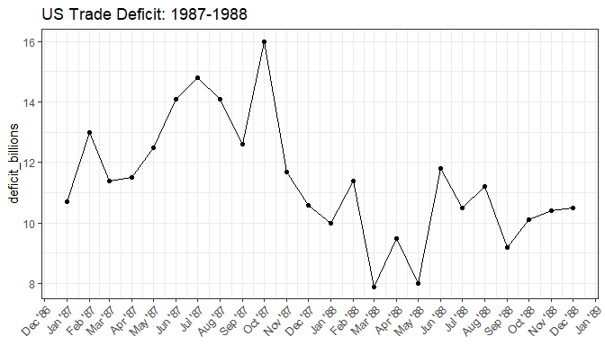
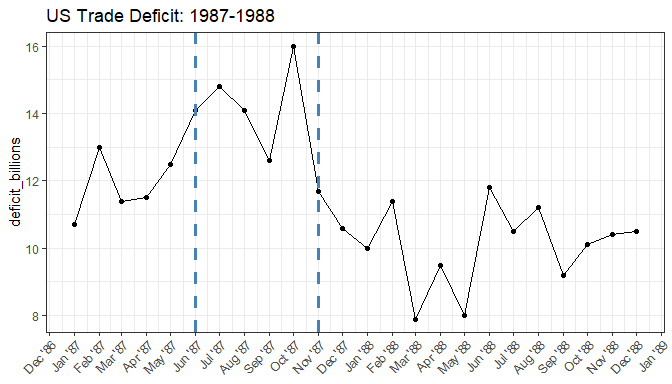

<!-- README.md is generated from README.Rmd. Please edit that file -->

# ChangePointTaylor

<!-- badges: start -->

<!-- badges: end -->

The goal of ChangePointTaylor is to identify changes in mean for a
series of data. The package is a simple R implementation of the change
in mean detection
[method](https://variation.com/wp-content/uploads/change-point-analyzer/change-point-analysis-a-powerful-new-tool-for-detecting-changes.pdf)
developed by Wayne Taylor and utilized in his [Change Point
Analyzer](https://variation.com/product/change-point-analyzer/)
software. The package recursively uses the ‘MSE’ change point
calculation to identify candidate change points. The change points are
then re-estimated and Taylor’s backwards elimination process is employed
to come up with a final set of change points. Many of the underlying
functions are written in C++ for improved performance.

## Installation

You can install the released version of ChangePointTaylor from
[CRAN](https://CRAN.R-project.org) with:

``` r
install.packages("ChangePointTaylor")
```

### Example

Load the package and tidyverse.

``` r
library(ChangePointTaylor)
library(tidyverse)
#> -- Attaching packages ------------------------------------------------------------------------------------------------------------------------- tidyverse 1.3.0 --
#> v ggplot2 3.3.0     v purrr   0.3.4
#> v tibble  3.0.1     v dplyr   0.8.5
#> v tidyr   1.0.3     v stringr 1.4.0
#> v readr   1.3.1     v forcats 0.5.0
#> -- Conflicts ---------------------------------------------------------------------------------------------------------------------------- tidyverse_conflicts() --
#> x dplyr::filter() masks stats::filter()
#> x dplyr::lag()    masks stats::lag()
```

View the example dataset of US trade deficit data from January 1987 to
December 1988.

``` r
US_Trade_Deficit
#> # A tibble: 24 x 2
#>    date    deficit_billions
#>    <chr>              <dbl>
#>  1 Jan '87             10.7
#>  2 Feb '87             13  
#>  3 Mar '87             11.4
#>  4 Apr '87             11.5
#>  5 May '87             12.5
#>  6 Jun '87             14.1
#>  7 Jul '87             14.8
#>  8 Aug '87             14.1
#>  9 Sep '87             12.6
#> 10 Oct '87             16  
#> # ... with 14 more rows
```

Plot the data

``` r

trade_deficit_plot <- US_Trade_Deficit %>%
  mutate(date = as.Date(paste(date, "1"), format = "%b '%y %d")) %>%
  ggplot(aes(x = date, y = deficit_billions, group = 1)) +
  geom_line() +
  geom_point() +
  theme_bw() +
  scale_x_date(date_breaks = "1 month", date_labels = "%b '%y") +
  theme(
    axis.text.x = element_text(angle = 45, vjust = 1, hjust =1),
    axis.title.x = element_blank()
  ) +
  ggtitle("US Trade Deficit: 1987-1988")
  
trade_deficit_plot
```



In its simplest form, the `change_point_analyzer()` function simply
takes a numeric vector and returns the identified change points.
However, the output only identifies changes by their index in the
original numeric vector.

``` r
change_point_analyzer(US_Trade_Deficit$deficit_billions)
#> 2 Change(s) Identified
#> NA supplied to 'label' argument
#> # A tibble: 2 x 6
#>   change_ix label `CI (95%)` change_conf  From    To
#>       <dbl> <lgl> <chr>            <dbl> <dbl> <dbl>
#> 1         6 NA    (5 - 7)          0.938  11.8  14.3
#> 2        11 NA    (11 - 11)        0.999  14.3  10.2
```

When a vector of labels, the same length as the `x` values, is supplied
to the `label` argument, those labels will be displayed in the output
dataframe.

``` r
change_points <- change_point_analyzer(US_Trade_Deficit$deficit_billions, label = US_Trade_Deficit$date)
#> 2 Change(s) Identified
change_points
#>   change_ix   label            CI (95%) change_conf  From    To
#> 1         6 Jun '87 (May '87 - Jul '87)       0.913 11.82 14.32
#> 2        11 Nov '87 (Nov '87 - Nov '87)       0.998 14.32 10.20
```

Plot the change points we identified.

``` r
trade_deficit_plot +
  geom_vline(xintercept = as.Date(paste(change_points$label, "1"), format = "%b '%y %d"), color = "steelblue", linetype = "dashed", size = 1.3)
```



The number of bootstraps can be controlled with the `n_bootstraps`
argument. This can reduce stochastic differences between subsequent
function calls; however, this comes at the expense of execution speed.

``` r
bench::mark(
  change_point_analyzer(US_Trade_Deficit$deficit_billions, label = US_Trade_Deficit$date, n_bootstraps = 1000)
 ,change_point_analyzer(US_Trade_Deficit$deficit_billions, label = US_Trade_Deficit$date, n_bootstraps = 10000)
  ,check = F
 ,min_iterations = 2
 ,max_iterations = 5
) %>%
  mutate(expression = c("1000 Bootstraps", "10000 Bootstraps")) %>%
  select(expression:mem_alloc)
#> # A tibble: 2 x 5
#>   expression            min   median `itr/sec` mem_alloc
#>   <chr>            <bch:tm> <bch:tm>     <dbl> <bch:byt>
#> 1 1000 Bootstraps  295.69ms 304.81ms     3.28      134MB
#> 2 10000 Bootstraps    1.03s    1.05s     0.948     274MB
```

The the user can also adjust the minimum level of confidence a change
point must reach to become an initial candidate (`min_candidate_conf`)
and the minimum confidence to be included in the final table of change
points (`min_tbl_conf`).

``` r
change_point_analyzer(US_Trade_Deficit$deficit_billions, label = US_Trade_Deficit$date, min_candidate_conf = 0.66,  min_tbl_conf = 0.95)
#> 1 Change(s) Identified
#>   change_ix   label            CI (95%) change_conf     From       To
#> 1        12 Dec '87 (Sep '87 - Jan '88)           1 12.94545 10.08462
```
