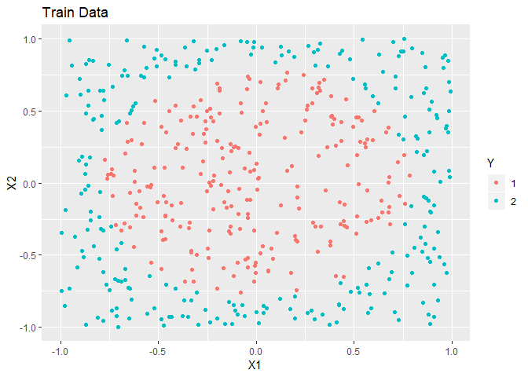
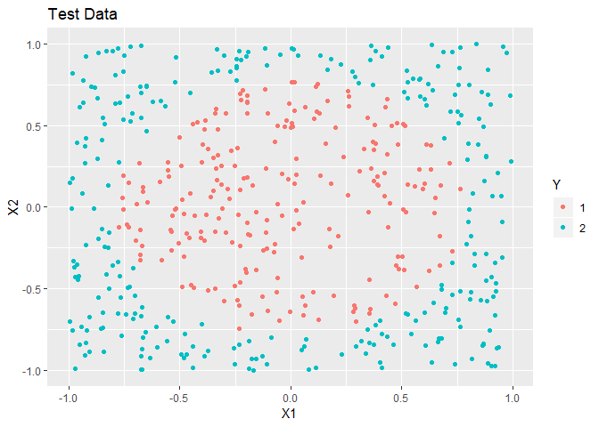

<!-- README.md is generated from README.Rmd. Please edit that file -->

# DANN

<!-- badges: start -->

[](https://travis-ci.org/gmcmacran/dann)
[](https://codecov.io/gh/gmcmacran/dann?branch=master)
[](https://cran.r-project.org/package=dann)
<!-- badges: end -->

An Implementation of Hastie and Tibshirani’s Discriminant Adaptive
Nearest Neighbor Classification in R.

## Installation

You can install the released version of dann from
[CRAN](https://CRAN.R-project.org) with:

``` r
install.packages("dann")
```

And the development version from [GitHub](https://github.com/) with:

``` r
# install.packages("devtools")
devtools::install_github("gmcmacran/dann")
```

## Package Introduction

In k nearest neighbors, the shape of the neighborhood is always
circular. Discriminant Adaptive Nearest Neighbor (dann) is a variation
of k nearest neighbors where the shape of the neighborhood is data
driven. The neighborhood is elongated along class boundaries and shrunk
in the orthogonal direction to class boundaries. See [Discriminate
Adaptive Nearest Neighbor
Classification](https://web.stanford.edu/~hastie/Papers/dann_IEEE.pdf)
by Hastie and Tibshirani. This package implements DANN and sub-DANN in
section 4.1 of the publication and is based on Christopher Jenness’s
python [implementation.](https://github.com/christopherjenness/ML-lib)

## Example: Circle Problem

In this example, simulated data is made. The overall trend is a circle
inside a square.

``` r
library(dann)
library(dplyr, warn.conflicts = FALSE)
library(ggplot2)
library(mlbench)

set.seed(1) 

#Create training data
train <- mlbench.circle(500, 2) %>%
  tibble::as_tibble()
colnames(train) <- c("X1", "X2", "Y")

ggplot(train, aes(x = X1, y = X2, colour = Y)) + 
  geom_point() + 
  labs(title = "Train Data")
```



``` r

#Create test data
test <- mlbench.circle(500, 2) %>%
  tibble::as_tibble()
colnames(test) <- c("X1", "X2", "Y")

ggplot(test, aes(x = X1, y = X2, colour = Y)) + 
  geom_point() + 
  labs(title = "Test Data")
```



Next, a bit of data shaping is needed. dann is more matrix driven as
opposed to dataframe driven. The predictor variables need to be one
matrix. The observed labels need to be in another.

``` r
xTrain <- train %>%
  select(X1, X2) %>%
  as.matrix()

yTrain <- train %>%
  pull(Y) %>%
  as.numeric() %>%
  as.vector()

xTest <- test %>%
  select(X1, X2) %>%
  as.matrix()

yTest <- test %>%
  pull(Y) %>%
  as.numeric() %>%
  as.vector()
```

To train a model, the matrices and a few parameters are passed into
dann. The argument neighborhood\_size is the number of data points used
to estimate a good shape of the neighborhood. The argument k is the
number of data points used in the final classification. Overall, dann is
a highly accurate model for this data set.

``` r
dannPreds <- dann(xTrain = xTrain, yTrain = yTrain, xTest = xTest, 
                  k = 7, neighborhood_size = 50)
mean(dannPreds == yTest)
#> [1] 0.964
```
