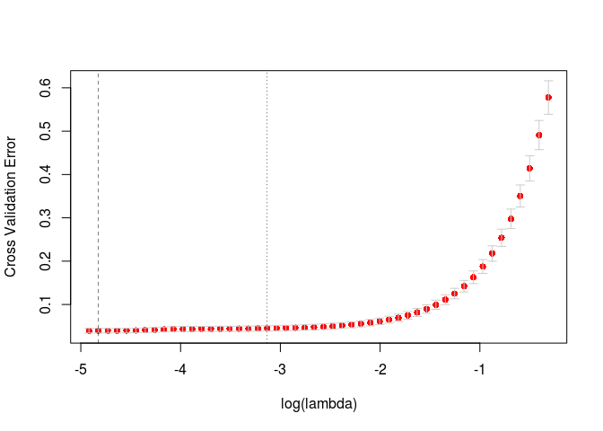
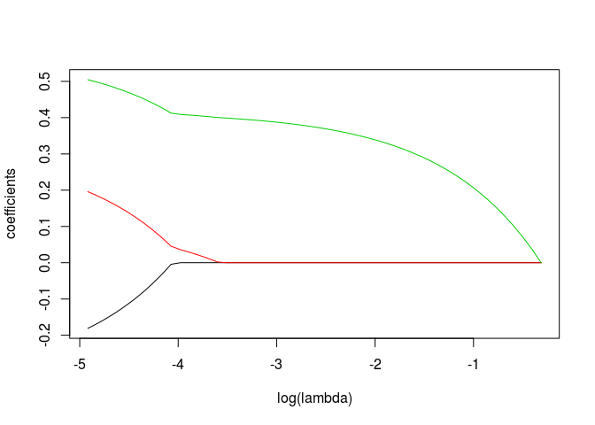

<!-- README.md is generated from README.Rmd. Please edit that file -->

# hmlasso

You have missing data and want to estimate a regression model? Try
`hmlasso` package\! This package provides a simple implementation of
HMLasso (Lasso with High Missing rate).

## Installation

You can install the released version of hmlasso from
[CRAN](https://CRAN.R-project.org) with:

``` r
install.packages("hmlasso")
```

## Example

This is a basic example which shows you how to solve a common problem:

``` r
library(hmlasso)
```

A typical usage of `hmlasso` is as follows:

``` r
head(iris)
#>   Sepal.Length Sepal.Width Petal.Length Petal.Width Species
#> 1          5.1         3.5          1.4         0.2  setosa
#> 2          4.9         3.0          1.4         0.2  setosa
#> 3          4.7         3.2          1.3         0.2  setosa
#> 4          4.6         3.1          1.5         0.2  setosa
#> 5          5.0         3.6          1.4         0.2  setosa
#> 6          5.4         3.9          1.7         0.4  setosa
X_incompl <- as.matrix(iris[, 1:3])
X_incompl[1:5,1] <- NA
X_incompl[6:10,2] <- NA
y <- iris[, 4]

cv_fit <- cv.hmlasso(X_incompl, y, nlambda=50, lambda.min.ratio=1e-2)
plot(cv_fit)
```



``` r
plot(cv_fit$fit)
```



## References

Takada, M., Fujisawa, H., & Nishikawa, T. (2019). “HMLasso: Lasso with
High Missing Rate.” IJCAI. \<arXiv:1811.00255\>.
