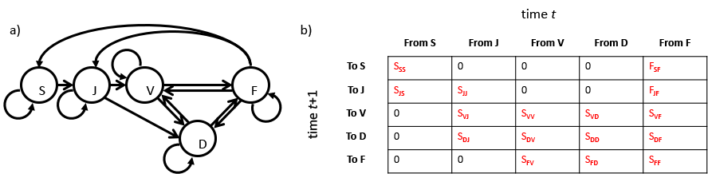
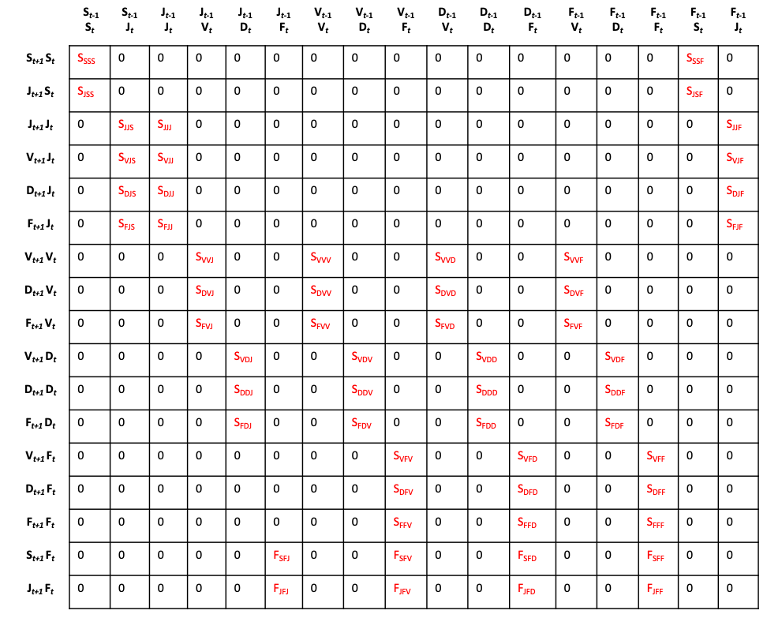

```{r, include = FALSE}
knitr::opts_chunk$set(
  collapse = TRUE,
  comment = "#>"
)
```

This document was built in Markdown in R `r getRversion()`, and covers package `lefko3` version 3.1.0.

## INTRODUCTION TO PACKAGE `LEFKO3`

  <p style="text-indent: 20px">R package `lefko3` is devoted to the analysis of demographic data through matrix projection models (MPMs). It is intended to serve as a one-stop destination for the construction of size-classified Lefkovitch MPMs, which divide the life of an individual into different life stages rather than ages. It was originally developed specifically to estimate and analyze *historical* matrix projection models (hMPMs), which are matrices designed to include not only current state but also past history in terms of previous states. Such matrices are large, typically having dimensions higher than their standard, ahistorical counterparts (the latter will be hereafter refered to as ahistorical MPMs, or ahMPMs, while the acronym MPM will be used to refer to all matrix projection models, whether historical or not). As this package has developed, we have prioritized the development of core algorithms and methods to construct these matrices quickly, efficiently, and at least relatively painlessly. To make comparison possible and straightforward, the package contains methods covering the estimation of both ahistorical and historical MPMs, using both raw matrix and function-based formats. It can also be used to create integral projection models (IPMs), and we are currently planning to include a set of functions to estimate age × stage matrices in both raw and function-based formats in the near future.</p>
  
  <p style="text-indent: 20px">Package `lefko3` introduces a complete suite of functions covering the MPM workflow, from dataset management to the construction of MPMs to their analysis. Dataset management functions standardize demographic datasets from the dominant formats into a format that facilitates hMPM estimation while accounting for individual identity and other parameters. Demographic vital rate models may be estimated using standardized demographic datasets, and these functions take the form of generalized linear or mixed linear models using a variety of response distributions. Matrix estimation functions produce all necessary matrices from a single dataset, including all times, patches, and populations in a single shot, and do so quickly through core binaries engineered for speed.</p>

  <p style="text-indent: 20px">This tutorial was written as a basic introduction to the concepts and methods underlying `lefko3`. The target audience is everyone from beginners with little knowledge of population ecology and even less of R, to experienced ecologists with advanced working knowledge of R and the analysis of population dynamics. The tutorial is divided into three core vignettes. First, this vignette introduces the concepts, background, and workflow underlying the package. Second and third, we include two vignettes showcasing `lefko3` on two datasets included in the package, one from a Swedish population of the perennial herb *Lathyrus vernus* and another from an American population of the terrestrial orchid *Cypripedium candidum*.</p>
  
## BASIC CONCEPTS BEHIND POPULATION MATRIX PROJECTION

### Life history models and population projection matrices

  <p style="text-indent: 20px">Matrix projection models are representations of the dynamics of a population across all life history stages deemed relevant, across the most relevant time interval (typically one year, but sometimes different, and assumed to be consistent within each analysis). They require a complete model of the organism's life history prior to construction, and this model must explicitly show all life stages and all life history transitions to be modeled. Each stage is mutually exclusive, meaning that an individual can only be in a single stage at a given time. Each stage is represented in the matrix by a single column and a single row. Each transition takes exactly one full time step. Matrix elements (*a*<sub>*kj*</sub>) show either the probability of transition for an individual in stage *j* at time *t* (along the columns), to stage *k* at time *t*+1 (along the rows), or the mean rate of production of new recruits into stage *k* at time *t*+1 (along the rows) by individuals in reproductive stage *j* in time *t* (along the columns). Conceptually, each individual is in a particular stage in the instance of monitoring or observation, and then transitions in the interval between that time's observation and the next time's observation. Death is not an explicit life stage and so is not modeled as such, instead becoming a potential endpoint of each transition.</p>
  
  <p style="text-indent: 20px">The timing of monitoring relative to the reproductive season impacts the structure of life history models. Life history models are typically categorized as either pre-breeding or post-breeding. Here, "breeding" refers to the production of offspring, and so a pre-breeding model assumes that monitoring is conducted before the new recruits are fully formed, while a post-breeding model assumes that the monitoring is conducted just after new recruits are born. In a pre-breeding model, fecundity equals the production of newborns multiplied by the survival of newborns to age 1, since fecundity must take place over a full time step [@kendall_persistent_2019]. In a post-breeding model, fecundity equals the survival of the parent from the stage/age preceding reproduction to reproduction itself, multiplied by the production of newborns [@kendall_persistent_2019]. In plant populations, the typical strategy taken is that of a pre-breeding model in which fecundity is estimated as the production of seeds in a given year multiplied by their germination in the following year, with seed dormancy allowed by multiplying seed production by seed survival (which is given as the probability of maintaining seed viability from one year to the next). Added complexity can arise if there are multiple fecundity pathways, for example when clonal reproduction is also possible. We urge users to be careful with this step, as properly defining the life history model has important implications for all analyses of population dynamics [@kendall_persistent_2019].</p>
  
  <p style="text-indent: 20px">Figure 1 is a simple example of a stage-classified model and matrix for a terrestrial orchid species, *Cypripedium candidum* [@shefferson_estimating_2001]. Here, we show each stage as a node, and each transition as a uni-directional arrow (a). The rates and probabilities are shown as mathematical symbols in (b), with *S*<sub>*kj*</sub> denoting survival-transition probability from stage *j* in time *t* to stage *k* in time *t*+1, and *F*<sub>*kj*</sub> denoting the fecundity of reproductive stage *j* into recruit stage *k* in this life history.</p>
  
</img>
**Figure 1.** Simple life history model (a) and ahistorical MPM (b) for *Cypripedium candidum*, a North American herbaceous plant species. Here, S is the dormant seed stage, J is the seedling stage, D is adult vegetative dormancy, V is adult vegetative sprouting, and F is flowering.

### Ahistorical vs. historical matrix models

  <p style="text-indent: 20px">Figure 1 is an example of an **ahistorical MPM** (ahMPM), which is a matrix projection model in which the future stage of an individual is dependent only on its current stage, and not on previous stages. In other words, individual history is not incorporated into ahMPMs. It may sound strange to say that individual history is not incorporated into the matrices given that demographic datasets are composed of records of individual histories spanning several or even many observation events. However, construction of a typical ahMPM breaks up these individual histories into pairs of consecutive stages across time, with each pair treated as independent of every other pair of consecutive stages. For example, if an individual is in stage A in time 1, stage B in time 2, stage E in time 3, and dead in time 4, then its individual history is broken up into A-B, B-E, and E-Dead, with each pair assumed to be independent.</p>
  
  <p style="text-indent: 20px">The matrix shown in figure 1 can be used to project population dynamics by predicting the future numbers of individuals in each stage. For this example, we can project forward by multiplying the projection matrix by a vector of the numbers of individuals in each stage, given in the same order as the order of stages corresponding to the rows and columns of the matrix, in a particular time, as in</p>
  
  \begin{equation}
  \tag{1}
  \left[\begin{array}
  {rrr}
  n _{2,S} \\
  n _{2,J} \\
  n _{2,V} \\
  n _{2,D} \\
  n _{2,F}
  \end{array}\right] = \left[\begin{array}
  {rrr}
  S _{SS} & 0 & 0 & 0 & F _{SF} \\
  S _{JS} & S _{JJ} & 0 & 0 & F _{JF} \\
  0 & S _{VJ} & S _{VV} & S _{VD} & S _{VF} \\
  0 & S _{DJ} & S _{DV} & S _{DD} & S _{DF} \\
  0 & 0 & S _{FV} & S _{FD} & S _{FF}
  \end{array}\right] \left[\begin{array}
  {rrr}
  n _{1,S} \\
  n _{1,J} \\
  n _{1,V} \\
  n _{1,D} \\
  n _{1,F}
  \end{array}\right]  
  \end{equation}
  
where $n _{1,S}$ is the number of individuals in stage $S$ in year 1. The total population size in any given year is the sum of the numbers of individuals in that year, and the asymptotic growth rate $\lambda$ can be estimated as the dominant eigenvalue of this matrix.
  
  <p style="text-indent: 20px">The independence of consecutive stage-pairs reflects a central assumption in ahMPM analysis: the stage of an individual in the next time is influenced only by its current stage. Conceptually, if an organism's stage in the next time is entirely determined by its current stage, then its previous states do not influence these transitions. Thus, standard ahMPMs are two dimensional and reflect only the current and next immediate stage of individuals, given by the columns and rows, respectively. This is ultimately an extension of the *iid* assumption in statistics - that the states of individuals are independent and originate from identically-distributed random variables.</p>
  
  <p style="text-indent: 20px">MPMs have been estimated for approximately a century now. We have never done a meta-analysis of all of these studies, but nonetheless it is safe to say that studies considering individual history are rare. The typical MPM study uses ahMPMs, and so assumes independence of stage transitions across time even from the same individual. In fact, at the time of writing, we are aware of only 5 examples of studies using a **historical** approach, meaning that they incorporated some degree of individual history into matrix estimation and analysis [@ehrlen_dynamics_2000; @shefferson_life_2014; @shefferson_predicting_2017; @shefferson_drivers_2018; @de_vries_demography_2018].</p>
  
  <p style="text-indent: 20px">The **historical MPM** (hMPM) is an extension of the matrix projection model that incorporates information on one previous time into the determination of vital rates. Thus, the expected survival-transition probability of an individual in stage *j* at time *t* to stage *k* at time *t*+1 depends not only on its stage in time *t* but also on its stage in time *t*-1. Population ecologists considering this problem analytically might be inclined to add an extra dimension to the matrix to deal with this, thus creating a 3d array or cube. However, this approach is computationally intensive and makes analysis challenging, particularly complicating projection [@de_vries_demography_2018]. Instead, we utilize the approach developed by Ehrlén [-@ehrlen_dynamics_2000], in which rows and columns represent life history stages paired in consecutive times. Thus, columns now represent the **From** pair of stages (stage in times *t* and *t*-1), and rows now represent the **To** pair of stages (stage in times *t* and *t*+1), as in Figure 2. This model is effectively equivalent to the second-order model proposed by de Vries and Caswell [-@de_vries_demography_2018], although it organizes the elements differently.</p>
  
</img>
**Figure 2.** Historical MPM for *Cypripedium candidum*, a North American herbaceous plant.

  <p style="text-indent: 20px">Here, we can refer to matrix elements as *a*<sub>*kjl*</sub>, where the element represents the rate at which individuals transition to stage *k* in time *t*+1 after having been stage *j* in time *t* and stage *l* in time *t*-1. If *n*<sub>*kjl*</sub> is the number of individuals making this transition, *n*<sub>*.jl*</sub> is the total number of individuals in stage *j* in time *t* and stage *l* in time *t*-1 regardless of stage (or even status as alive or dead) in time *t*+1, *m* is the number of stages in the life history model, and *d* is the number of stages plus death in the life history model, then we have</p>
  
  \begin{equation}
  \tag{2}
  a _{kjl} = \frac{n _{kjl}}{n _{.jl}} = \frac{n _{kjl}}{\sum_{i=1}^{d} n _{ijl}}
  \end{equation}
  
These values can be used to compute the elements of matrices in ahMPMs, as follows:
  
  \begin{equation}
  \tag{3}
  a _{kj} = \frac{\sum_{l=1}^{m} n _{kjl}}{\sum_{l=1}^{m} \sum_{i=1}^{d} n _{ijl}}
  \end{equation}

Note that one cannot use the matrix elements in a historical MPM to calculate the associated ahistorical MPM elements, because the historical transitions must be weighted by the numbers of individuals in each previous stage to produce the proper weighted average rate.

  <p style="text-indent: 20px">Historical MPMs can be projected forward in the same way that ahMPMs can. Here we see an example of a projection going forward one year, using the hMPM shown in figure 2.</p>
  
  \begin{equation}
  \tiny
  \tag{4}
  \left[\begin{array}
  {rrr}
  n _{2,SS} \\
  n _{2,JS} \\
  n _{2,JJ} \\
  n _{2,VJ} \\
  n _{2,DJ} \\
  n _{2,FJ} \\
  n _{2,VV} \\
  n _{2,DV} \\
  n _{2,FV} \\
  n _{2,VD} \\
  n _{2,DD} \\
  n _{2,FD} \\
  n _{2,VF} \\
  n _{2,DF} \\
  n _{2,FF} \\
  n _{2,SF} \\
  n _{2,JF}
  \end{array}\right] = \left[\begin{array}
  {rrr}
  S _{SSS} & 0 & 0 & 0 & 0 & 0 & 0 & 0 & 0 & 0 & 0 & 0 & 0 & 0 & 0 & F _{SSF} & 0 \\
  S _{JSS} & 0 & 0 & 0 & 0 & 0 & 0 & 0 & 0 & 0 & 0 & 0 & 0 & 0 & 0 & F _{JSF} & 0 \\
  0 & S _{JJS} & S _{JJJ} & 0 & 0 & 0 & 0 & 0 & 0 & 0 & 0 & 0 & 0 & 0 & 0 & 0 & F _{JJF} \\
  0 & S _{VJS} & S _{VJJ} & 0 & 0 & 0 & 0 & 0 & 0 & 0 & 0 & 0 & 0 & 0 & 0 & 0 & F _{VJF} \\
  0 & S _{DJS} & S _{DJJ} & 0 & 0 & 0 & 0 & 0 & 0 & 0 & 0 & 0 & 0 & 0 & 0 & 0 & F _{DJF} \\
  0 & S _{FJS} & S _{FJJ} & 0 & 0 & 0 & 0 & 0 & 0 & 0 & 0 & 0 & 0 & 0 & 0 & 0 & F _{FJF} \\
  0 & 0 & 0 & S _{VVJ} & 0 & 0 & S _{VVV} & 0 & 0 & S _{VVD} & 0 & 0 & S _{VVF} & 0 & 0 & 0 & 0 \\
  0 & 0 & 0 & S _{DVJ} & 0 & 0 & S _{DVV} & 0 & 0 & S _{DVD} & 0 & 0 & S _{DVF} & 0 & 0 & 0 & 0 \\
  0 & 0 & 0 & S _{FVJ} & 0 & 0 & S _{FVV} & 0 & 0 & S _{FVD} & 0 & 0 & S _{FVF} & 0 & 0 & 0 & 0 \\
  0 & 0 & 0 & 0 & S _{VDJ} & 0 & 0 & S _{VDV} & 0 & 0 & S _{VDD} & 0 & 0 & S _{VDF} & 0 & 0 & 0 \\
  0 & 0 & 0 & 0 & S _{DDJ} & 0 & 0 & S _{DDV} & 0 & 0 & S _{DDD} & 0 & 0 & S _{DDF} & 0 & 0 & 0 \\
  0 & 0 & 0 & 0 & S _{FDJ} & 0 & 0 & S _{FDV} & 0 & 0 & S _{FDD} & 0 & 0 & S _{FDF} & 0 & 0 & 0 \\
  0 & 0 & 0 & 0 & 0 & 0 & 0 & 0 & S _{VFV} & 0 & 0 & S _{VFD} & 0 & 0 & S _{VFF} & 0 & 0 \\
  0 & 0 & 0 & 0 & 0 & 0 & 0 & 0 & S _{DFV} & 0 & 0 & S _{DFD} & 0 & 0 & S _{DFF} & 0 & 0 \\
  0 & 0 & 0 & 0 & 0 & 0 & 0 & 0 & S _{FFV} & 0 & 0 & S _{FFD} & 0 & 0 & S _{FFF} & 0 & 0 \\
  0 & 0 & 0 & 0 & 0 & F _{SFJ} & 0 & 0 & F _{SFV} & 0 & 0 & F _{SFD} & 0 & 0 & F _{SFF} & 0 & 0 \\
  0 & 0 & 0 & 0 & 0 & F _{JFJ} & 0 & 0 & F _{JFV} & 0 & 0 & F _{JFD} & 0 & 0 & F _{JFF} & 0 & 0 \\
  \end{array}\right] \left[\begin{array}
  {rrr}
  n _{1,SS} \\
  n _{1,JS} \\
  n _{1,JJ} \\
  n _{1,VJ} \\
  n _{1,DJ} \\
  n _{1,FJ} \\
  n _{1,VV} \\
  n _{1,DV} \\
  n _{1,FV} \\
  n _{1,VD} \\
  n _{1,DD} \\
  n _{1,FD} \\
  n _{1,VF} \\
  n _{1,DF} \\
  n _{1,FF} \\
  n _{1,SF} \\
  n _{1,JF}
  \end{array}\right]  
  \end{equation}
  
Here, $n _{1,SS}$ is the number of individuals that were in stage $S$ in both years 0 and 1, and $n _{2,DF}$ is the number of individuals that were in stage $D$ in year 2 and stage $F$ in year 1.

  <p style="text-indent: 20px">Historical MPMs normally require a much larger number of elements to be parameterized. Figure 2 illustrates this issue, but **Analysis 2** in our *Cypripedium candidum* vignette provides a more realistic example. In that case study, we use a life history with 54 life stages, of which the first is a dormant seed stage, the next four are immature stages, the sixth is adult vegetative dormancy, the next 24 stages are size-classified non-flowering adults, and the final 24 stages are size-classified flowering adults. A life history with 54 stages yields an ahistorical matrix with 54 columns and 54 rows, and so 2,916 elements. A full historical matrix should have 2,916 columns and 2,916 rows, consisting of 8,503,056 elements, because the column and row stages represent pairs of stages.</p>
  
  <p style="text-indent: 20px">In an ahistorical matrix, the only true 0s will be those elements corresponding to biologically impossible transitions (although there may be 0s caused by a lack of individuals taking a particular transition in a given time step). However, most elements in a historical MPM are structural 0s, and increasing the number of stages causes these structural 0s to increase at a faster rate than the truly estimable elements. In fact, if there are *m* stages in a life history, yielding <i>m</i><sup>2</sup> elements in an ahistorical matrix, then although there will be <i>m</i><sup>4</sup> elements in the historical matrix, only <i>m</i><sup>3</sup> will be *potentially* estimable while (*m*-1)<i>m</i><sup>3</sup> are structural 0s (we say *potentially* because some of the logically possible transitions may still be biologically impossible). This happens because transition elements in hMPMs are only estimable if stage at time *t* is equal in the column and row stage pairs. For example, the transition probability between stage A in time *t*-1 and stage B in time *t* (column stage), to stage C in time *t* and stage D in time *t*+1 (row stage) equals 0, because an organism cannot be in both stages B and C in time *t*. Thus, in the *Cypripedium candidum* example, all 2,916 elements of the ahMPM are potentially estimable (although some may be biologically impossible), while only 157,464 of the 8,503,056 elements of the associated hMPM are potentially estimable and the rest are structural 0s.</p>
  
### Raw vs. function-based matrix models, including integral projection models

  <p style="text-indent: 20px">Matrix projection models, whether historical or ahistorical, can also be categorized as either **raw** or **function-based**. The oldest is the **raw** MPM, in which transition probabilities in the matrix are estimated by counting all of the individuals alive in a particular stage at time *t*, and dividing that number into the number of individuals from that set that are still alive in each possible stage in time *t*+1 (equations 2 and 3). For example, if 100 individuals are alive in stage D in 2010, and 20 of these are alive in stage D in year 2011, as are a further 40 in stage V and a further 25 in stage F, then the associated transition probabilities are 0.20, 0.40, and 0.25, respectively. The overall survival probability for stage D is the sum of these transitions, or 0.85. Methods for estimating fecundity in raw matrices vary from system to system. In the *Cypripedium candidum* vignette, we counted the number of fruits produced by each individual in a given year, and then multiplied by the mean number of seeds per fruit and the mean germination probability in the next year. This study was conducted as a pre-breeding census - fecundity was estimated using a count of the seeds or other propagules that the plant produces (or a proxy thereof, such as the number of fruits multiplied by the mean number of seeds per fruit) multiplied by the probability of that propagule surviving to the next year in order to make sure that fecundity reflects demographic processes across a full time-step [@kendall_persistent_2019]. In other systems in which offspring may be observed and tracked, counts of actual recruits may be possible, such as in studies of nesting birds, and as in *Lathyrus vernus*, an herbaceous perennial plant that is the subject of our second vignette.</p>
  
  <p style="text-indent: 20px">In **function-based** MPMs, most matrix elements are populated by kernels that link together functions representing key demographic processes governing each transition. Typically, demographic datasets are analyzed via linear models to estimate demographic parameters such as survival probability, the probability of becoming a certain size assuming survival, and fecundity. These linear models are developed using subsets of the demographic data used in a study in order to estimate conditional probabilities reflecting all of the demographic processes that must occur over the span of a single time-step. Matrix elements are then estimated as products of these linear models set to particular inputs corresponding to the From and To stages, as well as any other parameters governing the construction of the matrix. The most common examples of function-based MPMs are **integral projection projection models (IPMs)**, which break up a life history into many fine-scale size classes using a continuous measure of size, and then estimate survival-transitions and fecundity according to these fine-scale size classes [@ellner_integral_2006]. Function-based MPMs are more recent inventions than raw MPMs, and their strengths are making them increasingly common in the literature.</p>
  
  <p style="text-indent: 20px">The example from Figures 1 and 2 may help to illustrate the procedure of creating a function-based MPM. In *Cypripedium candidum*, the simple life history model shown in Figure 1 includes one adult stage that is unobservable (D - vegetative dormancy), one adult stage that is observable but not reproductive (V - vegetative sprouting), and one adult stage that is both observable and reproductive (F - flowering). If $\sigma _{.jl}$ is the probability of survival from stage *j* in time *t* and stage *l* in time *t*-1 to any stage in time *t*+1, $\psi _{.jl}$ is the probability of sprouting in time *t*+1 after being stage *j* in time *t* and stage *l* in time *t*-1 and surviving to time *t*+1, and $\rho _{.jl}$ is the probability of flowering in time *t*+1 after being stage *j* in time *t* and stage *l* in time *t*-1 and surviving to and sprouting in time *t*+1, then:</p>
  
  \begin{equation}
  \tag{5}
  a _{DDD} = \sigma _{.DD} (1 - \psi _{.DD})
  \end{equation}
  
  \begin{equation}
  \tag{6}
  a _{VDD} = \sigma _{.DD} \psi _{.DD} (1 - \rho _{.DD})
  \end{equation}
  
  \begin{equation}
  \tag{7}
  a _{FDD} = \sigma _{.DD} \psi _{.DD} \rho _{.DD}
  \end{equation}
  
  <p style="text-indent: 20px">In both raw and function-based MPMs, most estimated elements are *survival-transition* probabilities. In ahistorical MPMs, these give the probability of an individual in stage *j* at time *t* surviving and transitioning to stage *k* at time *t*+1. Fewer elements are devoted to fecundity, although life history models with more reproductive stages and more recruit stages will have more fecundity elements. In Figure 1, fecundity is shown in the top-right of the matrix, as the mean production of seeds either dormant and germinating in the next time interval. Ignoring the fecundity elements, we have a **survival-transition matrix** (symbolized as either <b>U</b> or <b>T</b>), in which the column sums correspond to the expected survival probabilities of individuals in each stage from time *t* to time *t*+1. Ignoring the survival-transition terms, we have the **fecundity matrix** (symbolized as <b>F</b>), in which the column sums correspond to the expected overall fecundity of individuals in these respective stages. The full MPM is the matrix sum of the survival-transition matrix and the fecundity matrix.</p>
  
  <p style="text-indent: 20px">In principle, everything just noted about function-based ahistorical MPMs also applies to historical function-based MPMs. However, there is a key difference in terms of the distribution of elements within the matrix. The inclusion of stage or condition in time *t*-1 increases both the number of survival-transition elements and the number of fecundity elements, and also has the effect of dispersing the locations of these elements across the matrix. Whereas estimated transitions in ahMPMs will generally occur in dense patches of estimated elements, in hMPMs, most elements are structural 0s, with elements occurring either individually surrounded by 0s, or in small patches of estimated elements surrounded by 0s. This makes error-checking more challenging, because the user needs to be aware of where elements are supposed to occur in order to check their values properly.</p>
  
## WORKFLOW

### Step 1: Life history model development

  <p style="text-indent: 20px">The basic workflow to analysis with package `lefko3` starts with the development of a life history model that encapsulates all of the appropriate life stages relevant to population dynamics. We do not present a complete discussion on this step, instead focusing only on a skeletal description of the process particularly focused on the life cycle graph and noting key issues related to this package. We encourage users to explore the literature on this subject, but particularly note chapters 3 and 4 in Caswell [-@caswell_matrix_2001] for a good treatment useful for beginners. Stages need to be defined carefully, and should strongly account for variability in vital rates. We also note Kendall et al. [-@kendall_persistent_2019] as a good reference detailing common problems in MPM construction and how to avoid them through proper development and operationalization of life history models, and Beissinger and Westphal [-@beissinger_use_1998], Wardle [-@wardle_graph_1998], and Salguero-Gómez and Casper [-@salguero-gomez_keeping_2010] for good discussions of proper application of life history models to understand population dynamics through the MPM approach.</p>
  
  <p style="text-indent: 20px">Here we utilize a **life cycle graph** approach to build a life history model. A life cycle graph shows the life history of an organism as a series of nodes and arrows. The nodes represent unique stages that the individual may go through during development, and individuals are noted as occurring in these stages during monitoring sessions conducted over a typically regular frequency, such as every year. Arrows represent transitions between stages across consecutive times. These may be interpreted either as probabilities of survival when reflecting the individual's stage across time, and as rates when reflecting the production of offspring. A good life cycle graph, and in general a good life history model, must explicitly include representations of all stages possible for the organism to enter, and all biologically plausible transitions between these transitions. Figure 1a shows an example of a life cycle graph.</p>
  
  <p style="text-indent: 20px">The construction of a good life history model is not as easy as it might appear, particularly because it can be influenced by factors seemingly external to the life history of the organism. Some of the most important considerations include the size of the dataset, and the decision of whether to create a raw MPM or a function-based MPM. All else being equal, a larger dataset and a function-based approach will allow more stages to be used in the life history. However, as the number of stages increases, raw MPMs will include more and more 0s caused by a lack of individuals moving through specific transitions. Function-based MPMs are better able to handle large numbers of matrix elements because overparameterization is prevented by parsimonious model selection when vital rate models are determined. However, the size of the dataset influences the statistical power of these vital rate models, with smaller datasets yielding larger error associated with matrix elements. Chapter 6 in Morris and Doak [-@morris_quantitative_2002] provides a good description of techniques that may be used to define stages and to determine the exact number to use. Ellner and Rees [-@ellner_integral_2006] provides some discussion of this issue within the context of integral projection model development.</p>
  
  <p style="text-indent: 20px">Once a life history model is developed, we need to characterize the main life stages in a way that is relevant to the dataset. We do this with the `sf_create()` function, which creates a `stageframe` object. This term is a combination of the terms 'life history stage' and 'data frame', and the object itself is a data frame that describes all of the life history stages. This object is created in a way that shows how stage relates to size, reproductive status, observation status, propagule status, maturity status, and presence in the dataset, and in which the description of each life stage is unique. A good stageframe describes stages in ways that matrix-estimating functions utilize to compute elements accurately, and also allows the user to stipulate extra descriptive information on each stage as text. If the user wishes to create an IPM, then this function also allows that to be specified in a way that simplifies calculations.</p>
  
### Step 2a: Dataset organization

  <p style="text-indent: 20px">Once the stageframe has been created, the demographic data needs to be organized into a format that `lefko3` can use. We have developed two functions for this purpose, depending on the format of the data. If the data is arranged **horizontally**, meaning that individual life histories are recorded in a spreadsheet with rows corresponding to unique individuals and columns corresponding to their condition at different times, then the `verticalize3()` function can turn this dataset into the proper format. If the dataset is in vertical, ahistorical format, in which an individual's condition across time is recorded across rows in a spreadsheet, with a single row corresponding to a single observation, then the `historicalize3()` function can organize the data properly. Both functions are powered by binaries built in C++ using a single control loop to propagate each data frame properly, and so run very quickly (typically under 1s on a 2019 MacBook Pro). The case studies included in `lefko3` illustrate the usage of these functions on real data.</p>
  
### Step 2b: Provide supplemental information for matrix estimation

  <p style="text-indent: 20px">MPMs are often estimated only partially from available demographic datasets. Some transitions are parameterized using information gathered from other studies. For example, if fecundity is a function of seed production, survival to the next year, and germination probability, then germination probability might be estimated via a separate field germination study, and then used to develop the MPM. In `lefko3`, this information is provided in two ways.</p>
  
  <p style="text-indent: 20px">First, the user may specify specific rates and probabilities to incorporate directly into the matrix via the `overwrite()` function. This function provides an opportunity to show the specific transition, in either historical or ahistorical format, along with the exact value to use. It also allows the user to specify whether a specific transition should be equal to another proxy transition to be estimated within the matrix estimation procedure. For example, if there are no juveniles in a study, then it may still be valid in some circumstances to set transitions from juvenile to adult stages as equal to transitions from the smallest adult class. Such proxy estimations can be specified with `overwrite()`. Additionally, `overwrite()` allows large groups of transitions to be altered with a single line, for example all reproductive transitions.</p>
  
  <p style="text-indent: 20px">Second, the user may provide detailed information on fecundity, including which adult stage recruits which juvenile or propagule stage, and also any modifiers on fecundity estimates associated with these transitions. This is accomplished by creating a numeric matrix equal in both dimension and row/column designation to the ahistorical matrix associated with the study. We refer to this as a **reproductive matrix**. Assuming the same order of stages as in the associated `stageframe`, a zero matrix is created and fecundity elements can be changed appropriately. Changing all fecundity elements to 1 simply yields fecundity estimated as equal to whatever variable corresponds to fecundity in the dataset. Multiplying by, say, 0.25 will yield estimates 1/4 of that magnitude. The default behavior of `lefko3` if a reproductive matrix is not supplied is to assume that all fecundity is to the earliest stage supplied in the stage frame, where the earliest stage would be the first propagule stage, if provided, the first immature stage if no propagule stage is noted, or the first overall stage if only mature stages are provided.</p>
  
### Step 3: Assess whether historical MPM is justified, and develop models of demographic parameters

  <p style="text-indent: 20px">Historical MPMs are not necessarily justified in all cases. We urge the reader to use the principle of parsimony in deciding this, for example by analyzing whether lagged effects of previous stage appear to influence vital rates. Package `lefko3` includes one method to do this based on linear modeling. A number of other methods exist, mostly focused on what are known as *memory models* [@brownie_capture-recapture_1993; @pradel_proposal_2003; @cole_does_2014]. Here, we focus only on the `lefko3` method, and leave it to the reader to explore other options.</p>
  
  <p style="text-indent: 20px">In `lefko3`, function `modelsearch()` allows users to explore whether history influences component vital rates, and to develop linear models of these vital rates. The results can be used to decide not only whether a historical MPM is justified, but also to develop function-based hMPMs and ahMPMs themselves. Package `lefko3` can estimate linear models to estimate up to nine different vital rates:</p>
  
  1. **Survival probability** - This is the probability of surviving from time *t* to time *t*+1, given that the individual is in stage *j* in time *t* (and, if historical, in stage *l* in time *t*-1). In `lefko3`, this parameter may be modeled as a function of size, reproductive status, patch, year, and individual identity in times *t* and *t*-1. This parameter is required in all function-based matrices.
  
  2. **Observation probability** - This is an optional parameter denoting the probability of observation in time *t*+1 of an individual in stage *k* given survival from time *t* to time *t*+1. This parameter is only used when at least one stage is technically unobservable. For example, some plants are capable of vegetative dormancy, in which case they are alive but do not necessarily sprout in all years. In these cases, the probability of sprouting can be estimated as the observation probability. Note that this probability does not refer to observer effort, and so should only be used to differentiate completely unobservable stages where the observation status refers to an important biological phenomenon, such as when individuals may be alive but have a size of 0. In `lefko3`, this parameter may be modeled as a function of size, reproductive status, patch, year, and individual identity in times *t* and *t*-1.
  
  3. **Size transition probability** - This is the probability of becoming size *k* in time *t*+1 assuming survival from time *t* to time *t*+1 and observation in that time. In `lefko3`, this parameter may be modeled as a function of size, reproductive status, patch, year, and individual identity in times *t* and *t*-1. This parameter is required in all function-based size-classified matrices.
  
  4. **Reproduction probability** - This is an optional parameter denoting the probability of reproducing in time *t*+1 given survival from time *t* to time *t*+1, and observation in that time. Note that this should be used only if the researcher wishes to separate breeding from non-breeding mature stages. If all adult stages are potentially reproductive and no separation of reproducing from non-reproducing adults is desired, then this parameter is not needed. In `lefko3`, this parameter may be modeled as a function of size, reproductive status, patch, year, and individual identity in times *t* and *t*-1.
  
  5. **Fecundity rate** - Under the default setting, this is the rate of successful production of offspring in time *t* by individuals alive, observable, and reproductive in that time, and, if provided in the dataset, the survival of those offspring into time *t*+1 in whatever juvenile class is possible. Thus, the fecundity rate of seed-producing plants might be split into seedlings, which are plants that germinated within a year of seed production, and dormant seeds. Alternatively, it may be given only as produced fruits or seeds, with the survival and germination of seeds provided elsewhere in the MPM development process, such as the reproductive matrix. An additional setting allows fecundity rate to be estimated using data provided for time *t*+1. In `lefko3`, this parameter may be modeled as a function of size, reproductive status, patch, year, and individual identity in times *t* and *t*-1. This parameter is required in all function-based matrices.

  6. **Juvenile survival probability** - This is an optional parameter that is used to model the probability of surviving from juvenile stage *j* in time *t* to a mature stage in time *t*+1. It is used only when the user wishes to model juvenile vital rates separately from adults. In `lefko3`, this parameter may be modeled as a function of size, patch, year, and individual identity in times *t* and *t*-1.
  
  7. **Juvenile observation probability** - This is an optional parameter denoting the probability of observation in time *t*+1 of an individual in mature stage *k* given survival from a juvenile stage in time *t* to time *t*+1. It is used only when the user wishes to model juvenile vital rates separately from adults. In `lefko3`, this parameter may be modeled as a function of size, patch, year, and individual identity in times *t* and *t*-1, and all other caveats noted in (2) above apply.
  
  8. **Juvenile size transition probability** - This is an optional parameter denoting the probability of becoming mature size *k* in time *t*+1 assuming survival from juvenile stage *j* in time *t* to time *t*+1 and observation in that time. It is used only when the user wishes to model juvenile vital rates separately from adults. In `lefko3`, this parameter may be modeled as a function of size, patch, year, and individual identity in times *t* and *t*-1.
  
  9. **Juvenile reproduction probability** - This is an optional parameter denoting the probability of reproducing in mature stage *k* in time *t*+1 given survival from juvenile stage *j* in time *t* to time *t*+1, and observation in that time. It is used only when the user wishes to model juvenile vital rates separately from adults. In `lefko3`, this parameter may be modeled as a function of size, patch, year, and individual identity in times *t* and *t*-1, and all other caveats in (4) apply. Note that this parameter denotes transition to maturity.
  
  <p style="text-indent: 20px">Of these nine vital rates, most users will estimate at least parameters (1) survival probability, (3) size transition probability, and (5) fecundity. These three are the default set for function `modelsearch()`. Parameters (2) observation probability and (4) reproduction probability may be used when some stages are included that are completely unobservable (and so do not have any size), or that are mature but non-reproductive, respectively. Parameters (6) through (9) should only be added if the dataset contains juvenile individuals transitioning to maturity.</p>
  
  <p style="text-indent: 20px">Function `modelsearch()` handles the entire modeling process, including the development of global models, exhaustive model building, and the selection of best-fit models. Users need to provide this function with information about the following.</p>
  
  1. **Individual history** - Are the matrices to be built historical or ahistorical? If the former, then the state of the individual in time *t*-1 will be included in modeling.
  
  2. **Modeling approach** - Should the models be estimated as generalized linear models (GLMs) or mixed linear models? While most function-based matrix models are estimated as the former, the latter approach can account for repeated measures of the same individual by including individual identity as a random factor. Mixed models also allow time and patch to be treated as random variables.
  
  3. **Suite of factors** - Should both size and reproductive status be tested as causal factors? Should two-way interactions be included? Alternatively, should models be estimated as constants?
  
  4. **Suite of vital rates** - Which adult demographic parameters should be estimated? The defaults are (1) survival, (3) size, and (5) fecundity.
  
  5. **Juvenile vital rate estimation** - Should juvenile parameters (6) through (9) also be modeled?
  
  6. **Best-fit criterion** - If a model with fewer parameters exists within 2.0 AICc units of the model with the lowest AICc, then should this model be used as the best-fit model (the default), or should the model with the lowest AICc always be chosen?
  
  7. **Size distribution** - Should size be modeled as a continuous variable under a Gaussian distribution, or as a count variable under either a Poisson or negative binomial distribution? If the latter, should the distribution be zero-inflated?
  
  8. **Fecundity distribution** - Should fecundity be modeled as a continuous variable under a Gaussian distribution, or as a count variable under either a Poisson or negative binomial distribution? If the latter, should the distribution be zero-inflated?
  
  9. **Timing of fecundity** - `Modelsearch()` assumes that linear models of fecundity use a metric counted or measured in time *t* as the response. This applies well with most herbaceous plant datasets, where flowers or seeds produced in one year might be the fecundity response measured. However, users not wishing to follow this default behavior can use the `fectime` option to stipulate a fecundity metric measured in time *t*+1. 
  
  10. **Age** - Is an age x stage MPM the main goal?
  
  11. **Individual covariates and environmental state variables** - Should individual or environmental covariates be tested as causal factors on vital rates?
  
  12. **Missing values for times and patches** - Should times or patches with coefficients that drop to 0 be estimated as random values from the corresponding distributions of time or patch coefficients?
  
  13. **Censoring** - Should data points marked as questionable be used or eliminated?
  
  14. **Variable names** - The names of all relevant variables in the dataset need to be specified. Note that the default behavior assumes variable names produced via the `historicalize3()` or `verticalize3()` functions, which produce standardized vertical datasets.

  <p style="text-indent: 20px">Once all inputs are provided, `modelsearch()` goes to work. The result is a `lefkoMod` object, which is essentially a list in which the first several elements are the best-fit models developed for each vital rate. These are followed by an equivalent number of elements showing the full model tables developed and tested, followed by an element detailing the best-fit criterion used, and ending on quality control data showing the number of individuals and the number of unique transitions used in the estimation of each model. Depending on user choices, linear modeling is handled through the `lm()` and `glm()` functions in the `stats` package, the `lmer()` and `glmer()` functions in `lme4`, or `glmmTMB()` function in `glmmTMB`. Exhaustive model building proceeds through the `dredge()` function in package `MuMIn` [@barton_mumin_2014]. Model selection is handled through assessment of AICc and the number of parameters estimated per model (see 6. **Best-fit criterion** above).</p>
  
  <p style="text-indent: 20px">If `modelsearch()` is set for historical analysis (`historical = TRUE`, the default), then the decision of whether to develop a historical MPM can be made on the basis of whether any best-fit vital rate model includes size or reproductive status in time *t*-1. If at least one vital rate does, then a historical MPM is justified. Otherwise, it is not. Regardless, the output can be used to create a function-based MPM in the next step.</p>
  
  <p style="text-indent: 20px">Advanced users of `lefko3` may wish to create their own models without the package's automated model selection function. In that case, `lefko3`'s matrix functions can accommodate single models developed using base R, package `lme4` [@bates_fitting_2015], package `glmmTMB` [@brooks_glmmtmb_2017], and package `pscl` [@zeileis_regression_2008]. Plans are in the works to add `nlme` compatibility [@pinheiro_nlme_2020], as well as non-linear models such as general additive models (GAMs).</p>

### Step 4: Estimate matrices
  
  <p style="text-indent: 20px">MPM creation can be accomplished with five different functions:</p>
  
  1. `rlefko2()` - This function creates raw ahistorical MPMs given a dataset, a stageframe, a reproductive matrix, and an overwrite matrix.
  
  2. `rlefko3()` - This function creates raw historical MPMs given a dataset, a stageframe, a reproductive matrix, and an overwrite matrix.
  
  3. `flefko2()` - This function creates function-based ahistorical MPMs given a dataset, a set of models, a stageframe, a reproductive matrix, and an overwrite matrix.
  
  4. `flefko3()` - This function creates function-based historical MPMs given a dataset, a set of models, a stageframe, a reproductive matrix, and an overwrite matrix.
  
  5. `aflefko3()` - This function creates function-based ahistorical age x stage MPMs given a dataset, a set of models, a stageframe,a reproductive matrix, and an overwrite matrix.

  <p style="text-indent: 20px">These functions incorporate binary kernels developed to handle the estimation of matrix elements quickly and efficiently. A single run of `flefko3()`, for example, should be able to yield all annual matrices for all patches for the *Cypripedium candidum* dataset provided with `lefko3` in under a minute on most machines (14s or so on RPS' 2019 MacBook Pro with 2.3 GHz 8-Core Intel Core i9). Parallel computing should not be necessary, even with the slowest of current machines, provided that the machine is current enough to handle at least R 4.0.</p>

### Step 5. MPM analyses

  <p style="text-indent: 20px">Package `lefko3` includes a number of functions to aid analysis once matrices are created. These may be of greater utility in some circumstances than functions such as `eigen()`, because our functions are made to handle even extremely large, sparse matrices. Currently, we include functions to estimate element-wise arithmetic mean matrices, discrete population growth rate, stable stage structure, reproductive value, sensitivity, and elasticity. Plans are in the works for further analysis functions in the future.</p>
  
#### Stable stage distribution and reproductive value

  <p style="text-indent: 20px">In ahistorical analyses, the stable stage distribution and the reproductive value of stages are estimated as standardized right and left eigenvectors associated with the dominant eigenvalue of the matrix. Standardization in the stable stage distribution is handled by dividing each respective element of the right eigenvector by the sum of the elements in that eigenvector. Standardization in the reproductive value case is handled by dividing each element in the left eigenvector by the value of the first non-zero element in that eigenvector.</p>
  
  <p style="text-indent: 20px">The methods mentioned above apply to historical matrices as well. However, as described, they only provide the stable stage distribution and reproductive values of stage pairs. We provide two functions, `stablestage3()` and `repvalue3()` to allow the estimation of these vectors for both ahistorical and historical MPMs. When provided with a historical MPM, these functions also estimate **historically-corrected** stable stage distributions and reproductive value vectors, which correspond to the original stages in the associated life history model rather than the stage pairs, and so are comparable against the ahistorical stable stage distributions and reproductive value vectors. The historically-corrected stable stage proportion for stage *j* is estimated as the sum of all stable stage proportions for stage *j* in time *t* across all stages in time *t*-1, as in:</p>
  
  \begin{equation}
  \tag{8}
  SS _j = \sum _{l=1}^{m} w _{jl}
  \end{equation}
  
where $l$ is stage in time *t*-1, $m$ is the number of stages, $SS_j$ is the stable stage proportion of stage *j*, and $w _{jl}$ is the stable stage proportion of stage pair $jl$ given as the standardized right eigenvector corresponding to the dominant eigenvalue of the hMPM. The historically-corrected reproductive value of stage *j* is calculated as the sum of all reproductive values for stage *j* in time *t* across all stages in time *t*-1, weighted by the stable stage proportion of the respective stage pair divided by the stable stage proportion of stage $j$ at time *t* [@ehrlen_dynamics_2000], as in:

  \begin{equation}
  \tag{9}
  RV _j = \sum _{l=1}^{m} v _{jl} (w _{jl} /  SS _{j})
  \end{equation}

where $RV _j$ refers to reproductive value of stage $j$, and $v _{jl}$ refers to the reproductive value of the stage pair as given by the standardized left eigenvector of the dominant eigenvalue of the historical MPM. The influence of history can make these numbers differ quite dramatically from those produced by ahistorical matrices.</p>

#### Sensitivity and elasticity

  <p style="text-indent: 20px">Package `lefko3` contains functions allowing users to conduct basic sensitivity and elasticity analyses, assuming deterministic MPMs. These two kinds of analysis are forms of perturbation analysis, and we urge readers to consult Caswell [-@caswell_matrix_2001] and Caswell [-@caswell_sensitivity_2019] to become fully acquainted with the topic. Here, we discuss just the most important aspects to understand these analyses as conducted using `lefko3`.</p>
  
  <p style="text-indent: 20px">The sensitivity of $\lambda$, the deterministic population growth rate, to a specific element in a projection matrix can be calculated using eigen analysis as</p>
  
  \begin{equation}
  \tag{10}
  \frac{\partial \lambda}{\partial a _{kj}} = \frac{\bar{v} _{k} w _{j}}{<\mathbf{w}, \mathbf{v}>}
  \end{equation}
  
Here, $\mathbf{w}$ is the stable stage distribution vector calculated as the right eigenvector of the dominant eigenvalue of the matrix (standardized to sum to 1.0), $\mathbf{v}$ is the reproductive value vector calculated as the associated left eigenvector (standardized by dividing by the value of the first non-zero value), and $\bar{v} _{k}$ is the complex conjugate of element $k$ of $\mathbf{v}$. $k$ is also the stage in time *t*+1 and in the ahMPM refers to the corresponding row, while $j$ refers to stage in time *t* and in an ahMPM refers to the corresponding column. The term $<\mathbf{w}, \mathbf{v}>$ refers to the scalar product of these vectors.

  <p style="text-indent: 20px">In the hMPM case, the basic method is essentially the same as in equation 10, although the equation itself changes somewhat, with the sensitivity of $\lambda$ to each matrix element given as</p>
  
  \begin{equation}
  \tag{11}
  \frac{\partial \lambda}{\partial a _{kjl}} = \frac{\bar{v} _{kj} w _{jl}}{<\mathbf{w}, \mathbf{v}>}
  \end{equation}
  
Here, $k$ is stage in time *t*+1, $j$ is stage in time *t*, $l$ is stage in time *t*-1, $kj$ refers both to the stage pair in times *t*+1 and *t* as well as the corresponding row in the historical matrix, and $jl$ refers both to the stage pair in times *t* and *t*-1 as well as the corresponding column in the historical matrix. Historically-corrected sensitivities may also be estimated for the basic stages of the life history model using the historically-corrected stable stage distributions and reproductive values given in equations 8 and 9 as input in equation 10. 
  
  <p style="text-indent: 20px">Sensitivities show how much a small change in a matrix element can alter $\lambda$, but do so by estimating the local slope of $\lambda$ given in terms of the matrix element [@caswell_matrix_2001]. This makes it difficult to compare the sensitivities of transition probabilities to fecundity rates, because they are given on different scales. Sensitivities are also typically non-zero even for impossible transitions represented by 0s in the matrix. Elasticities avoid these problems by showing the influence of a proportional change in a matrix element on $\lambda$. In the ahistorical case, the elasticity, $e _{kj}$, of $\lambda$ to change in a matrix element $a _{kj}$ is given as</p>
  
  \begin{equation}
  \tag{12}
  e _{kj} = \frac{a _{kj}}{\lambda} \frac{\partial \lambda}{\partial a _{kj}}
  \end{equation}
  
The historical case is just an extension of the above.
  
  \begin{equation}
  \tag{13}
  e _{kjl} = \frac{a _{kjl}}{\lambda} \frac{\partial \lambda}{\partial a _{kjl}}
  \end{equation}
  
Here, we use row and column definitions equivalent to those used in the historical sensitivity case. This makes the elasticity a function of the sensitivity of $\lambda$ to the matrix element, as well as of the value of the matrix element itself. Thus, structural 0s in the hMPM must have elasticity equal to 0, although it is entirely possible that they have non-zero sensitivities.

  <p style="text-indent: 20px">Elasticities calculated for hMPMs can be compared to those calculated in ahMPMs easily because elasticities are additive, with all elasticities corresponding to a specific matrix necessarily summing to 1.0. Thus, we can calculate the stage pair elasticities resulting from a historical MPM analysis as</p>
  
  \begin{equation}
  \tag{14}
  e _{kj} = \sum_{i=1}^{m} e _{kji}
  \end{equation}

with all symbol definitions as before.

#### Further analyses

  <p style="text-indent: 20px">Users can take the MPMs produced by MPM creation functions in package `lefko3` and plug them into MPM or matrix analysis functions in other packages. Matrices produced by `lefko3` are stored within `lefkoMat` objects, which are S3 objects structured as lists. These lists include a number of elements, but among the most important are elements `$A`, `$U`, and `$F`, which are themselves lists of complete projection matrices, survival-transition matrices, and fecundity matrices, respectively. For example, code such as `matobject$A[[1]]` would access the first complete projection matrix in a `lefkoMat` object named `matobject`. The `$labels` element is a data frame giving a description of each matrix in the order in which it occurs within the `$A` element, including its population, patch, and year designations. This allows the use of all functions that work with matrices, including functions in base R such as `eigen()`, as well as in packages such as `popbio` [@stubben_estimating_2007] and `popdemo` [@stott_popdemo_2012]. We encourage users to explore whether the packages and functions they wish to use can handle sparse matrices, as well as large matrices - some were not designed to and can fail or yield unpredictable behavior when applied particularly to historical matrices produced by `lefko3`.</p>

  <p style="text-indent: 20px">Now let's turn to some case studies using two datasets included in the package.</p>

## Acknowledgements

  <p style="text-indent: 20px">We are grateful to two anonymous reviewers whose scrutiny improved the quality of this vignette. The project resulting in this package and this tutorial was funded by Grant-In-Aid 19H03298 from the Japan Society for the Promotion of Science.</p>


## Literature cited

<div id="refs"></div>

