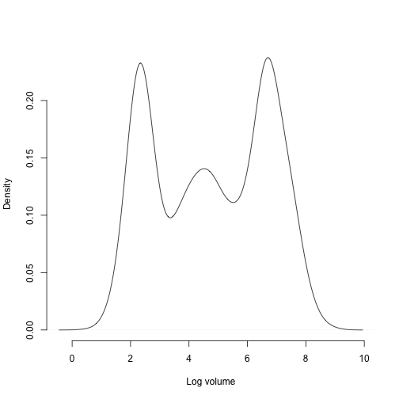

This document was built in Markdown in R 4.0.3, and covers package `lefko3` version 3.1.0.

## CASE STUDIES OF SWEDISH *Lathyrus vernus* POPULATION

### ORGANISM AND POPULATION

  <p style="text-indent: 20px">*Lathyrus vernus* (family Fabaceae) is a long-lived forest herb, native to Europe and large parts of northern Asia. Individuals increase slowly in size and usually flower only after 10-15 years of vegetative growth. Flowering individuals have an average conditional lifespan of 44.3 years [@ehrlen_how_2002]. *Lathyrus vernus* lacks organs for vegetative spread and individuals are well delimited [@ehrlen_assessing_2002]. One or several erect shoots of up to 40 cm height emerge from a subterranean rhizome in March-April. Flowering occurs about four weeks after shoot emergence. Shoot growth is determinate, and the number of flowers is determined in the previous year [@ehrlen_storage_2001]. Individuals may not produce aboveground structures every year but can remain dormant in one season. *Lathyrus vernus* is self-compatible but requires visits from bumble-bees to produce seeds. Individuals produce few, large seeds and establishment from seeds is relatively frequent [@ehrlen_seedling_1996]. The pre-dispersal seed predator *Bruchus atomarius* often consumes a large fraction of developing seeds, and roe deer (*Capreolus capreolus*) sometimes consume the shoots [@ehrlen_timing_2009].</p>
  
  <p style="text-indent: 20px">Data for this study were collected from six permanent plots in a population of *L. vernus* located in a deciduous forest in the Tullgarn area, SE Sweden (58.9496 N, 17.6097 E), during 1988–1991 [@ehrlen_demography_1995]. The six plots were relatively similar with regard to soil type, elevation, slope, and canopy cover. Within each plot, all individuals were marked with numbered tags that remained over the study period, and their locations were carefully mapped. New individuals were included in the study in each year. Individuals were recorded at least three times every growth season. At the time of shoot emergence, we recorded whether individuals were alive and produced above-ground shoots, and if shoots had been grazed. During flowering, we recorded flower number and the height and diameter of all shoots. At fruit maturation, we counted the number of intact and damaged seeds. To derive a measure of above-ground size for each individual, we calculated the volume of each shoot as $\pi × (\frac{1}{2} diameter)^2 × height$, and summed the volumes of all shoots. This measure is closely correlated with the dry mass of aboveground tissues ($R^2 = 0.924$, $P < 0.001$, $n = 50$, log-transformed values; Ehrlén 1995). Size of individuals that had been grazed was estimated based on measures of shoot diameter in grazed shoots, and the relationship between shoot diameter and shoot height in non-grazed individuals. Only individuals with an aboveground volume of more than 230 mm<sup>3</sup> flowered and produced fruits during this study. Individuals that lacked aboveground structures in one season but reappeared in the following year were considered dormant. Individuals that lacked aboveground structures in two subsequent seasons were considered dead from the year in which they first lacked aboveground structures. Probabilities of seeds surviving to the next year, and of being present as seedlings or seeds in the soil seed bank, were derived from separate yearly sowing experiments in separate plots adjacent to each subplot [@ehrlen_seedling_1996].</p>

### ANALYSES WITH *LATHYRUS* DATA

  <p style="text-indent: 20px">We will complete three different analyses to illustrate some of the ways in which package `lefko3` can be used:</p> 
  
  1) through the estimation of **raw MPMs**, with the intention of producing matrices similar to those published in Ehrlén [-@ehrlen_dynamics_2000]; 
  
  2) through the estimation of **function-based MPMs** using a stage classification different from Ehrlén [-@ehrlen_dynamics_2000], developed using the natural logarithm of the size measure used in that study; and
  
  3) through the construction of a complex **integral projection model**.
  
  <p style="text-indent: 20px">In this vignette, we focus on analysis (2).

### Analysis 2: Function-based MPM estimation

  <p style="text-indent: 20px">In this analysis, we will build function-based MPMs using the *Lathyrus* dataset. To spice things up, we will use a slightly different approach to size classification, using the natural log of size instead of the normal size shown in the dataset. This has to do with the fact that volume is used as the size metric here, and so should have an allometric relationship to some vital rates (note that all size metrics have allometric relationships, but this is clearer when size is based on something more strongly related to mass, as is volume). We will also create both reproductive or non-reproductive stages of the same size classes.</p>

#### Step 1. Life history model development

  <p style="text-indent: 20px">First, we will clear memory, load `lefko3`, and load the data. Then we will create a stageframe for the dataset. For this purpose, we will also look back at a summary of the distribution of original and log sizes.</p>

```r
rm(list=ls(all=TRUE))

library(lefko3)

data(lathyrus)

summary(c(lathyrus$Volume88, lathyrus$Volume89, lathyrus$Volume90, lathyrus$Volume91))
#>    Min. 1st Qu.  Median    Mean 3rd Qu.    Max.    NA's 
#>     1.8    14.7   123.0   484.2   732.5  7032.0    1248
summary(c(lathyrus$lnVol88, lathyrus$lnVol89, lathyrus$lnVol90, lathyrus$lnVol91))
#>    Min. 1st Qu.  Median    Mean 3rd Qu.    Max.    NA's 
#>   0.600   2.700   4.800   4.777   6.600   8.900    1248
```
  
  <p style="text-indent: 20px">The lower line shows the original size (upper line) given in logarithmic terms. It is important to note the size minima and maxima, because we have been using 0 as the size of vegetatively dormant individuals. The lowest uncorrected size is 1.8, with a maximum above 7000. Since the minimum is above 1, all log sizes should be positive, and no given size value should result in an NA value when its logarithm is taken. Looking at the log sizes, we see all positive values, and the same number of NAs as in the original size distribution. This suggests that we are still able to use the value 0 as an indicator of vegetative dormancy, and that vegetative dormancy is currently included in the many NAs that occur in size variables in this dataset.</p>
  
  <p style="text-indent: 20px">It can also help to take a look at plots of these distributions. First, we will look at the raw volume data.</p>

```r
plot(density(c(lathyrus$Volume88, lathyrus$Volume89, lathyrus$Volume90, lathyrus$Volume91), 
             na.rm = TRUE), main = "", xlab = "Volume", bty = "n")
```


Note how highly skewed this distribution looks. This might cause some difficulty with linear modeling, if we use this variable untransformed and with a Gaussian distribution. So, let's now look at the log volume data.

```r
plot(density(c(lathyrus$lnVol88, lathyrus$lnVol89, lathyrus$lnVol90, lathyrus$lnVol91), 
             na.rm = TRUE), main = "", xlab = "Log volume", bty = "n")
```



  <p style="text-indent: 20px">We see two very differently shaped distributions. The log volume distribution looks 'better' than the volume distribution, in the sense that it is closer to some semblance of a Gaussian distribution (primarily through symmetry). This is helpful since our size metrics are decimals, and so cannot be treated as integers (in the latter case, we could try modeling them as either Poisson- or negative binomial-distributed). We will work with log volume in this example, and treat it as Gaussian-distributed.</p>
  
  <p style="text-indent: 20px">We need to develop a stageframe that incorporates all log volumes that occur in the dataset, because our approach will include developing estimates of vital rates given inputs including all possible sizes, reproductive status, and so forth. We will build this by creating vectors of the values describing each stage, always in the same order.</p>

```r
sizevector <- c(0, 4.6, 0, 1, 2, 3, 4, 5, 6, 7, 8, 9, 1, 2, 3, 4, 5, 6, 7, 8, 9)
stagevector <- c("Sd", "Sdl", "Dorm", "Sz1nr", "Sz2nr", "Sz3nr", "Sz4nr", "Sz5nr",
                 "Sz6nr", "Sz7nr", "Sz8nr", "Sz9nr", "Sz1r", "Sz2r", "Sz3r", "Sz4r",
                 "Sz5r", "Sz6r", "Sz7r", "Sz8r", "Sz9r")
repvector <- c(0, 0, 0, 0, 0, 0, 0, 0, 0, 0, 0, 0, 1, 1, 1, 1, 1, 1, 1, 1, 1)
obsvector <- c(0, 1, 0, 1, 1, 1, 1, 1, 1, 1, 1, 1, 1, 1, 1, 1, 1, 1, 1, 1, 1)
matvector <- c(0, 0, 1, 1, 1, 1, 1, 1, 1, 1, 1, 1, 1, 1, 1, 1, 1, 1, 1, 1, 1)
immvector <- c(1, 1, 0, 0, 0, 0, 0, 0, 0, 0, 0, 0, 0, 0, 0, 0, 0, 0, 0, 0, 0)
propvector <- c(1, 0, 0, 0, 0, 0, 0, 0, 0, 0, 0, 0, 0, 0, 0, 0, 0, 0, 0, 0, 0)
indataset <- c(0, 1, 1, 1, 1, 1, 1, 1, 1, 1, 1, 1, 1, 1, 1, 1, 1, 1, 1, 1, 1)
binvec <- c(0, 4.6, 0.5, 0.5, 0.5, 0.5, 0.5, 0.5, 0.5, 0.5, 0.5, 0.5, 0.5, 0.5, 
            0.5, 0.5, 0.5, 0.5, 0.5, 0.5, 0.5)

lathframeln <- sf_create(sizes = sizevector, stagenames = stagevector, 
                         repstatus = repvector, obsstatus = obsvector, 
                         matstatus = matvector, immstatus = immvector, 
                         indataset = indataset, binhalfwidth = binvec, 
                         propstatus = propvector)
```

  <p style="text-indent: 20px">To be useful to others who might try to understand your work, or to yourself in the future, it helps to add text descriptions of the stages. Here, we add some stage descriptions to this stageframe in the `comments` field.</p>

```r
lathframeln$comments <- c("Dormant seed", "Seedling", "Dormant", "Size 1 Non-reprod", 
                          "Size 2 Non-reprod", "Size 3 Non-reprod", "Size 4 Non-reprod", 
                          "Size 5 Non-reprod", "Size 6 Non-reprod", "Size 7 Non-reprod", 
                          "Size 8 Non-reprod", "Size 9 Non-reprod", "Size 1 Reprod", 
                          "Size 2 Reprod", "Size 3 Reprod", "Size 4 Reprod", "Size 5 Reprod", 
                          "Size 6 Reprod", "Size 7 Reprod", "Size 8 Reprod", "Size 9 Reprod")
```

#### Step 2a. Data organization

  <p style="text-indent: 20px">Once the stageframe is created, we can reorganize the dataset into vertical format. Here, 'vertical' format is a way of organizing demographic data in which each row corresponds to the state of a single individual in two (if ahistorical) or three (if historical) consecutive times. To handle this, we use the `verticalize3()` function, which creates historically-formatted vertical datasets, as below. We also need to get rid of NAs in size and fecundity variables for `modelsearch` to work properly when we build models of vital rates, so we will now use the `NAas0 = TRUE` option. Some care needs to be taken with this last step, since some authors give missing values extra meaning not present in a value of 0. In our case, a missing value indicates that a plant was dead (both size and fecundity are missing), was alive but not sprouting (size was missing), or did not produce seed (fecundity was missing). In all cases, these NA values may be replaced by 0, because other variables indicate those conditions.</p>
  
  <p style="text-indent: 20px">We also have two choices for fecundity variables. The first choice, `FCODE88` indicates whether a plant flowered. The secone choice, `Intactseed88`, indicates the number of seed produced, and so will also be used as the fecundity variable. The choice of which to use depends strongly on the aims of the study. In our case, we would like to differentiate the different aspects of reproruction as much as possible, in the hopes of looking for different sorts of reproductive costs. Using the first term, `FCODE88`, will allow us to do that, as lopng as we remember that the fact that a plant produces flowers does not mean that it successfully reproduces - it is common for these plants to abort flowers, or to lose them to herbivory. So, let's use `FCODE88` here.
  

```r
lathvertln <- verticalize3(lathyrus, noyears = 4, firstyear = 1988, patchidcol = "SUBPLOT",
                           individcol = "GENET", blocksize = 9, juvcol = "Seedling1988",
                           sizeacol = "lnVol88", repstracol = "FCODE88",
                           fecacol = "Intactseed88", deadacol = "Dead1988",
                           nonobsacol = "Dormant1988", stageassign = lathframeln,
                           stagesize = "sizea", censorcol = "Missing1988",
                           censorkeep = NA, NAas0 = TRUE, censor = TRUE)
```
  
  <p style="text-indent: 20px">Something to note here is that fecundity is typically but not always an integer. We can see this below, where we show each non-integer in the dataset. There are a total of 6 out of 2,527 actual transitions in the dataset. These 6 cases are not errors - they are due to the fact that fecundity was estimated in two ways in this dataset, one way leading to integers, and one leading to decimals [@ehrlen_dynamics_2000].</p>

```r
lathvertln$feca2[which(lathvertln$feca2 != round(lathvertln$feca2))]
#> [1] 12.500000  3.818182 26.600000 23.333333  5.333333 24.500000
length(lathvertln$feca2)
#> [1] 2527
```
  
  <p style="text-indent: 20px">We can either treat fecundity as a continuous variable, or round the values and treat it as a count variable. In this dataset, fecundity is mostly a count of intact seeds, and only differs in six cases where the seed output was estimated based on other models. So, we will round fecundity so that we can assume count variables in the analysis, as below.</p>

```r
lathvertln$feca2 <- round(lathvertln$feca2)
lathvertln$feca1 <- round(lathvertln$feca1)
lathvertln$feca3 <- round(lathvertln$feca3)
```

  <p style="text-indent: 20px">Before we move on to the next key steps in analysis, let's take a closer look at fecundity here. Although we wish to treat fecundity as a count, it is still not clear what underlying distribution we should use. This package currently allows 5 choices: Gaussian, Poisson, negative binomial, zero-inflated Poisson, and zero-inflated negative binomial. To assess which to use, we should first assess whether the mean and variance of the count are equal using a dispersion test. This test allows us to test whether the variance is greater than that expected under our mean value for fecundity using a chi-squared test. If it is not significantly different, then we may use some variant of the Poisson distribution. If the data are overdispersed, then we should use the negative binomial distribution. We should also test whether the number of zeroes is more than expected under these distributions, and make the distribution zero-inflated if so.</p>
  
  <p style="text-indent: 20px">Let's start off by looking at a plot of the distribution of fecundity.</p>

```r
hist(subset(lathvertln, repstatus2 == 1)$feca2, main = "Fecundity", xlab = "Intact seeds produced in time t")
```


We see that the distribution conforms to a classic count variable with a very low mean value. The first bar suggests that there may be too many zeroes, as well, and we can see this in the following plot.

```r
hist(subset(lathvertln, repstatus2 == 1)$feca2[which(subset(lathvertln, repstatus2 == 1)$feca2 < 11)], 
     main = "Fecundity", xlab = "Intact seeds produced in time t")
```


This is fairly ample evidence that we should use a zero-inflated distribution of some sort. Let's now go to a formal test of these two assumptions. Both use chi-squared distribution-based approaches, with the zero-inflation test in particular based on van der Broek [-@van_den_broek_score_1995].

```r
sf_distrib(lathvertln, fec = "feca2", repst = "repstatus2")
#> 
#> Mean fecundity is 4.791
#> The variance in fecundity is 70.14
#> The probability of overdispersion is 0
#> 
#> Fecundity is significantly overdispersed.
#> 
#> 
#> Mean lambda is 0.008302
#> The actual number of 0s in fecundity is 334
#> The expected number of 0s in fecundity is 4.973
#> The probability of this deviation in 0s is 0
#> 
#> Fecundity is significantly zero-inflated.
#> NULL
```

Such significant results for both tests show us that we really need to use a zero-inflated negative binomial distribution here.

  <p style="text-indent: 20px">All set! Now to move on to supplemental descriptive information.</p>
  
#### Step 2b. Provide supplemental information for matrix estimation

  <p style="text-indent: 20px">Next we will create a **reproductive matrix**, which describes which stages are reproductive, which stages they produce, and at what levels they reproduce. This matrix is mostly composed of 0s, but fecundity is noted as non-zero entries equal to a scalar multiplier to the full fecundity estimated by `lefko3`. This matrix has rows and columns equal to the number of stages described in the stageframe for this dataset, and the rows and columns refer to these stages in the same order as in the stageframe. In many ways, it looks like a nearly empty population matrix, but notes the per-individual mean multipliers on fecundity for each stage that reproduces. Here, we first create a square zero matrix with dimensions equal to the number of rows in `lathframeln`. Then we modify elements corresponding to fecundity by the expected mean seed dormancy probability (row 1), and by the germination rate (row 2).</p>

```r
lathrepmln <- matrix(0, 21, 21)
lathrepmln[1, c(13:21)] <- 0.345
lathrepmln[2, c(13:21)] <- 0.054
```

  <p style="text-indent: 20px">Next we need to provide some given transitions. We will use the same overwrite tables as in the last analysis (objects `lathover2` and `lathover3` from \link{Lathyrus vernus raw MPMs}), because these relate only to stages that are the same in both analyses.</p>

```r
lathover2 <- overwrite(stage3 = c("Sd", "Sdl"), stage2 = c("Sd", "Sd"), 
                      givenrate = c(0.345, 0.054))

lathover3 <- overwrite(stage3 = c("Sd", "Sd", "Sdl"), stage2 = c("Sd", "Sd", "Sd"), 
                      stage1 = c("Sd", "rep", "rep"), givenrate = c(0.345, 0.345, 0.054))
```
  
  <p style="text-indent: 20px">Next, we will model vital rates.</p>

#### Step 3. Tests of history, and vital rate modeling

  <p style="text-indent: 20px">Next we will run the `modelsearch` function with the new vertical dataset, first for the ahistorical model set and then for the historical model set. This function will develop our best-fit vital rate models for us, and also allow us to test whether individual history is a significant influence on vital rates. This function looks simple, but it automates several crucial and complex tasks in MPM analysis. Specifically, it automates 1) the building of global models for each vital rate requested, 2) the exhaustive construction of all reduced models, and 3) the selection of the best-fit models.</p>
  
  <p style="text-indent: 20px">Let's look at some of the options that we will utilize for this purpose (please note that this list includes only some of the options actually offered by the function - further options are shown in the documentation for `modelsearch()`, and further theoretical details are shown in the `Basic theory and concepts` vignette).</p>
  
  **historical**: Setting this to TRUE or FALSE tells R whether to include state in time *t*-1 in the global models.
  
  **approach**: This option tells R whether to use generalized linear models (`glm`), in which all factors are treated as fixed, or mixed effects models (`mixed`), in which factors are treated as either fixed or random (most notably, time, patch, and individual identity can be treated as random). We encourage users to use the latter option, as it accounts for pseudoreplication, but the former approach is more common.
  
  **suite**: This tells R which factors to include in the global model. Possible values include `size`, which includes size only; `rep`, which includes reproductive status only; `main`, which includes both size and reproductive status as main effects only; `full`, which includes both size and reproductive status and all two-way interactions; and `const`, which includes only an intercept. These factors are in addition to individual identity, patch, and time.
  
  **vitalrates**: This option tells R which vital rates to model. The default is to model survival, size, and fecundity, but users can also model observation status and reproduction status.
  
  **juvestimate**: This optional term tells R the name of the juvenile stage transitioning to maturity, in cases where the dataset includes data on juveniles.
  
  **juvsize**: This optional term denotes whether size should be used as an independent term in models involving transition from the juvenile stage.
  
  **bestfit**: This describes whether the best-fit model should be chosen as the model with the lowest AICc (`AICc`) or as the most parsimonious model (`AICc&k`), where the latter is the model that has the fewest estimated parameters and is within 2 AICc units of the model with the lowest AICc. We encourage users to choose the latter. This is the default setting, and is more in-line with model selection protocols preferred by information theorists [@burnham_model_2002]..
  
  **sizedist**: This designates the distribution used for size. The options include `gaussian`, `poisson`, and `negbin`, the last of which refers to the negative binomial distribution.
  
  **fecdist**: This designates the distribution used for fecundity. The options include `gaussian`, `poisson`, and `negbin`, the last of which refers to the negative binomial distribution.
  
  **fectime**: This designates whether fecundity is estimated within time *t* (the default) or time *t*+1. Plant ecologists are likely to choose the former, since fecundity is typically estimated via a proxy such as flowers, fruit, or seed produced. Wildlife ecologists might choose the latter, since fecundity may be best estimated as a count of actual juveniles within nests, burrows, or other family structures.
  
  **size.zero**: This designates whether the size distribution should be zero-inflated. Only applies to the Poisson and negative binomial distributions.
  
  **fec.zero**: This designates whether the fecundity distribution should be zero-inflated. Only applies to the Poisson and negative binomial distributions.
  
  **indiv**: This should include the name of the variable corresponding to individual identity in the vertical dataset.
  
  **patch**: This should include the name of the variable corresponding to patch identity in the vertical dataset.
  
  **year**: This should include the name of the variable corresponding to time *t* in the vertical dataset.
  
  **year.as.random**: This tells R whether to treat year as a random factor, and is only used when `approach = "mixed"`.
  
  **patch.as.random**: This tells R whether to treat patch identity as a random factor, and is only used when `approach = "mixed"`.
  
  **show.model.tables**: This tells R to include the full dredge model tables showing all models developed and their associated AICc values.
  
  **quiet**: This tells R to silence guidepost statements and most warning messages. Only warnings incurred in model testing will be visible, including warnings from the testing of global models and those from the testing of reduced models produced during model dredging.
  
  <p style="text-indent: 20px">In addition, there are other options that provide flexibility in handling datasets with different designations for key variables, and allowing manual designation of stages.</p>
  
  <p style="text-indent: 20px">This function is useful not just because it develops the models that we can use to estimate function-based MPMs, but because it provides a test of whether individual history affects demography. Setting `historical = TRUE` fits size and/or reproductive status in time *t*-1 into global models. If any of the resulting best-fit vital rate models include one of these terms, then we see a significant effect of individual history on demography, and we have a reason to proceed with historical MPM analysis. Here, we will build both ahistorical and historical models for comparison.</p>

  <p style="text-indent: 20px">First we will create the ahistorical model set.</p>

```r
lathmodelsln2 <- modelsearch(lathvertln, historical = FALSE, approach = "mixed", 
                             suite = "full", juvestimate = "Sdl", bestfit = "AICc&k", 
                             vitalrates = c("surv", "obs", "size", "repst", "fec"), 
                             sizedist = "gaussian", fecdist = "negbin", fec.zero = TRUE,
                             indiv = "individ", patch = "patchid", year = "year2",
                             year.as.random = TRUE, patch.as.random = TRUE, juvsize = TRUE,
                             quiet = TRUE)
#> boundary (singular) fit: see ?isSingular
#> boundary (singular) fit: see ?isSingular
#> boundary (singular) fit: see ?isSingular
#> boundary (singular) fit: see ?isSingular
```

  <p style="text-indent: 20px">The output can be rather verbose, and so we have limited it with the `quiet = TRUE` option. The function was developed to provide text marker posts of what the function is doing and what it has accomplished, as well as to show all warnings from all workhorse functions used. Because we used the `mixed` approach here, this includes warnings originating from estimating mixed linear models with package `lme4` [@bates_fitting_2015]. It also shows warnings originating from the `dredge()` function of package `MuMIn` [@barton_mumin_2014], which is the core function used in model building and AICc estimation. We encourage users to get familiar with interpreting these warnings and assessing the degree to which they impact their own analyses.</p>

  <p style="text-indent: 20px">In developing these linear models, the `modelsearch()` function set up a series of nested datasets for use in estimating vital rates as conditional rates and probabilities. The exact subsets created depend on which parameters are called for. It is important to consider which are required, and particular attention needs to be paid if there are size classes with sizes of 0. In these situations, it is best to consider a size of 0 as unobservable, and so to introduce observation status as a vital rate. This sets up datasets for size estimation that do not include 0 in the response term, because all 0 responses are already absorbed by observation status.</p>
  
  <p style="text-indent: 20px">Let's take a peek at the summary for the model selection output. This condenses the output to the necessities.</p>

```r
summary(lathmodelsln2)
#> This LefkoMod object includes 8 linear models.
#> Best-fit model criterion used: AICc&k
#> 
#> ────────────────────────────────────────────────────────────────────────────────
#> Survival model:
#> Generalized linear mixed model fit by maximum likelihood (Laplace Approximation) ['glmerMod']
#>  Family: binomial  ( logit )
#> Formula: alive3 ~ repstatus2 + sizea2 + (1 | year2) + (1 | patchid) +      (1 | individ)
#>    Data: surv.data
#>       AIC       BIC    logLik  deviance  df.resid 
#>  916.4218  950.7233 -452.2109  904.4218      2240 
#> Random effects:
#>  Groups  Name        Std.Dev. 
#>  individ (Intercept) 0.4844333
#>  patchid (Intercept) 0.2554894
#>  year2   (Intercept) 0.0008752
#> Number of obs: 2246, groups:  individ, 257; patchid, 6; year2, 3
#> Fixed Effects:
#> (Intercept)   repstatus2       sizea2  
#>      2.0461       1.7264       0.1469  
#> 
#> ────────────────────────────────────────
#> 
#> Observation model:
#> Generalized linear mixed model fit by maximum likelihood (Laplace Approximation) ['glmerMod']
#>  Family: binomial  ( logit )
#> Formula: obsstatus3 ~ (1 | year2) + (1 | patchid) + (1 | individ)
#>    Data: obs.data
#>       AIC       BIC    logLik  deviance  df.resid 
#> 1342.9524 1365.5910 -667.4762 1334.9524      2117 
#> Random effects:
#>  Groups  Name        Std.Dev.
#>  individ (Intercept) 6.46e-05
#>  patchid (Intercept) 3.61e-01
#>  year2   (Intercept) 0.00e+00
#> Number of obs: 2121, groups:  individ, 254; patchid, 6; year2, 3
#> Fixed Effects:
#> (Intercept)  
#>        2.24  
#> optimizer (Nelder_Mead) convergence code: 0 (OK) ; 0 optimizer warnings; 1 lme4 warnings 
#> 
#> ────────────────────────────────────────
#> 
#> Size model:
#> Linear mixed model fit by REML ['lmerMod']
#> Formula: sizea3 ~ repstatus2 + sizea2 + (1 | year2) + (1 | patchid) +      (1 | individ) + repstatus2:sizea2
#>    Data: size.data
#> REML criterion at convergence: 5986.416
#> Random effects:
#>  Groups   Name        Std.Dev.
#>  individ  (Intercept) 0.6378  
#>  patchid  (Intercept) 0.1651  
#>  year2    (Intercept) 0.3511  
#>  Residual             1.0576  
#> Number of obs: 1916, groups:  individ, 254; patchid, 6; year2, 3
#> Fixed Effects:
#>       (Intercept)         repstatus2             sizea2  repstatus2:sizea2  
#>            2.6531            -1.5411             0.4095             0.2967  
#> 
#> ────────────────────────────────────────
#> 
#> Reproductive status model:
#> Generalized linear mixed model fit by maximum likelihood (Laplace Approximation) ['glmerMod']
#>  Family: binomial  ( logit )
#> Formula: repstatus3 ~ repstatus2 + sizea2 + (1 | year2) + (1 | patchid) +      (1 | individ)
#>    Data: repst.data
#>       AIC       BIC    logLik  deviance  df.resid 
#> 1613.2218 1646.5698 -800.6109 1601.2218      1910 
#> Random effects:
#>  Groups  Name        Std.Dev. 
#>  individ (Intercept) 5.404e-05
#>  patchid (Intercept) 3.292e-01
#>  year2   (Intercept) 6.737e-01
#> Number of obs: 1916, groups:  individ, 254; patchid, 6; year2, 3
#> Fixed Effects:
#> (Intercept)   repstatus2       sizea2  
#>     -5.9116       0.6675       0.8264  
#> optimizer (Nelder_Mead) convergence code: 0 (OK) ; 0 optimizer warnings; 1 lme4 warnings 
#> 
#> ────────────────────────────────────────
#> 
#> Fecundity model:
#> Formula:          feca2 ~ sizea2 + (1 | year2) + (1 | patchid) + (1 | individ)
#> Zero inflation:         ~sizea2 + (1 | year2) + (1 | patchid) + (1 | individ)
#> Data: fec.data
#>       AIC       BIC    logLik  df.resid 
#>  2473.717  2522.065 -1225.858       588 
#> Random-effects (co)variances:
#> 
#> Conditional model:
#>  Groups  Name        Std.Dev. 
#>  year2   (Intercept) 0.1317041
#>  patchid (Intercept) 0.0000503
#>  individ (Intercept) 0.3009980
#> 
#> Zero-inflation model:
#>  Groups  Name        Std.Dev.
#>  year2   (Intercept) 0.6680  
#>  patchid (Intercept) 0.2256  
#>  individ (Intercept) 0.4795  
#> 
#> Number of obs: 599 / Conditional model: year2, 3; patchid, 6; individ, 128 / Zero-inflation model: year2, 3; patchid, 6; individ, 128
#> 
#> Overdispersion parameter for nbinom2 family ():  2.4 
#> 
#> Fixed Effects:
#> 
#> Conditional model:
#> (Intercept)       sizea2  
#>     -2.4358       0.6476  
#> 
#> Zero-inflation model:
#> (Intercept)       sizea2  
#>      4.0764      -0.5421  
#> 
#> ────────────────────────────────────────────────────────────────────────────────
#> Juvenile survival model:
#> Generalized linear mixed model fit by maximum likelihood (Laplace Approximation) ['glmerMod']
#>  Family: binomial  ( logit )
#> Formula: alive3 ~ sizea2 + (1 | year2) + (1 | patchid) + (1 | individ)
#>    Data: juvsurv.data
#>       AIC       BIC    logLik  deviance  df.resid 
#>  321.8330  340.0248 -155.9165  311.8330       276 
#> Random effects:
#>  Groups  Name        Std.Dev. 
#>  individ (Intercept) 4.993e-05
#>  patchid (Intercept) 4.262e-01
#>  year2   (Intercept) 2.709e-05
#> Number of obs: 281, groups:  individ, 187; patchid, 6; year2, 3
#> Fixed Effects:
#> (Intercept)       sizea2  
#>     -0.6908       0.8325  
#> optimizer (Nelder_Mead) convergence code: 0 (OK) ; 0 optimizer warnings; 1 lme4 warnings 
#> 
#> ────────────────────────────────────────
#> 
#> Juvenile observation model:
#> Generalized linear mixed model fit by maximum likelihood (Laplace Approximation) ['glmerMod']
#>  Family: binomial  ( logit )
#> Formula: obsstatus3 ~ (1 | year2) + (1 | patchid) + (1 | individ)
#>    Data: juvobs.data
#>      AIC      BIC   logLik deviance df.resid 
#>  93.4925 106.8809 -42.7462  85.4925      206 
#> Random effects:
#>  Groups  Name        Std.Dev.
#>  individ (Intercept) 16.009  
#>  patchid (Intercept)  0.000  
#>  year2   (Intercept)  1.221  
#> Number of obs: 210, groups:  individ, 154; patchid, 6; year2, 3
#> Fixed Effects:
#> (Intercept)  
#>       10.39  
#> optimizer (Nelder_Mead) convergence code: 0 (OK) ; 0 optimizer warnings; 1 lme4 warnings 
#> 
#> ────────────────────────────────────────
#> 
#> Juvenile size model:
#> Linear mixed model fit by REML ['lmerMod']
#> Formula: sizea3 ~ sizea2 + (1 | year2) + (1 | patchid) + (1 | individ)
#>    Data: juvsize.data
#> REML criterion at convergence: 194.1918
#> Random effects:
#>  Groups   Name        Std.Dev.
#>  individ  (Intercept) 0.05626 
#>  patchid  (Intercept) 0.00000 
#>  year2    (Intercept) 0.15876 
#>  Residual             0.38466 
#> Number of obs: 193, groups:  individ, 144; patchid, 6; year2, 3
#> Fixed Effects:
#> (Intercept)       sizea2  
#>      0.8258       0.6746  
#> optimizer (nloptwrap) convergence code: 0 (OK) ; 0 optimizer warnings; 1 lme4 warnings 
#> 
#> ────────────────────────────────────────
#> 
#> Juvenile reproduction model:
#> [1] 0
#> 
#> 
#> ────────────────────────────────────────────────────────────────────────────────
#> 
#> Number of models in survival table:5
#> 
#> Number of models in observation table:5
#> 
#> Number of models in size table:5
#> 
#> Number of models in reproduction status table:5
#> 
#> Number of models in fecundity table:4
#> 
#> Number of models in juvenile survival table:2
#> 
#> Number of models in juvenile observation table:2
#> 
#> Number of models in juvenile size table:2
#> 
#> Number of models in juvenile reproduction table: 1
#> 
#> 
#> ────────────────────────────────────────────────────────────────────────────────
#> 
#> General model parameter names (column 1), and specific names used in these models (column 2):
#>                       parameter_names mainparams
#> 1                              time t      year2
#> 2                          individual    individ
#> 3                               patch      patch
#> 4                   alive in time t+1      surv3
#> 5                observed in time t+1       obs3
#> 6                    size in time t+1      size3
#> 7     reproductive status in time t+1     repst3
#> 8               fecundity in time t+1       fec3
#> 9                 fecundity in time t       fec2
#> 10                     size in time t      size2
#> 11                   size in time t-1      size1
#> 12      reproductive status in time t     repst2
#> 13     reprodutive status in time t-1     repst1
#> 14                      age in time t        age
#> 15   individual covariate a in time t   indcova2
#> 16 individual covariate a in time t-1   indcova1
#> 17   individual covariate b in time t   indcovb2
#> 18 individual covariate b in time t-1   indcovb1
#> 19   individual covariate c in time t   indcovc2
#> 20 individual covariate c in time t-1   indcovc1
#> 
#> 
#> ────────────────────────────────────────────────────────────────────────────────
#> 
#> Quality control:
#> 
#> Survival estimated with 257 individuals and 2246 individual transitions.
#> Observation estimated with 254 individuals and 2121 individual transitions.
#> Size estimated with 254 individuals and 1916 individual transitions.
#> Reproductive status estimated with 254 individuals and 1916 individual transitions.
#> Fecundity estimated with 128 individuals and 599 individual transitions.
#> Juvenile survival estimated with 187 individuals and 281 individual transitions.
#> Juvenile observation estimated with 154 individuals and 210 individual transitions.
#> Juvenile size estimated with 144 individuals and 193 individual transitions.
#> Juvenile reproduction probability not estimated.
#> NULL
```

  <p style="text-indent: 20px">The best-fit models vary a bit in complexity. For example, survival is influenced by size and reproductive status in the current year, as well as by patch, individual identity, and year, while observation status is not influenced by size. We can see these models explicitly, as well as the model tables developed, by calling them directly from the lefkoMod object. Here is the best-fit model for fecunity.</p>

```r
lathmodelsln2$fecundity_model
#> Formula:          feca2 ~ sizea2 + (1 | year2) + (1 | patchid) + (1 | individ)
#> Zero inflation:         ~sizea2 + (1 | year2) + (1 | patchid) + (1 | individ)
#> Data: fec.data
#>       AIC       BIC    logLik  df.resid 
#>  2473.717  2522.065 -1225.858       588 
#> Random-effects (co)variances:
#> 
#> Conditional model:
#>  Groups  Name        Std.Dev. 
#>  year2   (Intercept) 0.1317041
#>  patchid (Intercept) 0.0000503
#>  individ (Intercept) 0.3009980
#> 
#> Zero-inflation model:
#>  Groups  Name        Std.Dev.
#>  year2   (Intercept) 0.6680  
#>  patchid (Intercept) 0.2256  
#>  individ (Intercept) 0.4795  
#> 
#> Number of obs: 599 / Conditional model: year2, 3; patchid, 6; individ, 128 / Zero-inflation model: year2, 3; patchid, 6; individ, 128
#> 
#> Overdispersion parameter for nbinom2 family ():  2.4 
#> 
#> Fixed Effects:
#> 
#> Conditional model:
#> (Intercept)       sizea2  
#>     -2.4358       0.6476  
#> 
#> Zero-inflation model:
#> (Intercept)       sizea2  
#>      4.0764      -0.5421
```

This model assumes a zero-inflated negative binomial distribution, and so is actually composed of two models - a negative binomial model that covers non-zero cases, and a zero-inflation binomial model that predicts the probability of a 0 under a separate process from the count process. This best-fit model shows the best-fit for both components. The other models in `lathmodelsln2` are less complex, being composed of a single linear model predicting all cases of the response.

  <p style="text-indent: 20px">Now let's estimate the historical model set. This search will take more time, because the inclusion of status in time *t*-1 (and all two-way interactions when `suite = "full"`) increases the number of models that the `dredge` function will build and compare. The inclusion of these terms may also create more warnings as the function proceeds. Please also note that we include `quiet = TRUE` here, which prevents the model selection protocol from issuing warnings and most diagnostic messages. We do this only because the model selection will generate a particularly verbose list of warnings in this case. Normally it is best to stick with the default, `quiet = FALSE`.</p>

```r
lathmodelsln3 <- modelsearch(lathvertln, historical = TRUE, approach = "lme4", suite = "full", 
                          vitalrates = c("surv", "obs", "size", "repst", "fec"), juvestimate = "Sdl",
                          bestfit = "AICc&k", sizedist = "gaussian", fecdist = "negbin",
                          fec.zero = TRUE, indiv = "individ", patch = "patchid", year = "year2",
                          year.as.random = TRUE, patch.as.random = TRUE, juvsize = TRUE,
                          show.model.tables = TRUE, quiet = TRUE)
#> Warning in checkConv(attr(opt, "derivs"), opt$par, ctrl = control$checkConv, : Model failed to converge with max|grad| = 0.0111276 (tol =
#> 0.002, component 1)
#> boundary (singular) fit: see ?isSingular
#> Warning in checkConv(attr(opt, "derivs"), opt$par, ctrl = control$checkConv, : Model failed to converge with max|grad| = 0.0268313 (tol =
#> 0.002, component 1)
#> Warning in fitTMB(TMBStruc): Model convergence problem; extreme or very small eigen values detected. See vignette('troubleshooting')
#> boundary (singular) fit: see ?isSingular
#> boundary (singular) fit: see ?isSingular
#> boundary (singular) fit: see ?isSingular
summary(lathmodelsln3)
#> This LefkoMod object includes 8 linear models.
#> Best-fit model criterion used: AICc&k
#> 
#> ────────────────────────────────────────────────────────────────────────────────
#> Survival model:
#> Generalized linear mixed model fit by maximum likelihood (Laplace Approximation) ['glmerMod']
#>  Family: binomial  ( logit )
#> Formula: alive3 ~ repstatus1 + repstatus2 + sizea1 + sizea2 + (1 | year2) +  
#>     (1 | patchid) + (1 | individ) + repstatus2:sizea2 + sizea1:sizea2
#>    Data: surv.data
#>       AIC       BIC    logLik  deviance  df.resid 
#>  877.4442  934.6133 -428.7221  857.4442      2236 
#> Random effects:
#>  Groups  Name        Std.Dev.
#>  individ (Intercept) 0.1830  
#>  patchid (Intercept) 0.2496  
#>  year2   (Intercept) 0.3926  
#> Number of obs: 2246, groups:  individ, 257; patchid, 6; year2, 3
#> Fixed Effects:
#>       (Intercept)         repstatus1         repstatus2             sizea1             sizea2  repstatus2:sizea2      sizea1:sizea2  
#>           1.02667            1.84052           11.69226            0.46047            0.27446           -1.43729           -0.06948  
#> optimizer (Nelder_Mead) convergence code: 0 (OK) ; 0 optimizer warnings; 1 lme4 warnings 
#> 
#> ────────────────────────────────────────
#> 
#> Observation model:
#> Generalized linear mixed model fit by maximum likelihood (Laplace Approximation) ['glmerMod']
#>  Family: binomial  ( logit )
#> Formula: obsstatus3 ~ (1 | year2) + (1 | patchid) + (1 | individ)
#>    Data: obs.data
#>       AIC       BIC    logLik  deviance  df.resid 
#> 1342.9524 1365.5910 -667.4762 1334.9524      2117 
#> Random effects:
#>  Groups  Name        Std.Dev.
#>  individ (Intercept) 6.46e-05
#>  patchid (Intercept) 3.61e-01
#>  year2   (Intercept) 0.00e+00
#> Number of obs: 2121, groups:  individ, 254; patchid, 6; year2, 3
#> Fixed Effects:
#> (Intercept)  
#>        2.24  
#> optimizer (Nelder_Mead) convergence code: 0 (OK) ; 0 optimizer warnings; 1 lme4 warnings 
#> 
#> ────────────────────────────────────────
#> 
#> Size model:
#> Linear mixed model fit by REML ['lmerMod']
#> Formula: sizea3 ~ repstatus1 + repstatus2 + sizea1 + sizea2 + (1 | year2) +  
#>     (1 | patchid) + (1 | individ) + repstatus1:repstatus2 + repstatus2:sizea2 +      sizea1:sizea2
#>    Data: size.data
#> REML criterion at convergence: 5234.519
#> Random effects:
#>  Groups   Name        Std.Dev.
#>  individ  (Intercept) 0.1702  
#>  patchid  (Intercept) 0.1156  
#>  year2    (Intercept) 0.4997  
#>  Residual             0.9218  
#> Number of obs: 1916, groups:  individ, 254; patchid, 6; year2, 3
#> Fixed Effects:
#>           (Intercept)             repstatus1             repstatus2                 sizea1                 sizea2  repstatus1:repstatus2  
#>               0.61513                0.74807               -1.34027                0.59238                0.74795               -0.31508  
#>     repstatus2:sizea2          sizea1:sizea2  
#>               0.26105               -0.08471  
#> 
#> ────────────────────────────────────────
#> 
#> Reproductive status model:
#> Generalized linear mixed model fit by maximum likelihood (Laplace Approximation) ['glmerMod']
#>  Family: binomial  ( logit )
#> Formula: repstatus3 ~ repstatus1 + repstatus2 + sizea1 + sizea2 + (1 |      year2) + (1 | patchid) + (1 | individ) + repstatus1:sizea2 +  
#>     sizea1:sizea2
#>    Data: repst.data
#>       AIC       BIC    logLik  deviance  df.resid 
#> 1535.9445 1591.5245 -757.9723 1515.9445      1906 
#> Random effects:
#>  Groups  Name        Std.Dev. 
#>  individ (Intercept) 1.271e-05
#>  patchid (Intercept) 3.560e-01
#>  year2   (Intercept) 5.827e-01
#> Number of obs: 1916, groups:  individ, 254; patchid, 6; year2, 3
#> Fixed Effects:
#>       (Intercept)         repstatus1         repstatus2             sizea1             sizea2  repstatus1:sizea2      sizea1:sizea2  
#>          -8.23952            3.65284            0.62455            0.41613            1.14701           -0.51717           -0.05646  
#> optimizer (Nelder_Mead) convergence code: 0 (OK) ; 0 optimizer warnings; 1 lme4 warnings 
#> 
#> ────────────────────────────────────────
#> 
#> Fecundity model:
#> Formula:          feca2 ~ repstatus1 + sizea2 + (1 | year2) + (1 | patchid) + (1 |      individ)
#> Zero inflation:         ~sizea1 + sizea2 + (1 | year2) + (1 | patchid) + (1 | individ) +     sizea1:sizea2
#> Data: fec.data
#>       AIC       BIC    logLik  df.resid 
#>  2465.179  2526.712 -1218.589       585 
#> Random-effects (co)variances:
#> 
#> Conditional model:
#>  Groups  Name        Std.Dev. 
#>  year2   (Intercept) 9.944e-06
#>  patchid (Intercept) 4.113e-05
#>  individ (Intercept) 2.724e-01
#> 
#> Zero-inflation model:
#>  Groups  Name        Std.Dev.
#>  year2   (Intercept) 0.5659  
#>  patchid (Intercept) 0.2139  
#>  individ (Intercept) 0.4961  
#> 
#> Number of obs: 599 / Conditional model: year2, 3; patchid, 6; individ, 128 / Zero-inflation model: year2, 3; patchid, 6; individ, 128
#> 
#> Overdispersion parameter for nbinom2 family ():  2.4 
#> 
#> Fixed Effects:
#> 
#> Conditional model:
#> (Intercept)   repstatus1       sizea2  
#>     -2.1314       0.3169       0.5847  
#> 
#> Zero-inflation model:
#>   (Intercept)         sizea1         sizea2  sizea1:sizea2  
#>       0.64465        0.88127       -0.04328       -0.12823  
#> 
#> ────────────────────────────────────────────────────────────────────────────────
#> Juvenile survival model:
#> Generalized linear mixed model fit by maximum likelihood (Laplace Approximation) ['glmerMod']
#>  Family: binomial  ( logit )
#> Formula: alive3 ~ sizea2 + (1 | year2) + (1 | patchid) + (1 | individ)
#>    Data: juvsurv.data
#>       AIC       BIC    logLik  deviance  df.resid 
#>  321.8330  340.0248 -155.9165  311.8330       276 
#> Random effects:
#>  Groups  Name        Std.Dev. 
#>  individ (Intercept) 4.993e-05
#>  patchid (Intercept) 4.262e-01
#>  year2   (Intercept) 2.709e-05
#> Number of obs: 281, groups:  individ, 187; patchid, 6; year2, 3
#> Fixed Effects:
#> (Intercept)       sizea2  
#>     -0.6908       0.8325  
#> optimizer (Nelder_Mead) convergence code: 0 (OK) ; 0 optimizer warnings; 1 lme4 warnings 
#> 
#> ────────────────────────────────────────
#> 
#> Juvenile observation model:
#> Generalized linear mixed model fit by maximum likelihood (Laplace Approximation) ['glmerMod']
#>  Family: binomial  ( logit )
#> Formula: obsstatus3 ~ (1 | year2) + (1 | patchid) + (1 | individ)
#>    Data: juvobs.data
#>      AIC      BIC   logLik deviance df.resid 
#>  93.4925 106.8809 -42.7462  85.4925      206 
#> Random effects:
#>  Groups  Name        Std.Dev.
#>  individ (Intercept) 16.009  
#>  patchid (Intercept)  0.000  
#>  year2   (Intercept)  1.221  
#> Number of obs: 210, groups:  individ, 154; patchid, 6; year2, 3
#> Fixed Effects:
#> (Intercept)  
#>       10.39  
#> optimizer (Nelder_Mead) convergence code: 0 (OK) ; 0 optimizer warnings; 1 lme4 warnings 
#> 
#> ────────────────────────────────────────
#> 
#> Juvenile size model:
#> Linear mixed model fit by REML ['lmerMod']
#> Formula: sizea3 ~ sizea2 + (1 | year2) + (1 | patchid) + (1 | individ)
#>    Data: juvsize.data
#> REML criterion at convergence: 194.1918
#> Random effects:
#>  Groups   Name        Std.Dev.
#>  individ  (Intercept) 0.05626 
#>  patchid  (Intercept) 0.00000 
#>  year2    (Intercept) 0.15876 
#>  Residual             0.38466 
#> Number of obs: 193, groups:  individ, 144; patchid, 6; year2, 3
#> Fixed Effects:
#> (Intercept)       sizea2  
#>      0.8258       0.6746  
#> optimizer (nloptwrap) convergence code: 0 (OK) ; 0 optimizer warnings; 1 lme4 warnings 
#> 
#> ────────────────────────────────────────
#> 
#> Juvenile reproduction model:
#> [1] 0
#> 
#> 
#> ────────────────────────────────────────────────────────────────────────────────
#> 
#> Number of models in survival table:72
#> 
#> Number of models in observation table:72
#> 
#> Number of models in size table:72
#> 
#> Number of models in reproduction status table:72
#> 
#> Number of models in fecundity table:169
#> 
#> Number of models in juvenile survival table:2
#> 
#> Number of models in juvenile observation table:2
#> 
#> Number of models in juvenile size table:2
#> 
#> Number of models in juvenile reproduction table: 1
#> 
#> 
#> ────────────────────────────────────────────────────────────────────────────────
#> 
#> General model parameter names (column 1), and specific names used in these models (column 2):
#>                       parameter_names mainparams
#> 1                              time t      year2
#> 2                          individual    individ
#> 3                               patch      patch
#> 4                   alive in time t+1      surv3
#> 5                observed in time t+1       obs3
#> 6                    size in time t+1      size3
#> 7     reproductive status in time t+1     repst3
#> 8               fecundity in time t+1       fec3
#> 9                 fecundity in time t       fec2
#> 10                     size in time t      size2
#> 11                   size in time t-1      size1
#> 12      reproductive status in time t     repst2
#> 13     reprodutive status in time t-1     repst1
#> 14                      age in time t        age
#> 15   individual covariate a in time t   indcova2
#> 16 individual covariate a in time t-1   indcova1
#> 17   individual covariate b in time t   indcovb2
#> 18 individual covariate b in time t-1   indcovb1
#> 19   individual covariate c in time t   indcovc2
#> 20 individual covariate c in time t-1   indcovc1
#> 
#> 
#> ────────────────────────────────────────────────────────────────────────────────
#> 
#> Quality control:
#> 
#> Survival estimated with 257 individuals and 2246 individual transitions.
#> Observation estimated with 254 individuals and 2121 individual transitions.
#> Size estimated with 254 individuals and 1916 individual transitions.
#> Reproductive status estimated with 254 individuals and 1916 individual transitions.
#> Fecundity estimated with 128 individuals and 599 individual transitions.
#> Juvenile survival estimated with 187 individuals and 281 individual transitions.
#> Juvenile observation estimated with 154 individuals and 210 individual transitions.
#> Juvenile size estimated with 144 individuals and 193 individual transitions.
#> Juvenile reproduction probability not estimated.
#> NULL
```

  <p style="text-indent: 20px">This summary reveals some similarities, but also many differences. Historical models incorporate a further time back in the global model, so some of the best-fit models may have historical terms in them. Here, we see some of these historical terms in the models of survival, size, reproduction status, and fecundity. We also see that incorporating a time back ends up changing the model best-fit model structure such that reproductive status also becomes an important determinant of some vital rates, even where it was absent in the ahistorical case. This suggests that individual history is important to the demography of this population, and should not be ignored.</p>
  
  <p style="text-indent: 20px">Now we are ready to estimate matrices.</p>
  
#### Step 4. MPM estimation
  
  <p style="text-indent: 20px">For instructional purposes, we will make both ahistorical and historical MPMs. We will start by estimating the ahistorical set of matrices. Notice that we are matching the ahistorical matrix creation function, `flefko2()`, with the appropriate ahistorical input, including the ahistorical lefkoMod object `lathmodelsln2`. Model sets that include historical terms should not be used to create ahistorical matrices, since the coefficients in the best-fit models are estimated assuming a specific model structure. Historical vital rate models may yield biased results if used to construct ahistorical matrices.</p>

```r
lathmat2ln <- flefko2(stageframe = lathframeln, modelsuite = lathmodelsln2,
                      data = lathvertln, repmatrix = lathrepmln, overwrite = lathover2,
                      year.as.random = FALSE, patch.as.random = FALSE)
summary(lathmat2ln)
#> 
#> This ahistorical lefkoMat object contains 18 matrices.
#> 
#> Each matrix is a square matrix with 21 rows and columns, and a total of 441 elements.
#> A total of 6732 survival transitions were estimated, with 374 per matrix.
#> A total of 324 fecundity transitions were estimated, with 18 per matrix.
#> 
#> Vital rate modeling quality control:
#> 
#> Survival estimated with 257 individuals and 2246 individual transitions.
#> Observation estimated with 254 individuals and 2121 individual transitions.
#> Size estimated with 254 individuals and 1916 individual transitions.
#> Reproductive status estimated with 254 individuals and 1916 individual transitions.
#> Fecundity estimated with 128 individuals and 599 individual transitions.
#> Juvenile survival estimated with 187 individuals and 281 individual transitions.
#> Juvenile observation estimated with 154 individuals and 210 individual transitions.
#> Juvenile size estimated with 144 individuals and 193 individual transitions.
#> Juvenile reproduction probability not estimated.
#> NULL
```

  <p style="text-indent: 20px">Let's take a look at a portion of the first of these matrices.</p>

```r
print(lathmat2ln$A[[1]][,1:5], digits = 3)
#>        [,1]     [,2]     [,3]     [,4]     [,5]
#>  [1,] 0.345 0.00e+00 0.00e+00 0.00e+00 0.00e+00
#>  [2,] 0.054 3.85e-20 0.00e+00 0.00e+00 0.00e+00
#>  [3,] 0.000 2.93e-05 6.66e-02 6.75e-02 6.82e-02
#>  [4,] 0.000 4.56e-01 7.32e-02 3.54e-02 1.46e-02
#>  [5,] 0.000 8.11e-03 2.36e-01 1.64e-01 9.79e-02
#>  [6,] 0.000 1.67e-07 3.10e-01 3.12e-01 2.68e-01
#>  [7,] 0.000 4.01e-15 1.67e-01 2.42e-01 3.01e-01
#>  [8,] 0.000 1.11e-25 3.68e-02 7.70e-02 1.38e-01
#>  [9,] 0.000 3.60e-39 3.32e-03 1.00e-02 2.58e-02
#> [10,] 0.000 1.35e-55 1.22e-04 5.32e-04 1.98e-03
#> [11,] 0.000 5.87e-75 1.84e-06 1.16e-05 6.20e-05
#> [12,] 0.000 2.96e-97 1.14e-08 1.03e-07 7.95e-07
#> [13,] 0.000 0.00e+00 1.95e-04 2.15e-04 2.04e-04
#> [14,] 0.000 0.00e+00 6.28e-04 1.00e-03 1.36e-03
#> [15,] 0.000 0.00e+00 8.28e-04 1.90e-03 3.73e-03
#> [16,] 0.000 0.00e+00 4.46e-04 1.48e-03 4.18e-03
#> [17,] 0.000 0.00e+00 9.82e-05 4.69e-04 1.92e-03
#> [18,] 0.000 0.00e+00 8.85e-06 6.10e-05 3.59e-04
#> [19,] 0.000 0.00e+00 3.26e-07 3.24e-06 2.75e-05
#> [20,] 0.000 0.00e+00 4.92e-09 7.04e-08 8.63e-07
#> [21,] 0.000 0.00e+00 3.03e-11 6.26e-10 1.11e-08
```

  <p style="text-indent: 20px">The number of elements estimated is vastly greater now than in the raw ahMPMs estimated in Analysis 1, because each matrix element must be estimated based on the vital rate linear models supplied. This matrix is overwhelmingly composed of elements that are to be estimated (392 / 441 = 88.9% of elements), whereas in the raw matrix case, elements would only be estimated if individuals actually passed through that transition.</p>

  <p style="text-indent: 20px">Now we will estimate the historical matrices.</p>

```r
lathmat3ln <- flefko3(stageframe = lathframeln, modelsuite = lathmodelsln3,
                      data = lathvertln, repmatrix = lathrepmln, overwrite = lathover3,
                      year.as.random = FALSE, patch.as.random = FALSE)
summary(lathmat3ln)
#> 
#> This historical lefkoMat object contains 18 matrices.
#> 
#> Each matrix is a square matrix with 441 rows and columns, and a total of 194481 elements.
#> A total of 130500 survival transitions were estimated, with 7250 per matrix.
#> A total of 6804 fecundity transitions were estimated, with 378 per matrix.
#> 
#> Vital rate modeling quality control:
#> 
#> Survival estimated with 257 individuals and 2246 individual transitions.
#> Observation estimated with 254 individuals and 2121 individual transitions.
#> Size estimated with 254 individuals and 1916 individual transitions.
#> Reproductive status estimated with 254 individuals and 1916 individual transitions.
#> Fecundity estimated with 128 individuals and 599 individual transitions.
#> Juvenile survival estimated with 187 individuals and 281 individual transitions.
#> Juvenile observation estimated with 154 individuals and 210 individual transitions.
#> Juvenile size estimated with 144 individuals and 193 individual transitions.
#> Juvenile reproduction probability not estimated.
#> NULL
```

  <p style="text-indent: 20px">Once again, the matrices are vastly bigger than their ahistorical counterparts. The ahistorical matrices here are 21 rows x 21 columns, so contain 441 elements each. The historical matrices are 21<sup>2</sup> x 21<sup>2</sup> (441 x 441), or 194,481 elements large. However, because of the prevalence of structural 0s in the latter, only 7,628 elements are actually estimated (7,628 / 194,481 = 3.9% of elements estimated). Another point of interest here is that the number of **A** matrices estimated is 18, which is the same as the number of ahistorical matrices. In the raw matrix case, there would actually only be 12 historical matrices estimated, because of the lack of information for the time previous to the start of the dataset in each of the 6 patches. Here, linear modeling treating year as random allows us to make assumptions leading to estimated values for even those first transitions. In particular, by setting `year.as.random = FALSE`, the default value for the year coefficients in years without random coefficients estimated is 0, while it would be a randomly chosen coefficient from the distribution of random year coefficients if `year.as.random = TRUE`.</p>

  <p style="text-indent: 20px">Because of the size of the matrices and the proliferation of structural 0s, we may wish to analyze these matrices after removing some unneeded rows and columns. Let's re-do the above, but overwrite the models with smaller matrices using the `reduce = TRUE` option, which eliminates stages or stage-pairs with corresponding row and column vectors both equal to zero vectors.</p>

```r
lathmat3ln <- flefko3(stageframe = lathframeln, modelsuite = lathmodelsln3, 
                    data = lathvertln, repmatrix = lathrepmln, overwrite = lathover3, 
                    year.as.random = FALSE, patch.as.random = FALSE, reduce = TRUE)

summary(lathmat3ln)
#> 
#> This historical lefkoMat object contains 18 matrices.
#> 
#> Each matrix is a square matrix with 410 rows and columns, and a total of 168100 elements.
#> A total of 130500 survival transitions were estimated, with 7250 per matrix.
#> A total of 6804 fecundity transitions were estimated, with 378 per matrix.
#> 
#> Vital rate modeling quality control:
#> 
#> Survival estimated with 257 individuals and 2246 individual transitions.
#> Observation estimated with 254 individuals and 2121 individual transitions.
#> Size estimated with 254 individuals and 1916 individual transitions.
#> Reproductive status estimated with 254 individuals and 1916 individual transitions.
#> Fecundity estimated with 128 individuals and 599 individual transitions.
#> Juvenile survival estimated with 187 individuals and 281 individual transitions.
#> Juvenile observation estimated with 154 individuals and 210 individual transitions.
#> Juvenile size estimated with 144 individuals and 193 individual transitions.
#> Juvenile reproduction probability not estimated.
#> NULL
```
This exercise eliminated 31 rows and columns, so the matrices definitely got smaller although they are still quite large. The number of estimated elements, however, is the same as before.

  <p style="text-indent: 20px">Now we will estimate the mean matrices. Note that these include 6 mean matrices for the patches, followed by a grand mean matrix, yielding a total of 7 matrices per lefkoMat object.</p>

```r
lathmat2lnmean <- lmean(lathmat2ln)
lathmat3lnmean <- lmean(lathmat3ln)

summary(lathmat2lnmean)
#> 
#> This ahistorical lefkoMat object contains 7 matrices.
#> 
#> Each matrix is a square matrix with 21 rows and columns, and a total of 441 elements.
#> A total of 2618 survival transitions were estimated, with 374 per matrix.
#> A total of 126 fecundity transitions were estimated, with 18 per matrix.
#> 
#> Vital rate modeling quality control:
#> 
#> Survival estimated with 257 individuals and 2246 individual transitions.
#> Observation estimated with 254 individuals and 2121 individual transitions.
#> Size estimated with 254 individuals and 1916 individual transitions.
#> Reproductive status estimated with 254 individuals and 1916 individual transitions.
#> Fecundity estimated with 128 individuals and 599 individual transitions.
#> Juvenile survival estimated with 187 individuals and 281 individual transitions.
#> Juvenile observation estimated with 154 individuals and 210 individual transitions.
#> Juvenile size estimated with 144 individuals and 193 individual transitions.
#> Juvenile reproduction probability not estimated.
#> NULL
summary(lathmat3lnmean)
#> 
#> This historical lefkoMat object contains 7 matrices.
#> 
#> Each matrix is a square matrix with 410 rows and columns, and a total of 168100 elements.
#> A total of 50750 survival transitions were estimated, with 7250 per matrix.
#> A total of 2646 fecundity transitions were estimated, with 378 per matrix.
#> 
#> Vital rate modeling quality control:
#> 
#> Survival estimated with 257 individuals and 2246 individual transitions.
#> Observation estimated with 254 individuals and 2121 individual transitions.
#> Size estimated with 254 individuals and 1916 individual transitions.
#> Reproductive status estimated with 254 individuals and 1916 individual transitions.
#> Fecundity estimated with 128 individuals and 599 individual transitions.
#> Juvenile survival estimated with 187 individuals and 281 individual transitions.
#> Juvenile observation estimated with 154 individuals and 210 individual transitions.
#> Juvenile size estimated with 144 individuals and 193 individual transitions.
#> Juvenile reproduction probability not estimated.
#> NULL
```

  <p style="text-indent: 20px">Next we will check the survival of stages and stage pairs, making sure that they appear to be probabilities. We will focus on the grand mean U matrix in each case.</p>

```r
writeLines("Stage survival in ahistorical grand mean matrix")
#> Stage survival in ahistorical grand mean matrix
summary(colSums(lathmat2lnmean$U[[7]]))
#>    Min. 1st Qu.  Median    Mean 3rd Qu.    Max. 
#>  0.3075  0.9047  0.9529  0.8903  0.9798  0.9908

writeLines("\nStage survival in historical grand mean matrix")
#> 
#> Stage survival in historical grand mean matrix
summary(colSums(lathmat3lnmean$U[[7]]))
#>    Min. 1st Qu.  Median    Mean 3rd Qu.    Max. 
#>  0.0000  0.9358  0.9829  0.8985  0.9967  1.0000
```
  <p style="text-indent: 20px">Quick scans of these numbers show no real problems. Note that the spread of values is greater in the historical case - this is expected, since the ahistorical transition values are partially determined by the historical transition values. We encourage finer-scale examination of each matrix for further error-checking.</p>

#### Step 5. MPM analysis

  <p style="text-indent: 20px">Now let's estimate the deterministic population growth rate $\lambda$ in for historical and ahistorical MPM means and plot them. First, the ahistorical case. Remember that there are 6 patches, and the 7th $\lambda$ in each case is $\lambda$ for the population-level grand mean. So, we will just plot the 6 patch-level means.</p>

```r
lambda2lnm <- lambda3(lathmat2lnmean)
lambda3lnm <- lambda3(lathmat3lnmean)

plot(lambda ~ patch, data = lambda2lnm[1:6,], ylim = c(0.90, 1.00), type = "l", lty= 1, lwd = 2, bty = "n")
lines(lambda ~ patch, data = lambda3lnm[1:6,], lty = 2, lwd= 2, col = "red")
legend("bottomleft", c("ahistorical", "historical"), lty = c(1, 2), col = c("black", "red"), lwd = 2, bty = "n")
```


  <p style="text-indent: 20px">These lambda estimates are all less than 1.0, suggesting a declining population. Qualitatively, they agree with the $\lambda$ estimates from raw matrix analysis (Analysis 1). However, it is also clear that the hMPM estimates are less variable. This may be because of long-term trade-offs such as the cost of growth [@shefferson_life_2014], although only further research can explain it properly.</p>
  
  <p style="text-indent: 20px">Now let's look at the stable stage distributions for both ahistorical and historical MPMs, using the population mean matrix. First, we will estimate the full distributions, and then compare the ahistorical stable stage distribution to the historically-corrected distribution. Note that our output for the ahistorical MPM match those produced by package `popbio`'s `stable.stage()` function.</p>

```r
ehrlen2ss <- stablestage3(lathmat2lnmean)
ehrlen3ss <- stablestage3(lathmat3lnmean)

ss_put_together <- cbind.data.frame(subset(ehrlen2ss, matrix == 7)$ss_prop, 
                                    subset(ehrlen3ss$ahist, matrix == 7)$ss_prop)
names(ss_put_together) <- c("ahist", "hist")
rownames(ss_put_together) <- subset(ehrlen2ss, matrix == 7)$stage_id

barplot(t(ss_put_together), beside=T, ylab = "Proportion", xlab = "Stage", ylim = c(0, 0.25),
        col = c("black", "red"), bty = "n")
legend("topright", c("ahistorical", "historical"), col = c("black", "red"), pch = 15, bty = "n")
```


  <p style="text-indent: 20px">The output for the ahistorical MPM is a dataframe with matrix of origin, stage name, and stable stage proportion in each row. We have 7 sets of stable stage distributions because there are 7 matrices. Note that the last matrix, the 7th, is the grand mean matrix, and that the `ss_prop` column, which gives us the stable stage proportion of each stage, sums to 1.0 within each matrix. In the historical case, output includes 2 data frames, the first (`$hist`) of which is the full historical stage-pair distribution, and the second (`$ahist`) is the historically-corrected stable stage distribution.</p>
  
  <p style="text-indent: 20px">The ahistorical and historically-corrected distributions differ quite a bit. For example, dormant seeds make up 8% of the population in the historically-corrected stable stage distribution, but only 5% in the ahistorical case. Seedlings make up about 7% of the historically-corrected stable stage distribution but only 2% in the ahistorical case. Once again, we see an impact of individual history on an important characteristic of the dynamics of this population.</p>

  <p style="text-indent: 20px">Looking at the full historical stable stage distribution, we see that the large proportion of the population corresponds to dormant seeds that continue as dormant seeds. The next largest proportions are of seeds produced by adults in reproductive size classes 6, 7, and 8, and these are followed by non-reproductive adults staying in size classes 4, 5, and 6.</p>

```r
barplot(subset(ehrlen3ss$hist, matrix == 7)$ss_prop, main = "Historical", ylab = "Proportion", xlab = "Stage-pair")
```


  <p style="text-indent: 20px">Now let's take a look at the reproductive values. We'll go straight to the plots, as with the stable stage distribution.</p>

```r
ehrlen2rv <- repvalue3(lathmat2lnmean)
ehrlen3rv <- repvalue3(lathmat3lnmean)

rv_put_together <- cbind.data.frame(subset(ehrlen2rv, matrix == 7)$rep_value, 
                                    subset(ehrlen3rv$ahist, matrix == 7)$rep_value)
names(rv_put_together) <- c("ahist", "hist")
rv_put_together$ahist <- rv_put_together$ahist / max(rv_put_together$ahist)
rv_put_together$hist <- rv_put_together$hist / max(rv_put_together$hist)
rownames(rv_put_together) <- subset(ehrlen2rv, matrix == 7)$stage_id

barplot(t(rv_put_together), beside=T, ylab = "Relative rep value", xlab = "Stage", 
        col = c("black", "red"), bty = "n")
legend("topleft", c("ahistorical", "historical"), col = c("black", "red"), pch = 15, bty = "n")
```


  <p style="text-indent: 20px">In the ahistorical case, the highest reproductive value appears to be associated with the largest flowering stage, Sz9r, while the lowest is associated with dormant seeds (as before, our `rep_value` estimates are similar to those estimated by `popbio`'s `reproductive.value()` function). These results are different from the historically-corrected case. Dormant seeds and seedlings appear to have essentially no reproductive value, and the smallest non-zero reproductive value is associated with Sz1nr, the smallest non-flowering adult. The highest reproductive value is now Sz7r, the a large flowering adult. We leave it to the reader to consider the importance of such differences.</p>

  <p style="text-indent: 20px">We will next assess which matrix elements $\lambda$ is most sensitive and elastic to changes in. First the sensitivity of the grand mean ahistorical MPM.</p>

```r
lathmat2msens <- sensitivity3(lathmat2lnmean)

writeLines("\nThe highest sensitivity value: ")
#> 
#> The highest sensitivity value:
max(lathmat2msens$sensmats[[7]][which(lathmat2lnmean$A[[7]] > 0)])
#> [1] 0.4536532

writeLines("\nThis value is associated with element: ")
#> 
#> This value is associated with element:
which(lathmat2msens$sensmats[[7]] == max(lathmat2msens$sensmats[[7]][which(lathmat2lnmean$A[[7]] > 0)]))
#> [1] 147
```

The highest sensitivity value appears to be associated with the transition from 4-sprouted non-flowering adult to the largest flowering adult. Inspecting the sensitivity matrix (type `lathmat2msens$sensmats[[7]]` to inspect the full matrix) also shows that transitions near that element in the matrix are also associated with rather high sensitivities.

  <p style="text-indent: 20px">Now we can compare the historical case, particularly focusing on the historically-corrected sensitivities.</p>

```r
lathmat3msens <- sensitivity3(lathmat3lnmean)

writeLines("\nThe highest sensitivity value: ")
#> 
#> The highest sensitivity value:
max(lathmat3msens$ah_sensmats[[7]][which(lathmat2lnmean$A[[7]] > 0)])
#> [1] 5.089945

writeLines("\nThis value is associated with element: ")
#> 
#> This value is associated with element:
which(lathmat3msens$ah_sensmats[[7]] == max(lathmat3msens$ah_sensmats[[7]][which(lathmat2lnmean$A[[7]] > 0)]))
#> [1] 168
```

Here, the highest elasticity value is associated with transition from 5-sprouted non-flowering adult (Sz5nr) to the largest flowering adult, making it similar but not exactly equal to the ahistorical case. The elasticity associated with nearby smaller-sized non-flowering individuals appears to be similarly large relative to other elements.

  <p style="text-indent: 20px">Let's now assess the elasticity of $\lambda$ to matrix elements, comparing the ahistorical to the historically-corrected case.</p>

```r
lathmat2melas <- elasticity3(lathmat2lnmean)
lathmat3melas <- elasticity3(lathmat3lnmean)

writeLines("\nThe largest ahistorical elasticity is associated with element: ")
#> 
#> The largest ahistorical elasticity is associated with element:
which(lathmat2melas$elasmats[[7]] == max(lathmat2melas$elasmats[[7]]))
#> [1] 133

writeLines("\nThe largest historically-corrected elasticity is associated with element: ")
#> 
#> The largest historically-corrected elasticity is associated with element:
which(lathmat3melas$ah_elasmats[[7]] == max(lathmat3melas$ah_elasmats[[7]]))
#> [1] 155
```
The ahistorical analysis suggests that $\lambda$ is most elastic in response to the stasis transition from non-reproductive class 4, while the historical analysis suggests that $\lambda$ is most elastic in response to the transition from non-reproductive class 4 to non-reproductive class 5. Historically-corrected elasticities were most strongly different from the ahistorical case particularly for middle-sized non-reproductive classes, but overall both analyses suggest that $\lambda$ responds most to transitions involving these stages.

  <p style="text-indent: 20px">Finally, let's compare the elasticity of $\lambda$ in relation to the core life history stages, via a barplot comparison.</p>

```r
elas_put_together <- cbind.data.frame(colSums(lathmat2melas$elasmats[[7]]), colSums(lathmat3melas$ah_elasmats[[7]]))
names(elas_put_together) <- c("ahist", "hist")
rownames(elas_put_together) <- lathmat2melas$stages$stage_id

barplot(t(elas_put_together), beside=T, ylab = "Elasticity of lambda", xlab = "Stage", 
        col = c("black", "red"), bty = "n")
legend("topleft", c("ahistorical", "historical"), col = c("black", "red"), pch = 15, bty = "n")
```


The barplots show that incorporating individual history leads to greater elasticity values in larger adults, and in flowering adults, than in the ahistorical case. Although the overall pattern looks similar, the two analyses nonetheless suggest a different importance to young vs. old, small vs. large, and to flowering vs. non-flowering.


## Acknowledgements

  <p style="text-indent: 20px">We are grateful to two anonymous reviewers whose scrutiny improved the quality of this vignette. The project resulting in this package and this tutorial was funded by Grant-In-Aid 19H03298 from the Japan Society for the Promotion of Science.</p>
  
  
## Literature cited

<div id="refs"></div>
