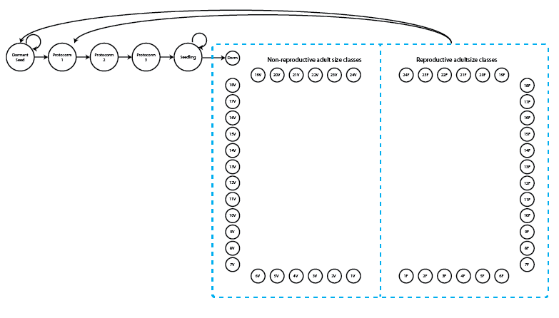
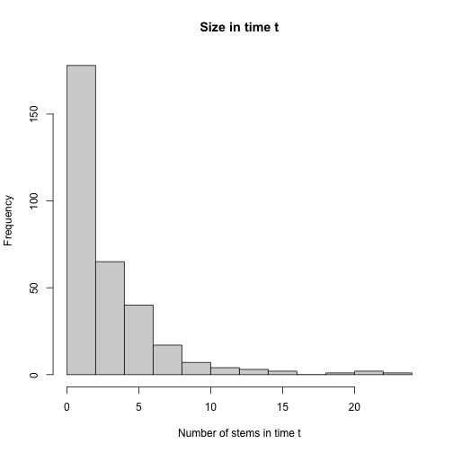
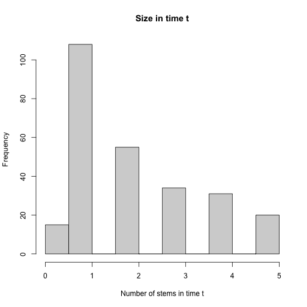
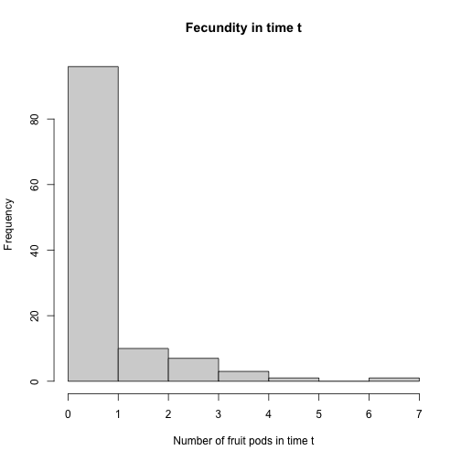
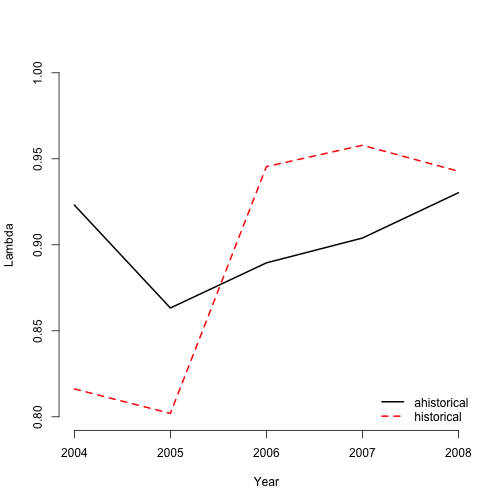
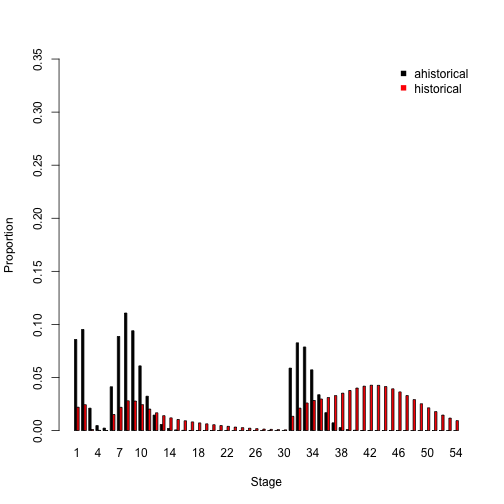
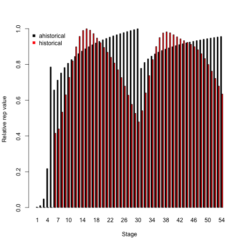
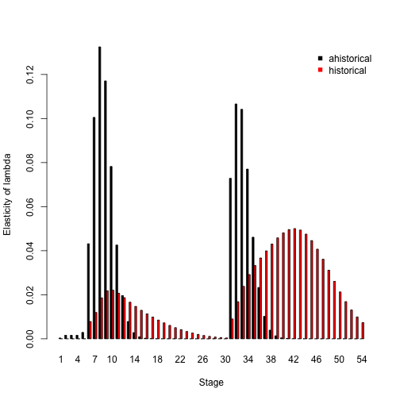

This document was built in Markdown in R 4.0.3, and covers package `lefko3` version 3.1.0.

## CASE STUDIES OF AMERICAN *Cypripedium candidum* POPULATION

### ORGANISM AND POPULATION

  <p style="text-indent: 20px">In this vignette, we will focus on a demographic dataset for a North American population of the white lady's slipper, *Cypripedium candidum*. This species is an herbaceous perennial in the orchid family, and is very long-lived. It is also of conservation concern, and the population is located within a state nature preserve located in northeastern Illinois, USA. The population was monitored annually from 2004 to 2009, with two monitoring sessions per year. More information about this population and its characteristics is given in Shefferson et al. [-@shefferson_estimating_2001] and Shefferson et al. [-@shefferson_predicting_2017].</p>
  
  <p style="text-indent: 20px">Population matrix projection modeling requires an appropriate life history model showing how all stages and transitions are related. The figure below shows a very general life history model detailing these relationships in *Cypripedium candidum*. The first stage of life is a dormant seed stage, although an individual may germinate in the year following seed production. The first germinated stage is a protocorm, which is an underground, mycoheterotrophic stage unique to the families Orchidaceae and Pyrolaceae. There are three years of protocorm stages, followed by a seedling stage, and finally a set of stages that comprise the size-classified adult portion of life. The figure shows 49 such stages, each for a different number of stems (including 0 for vegetative dormancy) and one of two reproductive statuses. These stages may be compressed for different circumstances (more on this later).</p>
  
</img>
**Figure 1.** Life history model of *Cypripedium candidum*.

  <p style="text-indent: 20px">We can see a variety of transitions within this figure. The juvenile stages have fairly simple transitions. New recruits may enter the population directly from germination of a seed produced the previous year, in which case they start in the protocorm 1 stage, or they may begin as dormant seed. Dormant seed may remain dormant, die, or germinate into the protocorm 1 stage. Protocorms exist for up to 3 years, yielding the protocorm 1, 2, and 3 stages, without any possibility of staying within each of these stages for more than a single year. Protocorm 3 leads to a seedling stage, in which the plant may persist for many years before becoming mature. Here, maturity does not really refer to reproduction *per se*, but rather to a morphology indistinguishable from a reproductive plant except for the lack of a flower. The first mature stage is usually either vegetative dormancy (dorm), during which time the plant does not sprout, or a small, non-flowering adult (1V). Once in this portion of the life history, the plant may transition among 49 mature stages, including vegetative dormancy, 1-24 shoots without flowers, or 1-24 shoots with at least one flower.</p>
  
  <p style="text-indent: 20px">The horizontal dataset `cypdata`, and the ahistorical vertical dataset `cypvert` which is the same as `cypdata` but is structured differently, both include only data for the adult stages, and so later we will need to set juvenile transitions to constants.</p>
  
### ANALYSES WITH *CYPRIPEDIUM* DATA

  <p style="text-indent: 20px">We will analyze these data in two different ways to illustrate the utility of package `lefko3`:</p> 
  
  1) through the estimation of **raw MPMs** using a simplified life history; and
  
  2) through the estimation of **function-based MPMs** using a count-based size metric and the general life history model shown above.
  
  <p style="text-indent: 20px">In this vignette, we will focus on analysis (2).</p>
  
  
### Analysis 2. Function-based MPM estimation

### Step 1. Life history model development

  <p style="text-indent: 20px">We will first need to describe the life history characterizing the dataset, matching it to our analyses properly with a `stageframe` for our *Cypripedium candidum* dataset. This stageframe will be different from the one that we created for the raw MPM example. Since this analysis will be function-based, we will include all possible size classes here. If constructing raw matrices, as in the previous example, all sizes that occur in the dataset need to be accounted for in a way that is both natural and parsimonious with respect to the numbers of individuals moving through actual transitions. If constructing function-based matrices, such as IPMs, then representative sizes at systematic increments will be satisfactory. Since size is count-based in the *Cypripedium candidum* case, we will use all numbers of stems that might occur from 0 to the maximum in the dataset, representing the life history diagram shown in the beginning of this chapter.</p>

```r
rm(list=ls(all=TRUE))

library(lefko3)

data(cypdata)

sizevector <- c(0, 0, 0, 0, 0, seq(from = 0, t = 24), seq(from = 1, to = 24))
stagevector <- c("SD", "P1", "P2", "P3", "SL", "D", "V1", "V2", "V3", "V4", "V5", 
                 "V6", "V7", "V8", "V9", "V10", "V11", "V12", "V13", "V14", "V15", 
                 "V16", "V17", "V18", "V19", "V20", "V21", "V22", "V23", "V24", 
                 "F1", "F2", "F3", "F4", "F5", "F6", "F7", "F8", "F9", "F10", 
                 "F11", "F12", "F13", "F14", "F15", "F16", "F17", "F18", "F19", 
                 "F20", "F21", "F22", "F23", "F24")
repvector <- c(0, 0, 0, 0, 0, rep(0, 25), rep(1, 24))
obsvector <- c(0, 0, 0, 0, 0, 0, rep(1, 48))
matvector <- c(0, 0, 0, 0, 0, rep(1, 49))
immvector <- c(0, 1, 1, 1, 1, rep(0, 49))
propvector <- c(1, rep(0, 53))
indataset <- c(0, 0, 0, 0, 0, rep(1, 49))

cypframe <- sf_create(sizes = sizevector, stagenames = stagevector, 
                      repstatus = repvector, obsstatus = obsvector, 
                      matstatus = matvector, propstatus = propvector, 
                      immstatus = immvector, indataset = indataset)
```
  
  <p style="text-indent: 20px">A close look at the output object, `cypframe`, shows a data frame that includes in order for each stage: the stage's name, the associated size, its reproductive status, its status as an observable stage, its status as a propagule stage, its status as an immature stage, its status as a mature stage, whether it occurs in the dataset, the half-width of a size class bin, the minima and maxima of size class bins, the centroid of the size class bin, the full size class bin width, and comments. Stage names and combinations of characteristics must be unique to prevent estimation errors, and the comments field may be edited to include any information deemed pertinent. We may edit the comments field as below.</p>

```r
cypframe$comments[(cypframe$stagenames == "SD")] <- "Dormant seed"
cypframe$comments[(cypframe$stagenames == "P1")] <- "1st yr protocorm"
cypframe$comments[(cypframe$stagenames == "P2")] <- "2nd yr protocorm"
cypframe$comments[(cypframe$stagenames == "P3")] <- "3rd yr protocorm"
cypframe$comments[(cypframe$stagenames == "SL")] <- "Seedling"
cypframe$comments[(cypframe$stagenames == "D")] <- "Dormant mature"
cypframe$comments[(cypframe$stagenames == "V1")] <- "Non-reproductive mature with 1 stem"
cypframe$comments[(cypframe$stagenames == "V2")] <- "Non-reproductive mature with 2 stems"
cypframe$comments[(cypframe$stagenames == "V3")] <- "Non-reproductive mature with 3 stems"
cypframe$comments[(cypframe$stagenames == "V4")] <- "Non-reproductive mature with 4 stems"
cypframe$comments[(cypframe$stagenames == "V5")] <- "Non-reproductive mature with 5 stems"
cypframe$comments[(cypframe$stagenames == "V6")] <- "Non-reproductive mature with 6 stems"
cypframe$comments[(cypframe$stagenames == "V7")] <- "Non-reproductive mature with 7 stems"
cypframe$comments[(cypframe$stagenames == "V8")] <- "Non-reproductive mature with 8 stems"
cypframe$comments[(cypframe$stagenames == "V9")] <- "Non-reproductive mature with 9 stems"
cypframe$comments[(cypframe$stagenames == "V10")] <- "Non-reproductive mature with 10 stems"
cypframe$comments[(cypframe$stagenames == "V11")] <- "Non-reproductive mature with 11 stems"
cypframe$comments[(cypframe$stagenames == "V12")] <- "Non-reproductive mature with 12 stems"
cypframe$comments[(cypframe$stagenames == "V13")] <- "Non-reproductive mature with 13 stems"
cypframe$comments[(cypframe$stagenames == "V14")] <- "Non-reproductive mature with 14 stems"
cypframe$comments[(cypframe$stagenames == "V15")] <- "Non-reproductive mature with 15 stems"
cypframe$comments[(cypframe$stagenames == "V16")] <- "Non-reproductive mature with 16 stems"
cypframe$comments[(cypframe$stagenames == "V17")] <- "Non-reproductive mature with 17 stems"
cypframe$comments[(cypframe$stagenames == "V18")] <- "Non-reproductive mature with 18 stems"
cypframe$comments[(cypframe$stagenames == "V19")] <- "Non-reproductive mature with 19 stems"
cypframe$comments[(cypframe$stagenames == "V20")] <- "Non-reproductive mature with 20 stems"
cypframe$comments[(cypframe$stagenames == "V21")] <- "Non-reproductive mature with 21 stems"
cypframe$comments[(cypframe$stagenames == "V22")] <- "Non-reproductive mature with 22 stems"
cypframe$comments[(cypframe$stagenames == "V23")] <- "Non-reproductive mature with 23 stems"
cypframe$comments[(cypframe$stagenames == "V24")] <- "Non-reproductive mature with 24 stems"
cypframe$comments[(cypframe$stagenames == "F1")] <- "Flowering mature with 1 stem"
cypframe$comments[(cypframe$stagenames == "F2")] <- "Flowering mature with 2 stems"
cypframe$comments[(cypframe$stagenames == "F3")] <- "Flowering mature with 3 stems"
cypframe$comments[(cypframe$stagenames == "F4")] <- "Flowering mature with 4 stems"
cypframe$comments[(cypframe$stagenames == "F5")] <- "Flowering mature with 5 stems"
cypframe$comments[(cypframe$stagenames == "F6")] <- "Flowering mature with 6 stems"
cypframe$comments[(cypframe$stagenames == "F7")] <- "Flowering mature with 7 stems"
cypframe$comments[(cypframe$stagenames == "F8")] <- "Flowering mature with 8 stems"
cypframe$comments[(cypframe$stagenames == "F9")] <- "Flowering mature with 9 stems"
cypframe$comments[(cypframe$stagenames == "F10")] <- "Flowering mature with 10 stems"
cypframe$comments[(cypframe$stagenames == "F11")] <- "Flowering mature with 11 stems"
cypframe$comments[(cypframe$stagenames == "F12")] <- "Flowering mature with 12 stems"
cypframe$comments[(cypframe$stagenames == "F13")] <- "Flowering mature with 13 stems"
cypframe$comments[(cypframe$stagenames == "F14")] <- "Flowering mature with 14 stems"
cypframe$comments[(cypframe$stagenames == "F15")] <- "Flowering mature with 15 stems"
cypframe$comments[(cypframe$stagenames == "F16")] <- "Flowering mature with 16 stems"
cypframe$comments[(cypframe$stagenames == "F17")] <- "Flowering mature with 17 stems"
cypframe$comments[(cypframe$stagenames == "F18")] <- "Flowering mature with 18 stems"
cypframe$comments[(cypframe$stagenames == "F19")] <- "Flowering mature with 19 stems"
cypframe$comments[(cypframe$stagenames == "F20")] <- "Flowering mature with 20 stems"
cypframe$comments[(cypframe$stagenames == "F21")] <- "Flowering mature with 21 stems"
cypframe$comments[(cypframe$stagenames == "F22")] <- "Flowering mature with 22 stems"
cypframe$comments[(cypframe$stagenames == "F23")] <- "Flowering mature with 23 stems"
cypframe$comments[(cypframe$stagenames == "F24")] <- "Flowering mature with 24 stems"
```

  <p style="text-indent: 20px">This object is quite large, so we do not show what it looks like here. Type `cypframe` at the prompt to see the full object.</p>

### Step 2a. Data organization

  <p style="text-indent: 20px">Now we will transform our vertical dataset into a historically-formatted vertical file. The resulting dataset will have each individual's observed life history broken up into states corresponding to three consecutive years per row, with plant identity marked in each row. To handle this, we use the `verticalize3()` function, as below. We also use the `str()` function to show us both the variables that constitute the reorganized dataset, and its dimensions.</p>

```r
vertdata <- verticalize3(data = cypdata, noyears = 6, firstyear = 2004, 
                         patchidcol = "patch", individcol = "plantid", blocksize = 4, 
                         sizeacol = "Inf2.04", sizebcol = "Inf.04", sizeccol = "Veg.04", 
                         repstracol = "Inf.04", repstrbcol = "Inf2.04", fecacol = "Pod.04", 
                         stageassign = cypframe, stagesize = "sizeadded", NAas0 = TRUE)
str(vertdata)
#> Classes 'hfvdata' and 'data.frame':	320 obs. of  54 variables:
#>  $ rowid      : num  1 2 3 4 5 6 7 8 9 10 ...
#>  $ popid      : Factor w/ 1 level "": 1 1 1 1 1 1 1 1 1 1 ...
#>  $ patchid    : Factor w/ 3 levels "A","B","C": 1 1 1 1 1 1 1 1 1 1 ...
#>  $ individ    : chr  "164" "165" "240" "242" ...
#>  $ year2      : num  2004 2004 2004 2004 2004 ...
#>  $ firstseen  : num  2004 2004 2004 2004 2004 ...
#>  $ lastseen   : num  2004 2009 2005 2009 2009 ...
#>  $ obsage     : num  0 0 0 0 0 0 0 0 0 0 ...
#>  $ obslifespan: num  0 5 1 5 5 3 5 5 5 5 ...
#>  $ sizea1     : num  0 0 0 0 0 0 0 0 0 0 ...
#>  $ sizeb1     : num  0 0 0 0 0 0 0 0 0 0 ...
#>  $ sizec1     : num  0 0 0 0 0 0 0 0 0 0 ...
#>  $ size1added : num  0 0 0 0 0 0 0 0 0 0 ...
#>  $ repstra1   : num  0 0 0 0 0 0 0 0 0 0 ...
#>  $ repstrb1   : num  0 0 0 0 0 0 0 0 0 0 ...
#>  $ feca1      : num  0 0 0 0 0 0 0 0 0 0 ...
#>  $ juvgiven1  : num  0 0 0 0 0 0 0 0 0 0 ...
#>  $ obsstatus1 : num  0 0 0 0 0 0 0 0 0 0 ...
#>  $ repstatus1 : num  0 0 0 0 0 0 0 0 0 0 ...
#>  $ fecstatus1 : num  0 0 0 0 0 0 0 0 0 0 ...
#>  $ matstatus1 : num  0 0 0 0 0 0 0 0 0 0 ...
#>  $ alive1     : num  0 0 0 0 0 0 0 0 0 0 ...
#>  $ stage1     : chr  "NotAlive" "NotAlive" "NotAlive" "NotAlive" ...
#>  $ stage1index: num  0 0 0 0 0 0 0 0 0 0 ...
#>  $ sizea2     : num  0 0 0 0 0 0 0 0 0 0 ...
#>  $ sizeb2     : num  0 2 1 0 0 0 0 0 0 0 ...
#>  $ sizec2     : num  1 1 0 1 5 1 1 1 2 1 ...
#>  $ size2added : num  1 3 1 1 5 1 1 1 2 1 ...
#>  $ repstra2   : num  0 2 1 0 0 0 0 0 0 0 ...
#>  $ repstrb2   : num  0 0 0 0 0 0 0 0 0 0 ...
#>  $ feca2      : num  0 1 0 0 0 0 0 0 0 0 ...
#>  $ juvgiven2  : num  0 0 0 0 0 0 0 0 0 0 ...
#>  $ obsstatus2 : num  1 1 1 1 1 1 1 1 1 1 ...
#>  $ repstatus2 : num  0 1 1 0 0 0 0 0 0 0 ...
#>  $ fecstatus2 : num  0 1 0 0 0 0 0 0 0 0 ...
#>  $ matstatus2 : num  1 1 1 1 1 1 1 1 1 1 ...
#>  $ alive2     : num  1 1 1 1 1 1 1 1 1 1 ...
#>  $ stage2     : chr  "V1" "F3" "F1" "V1" ...
#>  $ stage2index: num  7 33 31 7 11 7 7 7 8 7 ...
#>  $ sizea3     : num  0 0 0 0 0 0 0 0 0 0 ...
#>  $ sizeb3     : num  0 2 0 0 0 0 0 1 0 2 ...
#>  $ sizec3     : num  0 0 1 1 2 1 1 0 2 0 ...
#>  $ size3added : num  0 2 1 1 2 1 1 1 2 2 ...
#>  $ repstra3   : num  0 2 0 0 0 0 0 1 0 2 ...
#>  $ repstrb3   : num  0 0 0 0 0 0 0 0 0 0 ...
#>  $ feca3      : num  0 0 0 0 0 0 0 0 0 0 ...
#>  $ juvgiven3  : num  0 0 0 0 0 0 0 0 0 0 ...
#>  $ obsstatus3 : num  0 1 1 1 1 1 1 1 1 1 ...
#>  $ repstatus3 : num  0 1 0 0 0 0 0 1 0 1 ...
#>  $ fecstatus3 : num  0 0 0 0 0 0 0 0 0 0 ...
#>  $ matstatus3 : num  1 1 1 1 1 1 1 1 1 1 ...
#>  $ alive3     : num  0 1 1 1 1 1 1 1 1 1 ...
#>  $ stage3     : chr  "NotAlive" "F2" "V1" "V1" ...
#>  $ stage3index: num  0 32 7 7 8 7 7 31 8 32 ...
```
  
  <p style="text-indent: 20px">In the above code, we described the input dataset in a way that allows R to reorganize it appropriately. For the reorganization to proceed properly, the input dataset needs to be arranged in blocks of columns for each year, with variables in the same order every year. The output dataset includes a number of summary variables, but the data is essentially broken down into groups of three consecutive monitoring occasions each (time *t*+1, *t*, and *t*-1, corresponding to `year3`, `year2`, and `year1` in the output, respectively), with individuals spread across multiple rows. The output dataset is further limited to those entries in which the individual is alive in time *t* (`year2`), meaning that all rows in which an individual is dead or not yet recruited in time *t* are dropped. Thus, we have 320 rows of data and 54 variables.</p>

  <p style="text-indent: 20px">This reorganized dataset includes a set of interesting terms, the `sizeadded` group of three variables. These are sums of the size variables for each time, such that `size1added` is calculated as `sizea1 + sizeb1 + sizec1`. This may or may not make sense depending on the dataset. In this particular dataset, the full size of the individual in each time is this sum, because size is determined as the number of stems per plant, and these columns give the number of 3 different kinds of stems. `Veg` gives the number of non-reproductive stems, `Inf` gives the number of single-flowered inflorescences, and `Inf2` gives the number of double-flowered inflorescences per plant per time-step (an inflorescence takes a single stem, and no inflorescence has more than two flowers). Since size is given by the total number of stems in this example, we will use the `sizeadded` group of variables to code individual size in our analyses.</p>
  
  <p style="text-indent: 20px">Size and fecundity are both count variables here, and we need to determine the appropriate distribution to use in both cases. Let's take a look at a histogram of size in time *t*.</p>

```r
hist(vertdata$size2added, main = "Size in time t", xlab = "Number of stems in time t")
```



We can see here that the count has a very low mean, but the curve is fairly smoothly declining. Let's look more closely at the lowest values for size.

```r
hist(vertdata$size2added[which(vertdata$size2added < 6)], main = "Size in time t", 
     xlab = "Number of stems in time t")
```



The curve drops to relatively few 0s, suggesting that either the Poisson or negative binomial distribution might work for size. Before determining whether this is indeed the case, let's also see if similar patterns hold for fecundity.

```r
hist(subset(vertdata, repstatus2 == 1)$feca2, main = "Fecundity in time t", 
     xlab = "Number of fruit pods in time t")
```



Fecundity appears to have many more 0s than expected, suggesting the possibility that we will need to use a zero-inflated distribution.

  <p style="text-indent: 20px">Let's conduct a formal test to determine the appropriate distributions for size and fecundity.</p>

```r
sf_distrib(vertdata, size = "size2added", fec = "feca2", repst = "repstatus2")
#> The mean size is 3.322
#> 
#> The variance in size is 12.02
#> 
#> The probability of this dispersion level by chance is 0
#> 
#> Size is significantly overdispersed.
#> 
#> Mean lambda is 0.03609
#> The actual number of 0s in size is 15
#> The expected number of 0s in size is 11.55
#> The probability of this deviation in 0s from expectation by chance is 0.2687
#> 
#> Size is not significantly zero-inflated.
#> 
#> 
#> --------------------------------------------------
#> 
#> 
#> Mean fecundity is 0.7881
#> The variance in fecundity is 1.536
#> The probability of overdispersion is 0
#> 
#> Fecundity is significantly overdispersed.
#> 
#> 
#> Mean lambda is 0.4547
#> The actual number of 0s in fecundity is 68
#> The expected number of 0s in fecundity is 53.65
#> The probability of this deviation in 0s is 5.904e-06
#> 
#> Fecundity is significantly zero-inflated.
#> NULL
```

The results of these tests show us that size is overdispersed but does not have excess 0s, while fecundity is both overdispersed with excess 0s. Thus, we should assume the negative binomial distribution for size, and the zero-inflated negative binomial distribution for fecundity.

### Step 2b. Provide supplemental information for matrix estimation

  <p style="text-indent: 20px">The next steps involve the creation of a reproduction matrix and an `overwrite` data frame. These are optional, and only need to be set if the life history of the organism calls for it. The reproduction matrix tells where where fecundity rates need to be set, and at what level. *Cypripedium candidum* produces seeds that germinate by the following growing season (stage P1, or a first year protocorm), or that remain dormant for the next year (stage SD). In the following matrix, we detail that the fecundity of each reproductive stage needs to be split into two between each of these output stages. The actual split places 50% of the fecundity of a stage into each category of recruit, where the full fecundity is estimated by linear models that we will create.</p>

```r
rep.assumptions <- matrix(0, 54, 54)
rep.assumptions[1:2,31:54] <- 0.5
```

  <p style="text-indent: 20px">Next we create a data frame that outlines transitions that cannot be estimated from the data set and need to be set by other means. For this task, we will use the `overwrite` function. The function will handle two kinds of given transitions:</p>
  
  1) transitions that will be set to specific probabilities or rates that we specify, and 
  
  2) transitions that will be set to the values of other transitions that are to be estimated and will serve as proxies.
  
  <p style="text-indent: 20px">Here is an example for the *Cypripedium candidum* analysis. Each row refers to a specific transition, and there are codes for 17 given transitions. Most of these transitions are set to specific probabilities, but 8 are transitions that will be set to other, estimated transitions (these are the non-NA transitions in `eststage` set below). Also, the proxy transitions used in this case are a little different from the raw matrix case. Based on the literature, the proxies for entry into the adult classes are transitions from dormancy, as below. However, in the raw dataset, dormancy is not common enough to use as an effective proxy in raw matrix creation. Hence, we can use different proxies for function-based matrix estimation than for raw matrix estimation. We also use `rep` as shorthand to code for all reproductive stages where necessary.</p>

```r
cypover <- overwrite(stage3 = c("SD", "SD", "P1", "P1", "P2", "P3", "SL", "SL", "SL", "D",
                                "V1", "V2", "V3", "D", "V1", "V2", "V3"), 
                     stage2 = c("SD", "SD", "SD", "SD", "P1", "P2", "P3", "SL", "SL", 
                                "SL", "SL", "SL", "SL", "SL", "SL", "SL", "SL"), 
                     stage1 = c("SD", "rep", "SD", "rep", "SD", "P1", "P2", "P3", "SL", 
                                "P3", "P3", "P3", "P3", "SL", "SL", "SL", "SL"), 
                     eststage3 = c(NA, NA, NA, NA, NA, NA, NA, NA, NA, "D", "V1", "V2", 
                                   "V3", "D", "V1", "V2", "V3"), 
                     eststage2 = c(NA, NA, NA, NA, NA, NA, NA, NA, NA, "D", "D", "D", "D", 
                                   "D", "D", "D", "D"), 
                     eststage1 = c(NA, NA, NA, NA, NA, NA, NA, NA, NA, "D", "D", "D", "D", 
                                   "D", "D", "D", "D"), 
                     givenrate = c(0.1, 0.1, 0.2, 0.2, 0.2, 0.2, 0.25, 0.4, 0.4, NA, NA, 
                                   NA, NA, NA, NA, NA, NA), 
                     type = c("S", "S", "S", "S", "S", "S", "S", "S", "S", "S", "S", "S", 
                              "S", "S", "S", "S", "S"))
```

  <p style="text-indent: 20px">We can now proceed with matrix estimation.</p>

### Step 3. Tests of history, and vital rate modeling

  <p style="text-indent: 20px">Matrix creation can proceed either as raw matrix creation, as initially outlined in Ehrlén [-@ehrlen_dynamics_2000], or via the creation of function-based matrices, in many ways equivalent to complex integral projection models per Ellner and Rees [-@ellner_integral_2006] and as further described in the non-Gaussian case in Shefferson et al. [-@shefferson_life_2014]. In the raw MPM case, no vital rate models are estimated. In the function-based MPM case, vital rates are first analyzed via linear or non-linear models of the raw demographic dataset, and functions are created that estimate these vital rates according the inputs given. Matrices are then estimated using these functions, as opposed to the raw data.</p>
  
  <p style="text-indent: 20px">Prior to vital rate estimation, a number of key decisions need to be made regarding the assumptions underlying the vital rates, and their relationships with the factors under investigation. These decisions include the **general modeling strategy**, and the **size and fecundity distributions**.</p>
  
#### Step 3a. General modeling strategy

  <p style="text-indent: 20px">Most function-based matrices, whether integral projection models or otherwise, use either a generalized linear modeling (GLM) strategy, or a generalized linear mixed modeling (GLMM) strategy. The former is more common because of its simplicity, but the latter is theoretically more correct because it allows the analyst to correct for the lack of independence inherent in datasets incorporating multiple data points per sampled individual. The difference between the two with regards to vital rate modeling is strongly related to assumptions regarding the individual and the nature of spatiotemporal variation in vital rates.</p>
  
  <p style="text-indent: 20px">In both cases, the underlying dataset utilized is a vertical dataset. Here, each row of data gives the state of the individual in either two consecutive times (the ahistorical case), or three consecutive times (the historical case). Under a GLM framework, time is a fixed categorical variable, and individual identity is ignored. Using time as a fixed categorical variable implies that the monitoring occasions worked with are the only times for which inference is wanted. Thus, it would not be correct to infer future population dynamics after 2009 for a dataset collected between 2004 and 2009, if year is treated as fixed. Ignoring individual identity treats all transitions as independent, even though data originating from the same sampled individual is clearly not independent. This may be interpreted as a form of pseudoreplication because strongly related data is used to create matrices that are assumed to be statistically independent. In the case of linear modeling of vital rates, some of the data being used to estimate specific vital rates would originate from the same individual and so be related, even though all data points are assumed to be independent in the construction of linear models. This might impact demographic modeling by inflating Type 1 error, yielding more significant terms in the chosen best-fit model.</p>
  
  <p style="text-indent: 20px">Under a GLMM (generalized linear mixed model) framework, both time and individual identity can be treated as random categorical terms. This has two major implications. First, both time and individuals can be assumed to be random samples from a broader population of times and individuals for which we want to make inferences. Thus, sampled years represent a greater universe of years for which inference can be made, and so their associated coefficients are assumed to come from a normal distribution with $mean = 0$. Second, treating individual as a random categorical term eliminates the pseudoreplication that is inherent in the GLM approach to vital rate estimation when individuals are monitored potentially many times. Additionally, patch may be considered random, in which case it is assumed to have been sampled from all possible spaces that the species might occupy. We encourage researchers to use the GLMM approach in their demographic work, but we have also included easy-to-use GLM functionality, since many will find the GLM approach particularly useful in cases where mixed modeling breaks down.</p>
  
#### Step 3b. Size and fecundity distributions

  <p style="text-indent: 20px">Once a general approach is decided upon, the next step is to decide the underlying distributions. The probabilities of survival, observation, and reproductive status are automatically set to the binomial distribution, and this cannot be altered. However, the probability of size transition and fecundity rate can be set to the Gaussian, Poisson, or negative binomial distributions, with zero-inflated versions of the latter also available. In general, if size or fecundity rate is a continuous variable (i.e., not an integer or count variable), then it should be set to the Gaussian distribution. In contrast, if size or fecundity rate is a count, then it should be set to the Poisson distribution. The negative binomial distribution is also provided in cases where the Poisson distribution's assumptions, such as the mean equaling the variance, are clearly broken. We do not encourage the use of the negative binomial except in such cases, as the extra parameters estimated for the negative binomial distribution reduce the power of the modeling exercises conducted.</p>
  
  <p style="text-indent: 20px">The Poisson nor the negative binomial distributions both predict specific numbers of 0s in the response variable. If excess 0s occur within the dataset even after including the observation status and reproductive status as vital rates to absorb 0s, then a zero-inflated Poisson or negative binomial distribution may be used. These models work by parameterizing a binomial model, typically with a logit link, to predict 0 responses. The Poisson or negative binomial is then used to predict non-zero responses. This conditional model ends up really acting as two separate models in which 0s are assumed to be predicted under potentially different processes than the reamining counts. Users should be aware that, because an extra model is built to cover 0s, zero-inflated models are much more complex and include more parameters than their non-inflated counterparts.</p>
  
#### Step 3c. Model building and selection

  <p style="text-indent: 20px">In *lefko3*, the `modelsearch` function is the main workhorse function that conducts vital rate estimation. Here, we will create a full suite of vital rate models for the *Cypripedium candidum* dataset. Before proceeding, we need to decide on the linear model building strategy, the correct vital rates to model, the proper statistical distributions for estimated vital rates, the proper parameterizations for each vital rate, and the strategy for determination of the best-fit models.</p>
  
  <p style="text-indent: 20px">First, we must determine the model building strategy. In most cases, the best procedure will be through linear mixed models in which monitoring occasion and individual identity are random terms. We set monitoring occasion as random because we wish to make inferences for the population as a whole and not restrict ourselves to inference only for the years monitored (i.e. our distribution of years sampled is itself a sample of the population in time). We set individual identity to random because many or most of the individuals that we have sampled to produce our dataset yield multiple observation data points across time. Thus, we will use `approach = "mixed"` in the parameterization for `modelsearch`, and keep the defaults for `year.as.random`, `indiv`, and `year`, which are set to the default output for whether monitoring occasion is a random or fixed term (random by default), which variable corresponds to individual identity (`individ` by default), and which variable corresponds to time *t*(`year2` by default).</p>
  
  <p style="text-indent: 20px">The mixed modeling approach is usually better, particularly because it allows us to handle data points originating from the same individual as related. However, a mixed modeling strategy results in lower statistical power and a greater time used in estimating models. `Lefko3` users wishing to use a standard generalized linear modeling strategy can set `approach = "glm"`. In this case, individual identity is not used and all observed transitions are treated as independent.</p>
  
  <p style="text-indent: 20px">Second, we must determine which vital rates to model. The function `modelsearch()` estimates up to 9 vital rate models:</p>
  
  1) survival probability from time *t* to time *t*+1,
  
  2) observation probability in time *t*+1 assuming survival until that time, 
  
  3) size in time *t*+1 assuming survival and observation in that time, 
  
  4) reproduction status in time *t*+1 assuming survival and observation until that time,
  
  5) fecundity rate assuming survival in time *t* and observation and reproduction in time *t*+1 (mature only),
  
  6) juvenile survival probability from time *t* to time *t*+1,
  
  7) juvenile observation probability in time *t*+1 assuming survival until that time, 
  
  8) juveile size in time *t*+1 assuming survival and observation in that time, and
  
  9) reproduction status in time *t*+1 assuming survival and observation until that time of a juvenile in time *t* that is becoming mature in time *t*+1.
  
  <p style="text-indent: 20px">The default settings for `modelsearch` involve the estimation of 1) survival probability, 3) size distribution, and 5) fecundity, which are the minimum required for a full projection matrix. Observation probability (option `obs` in `vitalrates`) should only be included when a life history stage or size exists that cannot be observed. For example, in the case of a plant with vegetative dormancy, the observation probability can be thought of as the sprouting probability, which is a biologically meaningful vital rate [@shefferson_estimating_2001]. Further, reproduction status (option `repst` in `vitalrates`) should only be modeled if size classification needs to be stratified by the ability to reproduce, as when 0 fecundity occurs within the dataset. In this latter case, we can imagine that reproductive and non-reproductive individuals of each size class might theoretically exist, and we wish to parameterize transitions allowing individuals to be reproductive or non-reproductive. Since *Cypripedium candidum* is capable of long bouts of vegetative dormancy, since we wish to stratify the population into reproductive and non-reproductive adults, and since we have no data derived from juvenile individuals, we will set `vitalrates = c("surv", "obs", "size", "repst", "fec")`.</p>
  
  <p style="text-indent: 20px">Third, we need to set the proper statistical distribution for each parameter. Survival probability, observation probability, and reproductive status are all modeled as binomial variables, and this cannot be changed. In the case of this population of *Cypripedium candidum*, size was measured as the number of stems and so is a count variable. Likewise, fecundity is actually estimated as the number of fruits produced per plant, and so is also a count variable. We have already performed tests for overdispersion and zero-inflation, and so will set size to the negative binomial distribution, and fecundity to thee zero-inflated negative binomial distribution.</p>
  
  <p style="text-indent: 20px">Fourth, we need the proper model parameterizations for each vital rate, using the `suite` option. The default, `suite = "main"`, under the mixed model setting (`approach = "mixed"`) is for `modelsearch` to estimate a global model that includes sizes in times *t* and *t*-1, and reproductive status in times *t* and *t*-1, as fixed factors, with individual identity and time *t* set as random terms in a mixed model framework using R package `lme4` [@bates_fitting_2015]. Setting `suite = "full"` will yield a global model that also includes all two-way interactions. We will set it to the latter.  The default under the GLM setting (`approach = "glm"`) makes time *t* a fixed term and drops individual identity from consideration. The global model under `suite = "full"` then includes all fixed factors noted before, plus time *t* and all two-way interactions with it. To eliminate all interactions from the model and only analyze main effects, use `suite = "main"`. If the population is not stratified by reproductive status, then `suite = "size"` will eliminate reproductive status terms and use all others in the global model. If size is not important, then `suite = "rep"` will eliminate size but keep reproductive status and all other terms. Finally, `suite = "cons"` will result in a global model in which both reproductive status and size are not considered.</p>
  
  <p style="text-indent: 20px">Fifth, and finally, we need to determine the proper strategy for the determination of the best-fit model. Model building proceeds through the `dredge` function in package `MuMIn` [@barton_mumin_2014], and each model has an associated AICc value. The default setting in `lefko3` (`bestfit = "AICc&k"`) will compare all models within 2.0 AICc units of the model with $\Delta AICc=0$, and choose the one with the lowest degrees of freedom. This approach is generally better than the alternative, which simply uses the model with $\Delta AICc=0$ (`bestfit = "AICc"`), as all models within 2.0 AICc units of that model are equally parsimonious and so fewer degrees of freedom result from fewer parameters estimated [@burnham_model_2002].</p>
  
  <p style="text-indent: 20px">In the model building exercise below, we will use the `suite = "full"` option to run all main effects and their two-way interactions.</p>

```r
cypmodels3 <- modelsearch(vertdata, historical = TRUE, approach = "mixed", 
                          vitalrates = c("surv", "obs", "size", "repst", "fec"), 
                          sizedist = "negbin", fecdist = "negbin", fec.zero = TRUE,
                          suite = "full", size = c("size3added", "size2added", "size1added"),
                          quiet = TRUE)
#> boundary (singular) fit: see ?isSingular
#> Warning in checkConv(attr(opt, "derivs"), opt$par, ctrl = control$checkConv, : Model failed to converge with max|grad| = 0.00275544 (tol =
#> 0.002, component 1)
#> Warning in checkConv(attr(opt, "derivs"), opt$par, ctrl = control$checkConv, : Model failed to converge with max|grad| = 0.00923954 (tol =
#> 0.002, component 1)
#> Warning in fitTMB(TMBStruc): Model convergence problem; false convergence (8). See vignette('troubleshooting')
```

  <p style="text-indent: 20px">As `modelsearch` works, it produces a good amount of text to allow the user to understand what is going on. It is entirely possible, and actually quite likely, that many warning messages will appear, and these may be of use to users in understanding their data and how well it conforms to their analytical assumptions. We have silenced this with the `quiet = TRUE` option, but we encourage users to allow the function to run unsilenced, in case of modeling problems. Please read the documentation for functions `lm`, `glm`, `glm.nb`, `lmer` (lme4 package), `glmer` (lme4 package), `zeroinfl` (pscl package), `glmmTMB` (glmmTMB package), and `dredge` (MuMIn package) for further information on the sources of problems in such models.</p>
  
  <p style="text-indent: 20px">Once done, we can summarize the output with the `summary()` function.</p>

```r
summary(cypmodels3)
#> This LefkoMod object includes 5 linear models.
#> Best-fit model criterion used: AICc&k
#> 
#> ────────────────────────────────────────────────────────────────────────────────
#> Survival model:
#> Generalized linear mixed model fit by maximum likelihood (Laplace Approximation) ['glmerMod']
#>  Family: binomial  ( logit )
#> Formula: alive3 ~ size2added + (1 | year2) + (1 | individ)
#>    Data: surv.data
#>      AIC      BIC   logLik deviance df.resid 
#> 128.1324 143.2057 -60.0662 120.1324      316 
#> Random effects:
#>  Groups  Name        Std.Dev.
#>  individ (Intercept) 1.198371
#>  year2   (Intercept) 0.008826
#> Number of obs: 320, groups:  individ, 74; year2, 5
#> Fixed Effects:
#> (Intercept)   size2added  
#>      2.0352       0.6344  
#> optimizer (Nelder_Mead) convergence code: 0 (OK) ; 0 optimizer warnings; 1 lme4 warnings 
#> 
#> ────────────────────────────────────────
#> 
#> Observation model:
#> Generalized linear mixed model fit by maximum likelihood (Laplace Approximation) ['glmerMod']
#>  Family: binomial  ( logit )
#> Formula: obsstatus3 ~ size2added + (1 | year2) + (1 | individ)
#>    Data: obs.data
#>      AIC      BIC   logLik deviance df.resid 
#> 118.2567 133.1117 -55.1284 110.2567      299 
#> Random effects:
#>  Groups  Name        Std.Dev. 
#>  individ (Intercept) 1.078e-05
#>  year2   (Intercept) 8.776e-01
#> Number of obs: 303, groups:  individ, 70; year2, 5
#> Fixed Effects:
#> (Intercept)   size2added  
#>      2.4904       0.3134  
#> optimizer (Nelder_Mead) convergence code: 0 (OK) ; 0 optimizer warnings; 1 lme4 warnings 
#> 
#> ────────────────────────────────────────
#> 
#> Size model:
#> Formula:          size3added ~ repstatus1 + repstatus2 + size1added + size2added +  
#>     (1 | year2) + (1 | individ) + repstatus1:repstatus2 + size1added:size2added
#> Data: size.data
#>       AIC       BIC    logLik  df.resid 
#> 1083.5943 1120.2239 -531.7971       278 
#> Random-effects (co)variances:
#> 
#> Conditional model:
#>  Groups  Name        Std.Dev.
#>  year2   (Intercept) 0.19588 
#>  individ (Intercept) 0.05703 
#> 
#> Number of obs: 288 / Conditional model: year2, 5; individ, 70
#> 
#> Overdispersion parameter for nbinom2 family ():  651 
#> 
#> Fixed Effects:
#> 
#> Conditional model:
#>           (Intercept)             repstatus1             repstatus2             size1added             size2added  repstatus1:repstatus2  
#>              0.212264               0.279521               0.255923               0.131124               0.153940              -0.369427  
#> size1added:size2added  
#>             -0.008694  
#> 
#> ────────────────────────────────────────
#> 
#> Reproductive status model:
#> Generalized linear mixed model fit by maximum likelihood (Laplace Approximation) ['glmerMod']
#>  Family: binomial  ( logit )
#> Formula: repstatus3 ~ repstatus2 + size2added + (1 | year2) + (1 | individ)
#>    Data: repst.data
#>       AIC       BIC    logLik  deviance  df.resid 
#>  333.6176  351.9324 -161.8088  323.6176       283 
#> Random effects:
#>  Groups  Name        Std.Dev.
#>  individ (Intercept) 0.1829  
#>  year2   (Intercept) 0.6250  
#> Number of obs: 288, groups:  individ, 70; year2, 5
#> Fixed Effects:
#> (Intercept)   repstatus2   size2added  
#>     -1.4630       1.6457       0.1715  
#> 
#> ────────────────────────────────────────
#> 
#> Fecundity model:
#> Formula:          feca2 ~ size2added + (1 | year2) + (1 | individ)
#> Zero inflation:         ~size2added + (1 | year2) + (1 | individ)
#> Data: fec.data
#>       AIC       BIC    logLik  df.resid 
#>  250.8609  275.7971 -116.4305       109 
#> Random-effects (co)variances:
#> 
#> Conditional model:
#>  Groups  Name        Std.Dev.
#>  year2   (Intercept) 0.5761  
#>  individ (Intercept) 0.1640  
#> 
#> Zero-inflation model:
#>  Groups  Name        Std.Dev. 
#>  year2   (Intercept) 1.278e-06
#>  individ (Intercept) 2.123e-04
#> 
#> Number of obs: 118 / Conditional model: year2, 5; individ, 51 / Zero-inflation model: year2, 5; individ, 51
#> 
#> Overdispersion parameter for nbinom2 family (): 1.11e+07 
#> 
#> Fixed Effects:
#> 
#> Conditional model:
#> (Intercept)   size2added  
#>    -0.54014      0.06174  
#> 
#> Zero-inflation model:
#> (Intercept)   size2added  
#>       3.865       -1.574  
#> 
#> ────────────────────────────────────────────────────────────────────────────────
#> Juvenile survival model:
#> [1] 1
#> 
#> ────────────────────────────────────────
#> 
#> Juvenile observation model:
#> [1] 1
#> 
#> ────────────────────────────────────────
#> 
#> Juvenile size model:
#> [1] 1
#> 
#> ────────────────────────────────────────
#> 
#> Juvenile reproduction model:
#> [1] 0
#> 
#> 
#> ────────────────────────────────────────────────────────────────────────────────
#> 
#> Number of models in survival table:72
#> 
#> Number of models in observation table:72
#> 
#> Number of models in size table:72
#> 
#> Number of models in reproduction status table:72
#> 
#> Number of models in fecundity table:168
#> 
#> Number of models in juvenile survival table: 1
#> 
#> Number of models in juvenile observation table: 1
#> 
#> Number of models in juvenile size table: 1
#> 
#> Number of models in juvenile reproduction table: 1
#> 
#> 
#> ────────────────────────────────────────────────────────────────────────────────
#> 
#> General model parameter names (column 1), and specific names used in these models (column 2):
#>                       parameter_names mainparams
#> 1                              time t      year2
#> 2                          individual    individ
#> 3                               patch      patch
#> 4                   alive in time t+1      surv3
#> 5                observed in time t+1       obs3
#> 6                    size in time t+1      size3
#> 7     reproductive status in time t+1     repst3
#> 8               fecundity in time t+1       fec3
#> 9                 fecundity in time t       fec2
#> 10                     size in time t      size2
#> 11                   size in time t-1      size1
#> 12      reproductive status in time t     repst2
#> 13     reprodutive status in time t-1     repst1
#> 14                      age in time t        age
#> 15   individual covariate a in time t   indcova2
#> 16 individual covariate a in time t-1   indcova1
#> 17   individual covariate b in time t   indcovb2
#> 18 individual covariate b in time t-1   indcovb1
#> 19   individual covariate c in time t   indcovc2
#> 20 individual covariate c in time t-1   indcovc1
#> 
#> 
#> ────────────────────────────────────────────────────────────────────────────────
#> 
#> Quality control:
#> 
#> Survival estimated with 74 individuals and 320 individual transitions.
#> Observation estimated with 70 individuals and 303 individual transitions.
#> Size estimated with 70 individuals and 288 individual transitions.
#> Reproductive status estimated with 70 individuals and 288 individual transitions.
#> Fecundity estimated with 51 individuals and 118 individual transitions.
#> Juvenile survival not estimated.
#> Juvenile observation probability not estimated.
#> Juvenile size transition not estimated.
#> Juvenile reproduction probability not estimated.
#> NULL
```

  <p style="text-indent: 20px">Here we see historical terms determining size, suggesting that we cannot ignore history. The `summary` function gives us a great deal of information about all of the models, but also hides a number of more technical details. For example, the complete model selection tables are actually included in the `modelsearch` output, and users can see these by calling them directly, as below.</p>

```r
cypmodels3$survival_table
#> Global model call: lme4::glmer(formula = alive3 ~ size2added + repstatus2 + size1added + 
#>     repstatus1 + size2added:repstatus2 + size2added:size1added + 
#>     repstatus2:repstatus1 + size2added:repstatus1 + repstatus2:size1added + 
#>     (1 | year2) + (1 | individ), data = surv.data, family = "binomial")
#> ---
#> Model selection table 
#>     (Int)      rp1      rp2    sz1    sz2 rp1:rp2 rp1:sz2 rp2:sz1    rp2:sz2    sz1:sz2 df  logLik used.criterion delta weight
#> 9   2.035                          0.6344                                                4 -60.066          128.3  0.00  0.165
#> 11  2.006           0.54530        0.5899                                                5 -59.773          129.7  1.48  0.079
#> 13  1.538                   0.1862 0.5185                                                5 -59.781          129.8  1.49  0.078
#> 10  1.984  0.31570                 0.6240                                                5 -59.967          130.1  1.87  0.065
#> 28  2.063 -0.42760 -0.13110        0.5712   46.86                                        7 -58.039          130.4  2.18  0.056
#> 42  2.149 -0.77080                 0.5004          0.8144                                6 -59.407          131.1  2.82  0.040
#> 15  1.505           0.41530 0.1828 0.4824                                                6 -59.578          131.4  3.17  0.034
#> 12  1.972  0.25460  0.51660        0.5866                                                6 -59.712          131.7  3.43  0.030
#> 269 1.453                   0.2393 0.5678                                    -0.0242500  6 -59.745          131.8  3.50  0.029
#> 139 1.995           0.78850        0.6308                         -1.289e-01             6 -59.748          131.8  3.50  0.029
#> 14  1.535  0.04577          0.1820 0.5183                                                6 -59.779          131.8  3.57  0.028
#> 60  2.161 -0.97690 -0.09133        0.5074   66.09  0.4323                                8 -57.864          132.2  3.93  0.023
#> 32  1.642 -0.62310 -0.13560 0.1672 0.4722   32.02                                        8 -57.910          132.3  4.02  0.022
#> 156 1.999 -0.42880  0.16980        0.6194   78.38                 -1.665e-01             8 -57.991          132.4  4.18  0.020
#> 96  1.446 -0.80970  0.49640 0.3565 0.4784   29.29         -0.5133                        9 -57.022          132.6  4.37  0.019
#> 44  2.126 -0.74500  0.43350        0.4772          0.7549                                7 -59.228          132.8  4.56  0.017
#> 79  1.381           0.81620 0.2759 0.4952                 -0.2702                        7 -59.333          133.0  4.76  0.015
#> 46  1.696 -0.78060          0.1570 0.4225          0.6639                                7 -59.333          133.0  4.77  0.015
#> 271 1.425           0.41160 0.2332 0.5288                                    -0.0227300  7 -59.546          133.5  5.19  0.012
#> 143 1.467           0.58300 0.1844 0.5106                         -9.563e-02             7 -59.561          133.5  5.22  0.012
#> 16  1.507 -0.05451  0.42620 0.1876 0.4815                                                7 -59.575          133.5  5.25  0.012
#> 140 1.950  0.27080  0.78520        0.6328                         -1.433e-01             7 -59.680          133.7  5.46  0.011
#> 270 1.451  0.04333          0.2350 0.5673                                    -0.0240900  7 -59.743          133.8  5.59  0.010
#> 64  1.988 -1.04200 -0.09154 0.1302 0.4754   67.43  0.3721                                9 -57.649          133.9  5.62  0.010
#> 288 1.524 -0.63140 -0.14680 0.2443 0.5409   27.76                            -0.0345200  9 -57.852          134.3  6.02  0.008
#> 188 2.123 -0.93650  0.04907        0.5338   48.18  0.4045         -7.679e-02             9 -57.855          134.3  6.03  0.008
#> 160 1.596 -0.62030  0.08667 0.1643 0.5111   30.28                 -1.275e-01             9 -57.877          134.3  6.08  0.008
#> 48  1.951 -0.83530  0.42180 0.1351 0.4415          0.7060                                8 -59.007          134.5  6.22  0.007
#> 5   2.203                   0.4232                                                       4 -63.249          134.6  6.36  0.007
#> 128 1.483 -0.98140  0.49340 0.3452 0.4569   50.44  0.1606 -0.4970                       10 -56.997          134.7  6.45  0.007
#> 352 1.444 -0.80970  0.49510 0.3575 0.4797   34.46         -0.5125            -0.0005682 10 -57.022          134.8  6.50  0.006
#> 224 1.445 -0.80970  0.49780 0.3565 0.4788   32.07         -0.5131 -9.739e-04            10 -57.022          134.8  6.50  0.006
#> 172 2.060 -0.73950  0.75970        0.5324          0.7524         -1.819e-01             8 -59.169          134.8  6.54  0.006
#> 302 1.546 -0.84910          0.2643 0.5043          0.6923                    -0.0454200  8 -59.216          134.9  6.64  0.006
#> 7   2.034           0.80290 0.4000                                                       5 -62.393          135.0  6.72  0.006
#> 335 1.362           0.80260 0.2870 0.5080                 -0.2618            -0.0063460  8 -59.330          135.1  6.86  0.005
#> 80  1.382 -0.02074  0.82000 0.2775 0.4949                 -0.2698                        8 -59.332          135.1  6.87  0.005
#> 207 1.376           0.83470 0.2757 0.4990                 -0.2679 -1.284e-02             8 -59.332          135.1  6.87  0.005
#> 399 1.401           0.55540 0.2294 0.5477                         -8.203e-02 -0.0200800  8 -59.533          135.5  7.27  0.004
#> 272 1.427 -0.05600  0.42280 0.2385 0.5282                                    -0.0228700  8 -59.543          135.5  7.29  0.004
#> 144 1.470 -0.04976  0.59090 0.1888 0.5094                         -9.440e-02             8 -59.558          135.6  7.32  0.004
#> 88  1.913 -0.93410  0.95620 0.6509          20.14         -0.6027                        8 -59.560          135.6  7.32  0.004
#> 24  2.154 -0.69120  0.25110 0.3991          18.80                                        7 -60.686          135.7  7.47  0.004
#> 320 1.834 -1.11300 -0.09707 0.2406 0.5457   23.46  0.4029                    -0.0405500 10 -57.568          135.8  7.59  0.004
#> 192 1.945 -0.97650  0.08717 0.1359 0.5025   25.75  0.3256         -8.922e-02            10 -57.637          136.0  7.73  0.003
#> 416 1.684 -0.61000  0.16510 0.2256 0.6463  308.60                 -1.686e-01 -0.0345200 10 -57.679          136.1  7.81  0.003
#> 112 1.531 -0.87890  0.83730 0.2757 0.3991          0.7075 -0.3417                        9 -58.813          136.2  7.95  0.003
#> 3   3.318           1.13000                                                              4 -64.113          136.4  8.09  0.003
#> 20  3.291 -0.29670  0.35580                 30.75                                        6 -62.076          136.4  8.16  0.003
#> 304 1.768 -0.97290  0.37300 0.2656 0.5016          0.7453                    -0.0418000  9 -58.935          136.5  8.19  0.003
#> 71  1.890           1.23900 0.5294                        -0.2978                        6 -62.098          136.5  8.20  0.003
#> 176 1.887 -0.82500  0.73370 0.1317 0.4991          0.7012         -1.755e-01             9 -58.951          136.5  8.22  0.003
#> 6   2.193  0.12520          0.4129                                                       5 -63.233          136.7  8.40  0.002
#> 256 1.499 -0.99750  0.44370 0.3452 0.4446   32.30  0.1730 -0.5019  3.323e-02            11 -56.995          136.8  8.59  0.002
#> 384 1.475 -0.98370  0.48650 0.3499 0.4626   33.34  0.1630 -0.4920            -0.0028670 11 -56.996          136.8  8.59  0.002
#> 480 1.444 -0.80970  0.49500 0.3575 0.4796   30.97         -0.5125  8.391e-05 -0.0005727 11 -57.022          136.9  8.64  0.002
#> 8   2.039 -0.11950  0.82790 0.4090                                                       6 -62.380          137.0  8.77  0.002
#> 1   3.724                                                                                3 -65.517          137.1  8.85  0.002
#> 336 1.363 -0.02181  0.80640 0.2888 0.5078                 -0.2612            -0.0064190  9 -59.330          137.2  8.98  0.002
#> 463 1.361           0.80780 0.2867 0.5087                 -0.2613 -3.446e-03 -0.0061910  9 -59.330          137.2  8.98  0.002
#> 208 1.378 -0.02024  0.83770 0.2772 0.4985                 -0.2676 -1.241e-02             9 -59.332          137.2  8.98  0.002
#> 400 1.403 -0.05133  0.56330 0.2343 0.5467                         -8.058e-02 -0.0202400  9 -59.531          137.6  9.38  0.002
#> 448 1.792 -1.06400  0.04247 0.2272 0.5779   13.39  0.3693         -8.065e-02 -0.0393600 11 -57.560          138.0  9.72  0.001
#> 4   3.227  0.42560  1.06400                                                              5 -63.937          138.1  9.80  0.001
#> 368 1.461 -0.90630  0.78600 0.3220 0.4437          0.7117 -0.3090            -0.0240700 10 -58.776          138.3 10.00  0.001
#> 240 1.500 -0.88080  0.96170 0.2756 0.4238          0.7059 -0.3320 -8.134e-02            10 -58.799          138.3 10.05  0.001
#>  [ reached getOption("max.print") -- omitted 6 rows ]
#> Models ranked by used.criterion(x) 
#> Random terms (all models): 
#> '1 | year2', '1 | individ'
```

  <p style="text-indent: 20px">Looking over the model table shows that our best-fit model was the model with the lowest $\Delta AICc = 0$. This is not always the case, because sometimes models with $\Delta AICc \le 2.0$ have fewer parameters, in which case those models are more parsimonious. If such a model existed here, then that model would have been chosen as the best-fit model. This reflects current best practice in model selection, where the most parsimonious model is chosen.</p>
  
  <p style="text-indent: 20px">Before moving on, we note that the models created above are actually only usable for the construction of historical models. For comparison, we may wish to estimate ahistorical models. In that case, we also need linear models in which the global models tested do not include state at time *t*-1. Here, we produce these models.</p>

```r
cypmodels2 <- modelsearch(vertdata, historical = FALSE, approach = "mixed", 
                          vitalrates = c("surv", "obs", "size", "repst", "fec"), 
                          sizedist = "negbin", fecdist = "negbin", fec.zero = TRUE,
                          suite = "full", size = c("size3added", "size2added"),
                          quiet = TRUE)
#> Warning in checkConv(attr(opt, "derivs"), opt$par, ctrl = control$checkConv, : Model failed to converge with max|grad| = 0.0330459 (tol =
#> 0.002, component 1)
#> Warning in fitTMB(TMBStruc): Model convergence problem; false convergence (8). See vignette('troubleshooting')

#> Warning in fitTMB(TMBStruc): Model convergence problem; false convergence (8). See vignette('troubleshooting')
summary(cypmodels2)
#> This LefkoMod object includes 5 linear models.
#> Best-fit model criterion used: AICc&k
#> 
#> ────────────────────────────────────────────────────────────────────────────────
#> Survival model:
#> Generalized linear mixed model fit by maximum likelihood (Laplace Approximation) ['glmerMod']
#>  Family: binomial  ( logit )
#> Formula: alive3 ~ size2added + (1 | year2) + (1 | individ)
#>    Data: surv.data
#>      AIC      BIC   logLik deviance df.resid 
#> 128.1324 143.2057 -60.0662 120.1324      316 
#> Random effects:
#>  Groups  Name        Std.Dev.
#>  individ (Intercept) 1.198371
#>  year2   (Intercept) 0.008826
#> Number of obs: 320, groups:  individ, 74; year2, 5
#> Fixed Effects:
#> (Intercept)   size2added  
#>      2.0352       0.6344  
#> optimizer (Nelder_Mead) convergence code: 0 (OK) ; 0 optimizer warnings; 1 lme4 warnings 
#> 
#> ────────────────────────────────────────
#> 
#> Observation model:
#> Generalized linear mixed model fit by maximum likelihood (Laplace Approximation) ['glmerMod']
#>  Family: binomial  ( logit )
#> Formula: obsstatus3 ~ size2added + (1 | year2) + (1 | individ)
#>    Data: obs.data
#>      AIC      BIC   logLik deviance df.resid 
#> 118.2567 133.1117 -55.1284 110.2567      299 
#> Random effects:
#>  Groups  Name        Std.Dev. 
#>  individ (Intercept) 1.078e-05
#>  year2   (Intercept) 8.776e-01
#> Number of obs: 303, groups:  individ, 70; year2, 5
#> Fixed Effects:
#> (Intercept)   size2added  
#>      2.4904       0.3134  
#> optimizer (Nelder_Mead) convergence code: 0 (OK) ; 0 optimizer warnings; 1 lme4 warnings 
#> 
#> ────────────────────────────────────────
#> 
#> Size model:
#> Formula:          size3added ~ repstatus2 + size2added + (1 | year2) + (1 | individ) +      repstatus2:size2added
#> Data: size.data
#>       AIC       BIC    logLik  df.resid 
#> 1117.7882 1143.4289 -551.8941       281 
#> Random-effects (co)variances:
#> 
#> Conditional model:
#>  Groups  Name        Std.Dev.
#>  year2   (Intercept) 0.09953 
#>  individ (Intercept) 0.51799 
#> 
#> Number of obs: 288 / Conditional model: year2, 5; individ, 70
#> 
#> Overdispersion parameter for nbinom2 family (): 6.07e+07 
#> 
#> Fixed Effects:
#> 
#> Conditional model:
#>           (Intercept)             repstatus2             size2added  repstatus2:size2added  
#>               0.71946                0.25222                0.06979               -0.03505  
#> 
#> ────────────────────────────────────────
#> 
#> Reproductive status model:
#> Generalized linear mixed model fit by maximum likelihood (Laplace Approximation) ['glmerMod']
#>  Family: binomial  ( logit )
#> Formula: repstatus3 ~ repstatus2 + size2added + (1 | year2) + (1 | individ)
#>    Data: repst.data
#>       AIC       BIC    logLik  deviance  df.resid 
#>  333.6176  351.9324 -161.8088  323.6176       283 
#> Random effects:
#>  Groups  Name        Std.Dev.
#>  individ (Intercept) 0.1829  
#>  year2   (Intercept) 0.6250  
#> Number of obs: 288, groups:  individ, 70; year2, 5
#> Fixed Effects:
#> (Intercept)   repstatus2   size2added  
#>     -1.4630       1.6457       0.1715  
#> 
#> ────────────────────────────────────────
#> 
#> Fecundity model:
#> Formula:          feca2 ~ size2added + (1 | year2) + (1 | individ)
#> Zero inflation:         ~size2added + (1 | year2) + (1 | individ)
#> Data: fec.data
#>       AIC       BIC    logLik  df.resid 
#>  250.8609  275.7971 -116.4305       109 
#> Random-effects (co)variances:
#> 
#> Conditional model:
#>  Groups  Name        Std.Dev.
#>  year2   (Intercept) 0.5761  
#>  individ (Intercept) 0.1640  
#> 
#> Zero-inflation model:
#>  Groups  Name        Std.Dev. 
#>  year2   (Intercept) 1.278e-06
#>  individ (Intercept) 2.123e-04
#> 
#> Number of obs: 118 / Conditional model: year2, 5; individ, 51 / Zero-inflation model: year2, 5; individ, 51
#> 
#> Overdispersion parameter for nbinom2 family (): 1.11e+07 
#> 
#> Fixed Effects:
#> 
#> Conditional model:
#> (Intercept)   size2added  
#>    -0.54014      0.06174  
#> 
#> Zero-inflation model:
#> (Intercept)   size2added  
#>       3.865       -1.574  
#> 
#> ────────────────────────────────────────────────────────────────────────────────
#> Juvenile survival model:
#> [1] 1
#> 
#> ────────────────────────────────────────
#> 
#> Juvenile observation model:
#> [1] 1
#> 
#> ────────────────────────────────────────
#> 
#> Juvenile size model:
#> [1] 1
#> 
#> ────────────────────────────────────────
#> 
#> Juvenile reproduction model:
#> [1] 0
#> 
#> 
#> ────────────────────────────────────────────────────────────────────────────────
#> 
#> Number of models in survival table:5
#> 
#> Number of models in observation table:5
#> 
#> Number of models in size table:5
#> 
#> Number of models in reproduction status table:5
#> 
#> Number of models in fecundity table:4
#> 
#> Number of models in juvenile survival table: 1
#> 
#> Number of models in juvenile observation table: 1
#> 
#> Number of models in juvenile size table: 1
#> 
#> Number of models in juvenile reproduction table: 1
#> 
#> 
#> ────────────────────────────────────────────────────────────────────────────────
#> 
#> General model parameter names (column 1), and specific names used in these models (column 2):
#>                       parameter_names mainparams
#> 1                              time t      year2
#> 2                          individual    individ
#> 3                               patch      patch
#> 4                   alive in time t+1      surv3
#> 5                observed in time t+1       obs3
#> 6                    size in time t+1      size3
#> 7     reproductive status in time t+1     repst3
#> 8               fecundity in time t+1       fec3
#> 9                 fecundity in time t       fec2
#> 10                     size in time t      size2
#> 11                   size in time t-1      size1
#> 12      reproductive status in time t     repst2
#> 13     reprodutive status in time t-1     repst1
#> 14                      age in time t        age
#> 15   individual covariate a in time t   indcova2
#> 16 individual covariate a in time t-1   indcova1
#> 17   individual covariate b in time t   indcovb2
#> 18 individual covariate b in time t-1   indcovb1
#> 19   individual covariate c in time t   indcovc2
#> 20 individual covariate c in time t-1   indcovc1
#> 
#> 
#> ────────────────────────────────────────────────────────────────────────────────
#> 
#> Quality control:
#> 
#> Survival estimated with 74 individuals and 320 individual transitions.
#> Observation estimated with 70 individuals and 303 individual transitions.
#> Size estimated with 70 individuals and 288 individual transitions.
#> Reproductive status estimated with 70 individuals and 288 individual transitions.
#> Fecundity estimated with 51 individuals and 118 individual transitions.
#> Juvenile survival not estimated.
#> Juvenile observation probability not estimated.
#> Juvenile size transition not estimated.
#> Juvenile reproduction probability not estimated.
#> NULL
```

  <p style="text-indent: 20px">Fewer models were estimated per dredge, since fewer parameters were tested in the global models (size and reproductive status in time *t*-1 were not included). So, the best-fit models should look a little bit different. However, a more thorough comparison will show that many of the best-fit models are similar between historical and ahistorical analysis. This is not guaranteed - in this case, it may be that the relatively small number of years and small overall sample size leaves too little power to find an impact of historical status on most vital rates.</p>
  
### Step 4. MPM estimation

  <p style="text-indent: 20px">Now we will create function-based MPMs. Function-based matrices have quickly been taking over in population ecology, probably because of their ability to parse out interesting trends and influential factors picked up by the linear modeling of vital rates. Let's first create a set of ahistorical matrices.</p>

```r
cypmatrix2 <- flefko2(stageframe = cypframe, repmatrix = rep.assumptions, 
                      modelsuite = cypmodels2, overwrite = cypover, 
                      data = vertdata, year.as.random = TRUE)

summary(cypmatrix2)
#> 
#> This ahistorical lefkoMat object contains 5 matrices.
#> 
#> Each matrix is a square matrix with 54 rows and columns, and a total of 2916 elements.
#> A total of 12055 survival transitions were estimated, with 2411 per matrix.
#> A total of 240 fecundity transitions were estimated, with 48 per matrix.
#> 
#> Vital rate modeling quality control:
#> 
#> Survival estimated with 74 individuals and 320 individual transitions.
#> Observation estimated with 70 individuals and 303 individual transitions.
#> Size estimated with 70 individuals and 288 individual transitions.
#> Reproductive status estimated with 70 individuals and 288 individual transitions.
#> Fecundity estimated with 51 individuals and 118 individual transitions.
#> Juvenile survival not estimated.
#> Juvenile observation probability not estimated.
#> Juvenile size transition not estimated.
#> Juvenile reproduction probability not estimated.
#> NULL
```
  <p style="text-indent: 20px">A quick glance at the summary output will highlight that many more elements are estimated for function-based matrices than for raw matrices - this time 2,459 out of 2,916 total elements (84.3%). In raw matrices, elements associated with transitions from specific stages are only estimated when individuals actually exist within those particular stages. In function-based matrices, in contrast, the linear models estimated allow the estimation of all elements that are theoretically possible (i.e. only structural 0s are not estimated). Let's take a look at an example matrix, but only on the top corner to deal with its size.</p>

```r
print(cypmatrix2$A[[1]][1:25, 1:8], digits = 3)
#>       [,1] [,2] [,3] [,4]  [,5]     [,6]     [,7]     [,8]
#>  [1,]  0.1  0.0  0.0 0.00 0.000 0.00e+00 0.00e+00 0.00e+00
#>  [2,]  0.2  0.0  0.0 0.00 0.000 0.00e+00 0.00e+00 0.00e+00
#>  [3,]  0.0  0.2  0.0 0.00 0.000 0.00e+00 0.00e+00 0.00e+00
#>  [4,]  0.0  0.0  0.2 0.00 0.000 0.00e+00 0.00e+00 0.00e+00
#>  [5,]  0.0  0.0  0.0 0.25 0.400 0.00e+00 0.00e+00 0.00e+00
#>  [6,]  0.0  0.0  0.0 0.00 0.047 4.70e-02 3.69e-02 2.81e-02
#>  [7,]  0.0  0.0  0.0 0.00 0.158 1.58e-01 1.48e-01 1.33e-01
#>  [8,]  0.0  0.0  0.0 0.00 0.176 1.76e-01 1.77e-01 1.71e-01
#>  [9,]  0.0  0.0  0.0 0.00 0.131 1.31e-01 1.42e-01 1.46e-01
#> [10,]  0.0  0.0  0.0 0.00 0.000 7.31e-02 8.48e-02 9.40e-02
#> [11,]  0.0  0.0  0.0 0.00 0.000 3.26e-02 4.06e-02 4.82e-02
#> [12,]  0.0  0.0  0.0 0.00 0.000 1.21e-02 1.62e-02 2.06e-02
#> [13,]  0.0  0.0  0.0 0.00 0.000 3.87e-03 5.54e-03 7.57e-03
#> [14,]  0.0  0.0  0.0 0.00 0.000 1.08e-03 1.66e-03 2.43e-03
#> [15,]  0.0  0.0  0.0 0.00 0.000 2.68e-04 4.41e-04 6.93e-04
#> [16,]  0.0  0.0  0.0 0.00 0.000 5.98e-05 1.06e-04 1.78e-04
#> [17,]  0.0  0.0  0.0 0.00 0.000 1.21e-05 2.30e-05 4.15e-05
#> [18,]  0.0  0.0  0.0 0.00 0.000 2.26e-06 4.58e-06 8.88e-06
#> [19,]  0.0  0.0  0.0 0.00 0.000 3.88e-07 8.44e-07 1.75e-06
#> [20,]  0.0  0.0  0.0 0.00 0.000 6.19e-08 1.44e-07 3.21e-07
#> [21,]  0.0  0.0  0.0 0.00 0.000 9.21e-09 2.30e-08 5.50e-08
#> [22,]  0.0  0.0  0.0 0.00 0.000 1.29e-09 3.45e-09 8.82e-09
#> [23,]  0.0  0.0  0.0 0.00 0.000 1.69e-10 4.85e-10 1.33e-09
#> [24,]  0.0  0.0  0.0 0.00 0.000 2.09e-11 6.45e-11 1.90e-10
#> [25,]  0.0  0.0  0.0 0.00 0.000 2.46e-12 8.13e-12 2.57e-11
```
The matrix is overwhelmingly composed of non-zero elements, unlike in the raw matrix case.

  <p style="text-indent: 20px">Next, we will create a set of historical Lefkovitch matrices.</p>

```r
cypmatrix3 <- flefko3(stageframe = cypframe, repmatrix = rep.assumptions, 
                      modelsuite = cypmodels3, overwrite = cypover, 
                      data = vertdata, yearcol = "year2", year.as.random = TRUE)

summary(cypmatrix3)
#> 
#> This historical lefkoMat object contains 5 matrices.
#> 
#> Each matrix is a square matrix with 2916 rows and columns, and a total of 8503056 elements.
#> A total of 588560 survival transitions were estimated, with 117712 per matrix.
#> A total of 12960 fecundity transitions were estimated, with 2592 per matrix.
#> 
#> Vital rate modeling quality control:
#> 
#> Survival estimated with 74 individuals and 320 individual transitions.
#> Observation estimated with 70 individuals and 303 individual transitions.
#> Size estimated with 70 individuals and 288 individual transitions.
#> Reproductive status estimated with 70 individuals and 288 individual transitions.
#> Fecundity estimated with 51 individuals and 118 individual transitions.
#> Juvenile survival not estimated.
#> Juvenile observation probability not estimated.
#> Juvenile size transition not estimated.
#> Juvenile reproduction probability not estimated.
#> NULL
```

Once again, we see many more elements estimated (over 8.5 million, in comparison to 2,916 in the ahistorical case), and many more rows and columns (54 rows and columns in the ahistorical case, and 54<sup>2</sup> = 2,916 rows and columns in the historical case). However, the dominance of structural 0s in historical matrices still yields matrices that are mostly composed of 0s. In this case, with only 120,304 elements estimated per matrix, only 1.4% of elements are non-zero (the equivalent percentage for the ahistorical case is 84.3%). A quick glance at one matrix will show that. We will focus on only one small section of that matrix.

```r
print(cypmatrix3$A[[1]][2001:2050,2036:2045], digits = 3)
#>           [,1] [,2] [,3] [,4] [,5] [,6] [,7] [,8] [,9] [,10]
#>  [1,] 0.00e+00    0    0    0    0    0    0    0    0     0
#>  [2,] 0.00e+00    0    0    0    0    0    0    0    0     0
#>  [3,] 0.00e+00    0    0    0    0    0    0    0    0     0
#>  [4,] 4.55e-03    0    0    0    0    0    0    0    0     0
#>  [5,] 4.26e-05    0    0    0    0    0    0    0    0     0
#>  [6,] 2.23e-04    0    0    0    0    0    0    0    0     0
#>  [7,] 7.77e-04    0    0    0    0    0    0    0    0     0
#>  [8,] 2.04e-03    0    0    0    0    0    0    0    0     0
#>  [9,] 4.28e-03    0    0    0    0    0    0    0    0     0
#> [10,] 7.49e-03    0    0    0    0    0    0    0    0     0
#> [11,] 1.13e-02    0    0    0    0    0    0    0    0     0
#> [12,] 1.49e-02    0    0    0    0    0    0    0    0     0
#> [13,] 1.74e-02    0    0    0    0    0    0    0    0     0
#> [14,] 1.85e-02    0    0    0    0    0    0    0    0     0
#> [15,] 1.78e-02    0    0    0    0    0    0    0    0     0
#> [16,] 1.57e-02    0    0    0    0    0    0    0    0     0
#> [17,] 1.29e-02    0    0    0    0    0    0    0    0     0
#> [18,] 9.77e-03    0    0    0    0    0    0    0    0     0
#> [19,] 6.94e-03    0    0    0    0    0    0    0    0     0
#> [20,] 4.63e-03    0    0    0    0    0    0    0    0     0
#> [21,] 2.91e-03    0    0    0    0    0    0    0    0     0
#> [22,] 1.73e-03    0    0    0    0    0    0    0    0     0
#> [23,] 9.78e-04    0    0    0    0    0    0    0    0     0
#> [24,] 5.25e-04    0    0    0    0    0    0    0    0     0
#> [25,] 2.69e-04    0    0    0    0    0    0    0    0     0
#> [26,] 1.32e-04    0    0    0    0    0    0    0    0     0
#> [27,] 6.18e-05    0    0    0    0    0    0    0    0     0
#> [28,] 2.78e-05    0    0    0    0    0    0    0    0     0
#> [29,] 2.38e-04    0    0    0    0    0    0    0    0     0
#> [30,] 1.24e-03    0    0    0    0    0    0    0    0     0
#> [31,] 4.33e-03    0    0    0    0    0    0    0    0     0
#> [32,] 1.14e-02    0    0    0    0    0    0    0    0     0
#> [33,] 2.38e-02    0    0    0    0    0    0    0    0     0
#> [34,] 4.18e-02    0    0    0    0    0    0    0    0     0
#> [35,] 6.29e-02    0    0    0    0    0    0    0    0     0
#> [36,] 8.29e-02    0    0    0    0    0    0    0    0     0
#> [37,] 9.73e-02    0    0    0    0    0    0    0    0     0
#> [38,] 1.03e-01    0    0    0    0    0    0    0    0     0
#> [39,] 9.91e-02    0    0    0    0    0    0    0    0     0
#> [40,] 8.77e-02    0    0    0    0    0    0    0    0     0
#> [41,] 7.17e-02    0    0    0    0    0    0    0    0     0
#> [42,] 5.45e-02    0    0    0    0    0    0    0    0     0
#> [43,] 3.87e-02    0    0    0    0    0    0    0    0     0
#> [44,] 2.58e-02    0    0    0    0    0    0    0    0     0
#> [45,] 1.62e-02    0    0    0    0    0    0    0    0     0
#> [46,] 9.66e-03    0    0    0    0    0    0    0    0     0
#> [47,] 5.45e-03    0    0    0    0    0    0    0    0     0
#> [48,] 2.93e-03    0    0    0    0    0    0    0    0     0
#> [49,] 1.50e-03    0    0    0    0    0    0    0    0     0
#> [50,] 7.35e-04    0    0    0    0    0    0    0    0     0
```

  <p style="text-indent: 20px">Now let's estimate some mean matrices. First the ahistorical matrices, with a quick check of survival-transition column sums.</p>

```r
tmeans2r <- lmean(cypmatrix2)
summary(colSums(tmeans2r$U[[1]]))
#>    Min. 1st Qu.  Median    Mean 3rd Qu.    Max. 
#>  0.2000  0.9427  0.9828  0.9133  0.9957  0.9999
```

And now the historical mean.

```r
tmeans3r <- lmean(cypmatrix3)
summary(colSums(tmeans3r$U[[1]]))
#>    Min. 1st Qu.  Median    Mean 3rd Qu.    Max. 
#>  0.0000  0.4245  0.9224  0.6997  0.9859  0.9996
```

Everything looks fine at first glance, so we will move on to some of the deterministic analyses that are currently possible with `lefko3`.

### Step 5. MPM analysis

  <p style="text-indent: 20px">Let's now conduct some quick population analyses. First, we can estimate the deterministic growth rate for these means.</p>

```r
lambda3(tmeans2r)
#>   pop patch    lambda
#> 1   1     1 0.9029834
lambda3(tmeans3r)
#>   pop patch    lambda
#> 1   1     1 0.9437309
```

These are very similar $\lambda$ values. Let's take a look at a plot of annual matrices.

```r
cypann3 <- lambda3(cypmatrix3)
cypann2 <- lambda3(cypmatrix2)

plot(lambda ~ year2, data = cypann2, xlab = "Year", ylab = "Lambda", ylim = c(0.80, 1.00), type = "l", lty= 1, lwd = 2, bty = "n")
lines(lambda ~ year2, data = cypann3, lty = 2, lwd= 2, col = "red")
legend("bottomright", c("ahistorical", "historical"), lty = c(1, 2), col = c("black", "red"), lwd = 2, bty = "n")
```



  <p style="text-indent: 20px">We find that annual $\lambda$ differs between ahistorical and historical analyses. It is likely that the historical approach is more accurate, given the ability of this style of analysis to pick out the underlying statistical patterns occurring in a dataset, suggesting that the earlier years were worse for the population than we might have initially thought given the ahistorical analysis.</p>
  
  <p style="text-indent: 20px">Now let's take a look at the stable stage distributions. First the ahistorical case, with summary.</p>

```r
tm2ss <- stablestage3(tmeans2r)
tm3ss <- stablestage3(tmeans3r)

ss_put_together <- cbind.data.frame(tm2ss$ss_prop, tm3ss$ahist$ss_prop)
names(ss_put_together) <- c("ahist", "hist")
rownames(ss_put_together) <- tm2ss$stage_id

barplot(t(ss_put_together), beside=T, ylab = "Proportion", xlab = "Stage", ylim = c(0, 0.35),
        col = c("black", "red"), bty = "n")
legend("topright", c("ahistorical", "historical"), col = c("black", "red"), pch = 15, bty = "n")
```



Overall, these look like fairly large shifts. Ahistorical analysis suggests that small non-reproductive adults take up the greatest share of the stable stage structure, with dormant seed and 1st-year protocorms coming next. But historical analysis suggests that the greatest share of the stable stage structure comes from reproductive individuals.

  <p style="text-indent: 20px">Finally, let's take a peek at the reproductive values associated with both ahistorical and historical approaches. First, the ahistorical set.</p>

```r
tm2rv <- repvalue3(tmeans2r)
tm3rv <- repvalue3(tmeans3r)$ahist

rv_put_together <- cbind.data.frame(tm2rv$rep_value, tm3rv$rep_value)
names(rv_put_together) <- c("ahist", "hist")
rv_put_together$ahist <- rv_put_together$ahist / max(rv_put_together$ahist)
rv_put_together$hist <- rv_put_together$hist / max(rv_put_together$hist)
rownames(rv_put_together) <- tm2rv$stage_id

barplot(t(rv_put_together), beside=T, ylab = "Relative rep value", xlab = "Stage", 
        col = c("black", "red"), bty = "n")
legend("topleft", c("ahistorical", "historical"), col = c("black", "red"), pch = 15, bty = "n")
```



  <p style="text-indent: 20px">Note that the historical case predicts a greater importance of small adults and lesser importance of large adults than the ahistorical matrix does. Interesting results in need of further study!</p>
  
  <p style="text-indent: 20px">Let's now do a sensitivity analysis.</p>

```r
tm2sens <- sensitivity3(tmeans2r)

writeLines("\nThe highest sensitivity value: ")
#> 
#> The highest sensitivity value:
max(tm2sens$sensmats[[1]][which(tmeans2r$A[[1]] > 0)])
#> [1] 0.1761272

writeLines("\nThis value is associated with element: ")
#> 
#> This value is associated with element:
which(tm2sens$sensmats[[1]] == max(tm2sens$sensmats[[1]][which(tmeans2r$A[[1]] > 0)]))
#> [1] 408
```

The highest sensitivity value appears to be associated with the transition from 2-sprouted non-flowering adult to the largest non-flowering adult. Inspecting the sensitivity matrix (type `tm2sens$sensmats[[1]]` to inspect the full matrix) also shows that transitions near that element in the matrix are also associated with rather high sensitivities.

  <p style="text-indent: 20px">Now we can compare the historical case, particularly focusing on the historically-corrected sensitivities.</p>

```r
tm3sens <- sensitivity3(tmeans3r)

writeLines("\nThe highest sensitivity value: ")
#> 
#> The highest sensitivity value:
max(tm3sens$ah_sensmats[[1]][which(tmeans2r$A[[1]] > 0)])
#> [1] 0.1142781

writeLines("\nThis value is associated with element: ")
#> 
#> This value is associated with element:
which(tm3sens$ah_sensmats[[1]] == max(tm3sens$ah_sensmats[[1]][which(tmeans2r$A[[1]] > 0)]))
#> [1] 2266
```

Here, the highest sensitivity value is associated with transition from 12-sprouted flowering adult (Sz5nr) to 22-sprouted flowering adults, making it similar though not equal to the ahistorical case. The sensitivity associated with transitions from smaller-sized individuals to larger flowering individuals appears to be similarly large relative to other elements.

  <p style="text-indent: 20px">Let's now assess the elasticity of $\lambda$ to matrix elements, comparing the ahistorical to the historically-corrected case.</p>

```r
tm2elas <- elasticity3(tmeans2r)
tm3elas <- elasticity3(tmeans3r)

writeLines("\nThe largest ahistorical elasticity is associated with element: ")
#> 
#> The largest ahistorical elasticity is associated with element:
which(tm2elas$elasmats[[1]] == max(tm2elas$elasmats[[1]]))
#> [1] 386

writeLines("\nThe largest historically-corrected elasticity is associated with element: ")
#> 
#> The largest historically-corrected elasticity is associated with element:
which(tm3elas$ah_elasmats[[1]] == max(tm3elas$ah_elasmats[[1]]))
#> [1] 2256
```
Ahistorical analysis suggests that $\lambda$ is most elastic in response to the transition from 2-sprouted to 2-sprouted non-flowering status. In the historically-corrected case, $\lambda$ is most elastic to stasis as a 12-sprouted flowering individual.

  <p style="text-indent: 20px">Finally, let's compare the elasticity of $\lambda$ in relation to the core life history stages, via a barplot comparison.</p>

```r
elas_put_together <- cbind.data.frame(colSums(tm2elas$elasmats[[1]]), colSums(tm3elas$ah_elasmats[[1]]))
names(elas_put_together) <- c("ahist", "hist")
rownames(elas_put_together) <- tm2elas$stages$stage_id

barplot(t(elas_put_together), beside=T, ylab = "Elasticity of lambda", xlab = "Stage", 
        col = c("black", "red"), bty = "n")
legend("topright", c("ahistorical", "historical"), col = c("black", "red"), pch = 15, bty = "n")
```



The barplots show that incorporating individual history leads to greater elasticity values in larger adults, and in flowering adults, than in the ahistorical case. Although the overall pattern looks similar, the two analyses nonetheless suggest a different importance to young vs. old, small vs. large, and to flowering vs. non-flowering.


## Acknowledgements

  <p style="text-indent: 20px">We are grateful to two anonymous reviewers whose scrutiny improved the quality of this vignette. The project resulting in this package and this tutorial was funded by Grant-In-Aid 19H03298 from the Japan Society for the Promotion of Science.</p>
  
  
## Literature cited

<div id="refs"></div>
