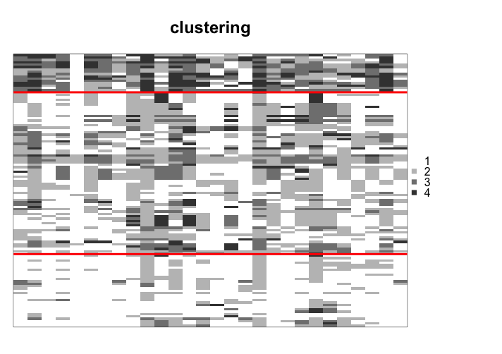
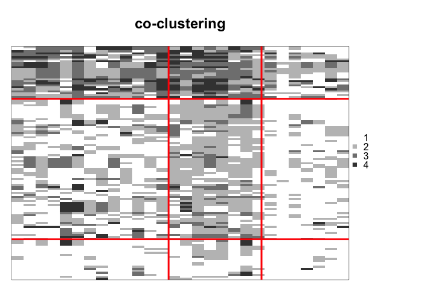

## Description

ordinalClust is an R package to perform classification, clustering and co-clustering of ordinal data. Furthermore, it can handle different numbers of levels and missing values. The ordinal data is considered to follow a BOS distribution [@biernacki16], which is specific to this kind of data. The Latent Block Model is used for performing co-clustering [@jacques17].

## Installation
```{r}
set.seed(1)
```
```{r, echo=TRUE, eval=TRUE, message=FALSE, warning=FALSE }
library(ordinalClust)
```

## Datasets
The package contains real datasets created from [@Anota17]. They relate to quality of life questionnaires for patients affected by breast cancer.

* __dataqol__ is a dataframe with 121 lines such that each line represents a patient and the columns contain information about the patient:
    + Id: patient Id
    + q1-q28: responses to 28 questions with the number of levels equal to 4
    + q29-q30: responses to 2 questions with the number of levels equal to 7

* __dataqol.classif__ is a dataframe with 40 lines such that a line represents a patient and the columns contain information about the patient:
    + Id: patient Id
    + q1-q28: responses to 28 questions with the number of levels equal to 4
    + q29-q30: responses to 2 questions with the number of levels equal to 7
    + death: if the patient survived (1) or not (2).

## Univariate Ordinal Data Simulation

To simulate a sample of ordinal data following the BOS distribution, the function **pejSim** is used.

### Basic example code

This snippet of code creates a sample of ordinal data with 7 levels that follows a BOS distribution parameterized by mu=5 and pi=0.5:
```{r}
m=7
nr=10000
mu=5
pi=0.5

probaBOS=rep(0,m)
for (im in 1:m) probaBOS[im]=pejSim(im,m,mu,pi)
M <- sample(1:m,nr,prob = probaBOS, replace=TRUE)
```

### Plotting

To plot the resulting distribution, the **ggplot2** library can be used.


```{r  fig.width = 5, warning=FALSE, eval=TRUE, message=FALSE, tidy=TRUE, dev='png', echo=FALSE, fig.show='hold', fig.align='center'}
library(ggplot2)
library(ordinalClust)
m=7
nr=10000

probaBOS=rep(0,m)
for (im in 1:m) probaBOS[im]=pejSim(im,m,5,0.5)
M <- sample(1:m,nr,prob = probaBOS, replace=TRUE)
M <- as.data.frame(M)
cbPalette <- c("#560303", "#a30606", "#ceac18", "#e0e00d", "#f7f313", "#9bf713", "#0de037")
plot1 <- ggplot(data = M, aes(x = M,fill=factor(M))) +
  geom_histogram() +
  ylim(0, nr) +
  ggtitle("ordinal data with m=7 \n mu=5 and pi=0.5") +
  theme(plot.title = element_text(vjust = -20,hjust = 0.5,size = 16)) +
  scale_x_continuous(breaks=1:7, labels=c(1:7), limits=c(0,8)) +
  scale_fill_manual(values=cbPalette)

plot1
```

## Performing clustering

In this section, clustering is executed using the __dataqol__ dataset. The purpose of performing clustering is to highlight the structure through the matrix rows.

### Example code
```{r, echo=TRUE, eval=FALSE, message=FALSE, warning=FALSE}
set.seed(0)

library(ordinalClust)
data("dataqol")

# loading the ordinal data
M <- as.matrix(dataqol[,2:29])

m = 4

krow = 3

nbSEM=100
nbSEMburn=90
nbindmini=2
init = "randomBurnin"
percentRandomB = c(30)

object <- bosclust(x=M,kr=krow, m=m, nbSEM=nbSEM,
    nbSEMburn=nbSEMburn, nbindmini=nbindmini, 
    percentRandomB=percentRandomB, init=init)

```

### Plotting the result

```{r, echo=TRUE, eval=FALSE, message=FALSE, warning=FALSE}

plot(object)

```

```{r  echo=FALSE, out.width = "75%", out.extra='style="display: block;margin: auto;"', fig.cap=""}
library(knitr)    # For knitting document and include_graphics function


```


## Performing co-clustering

### Example code

In this example, co-clustering is performed using the __dataqol__ dataset. In this case, the interest in performing co-clustering is to detect an internal structure throughout the rows and columns of the data.

```{r, echo=TRUE, eval=FALSE, message=FALSE, warning=FALSE}

set.seed(0)

library(ordinalClust)

# loading the real dataset
data("dataqol")

# loading the ordinal data
M <- as.matrix(dataqol[,2:29])


# defining different number of categories:
m=4


# defining number of row and column clusters
krow = 3
kcol = 3

# configuration for the inference
nbSEM=100
nbSEMburn=90
nbindmini=2
init = "randomBurnin"
percentRandomB = c(30, 30)

# Co-clustering execution
object <- boscoclust(x = M,kr = krow, kc = kcol, m = m,
                    nbSEM = nbSEM, nbSEMburn = nbSEMburn, 
                    nbindmini = nbindmini, init = init,
                    percentRandomB = percentRandomB)


```

### Plotting the result

This snippet of code shows how to visualize the resulting co-clustering, using the **plot** function:
```{r echo=TRUE, eval=FALSE, message=FALSE, warning=FALSE}

plot(object)

```


```{r  echo=FALSE, out.width = "75%", out.extra='style="display: block;margin: auto;"', fig.cap=""}
library(knitr)    # For knitting document and include_graphics function


```


## Performing classification
In this section, the dataset __dataqol.classif__ is used. It contains the responses to a questionnaire by 40 patients affected by breast cancer. Furthermore, a column labeled __death__ indicates whether the patient died from the disease (2) or not (1). The aim of this section is to predict the classes of a validation dataset from a training dataset.

### Choosing a good kc parameter with cross-validation

The classification function __bosclassif__ provides two classification models. The first model, (chosen by the option kc=0), is a multivariate BOS model with the assumption that, conditional to the class of the observations, the features are independent. The second model is a parsimonious version of the first model. Parsimony is introduced by grouping the features into clusters (as in co-clustering) and assuming that the features of a cluster have a common distribution. The number L of clusters of features is defined with the option kc=L. In practice, L can be chosen by cross-validation, as shown in the following example:


```{r, echo=TRUE, message=FALSE, warning=FALSE}
set.seed(1)

library(ordinalClust)
# loading the real dataset
data("dataqol.classif")


# loading the ordinal data
M <- as.matrix(dataqol.classif[,2:29])


# creating the classes values
y <- as.vector(dataqol.classif$death)


# sampling datasets for training and to predict
nb.sample <- ceiling(nrow(M)*7/10)
sample.train <- sample(1:nrow(M), nb.sample, replace=FALSE)

M.train <- M[sample.train,]
M.validation <- M[-sample.train,]
nb.missing.validation <- length(which(M.validation==0))


y.train <- y[sample.train]
y.validation <- y[-sample.train]

# number of classes to predict
kr <- 2

# configuration for SEM algorithm
nbSEM=200
nbSEMburn=175
nbindmini=2
init="randomBurnin"
percentRandomB = c(50, 50)


# different kc to test with cross-validation
kcol <- c(0,1,2,3)
m <- 4


# matrix that contains the predictions for all different kc
preds <- matrix(0,nrow=length(kcol),ncol=nrow(M.validation))

for(kc in 1:length(kcol)){
  res <- bosclassif(x=M.train, y=y.train, 
                    kr=kr, kc=kcol[kc], m=m, 
                    nbSEM=nbSEM, nbSEMburn=nbSEMburn, 
                    nbindmini=nbindmini, init=init, percentRandomB=percentRandomB)

  new.prediction <- predict(res, M.validation)
  preds[kc,] <- new.prediction@zr_topredict
  
}

preds = as.data.frame(preds)
row.names <- c()
for(kc in kcol){
  name= paste0("kc=",kc)
  row.names <- c(row.names,name)
}
rownames(preds)=row.names

```


### Computing the sensitivity and specificity rates for each kc

```{r, echo=TRUE, message=FALSE, warning=FALSE}

library(caret)

actual <- y.validation -1

specificities <- rep(0,length(kcol))
sensitivities <- rep(0,length(kcol))

for(i in 1:length(kcol)){
  prediction <- unlist(as.vector(preds[i,])) -1
  u <- union(prediction, actual)
  conf_matrix<-table(factor(prediction, u),factor(actual, u))
  sensitivities[i] <- recall(conf_matrix)
  specificities[i] <- specificity(conf_matrix)
}

sensitivities
specificities

```

## Handling different numbers of levels

The package can deal with ordinal data with different numbers of levels. In this section, we show how to introduce these kinds of datasets in a co-clustering context.

### Example code

In this example, co-clustering is performed using the dataset **dataqol**, by including the questions with 4 levels, and questions with 7 levels. The function **boscoclustMulti** is executed, **which might take a few minutes**.

```{r, echo=TRUE, eval=FALSE, message=FALSE, warning=FALSE}
set.seed(0)

library(ordinalClust)

# loading the real dataset
data("dataqol")

# loading the ordinal data
M <- as.matrix(dataqol[,2:31])


# defining different number of categories:
m=c(4,7)


# defining number of row and column clusters
krow = 3
kcol = c(3,1)

# configuration for the inference
nbSEM=50
nbSEMburn=40
nbindmini=2
init='random'

d.list <- c(1,29)

# Co-clustering execution
object <- boscoclust(x=M,kr=krow,kc=kcol,m=m, idx_list=d.list,
                    nbSEM=nbSEM,nbSEMburn=nbSEMburn,
                     nbindmini=nbindmini, init=init)

```


## References


